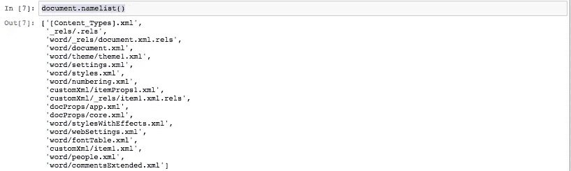
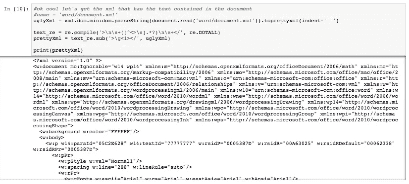
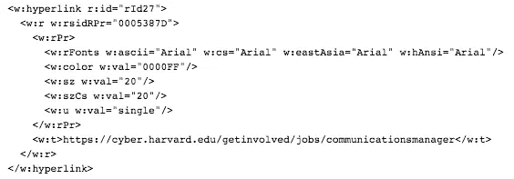
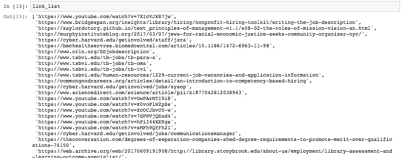

# 如何使用 Python 从 MS Word 文档中提取数据

> 原文：<https://towardsdatascience.com/how-to-extract-data-from-ms-word-documents-using-python-ed3fbb48c122?source=collection_archive---------0----------------------->

这篇博客将详细介绍如何从本地 Word 文档中提取信息。由于许多公司和角色都与 Microsoft Office 套件密不可分，对于任何面临通过传输数据的人来说，这都是一个有用的博客。多克还是。docx 格式。

作为先决条件，您需要在计算机上安装 Python。对于那些在工作中这样做的人，你可能没有管理员权限。[这篇博客](https://medium.com/@GalarnykMichael/install-python-on-windows-anaconda-c63c7c3d1444)解释了如何在没有管理员权限的情况下在 Windows 机器上安装 Anaconda。

你可以在这里找到支持这个博客[的笔记本。](https://github.com/nmolivo/tesu_scraper/blob/master/Python_Blogs/01_extract_from_MSWord.ipynb)


Image created with Microsoft Word and google searches “Microsoft Word Logo” and “Python Logo”

我们将利用每个 word 文档的 XML 构成。从那里，我们将使用 regex 库来查找文档文本中的每个 URL，然后将这些 URL 添加到一个列表中，这对于执行 for 循环来说将是完美的。

```
#specific to extracting information from word documents
**import** **os**
**import** **zipfile**#other tools useful in extracting the information from our document
**import** **re**#to pretty print our xml:
**import xml.dom.minidom**
```

*   [os](https://docs.python.org/3/library/os.html) 将允许您在操作系统上导航和查找相关文件
*   [zipfile](https://docs.python.org/3/library/zipfile.html) 将允许你从文件中提取 xml
*   [xml.dom.minidom](https://docs.python.org/3/library/xml.dom.minidom.html) 解析 xml 代码

首先，我们需要指导我们的代码在文件存储的位置打开文件。要从我们的笔记本上看到这一点(而不是打开文件浏览器)，我们可以使用`os`。虽然知道了感兴趣的单个文件的路径就不需要在这个简单的例子中使用`os`,但是这个库以后可以用来创建存储在目标文件夹中的文档列表。如果您想编写一个 for 循环来从文件夹中存储的所有 word 文档中提取信息，那么在文件夹中存储一个文档列表会很有帮助。

要查看当前目录中的文件列表，请在`os`文件路径中使用一个句点:

```
os.listdir('.')
```

要查看当前位置上方目录中的文件列表，请使用双句点:

```
os.listdir('..')
```

一旦找到 word 文档的存储位置，就可以将找到的文件路径转换为 zip 文件。ZipFile 文件类型，对于我们来说，它是可读的。

> ZIP 文件格式是一种常见的归档和压缩标准
> 
> [https://docs.python.org/3/library/zipfile.html](https://docs.python.org/3/library/zipfile.html)

```
document = zipfile.ZipFile('../docs/TESU CBE 29 Employee Job Description Evaluation - Final Approved.docx')#document will be the filetype zipfile.ZipFile
```

现在，zipfile 类的`.read()`对象需要一个名称参数，它不同于文件名或文件路径。

```
ZipFile.read(name, pwd=None)
```

要查看可用名称的示例，我们可以使用`.name()`对象

```
document.namelist()
```



在这个博客的 [Jupyter 笔记本中，我探究了其中几个名字来展示它们是什么。包含 Word 文档正文文本的名称为“word/document.xml”](https://github.com/nmolivo/tesu_scraper/blob/master/Python_Blogs/01_extract_from_MSWord.ipynb)



我在 StackOverflow 用户 [Nate Bolton](https://stackoverflow.com/users/47775/nick-bolton) 对问题的回答中发现了漂亮的打印技术:[用 Python 漂亮地打印 XML](https://stackoverflow.com/questions/749796/pretty-printing-xml-in-python)。

我们将只使用漂亮的字体来帮助我们识别 XML 中的模式以提取我们的数据。我个人不太了解 XML，所以我将依靠语法模式来查找 word 文档文本中的每个 URL。如果您已经知道提取数据的语法模式，您可能根本不需要打印出来。

在我们的例子中，我们发现字符`>http`和`<`包围了文档文本中包含的每个超链接。



我需要完成我们的目标，收集上述字符之间的所有文本。为了帮助使用 regex 实现这一点，我使用了下面的 StackOverflow 问题，它包含了我在最初的 ask 中要寻找的内容:[正则表达式查找两个字符之间包含的字符串，同时排除分隔符。](https://stackoverflow.com/questions/1454913/regular-expression-to-find-a-string-included-between-two-characters-while-exclud)

虽然我确实想保留`http`，但我不想保留`<`或`>`。我将使用字符串切片和列表理解对列表项进行这些修改。

```
link_list = re.findall('http.*?\<',xml_str)[1:]
link_list = [x[:-1] for x in link_list]
```



要查看这个博客后面的完整 Jupyter 笔记本，[点击这里](https://github.com/nmolivo/tesu_scraper/blob/master/Python_Blogs/01_extract_from_MSWord.ipynb)！

如果您对使用 python 创建和编写 MS Word 文档感兴趣，请查看库 [python-docx](https://python-docx.readthedocs.io/en/latest/) 。

还有其他从 word 文档中提取文本和信息的方法，比如在下面的 [Python 论坛帖子](https://python-forum.io/Thread-extract-data-inside-a-table-from-a-doc-file)的回答中提到的 docx2txt 和 docx 库。

这是我关于托马斯·爱迪生州立大学(苏特)开源材料可访问性倡议的博客的姊妹博客。[中邮](https://medium.com/@NatalieOlivo/preserving-web-content-of-links-provided-in-a-word-doc-using-aws-services-ec2-and-s3-2c4f0cee0a26) / [Github 资源库](https://github.com/nmolivo/tesu_scraper)

我为这个项目撰写的第一篇博客很具体，有点笨拙，所以这篇博客是我将撰写的系列文章中的第一篇，深入探讨苏特项目的各个方面，并使材料更容易理解。