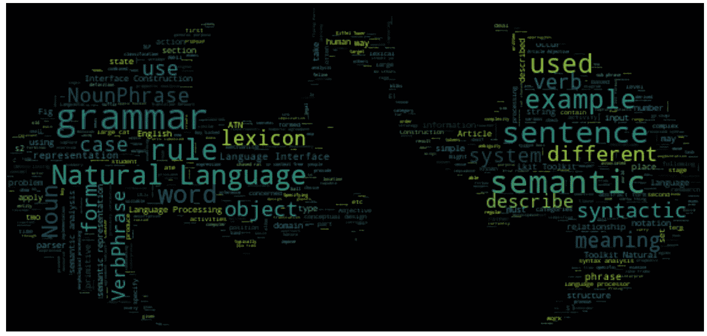

# 如何使用 Python 从 pdf 中提取关键词并按权重排序

> 原文：<https://towardsdatascience.com/how-to-extract-keywords-from-pdfs-and-arrange-in-order-of-their-weights-using-python-841556083341?source=collection_archive---------1----------------------->



**Batman masked Word cloud : Find code at the bottom**

关键词提取只不过是识别最能描述文档主题的术语的任务。

*、*、*关键术语“*、*关键片段“*或仅仅是“*关键词”*是不同的术语，通常用于定义表示包含在文档中的最相关信息的术语。虽然它们听起来不同，但它们都服务于相同的目的:描述文档中讨论的主题。

# 为什么要提取关键词？

在文本挖掘、信息检索和自然语言处理领域，提取关键词是处理文本数据时最重要的任务之一。

## 使用案例:

> 读者从关键词中受益，因为他们可以更快地判断给定的文本是否值得阅读。
> 
> 网站制作者从关键词中受益，因为他们可以根据主题对相似的内容进行分组。
> 
> 算法程序员受益于关键字，因为它们将文本的维度减少到最重要的特征。

这些只是许多例子中的几个。

让我们开始讨论这个话题的实质。接下来是一个教程，教你如何解析一个 PDF 文件，并把它转换成一个关键字列表。我们将通过动手解决问题来学习和巩固我们的理解，所以一起编码吧！

# 问题陈述-

## 给定一个特定的 PDF/文本文档，如何使用 Python 提取关键词并按权重排序？

# 依赖关系:

(本教程我用的是 Python 2.7.15 版本。)

你需要在你的机器上安装下面提到的库来完成这个任务。如果您没有，我在下面的代码块中插入了每个依赖项的代码，您可以在 windows 的命令提示符下或 mac 操作系统的终端上键入。

*   **PyPDF2** (将简单的基于文本的 PDF 文件转换成 Python 可读的文本)

```
pip install PyPDF2
```

*   **textract** (将重要的扫描 PDF 文件转换成 Python 可读的文本)

```
pip install textract
```

*   **回复**(查找关键字)

```
pip install regex
```

***注*** :我尝试了三种方法来完成这项任务。对于方法 1，上述库就足够了。然而，我刚刚提到了我在网上找到的另外两种方法。把他们当做替代品。下面是 jupyter 笔记本，上面有这三种方法。看一看！

# Jupyter 笔记本:

所有必要的备注都用“#”表示。

*   **方法 1 未装箱**

第一步:导入所有库。

**第二步**:将 PDF 文件转换为 txt 格式，读取数据。

**第三步**:使用*。findall()"* 正则表达式提取关键字的功能。

**步骤 4** :将提取的关键字列表保存在数据帧中。

**第五步**:应用 TF-IDF 的概念计算每个关键词的权重。

**第六步**:将结果保存在数据帧中，使用*。sort_values()"来按顺序排列关键字。*

更多详情请点击这里 ！

**参考文献**:

1.  [www.wikipedia.org](https://en.wikipedia.org/wiki/Keyword_extraction)

2.[PDF 到文本转换的中等帖子](https://medium.com/@rqaiserr/how-to-convert-pdfs-into-searchable-key-words-with-python-85aab86c544f)

3.[关键词提取教程](https://www.airpair.com/nlp/keyword-extraction-tutorial)

4.[正则表达式](https://www.analyticsvidhya.com/blog/2015/06/regular-expression-python/)

我希望你觉得这篇教程很有收获，值得一读。此外，我相信一定有很多其他方法可以让你完成上述任务。如果你遇到了，请在评论区分享它们。

**屏蔽字云的代码**:

在这里找到 GitHub 回购[](https://github.com/PBPatil/Masked-Word-cloud)****！****

```
***# modules for generating the word cloud* 
from os import path, getcwd 
from PIL import Image 
import numpy as np 
import matplotlib.pyplot as plt 
from wordcloud import WordCloud%matplotlib inline 
d = getcwd()  
text = open('nlp.txt','r').read()#Image link = '[https://produto.mercadolivre.com.br/MLB-693994282-adesivo-decorativo-de-parede-batman-rosto-e-simbolo-grande-_JM](https://produto.mercadolivre.com.br/MLB-693994282-adesivo-decorativo-de-parede-batman-rosto-e-simbolo-grande-_JM)' mask = np.array(Image.open(path.join(d, "batman.jpg")))

wc = WordCloud(background_color="black",max_words=3000,mask=mask,\
               max_font_size=30,min_font_size=0.00000001,\
               random_state=42,)    
wc.generate(text) 
plt.figure(figsize=[100,80]) 
plt.imshow(wc, interpolation="bilinear") 
plt.axis("off") 
plt.savefig('bat_wordcloud.jpg',bbox_inches='tight',pad_inches=0.3);**
```

******阅读我发表的其他文章**—****

1.  ****[如何使用 Python 从 Excel 创建 PDF 报告](https://medium.com/@theprasadpatil/how-to-create-a-pdf-report-from-excel-using-python-b882c725fcf6)****
2.  ****[最后一分钟修订:第一部分—机器学习&统计](https://medium.com/@theprasadpatil/last-minute-revision-part-i-machine-learning-statistics-8de23a377987)****
3.  ****[什么是探索性数据分析？](/exploratory-data-analysis-8fc1cb20fd15)****