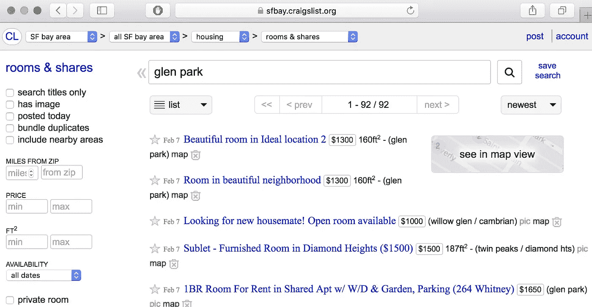
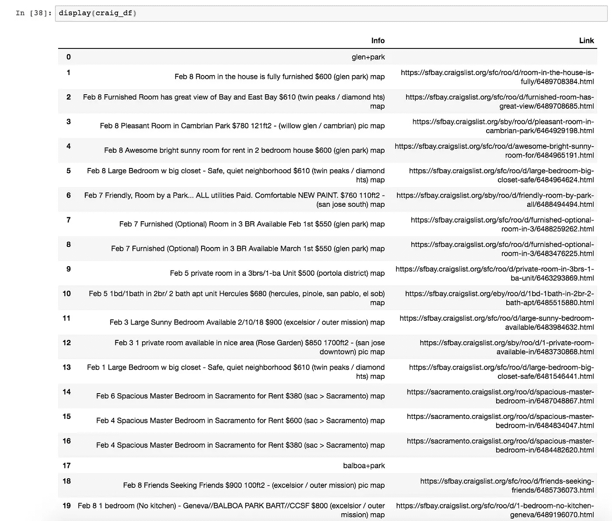
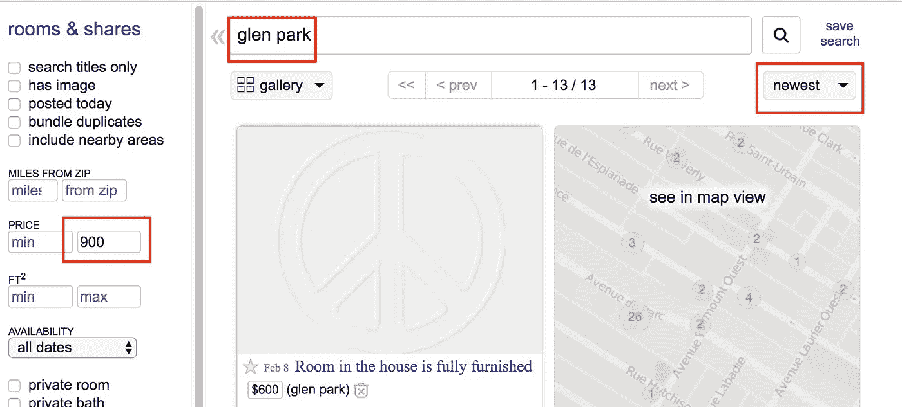
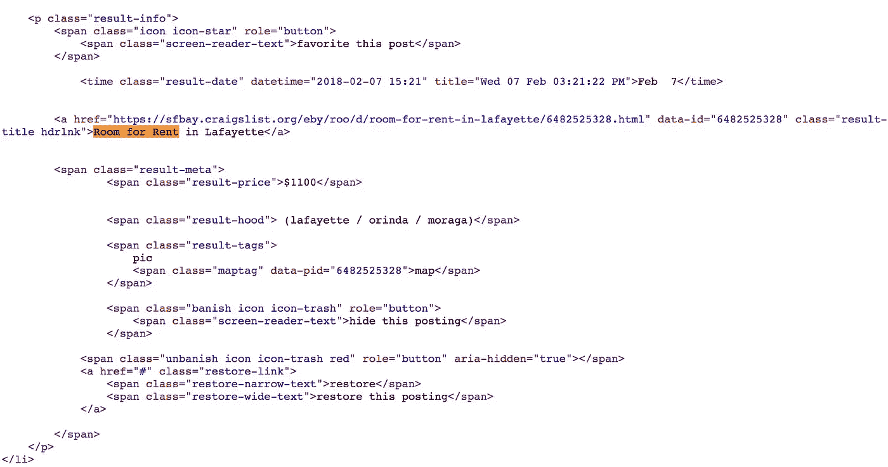
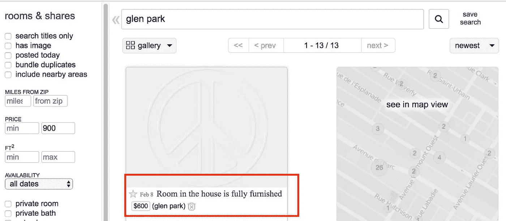

# 用数据科学加速旧金山的住房搜索

> 原文：<https://towardsdatascience.com/how-to-find-housing-in-san-francisco-with-data-science-2991ff503602?source=collection_archive---------4----------------------->


不久前有人问我如何在旧金山找到住房。一年前，在我找到我现在的客厅沙发之前，我开始寻找住房，并且很快成为一种压倒性的经历，试图找到任何低于一只胳膊和一条腿的租金。我花越来越多的时间在网上搜索，并把搜索范围从金融区扩大到旧金山的几个地区，包括臭名昭著的嫩腰区。这种搜索慢慢消耗了我的精力，以至于我每天醒来至少花一个小时点击 Craigslist，看到熟悉的地方，一张疲惫的脸。

我心想:“一定有什么办法可以加快找房子的速度！”作为一名有抱负的数据科学家，我的解决方案是创建一个 web scraper，它可以收集旧金山几个地区的信息，并以简洁的方式呈现它们，而不是所有的绒毛。虽然不能保证找到房子，但至少我可以把 1 个多小时的搜索时间减少到 10 分钟。

TLDR:我写了一个脚本，以地点和价格为参数来抓取 Craigslist。代码位于底部，但除此之外继续阅读，看看整个网页抓取过程！


One of the most helpful pictures I had in finding housing

第 0 步:了解你的敌人



What the Craigslist interface looks like



What I wanted the results to look like

很多时候，我们很容易超越自己，一头扎进问题中。对我的编码技能有很大帮助的一件事是从较小的目标开始，然后把它变成一个大的、宏伟的目标。我的大目标是得到每篇文章的标题以及它到个人页面的链接。然后我想从旧金山的一个地区(比如格伦公园)搬到另一个地区(比如巴尔博亚公园)。查看 Craigslist 界面，似乎每篇文章都有一个标题和一个蓝色超链接，显示在描述旁边会很有用。

因此，分解大目标，我的攻击计划是:

1.  使用 Selenium 打开一个远程控制页面
2.  刮一页 Craigslist 住房获得标题
3.  进一步抓取以获得卖家帖子的链接
4.  移动到另一个位置而不重写任何内容
5.  重复此过程，直到所有位置都被刮除
6.  把所有的都集中到一个好的功能上

**第一步:引入网络抓取工具**

```
from selenium import webdriver
from bs4 import BeautifulSoup
import urllib2
import re
import pandas as pd
import numpy as np
pd.set_option('max_colwidth', 5000)
pd.options.display.max_rows = 999
```

**第二步:用硒打开一个网页**

Selenium 是一个工具，它让我们在浏览器中自动操作，就像我们像人一样点击或打字一样。这让我们可以登录并做任何人类在使用浏览器时可以做的事情。也许最重要的是，它允许我们从网页中抓取数据，这些网页使用在浏览器中执行的 JavaScript 生成 HTML 旧金山大学的 Terence Parr 教授说

为了初始化 Selenium 工具，我们需要从 Chromedriver(或 geckodriver)所在的路径调用它。[(链接下载 Selenium)](http://www.seleniumhq.org/download/)

```
driver = webdriver.Chrome(executable_path="/Users/shsu/Downloads/chromedriver")
```

在那里，我们可以使用驱动程序打开某些网页，例如:

```
driver.get('http://google.com')
```

这应该会在你的 Chrome 上打开一个新的浏览器，然后可以用代码自动完成。用你选择的任何网站试试吧！

**第三步:从页面上刮下帖子标题**



A general query for my housing limitations

如前所述，我们宏伟计划的第一个目标是抓取 Craigslist 的一个页面。让我们打开一个页面，实际输入一些过滤器(参数)，然后查看内容(左边的图片)。就我的预算而言，我正在寻找一个低于 900 美元的地方，并希望最近的帖子首先显示出来。当我查看由该查询创建的超链接时，我得到这样的结果:

"【https://sfbay.craigslist.org/search/roo?query=】T4**格伦+公园**sort =**date**max _ price =**900**availability mode = 0

你知道什么？看起来 url 中的头包含了我输入的参数，也就是查询字符串[和](https://en.wikipedia.org/wiki/Query_string)。让我们从代码开始。

```
url = [https://sfbay.craigslist.org/search/roo?query=glen+park&sort=date&max_price=1000&availabilityMode=0](https://sfbay.craigslist.org/search/roo?query=glen+park&sort=date&max_price=1000&availabilityMode=0)driver.get(url)
```

此时，你可能会奇怪为什么我选择 Chromedriver 而不是其他 web 驱动。主要原因是因为开发者工具可以用这三个键打开:

**选项+命令+ U**

通过同时点击这三个键，您可以查看任何网页背后的 HTML 代码。



Inside the developer source with the tag information we need

通过搜索单个标题文章，我们可以提取该文章的标签和标题。在这种情况下，请注意上图顶部带有“result-info”类的“p”标签。在这个标签中包含了关键文本(特别是“Lafayette 的出租房间”、“1100 美元”和“(Lafayette/or inda/moraga)”，我们可以用. text 来抓取。

```
craig_title = []
all_posts = driver.find_elements_by_class_name("result-row")
for post in all_posts:
    craig_title.append(post.text)
```

现在我们已经从帖子的标题中获得了所有重要的信息！接下来我们要做的就是抓取这个页面，不仅要获取标题信息，还要获取标题所指向的网页。

**第四步:抓取个人帖子的链接**

棘手的部分来了:如果我不能在不重定向 Selenium 浏览器的情况下点击链接并获得它的超链接，我如何获得到个人卖家页面的链接？

解决方案:使用我们的网络抓取工具寻找一个标题，然后将其推广到页面上的所有帖子。



What we see on the website


What the code on the website looks like

通过搜索原始标题文章，我们可以看到“a”标签和“href”类等同于我们正在搜索的文章链接。我们将首先用 urllib2 打开 url(因为我们不想用 selenium 远程打开另一个页面)，然后按照与步骤 2 类似的过程获得 post 超链接。

```
link_list = []
html_page = urllib2.urlopen(url)
soup = BeautifulSoup(html_page, "lxml")
for element in soup.findAll("a", {"class": "result-title hdrlnk"}):
    print element['href']
```

我们现在已经抓取了文章标题和它们各自的链接。

**第 5 步和第 6 步:迭代整个过程并进行归纳**

我们可以用变量代替所有参数来概括我们的刮削。

例如，转动这个:

```
craig_title = []
url = **"https://sfbay.craigslist.org/search/roo?query=glen+park&sort=date&max_price=1000&availabilityMode=0"**
driver.get(url)
allthing = driver.find_elements_by_class_name("result-row")
for post in allthing:
    craig_title.append(post.text)
```

变成这样:

```
**place = ['glen+park']
price = '900'**craig_title = []
url = **"**[**https://sfbay.craigslist.org/search/roo?query=**](https://sfbay.craigslist.org/search/roo?query=)**"+ \
                str(place)+ 
                "&sort=date&max_price="+
                str(price)+
                "&availabilityMode=0"**
driver.get(url)
all_posts = driver.find_elements_by_class_name("result-row")
for post in all_posts:
    craig_title.append(post.text)
```

我们可以对所有其他变量重复这个过程，比如当我们遍历页面并添加到列表中时。

**第七步:把所有东西放在一起**

我们有(1)抓取一个页面的标题和链接，(2)移动到另一个页面并重复步骤 1，以及(3)将所有信息附加到一个列表。所以现在，我们要做的就是创建一个漂亮的小函数，允许我们包含一些参数并返回一个数据帧。姑且称之为: **craig_list()** 。

```
from selenium import webdriver
from bs4 import BeautifulSoup
import urllib2
import re
import pandas as pd
import numpy as np
pd.set_option('max_colwidth', 5000)
pd.options.display.max_rows = 999
from IPython.display import display, HTMLdriver = webdriver.Chrome(executable_path="/Users/shsu/Downloads/chromedriver")def craig_list(price, location_list=list):
    """
    craig_list is a function that creates the condensed Craigslist post information
    Inputs:
        price_max: integer of the maximum price of houses one wants
        places: list of strings where the string represents the region of choice 
    Output:
        a dataframe with the description and the link of the post 
    """
    craig_title = []
    link_list = []
    for place in location_list:
        print("--------- MOVING TO PLACE: " + str(place) + " -----")
        link_list.append(" ")
        craig_title.append(str(place).upper())

        url = "[https://sfbay.craigslist.org/search/roo?query=](https://sfbay.craigslist.org/search/roo?query=)"+ \
                str(place)+ "&sort=date&max_price="+ str(price)+"&availabilityMode=0"
        driver.get(url)
        all_posts = driver.find_elements_by_class_name("result-row")
        for post in all_posts:
            craig_title.append(post.text)

        html_page = urllib2.urlopen(url)
        soup = BeautifulSoup(html_page, "lxml")
        for pid in soup.findAll("a", {"class": "result-title hdrlnk"}):
         link_list.append(pid['href'])
    craig_df = pd.DataFrame(np.column_stack([craig_title,link_list]), 
columns = ["Info", "Link"])
    return craig_dfplaces = ["glen+park", "balboa+park"]
price_max = 900
craig_df = craig_list(price_max, places)
display(craig_df)
```

就像这样，你现在也可以节省 40 分钟在 Craigslist 上搜索房屋的时间，最终在一个改造过的客厅里租到一张沙发！


Even San Francisco is not safe from satire

总之，我们了解到，虽然抓取看起来困难且耗时，但它可以被分解为更容易的部分，在实际的用户界面和背后的 HTML 源代码之间可视化，并最终概括为模拟整个人类行为。感谢你的阅读，祝你找房子好运！

附言:很多帖子都是垃圾邮件制造者，他们复制真实的帖子，并给出一个通用的消息“请把你的联系电话发给我，我会尽快与你联系。”

参考资料:

1.  [硒下载页面](http://www.seleniumhq.org/download/)
2.  [特伦斯·帕尔教授的硒教程](https://github.com/parrt/msan692/blob/master/notes/selenium.md)
3.  [美汤文档](https://www.crummy.com/software/BeautifulSoup/bs4/doc/)
4.  [查询字符串](https://en.wikipedia.org/wiki/Query_string)
5.  【Beautifulsoup 网页抓取教程
6.  [旧金山 Craigslist](https://sfbay.craigslist.org/)