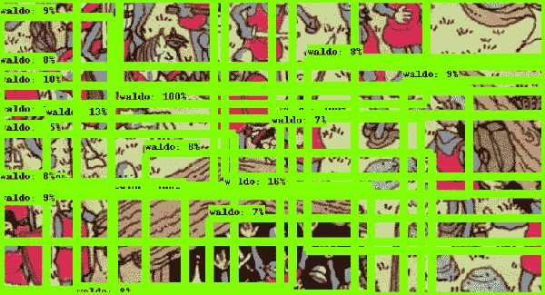
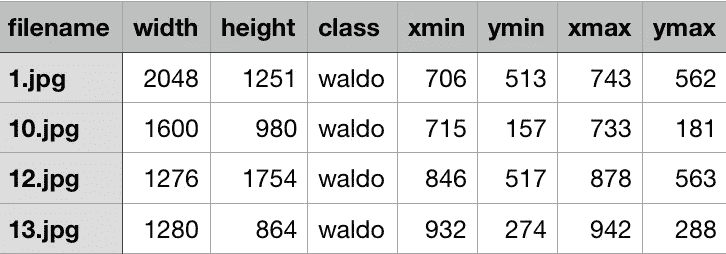
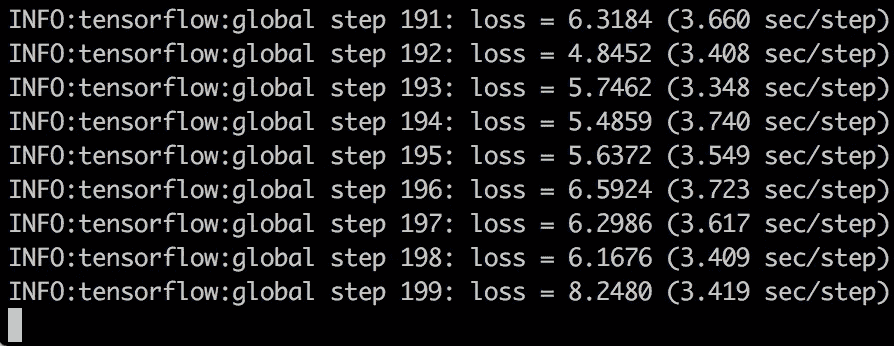

# 如何用神经网络找到沃利

> 原文：<https://towardsdatascience.com/how-to-find-wally-neural-network-eddbb20b0b90?source=collection_archive---------1----------------------->

## 如何训练一个模型来解决沃利难题的指南



Process of a Neural Network learning to find Wally from start to finish

深度学习提供了另一种方法来解决 Wally 在哪里的难题。但与传统的图像处理计算机视觉方法不同，它只使用少数几个带标签的例子，包括沃利在图像中的位置。

> 如果神经网络可以为你做这件事，为什么还要去找沃利呢？

带有评估图像和检测脚本的最终训练模型发布在 my [Github repo](https://github.com/tadejmagajna/HereIsWally) 上。

这篇文章描述了使用 Tensorflow 对象检测 API 训练神经网络的过程，并使用围绕它构建的 Python 脚本来找到 Wally。它由以下步骤组成:

*   **通过创建一组带标签的训练图像准备数据集**，其中标签代表 Wally 在图像中的 x-y 位置
*   **获取并配置模型**以与 Tensorflow 对象检测 API 一起使用
*   在我们的数据集上训练模型
*   **使用导出的图表在评估图像**上测试模型

启动前，请确保按照[说明](https://github.com/tensorflow/models/blob/master/research/object_detection/g3doc/installation.md)安装 Tensorflow 对象检测 API。

# 准备数据集

虽然处理神经网络是深度学习中最值得注意的过程，但令人遗憾的是，数据科学家花费最多时间的步骤是准备和格式化训练数据。

最简单的机器学习问题的目标值通常是标量(如数字检测器)或分类字符串。Tensorflow 对象检测 API 训练数据使用两者的组合。它由一组图像组成，并附有所需对象的标签以及它们在图像中出现的位置。位置由两个点定义，因为(在 2d 空间中)两个点足以在对象周围绘制边界框。

因此，为了创建训练集，我们需要提供一组 Wally 在哪里的拼图图片，以及 Wally 出现的位置。

虽然我可以花几个星期的时间用注释工具如 [LabelImg](https://github.com/tzutalin/labelImg) 手工标记图像来解决 Wally 谜题，但我发现了一个[已经解决的训练集](https://github.com/vc1492a/Hey-Waldo)Wally 谜题在哪里。



Where’s Wally training dataset with last four columns describing where Wally appears in an image

准备数据集的最后一步是将标签(保存为`.csv`)和图像(`.jpeg`)打包成一个二进制`.tfrecord`文件。这样做的过程在这里[解释](http://warmspringwinds.github.io/tensorflow/tf-slim/2016/12/21/tfrecords-guide/)，但是你可以找到 train 和 eval Wally 在哪里。`tfecord`我的 [Github 回购](https://github.com/tadejmagajna/HereIsWally)上的文件。

# **准备模型**

Tensorflow 对象检测 API 提供了一组在几个公共数据集上训练的具有不同性能(通常是速度-精度权衡)的预训练模型。

虽然该模型可以从随机初始化的网络权重开始从头开始训练，但这一过程可能需要数周时间。相反，我们使用了一种叫做迁移学习的方法。
它包括采用一个通常被训练来解决一般问题的模型，并对其进行再训练来解决我们的问题。迁移学习背后的想法是，我们可以使用预训练模型中获得的知识，并将其转移到我们的新模型中，而不是通过从头开始训练我们的模型来重新发明轮子。这为我们节省了大量时间，因此我们可以将花在培训上的时间用于获取针对我们问题的知识。

我们使用了 [RCNN 和在 COCO 数据集上训练的 Inception v2 模型](http://download.tensorflow.org/models/object_detection/faster_rcnn_inception_v2_coco_2017_11_08.tar.gz)以及[它的管道配置文件](https://github.com/tensorflow/models/blob/master/research/object_detection/samples/configs/ssd_inception_v2_coco.config)。该模型包括一个检查点`.ckpt`文件，我们可以用它来开始训练。

> 下载配置文件后，请确保用指向您的检查点文件、培训和评估的路径替换“PATH_TO_BE_CONFIGURED”字段。tfrecord 文件和标签映射文件。

需要配置的最后一个文件是`labels.txt`地图文件，它包含了我们所有不同对象的标签。因为我们只寻找一种类型的对象，所以我们的标签文件看起来像这样

```
item {
  id: 1
  name: 'waldo'
}
```

最后，我们应该以下列内容结束:

*   带有`.ckpt`检查点文件的预训练模型
*   训练和评估`.tfrecord`数据集
*   标签映射文件
*   指向上述文件的管道配置文件

现在，我们准备开始训练。

# **培训**

Tensorflow 对象检测 API 提供了一个简单易用的 Python 脚本来本地重新训练我们的模型。它位于`models/research/object_detection`中，可以运行:

`python train.py --logtostderr --pipeline_config_path= PATH_TO_PIPELINE_CONFIG --train_dir=PATH_TO_TRAIN_DIR`

其中`PATH_TO_PIPELINE_CONFIG`是我们的管道配置文件的路径，`PATH_TO_TRAIN_DIR`是新创建的目录，我们的新检查点和模型将存储在这里。

`train.py`的输出应该是这样的:



寻找最重要的信息是损失。它是训练集或验证集中每个例子的错误总和。当然，您希望它尽可能低，这意味着如果它缓慢下降，这意味着您的模型正在学习(…或过度拟合您的训练数据)。

还可以使用 Tensorboard 更详细地显示训练数据。

该脚本会在完成一定数量的步骤后自动存储一个检查点文件，这样您就可以在学习时随时恢复您保存的检查点，以防您的计算机崩溃。

这意味着当您想要完成模型的训练时，您可以终止脚本。

**但是什么时候停止学习呢？**关于何时停止训练的一般规则是当我们的评估集上的损失停止减少或通常非常低时(在我们的示例中低于 0.01)。

# 测试

现在，我们可以通过在一些示例图像上测试来实际使用我们的模型。

首先，我们需要使用`models/research/object_detection`中的脚本从存储的检查点(位于我们的火车目录中)导出一个推理图:

```
python export_inference_graph.py — pipeline_config_path PATH_TO_PIPELINE_CONFIG --trained_checkpoint_prefix PATH_TO_CHECPOINT --output_directory OUTPUT_PATH
```

导出的推理图现在是我们的 Python 脚本可以用来查找 Wally 的。

我写了几个简单的 Python 脚本(基于 Tensorflow 对象检测 API ),您可以使用它们在您的模型上执行对象检测，并在检测到的对象周围绘制框或暴露它们。

`[find_wally.py](https://github.com/tadejmagajna/HereIsWally/blob/master/find_wally.py)`和`[find_wally_pretty.py](https://github.com/tadejmagajna/HereIsWally/blob/master/find_wally_pretty.py)`都可以在我的 [Github repo](https://github.com/tadejmagajna/HereIsWally) 中找到，并且可以简单地运行

```
python find_wally.py
```


或者

```
python find_wally_pretty.py
```


在您自己的模型或评估图像上使用脚本时，请确保修改`model_path`和`image_path`变量。

# 最后的想法

在我的 [Github repo](https://github.com/tadejmagajna/HereIsWally) 上发布的模型表现得出奇的好。

它设法在评估图片中找到了 Wally，并在网上找到了一些额外的随机例子。它没能在沃利真正大的地方找到他，凭直觉这应该比在他真正小的地方找到他更容易解决。这表明我们的模型可能过度拟合我们的训练数据，主要是因为只使用了少量的训练图像。

任何希望通过手动标记一些来自网络的额外图片来提高模型性能的人，都可以在我的 [Github repo](https://github.com/tadejmagajna/HereIsWally) 上提交 PR，并帮助改进训练集。