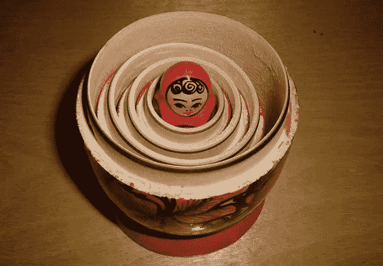
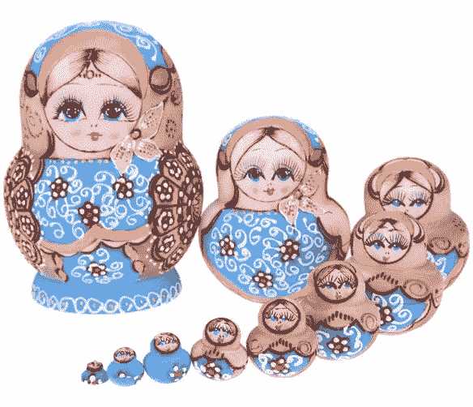
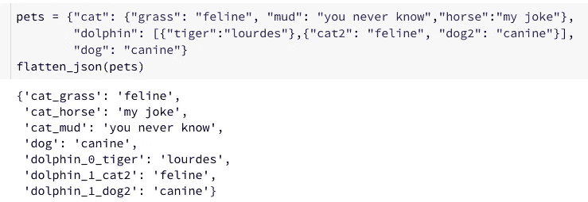
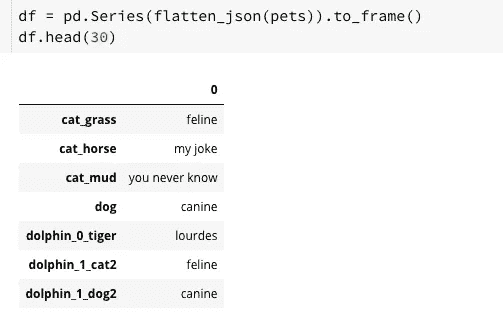
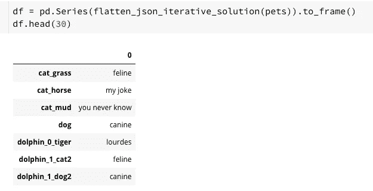
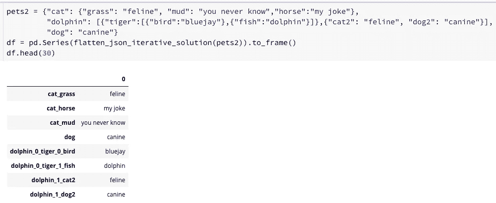

# 如何在非递归优雅 Python 中展平深度嵌套的 JSON 对象

> 原文：<https://towardsdatascience.com/how-to-flatten-deeply-nested-json-objects-in-non-recursive-elegant-python-55f96533103d?source=collection_archive---------0----------------------->

用递归 python 解决方案来扁平化深度嵌套的 JSON 对象是很危险的。因为 python 解释器限制了堆栈的深度，以避免可能导致堆栈溢出的无限递归。从性能的角度来看，递归通常比迭代解决方案慢。

Deeply Nested “JSON”. Photo credit to [wikipedia](https://en.wikipedia.org/wiki/Matryoshka_doll).

本文的目的是分享一种使用 python 源代码和提供的示例来展平深度嵌套的 JSON 对象的迭代方法，这类似于迭代地将所有嵌套的 matryoshka 玩偶带到外面呼吸一些新鲜空气。

Photo credit to [MagiDeal](https://www.google.ca/imgres?imgurl=https%3A%2F%2Fae01.alicdn.com%2Fkf%2FHTB1Ur9qlZjI8KJjSsppq6xbyVXar%2F10pcs-Set-Wooden-Flower-Round-Stomach-Matryoshka-Doll-Nesting-Dolls-Craft-Gift-Home-Decor-Travel-Gift.jpg&imgrefurl=http%3A%2F%2Fwww.wtresb.com%2Fyryazn-v123717-romklyadk%2F&docid=sJ_fUZBlzFcy_M&tbnid=w4q_TeAdee7kNM%3A&vet=12ahUKEwjm8Nn009TeAhXL7IMKHfhsB0w4ZBAzKCswK3oECAEQLA..i&w=800&h=800&itg=1&bih=550&biw=1018&q=matryoshka%20doll%20nested&ved=2ahUKEwjm8Nn009TeAhXL7IMKHfhsB0w4ZBAzKCswK3oECAEQLA&iact=mrc&uact=8)

## 简化 JSON 的传统递归 python 解决方案

下面的函数是递归展平 JSON 的一个例子。第 16 行和第 20 行的代码调用函数“flatten”来保持 JSON 对象中项的解包，直到所有值都是原子元素(没有字典或列表)。

在下面的示例中，“pets”是两级嵌套的。键“dolphin”的值是一个字典列表。

将展平后的结果加载到 pandas 数据框中，我们可以得到

## 使用迭代方法展平深度嵌套的 JSON

函数“flatten _ json _ iterative _ solution”用迭代的方法解决了嵌套的 JSON 问题。这个想法是，我们扫描 JSON 文件中的每个元素，如果元素是嵌套的，就只解包一层。我们不断迭代，直到所有的值都是原子元素(没有字典或列表)。

*   [**第 27 行的 chain.from_iterable()**](https://docs.python.org/3.7/library/itertools.html) 用于从单个可迭代参数中获取链式输入，即 chain.from_iterable(['ABC '，' DEF']) → A B C D E F
*   第 27 行的 [**starmap()**](https://docs.python.org/3.7/library/itertools.html) 用于创建一个迭代器，该迭代器使用从 dictionary.items()获得的参数来计算函数“unpack”

使用新的迭代解决方案“flatten _ JSON _ iterative _ solution”，例如“pets”:

使用另一个示例“pets2”进行单元测试，该示例在键“dolphin”处嵌套了 3 层。一个 list *[{ "鸟":"蓝鸟" }，{ "鱼":"海豚" }]* 打包成 key "老虎"的值。

在本文中，我描述了一种用于展平深度嵌套的 JSON 对象的迭代解决方案。在实践中可以随意使用源代码。如果你有任何优化迭代解的想法，请给我发消息。

恭喜你！你刚刚读完一篇文章，同时解放了一些套娃。

# 报名参加🦞:的 Udemy 课程

## [具有机器学习和统计的推荐系统](https://www.udemy.com/course/recommender-system-with-machine-learning-and-statistics/?referralCode=178D030EF728F966D62D)

[https://www.udemy.com/course/recommender-system-with-machine-learning-and-statistics/?referralCode=178D030EF728F966D62D](https://www.udemy.com/course/recommender-system-with-machine-learning-and-statistics/?referralCode=178D030EF728F966D62D)