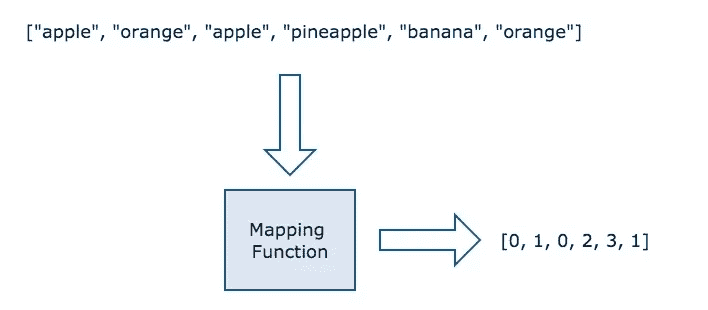
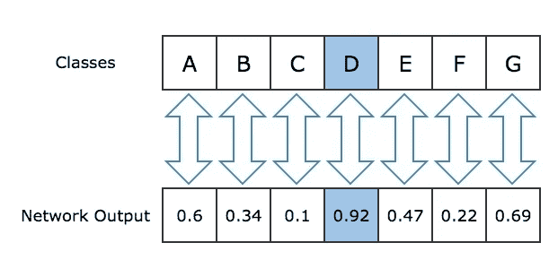
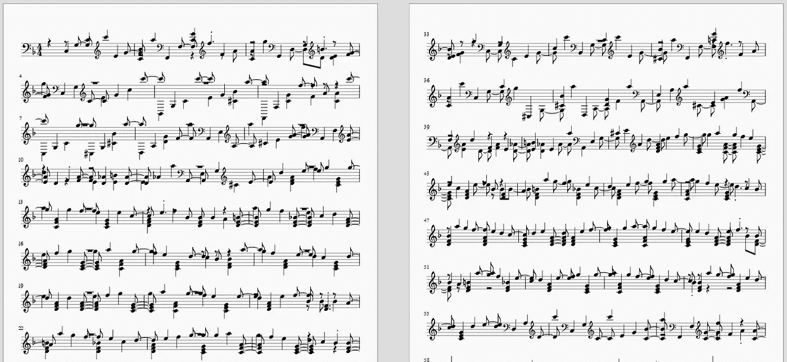

# 如何在 Keras 中使用 LSTM 神经网络生成音乐

> 原文：<https://towardsdatascience.com/how-to-generate-music-using-a-lstm-neural-network-in-keras-68786834d4c5?source=collection_archive---------0----------------------->


# 介绍

网络正被用来改善我们生活的方方面面。它们为我们提供想要购买的物品的建议，[根据作者的风格生成文本](http://www.cs.utoronto.ca/~ilya/pubs/2011/LANG-RNN.pdf)，甚至可以用于[改变图像的艺术风格](https://arxiv.org/pdf/1508.06576.pdf)。近年来，已经有一些关于如何使用神经网络生成文本的教程，但缺乏关于如何创作音乐的教程。在本文中，我们将介绍如何使用 Keras 库在 Python 中使用递归神经网络来创作音乐。

对于不耐烦的人，在教程的最后有一个 Github 库的链接。

# 背景

在我们进入实现的细节之前，有一些术语我们必须澄清。

## 递归神经网络(RNN)

递归神经网络是一类利用序列信息的人工神经网络。它们之所以被称为递归，是因为它们对序列中的每个元素都执行相同的功能，其结果取决于之前的计算。而输出与传统神经网络中的先前计算无关。

在本教程中我们将使用一个[**【LSTM】**](http://colah.github.io/posts/2015-08-Understanding-LSTMs/)长短期记忆网络。它们是一种可以通过梯度下降有效学习的递归神经网络。使用门控机制，LSTMs 能够识别和编码长期模式。LSTMs 对于解决网络必须长时间记忆信息的问题非常有用，例如音乐和文本生成。

## 音乐 21

[Music21](http://web.mit.edu/music21/) 是一个用于计算机辅助音乐学的 Python 工具包。它允许我们教授音乐理论的基础知识，生成音乐示例并研究音乐。该工具包提供了一个简单的接口来获取 MIDI 文件的乐谱。此外，它允许我们创建音符和和弦对象，以便我们可以轻松地制作自己的 MIDI 文件。

在本教程中，我们将使用 Music21 来提取数据集的内容，并获取神经网络的输出，将其转换为乐谱。

## 克拉斯

[Keras](https://keras.io/) 是一个高级神经网络 API，它简化了与 [Tensorflow](https://www.tensorflow.org/) 的交互。它的开发重点是支持快速实验。

在本教程中，我们将使用 Keras 库来创建和训练 LSTM 模型。一旦模型被训练，我们将使用它来为我们的音乐生成乐谱。

# 培养

在本节中，我们将介绍如何为我们的模型收集数据，如何准备数据以便在 LSTM 模型中使用，以及我们模型的架构。

## 数据

在我们的 [Github 库](https://github.com/Skuldur/Classical-Piano-Composer)中，我们使用了钢琴曲，主要由《最终幻想》的配乐组成。我们选择《最终幻想》音乐是因为大部分作品都有非常独特和美丽的旋律，而且作品数量庞大。但是任何由单个乐器组成的 MIDI 文件集都可以满足我们的需求。

实现神经网络的第一步是检查我们将使用的数据。

下面我们可以看到使用 Music21 读取的 midi 文件的摘录:

```
...
<music21.note.Note F>
<music21.chord.Chord A2 E3>
<music21.chord.Chord A2 E3>
<music21.note.Note E>
<music21.chord.Chord B-2 F3>
<music21.note.Note F>
<music21.note.Note G>
<music21.note.Note D>
<music21.chord.Chord B-2 F3>
<music21.note.Note F>
<music21.chord.Chord B-2 F3>
<music21.note.Note E>
<music21.chord.Chord B-2 F3>
<music21.note.Note D>
<music21.chord.Chord B-2 F3>
<music21.note.Note E>
<music21.chord.Chord A2 E3>
...
```

数据分为两种对象类型:[音符](http://web.mit.edu/music21/doc/moduleReference/moduleNote.html#note) s 和[和弦](http://web.mit.edu/music21/doc/moduleReference/moduleChord.html) s。音符对象包含关于音符的**音高**、**八度音程**和**偏移**的信息。

*   **音高**是指声音的频率，或者说高低，用字母【A、B、C、D、E、F、G】来表示，A 最高，G 最低。
*   [**八度**](http://web.mst.edu/~kosbar/test/ff/fourier/notes_pitchnames.html) 指的是你在钢琴上使用的那一组音高。
*   **偏移**指音符在乐曲中的位置。

和弦对象实质上是同时播放的一组音符的容器。

现在我们可以看到，为了准确地产生音乐，我们的神经网络必须能够预测下一个音符或和弦。这意味着我们的预测数组必须包含我们在训练集中遇到的每个音符和弦对象。在 Github 页面上的训练集中，不同音符和和弦的总数是 352。对于网络来说，这似乎需要处理很多可能的输出预测，但 LSTM 网络可以轻松处理。

接下来我们要担心我们要把笔记放在哪里。正如大多数听过音乐的人所注意到的，音符之间通常有不同的音程。你可以在短时间内连续弹奏许多音符，然后是一段休息时间，在这段时间内没有音符弹奏。

下面我们有另一个用 Music21 读取的 midi 文件的摘录，只是这次我们在它后面添加了对象的偏移量。这让我们可以看到每个音符和和弦之间的音程。

```
...
<music21.note.Note B> 72.0
<music21.chord.Chord E3 A3> 72.0
<music21.note.Note A> 72.5
<music21.chord.Chord E3 A3> 72.5
<music21.note.Note E> 73.0
<music21.chord.Chord E3 A3> 73.0
<music21.chord.Chord E3 A3> 73.5
<music21.note.Note E-> 74.0
<music21.chord.Chord F3 A3> 74.0
<music21.chord.Chord F3 A3> 74.5
<music21.chord.Chord F3 A3> 75.0
<music21.chord.Chord F3 A3> 75.5
<music21.chord.Chord E3 A3> 76.0
<music21.chord.Chord E3 A3> 76.5
<music21.chord.Chord E3 A3> 77.0
<music21.chord.Chord E3 A3> 77.5
<music21.chord.Chord F3 A3> 78.0
<music21.chord.Chord F3 A3> 78.5
<music21.chord.Chord F3 A3> 79.0
...
```

从这段摘录和大部分数据集可以看出，midi 文件中音符之间最常见的音程是 0.5。因此，我们可以通过忽略可能输出列表中的变化偏移来简化数据和模型。它不会太严重地影响网络产生的音乐的旋律。因此，在本教程中，我们将忽略偏移量，将可能的输出列表保持在 352。

## 准备数据

既然我们已经检查了数据，并且确定了我们想要使用的特征是作为我们的 LSTM 网络的输入和输出的音符和弦，那么是时候为网络准备数据了。

首先，我们将数据加载到一个数组中，如下面的代码片段所示:

```
from music21 import converter, instrument, note, chordnotes = []for file in glob.glob("midi_songs/*.mid"):
    midi = converter.parse(file)
    notes_to_parse = None parts = instrument.partitionByInstrument(midi) if parts: # file has instrument parts
        notes_to_parse = parts.parts[0].recurse()
    else: # file has notes in a flat structure
        notes_to_parse = midi.flat.notes for element in notes_to_parse:
        if isinstance(element, note.Note):
            notes.append(str(element.pitch))
        elif isinstance(element, chord.Chord):
            notes.append('.'.join(str(n) for n in element.normalOrder))
```

我们首先使用 *converter.parse(file)* 函数*将每个文件加载到一个 Music21 流对象中。使用这个流对象，我们得到了文件中所有音符和和弦的列表。我们使用每个音符对象的字符串符号来附加其音高，因为音符的最重要部分可以使用音高的字符串符号来重新创建。我们通过将和弦中每个音符的 id 编码到一个字符串中来添加每个和弦，每个音符用一个点来分隔。这些编码使我们能够轻松地将网络生成的输出解码成正确的音符和和弦。*

现在我们已经把所有的音符和和弦放入一个序列列表中，我们可以创建序列作为我们网络的输入。



Figure 1: When converting from categorical to numerical data the data is converted to integer indexes representing where the category is positioned in the set of distinct values. E.g. apple is the first distinct value so it maps to 0, orange is the second so it maps to 1, pineapple is the third so it maps to 2, and so forth.

首先，我们将创建一个映射函数，从基于字符串的分类数据映射到基于整数的数值数据。这样做是因为神经网络对于基于整数数字数据的性能比基于字符串的分类数据好得多。从分类到数字转换的一个例子可以在图 1 中看到。

接下来，我们必须为网络及其各自的输出创建输入序列。每个输入序列的输出将是音符列表中输入序列中音符序列之后的第一个音符或和弦。

```
sequence_length = 100# get all pitch names
pitchnames = sorted(set(item for item in notes))# create a dictionary to map pitches to integers
note_to_int = dict((note, number) for number, note in enumerate(pitchnames))network_input = []
network_output = []# create input sequences and the corresponding outputs
for i in range(0, len(notes) - sequence_length, 1):
    sequence_in = notes[i:i + sequence_length]
    sequence_out = notes[i + sequence_length]
    network_input.append([note_to_int[char] for char in sequence_in])
    network_output.append(note_to_int[sequence_out])n_patterns = len(network_input)# reshape the input into a format compatible with LSTM layers
network_input = numpy.reshape(network_input, (n_patterns, sequence_length, 1))
# normalize input
network_input = network_input / float(n_vocab)network_output = np_utils.to_categorical(network_output)
```

在我们的代码示例中，我们将每个序列的长度设为 100 个音符/和弦。这意味着，为了预测序列中的下一个音符，网络有前 100 个音符来帮助进行预测。我强烈建议使用不同的序列长度来训练网络，以查看不同的序列长度对网络生成的音乐的影响。

为网络准备数据的最后一步是标准化输入和[一次性编码输出](https://machinelearningmastery.com/why-one-hot-encode-data-in-machine-learning/)。

## 模型

最后，我们开始设计模型架构。在我们的模型中，我们使用四种不同类型的层:

**LSTM 层**是一个递归神经网络层，它将一个序列作为输入，可以返回序列(return_sequences=True)或矩阵。

**辍学层**是一种正则化技术，包括在训练期间的每次更新时将一部分输入单元设置为 0，以防止过拟合。该分数由该层使用的参数决定。

**密集层**或**全连接层**是全连接神经网络层，其中每个输入节点连接到每个输出节点。

**激活层**决定了我们的神经网络将使用什么激活函数来计算一个节点的输出。

```
model = Sequential()
    model.add(LSTM(
        256,
        input_shape=(network_input.shape[1], network_input.shape[2]),
        return_sequences=True
    ))
    model.add(Dropout(0.3))
    model.add(LSTM(512, return_sequences=True))
    model.add(Dropout(0.3))
    model.add(LSTM(256))
    model.add(Dense(256))
    model.add(Dropout(0.3))
    model.add(Dense(n_vocab))
    model.add(Activation('softmax'))
    model.compile(loss='categorical_crossentropy', optimizer='rmsprop')
```

现在，我们已经了解了将要使用的不同层的一些信息，是时候将它们添加到网络模型中了。

对于每个 LSTM、密集和激活层，第一个参数是该层应该有多少个节点。对于丢弃层，第一个参数是训练期间应该丢弃的输入单元的分数。

对于第一层，我们必须提供一个名为 *input_shape 的参数。*该参数的目的是通知网络它将训练的数据的形状。

最后一层应该总是包含与我们系统的不同输出相同数量的节点。这确保了网络的输出将直接映射到我们的类。

在本教程中，我们将使用一个简单的网络，包括三个 LSTM 层，三个下降层，两个密集层和一个激活层。我建议试验一下网络的结构，看看能否提高预测的质量。

为了计算每次训练迭代的损失，我们将使用[分类交叉熵](https://rdipietro.github.io/friendly-intro-to-cross-entropy-loss/)，因为我们的每个输出只属于一个类，而我们有两个以上的类要处理。为了优化我们的网络，我们将使用 RMSprop 优化器，因为它通常是递归神经网络的一个非常好的选择。

```
filepath = "weights-improvement-{epoch:02d}-{loss:.4f}-bigger.hdf5" checkpoint = ModelCheckpoint(
    filepath, monitor='loss', 
    verbose=0,        
    save_best_only=True,        
    mode='min'
)    
callbacks_list = [checkpoint] model.fit(network_input, network_output, epochs=200, batch_size=64, callbacks=callbacks_list)
```

一旦我们确定了网络的架构，就该开始培训了。Keras 中的 *model.fit()* 函数用于训练网络。第一个参数是我们之前准备的输入序列列表，第二个参数是它们各自的输出列表。在我们的教程中，我们将训练网络 200 个历元(迭代)，通过网络传播的每一批包含 64 个样本。

为了确保我们可以在任何时间点停止训练而不丢失我们所有的辛苦工作，我们将使用模型检查点。模型检查点为我们提供了一种在每个时期后将网络节点的权重保存到文件中的方法。这使得我们一旦对损失值感到满意，就可以停止运行神经网络，而不必担心失去权重。否则，在我们有机会将权重保存到文件之前，我们将不得不等待网络完成所有 200 个时期。

# 创作音乐

既然我们已经完成了对网络的训练，现在是时候让我们花了几个小时训练的网络玩一玩了。

为了能够使用神经网络生成音乐，你必须将它置于与以前相同的状态。为简单起见，我们将重用培训部分的代码来准备数据，并以与之前相同的方式建立网络模型。除了不是训练网络，而是将我们在训练部分保存的权重加载到模型中。

```
model = Sequential()
model.add(LSTM(
    512,
    input_shape=(network_input.shape[1], network_input.shape[2]),
    return_sequences=True
))
model.add(Dropout(0.3))
model.add(LSTM(512, return_sequences=True))
model.add(Dropout(0.3))
model.add(LSTM(512))
model.add(Dense(256))
model.add(Dropout(0.3))
model.add(Dense(n_vocab))
model.add(Activation('softmax'))
model.compile(loss='categorical_crossentropy', optimizer='rmsprop')# Load the weights to each node
model.load_weights('weights.hdf5')
```

现在，我们可以使用训练好的模型开始生成注释。

由于我们有一个完整的音符序列列表，我们将在列表中选择一个随机索引作为我们的起点，这允许我们在不做任何更改的情况下重新运行生成代码，并且每次都会得到不同的结果。但是，如果您希望控制起始点，只需用命令行参数替换 random 函数。

这里我们还需要创建一个映射函数来解码网络的输出。这个函数将从数字数据映射到分类数据(从整数到注释)。

```
start = numpy.random.randint(0, len(network_input)-1)int_to_note = dict((number, note) for number, note in enumerate(pitchnames))pattern = network_input[start]
prediction_output = []# generate 500 notes
for note_index in range(500):
    prediction_input = numpy.reshape(pattern, (1, len(pattern), 1))
    prediction_input = prediction_input / float(n_vocab) prediction = model.predict(prediction_input, verbose=0) index = numpy.argmax(prediction)
    result = int_to_note[index]
    prediction_output.append(result) pattern.append(index)
    pattern = pattern[1:len(pattern)]
```

我们选择使用网络生成 500 个音符，因为这大约是两分钟的音乐，并给网络足够的空间来创作旋律。对于我们想要生成的每个音符，我们必须向网络提交一个序列。我们提交的第一个序列是起始索引处的音符序列。对于我们用作输入的每个后续序列，我们将删除序列的第一个音符，并在序列的末尾插入前一次迭代的输出，如图 2 所示。


Figure 2: The first input sequence is ABCDE. The output we get from feeding that to the network is F. For the next iteration we remove A from the sequence and append F to it. Then we repeat the process.

为了从网络的输出中确定最可能的预测，我们提取最高值的索引。输出数组中索引 *X* 处的值对应于 *X* 是下一个音符的概率。图 3 有助于解释这一点。



Figure 3: Here we see the mapping between the an output prediction from the network and classes. As we can see the highest probability is that the next value should be D, so we choose D as the most probable class.

然后，我们将网络的所有输出收集到一个数组中。

现在我们已经将所有音符和弦的编码表示放在一个数组中，我们可以开始解码它们并创建一个音符和弦对象的数组。

首先，我们必须确定我们正在解码的输出是音符还是和弦。

如果模式是一个**和弦**，我们必须将弦分成一系列音符。然后我们遍历每个音符的字符串表示，并为每个音符创建一个音符对象。然后我们可以创建一个包含这些音符的和弦对象。

如果模式是一个**音符**，我们使用模式中包含的音高的字符串表示创建一个音符对象。

在每次迭代结束时，我们将偏移量增加 0.5(正如我们在上一节中所决定的)，并将创建的音符/和弦对象添加到一个列表中。

```
offset = 0
output_notes = []# create note and chord objects based on the values generated by the modelfor pattern in prediction_output:
    # pattern is a chord
    if ('.' in pattern) or pattern.isdigit():
        notes_in_chord = pattern.split('.')
        notes = []
        for current_note in notes_in_chord:
            new_note = note.Note(int(current_note))
            new_note.storedInstrument = instrument.Piano()
            notes.append(new_note)
        new_chord = chord.Chord(notes)
        new_chord.offset = offset
        output_notes.append(new_chord)
    # pattern is a note
    else:
        new_note = note.Note(pattern)
        new_note.offset = offset
        new_note.storedInstrument = instrument.Piano()
        output_notes.append(new_note) # increase offset each iteration so that notes do not stack
    offset += 0.5
```

现在我们有了网络生成的音符和和弦列表，我们可以使用该列表作为参数来创建 Music21 Stream 对象。最后，为了创建包含网络生成的音乐的 MIDI 文件，我们使用 Music21 工具包中的 *write* 函数将流写入文件。

```
midi_stream = stream.Stream(output_notes)midi_stream.write('midi', fp='test_output.mid')
```

## 结果

现在是惊叹结果的时候了。图 4 包含使用 LSTM 网络生成的音乐的活页乐谱表示。我们一眼就能看出它有一定的结构。这在第二页倒数第三行尤为明显。

了解音乐并能读懂乐谱的人会发现乐谱上散布着一些奇怪的音符。这是神经网络无法创造完美旋律的结果。在我们目前的实施中，总会有一些错误的注释，为了能够取得更好的结果，我们需要一个更大的网络。



Figure 4: An example of sheet music generated by the LSTM network

从这个相对较浅的网络得到的结果仍然令人印象深刻，这可以从 Embed 1 中的音乐示例中听出来。对于那些感兴趣的人，图 4 中的活页乐谱代表了 NeuralNet Music 5 的乐谱。

Embed 1: Examples generated by the network

# 未来的工作

我们用一个简单的 LSTM 网络和 352 节课取得了显著的效果和优美的旋律。然而，也有可以改进的地方。

首先，我们目前的实现不支持音符的不同持续时间和音符之间的不同偏移。为了实现这一点，我们可以为每个不同的持续时间添加更多的类，并添加代表音符之间的休止符的休止符类。

为了通过添加更多的类来获得令人满意的结果，我们还必须增加 LSTM 网络的深度，这将需要一台功能强大得多的计算机。我在家里使用的笔记本电脑花了大约 20 个小时来训练现在的网络。

第二，将开头和结尾添加到片段中。由于网络现在没有片段之间的区别，也就是说网络不知道一个片段在哪里结束，另一个片段在哪里开始。这将允许网络从头到尾生成一个片段，而不是像现在这样突然结束所生成的片段。

第三，添加一个处理未知音符的方法。现在，如果网络遇到它不知道的通知，它将进入失败状态。解决该问题的可能方法是找到与未知音符最相似的音符或和弦。

最后，向数据集添加更多仪器。现在，网络只支持只有一个乐器的作品。看看它是否能扩展到支持整个管弦乐队会很有趣。

# 结论

在本教程中，我们已经展示了如何创建一个 LSTM 神经网络来生成音乐。虽然结果可能并不完美，但仍然令人印象深刻，并向我们展示了神经网络可以创作音乐，并有可能用于帮助创作更复杂的音乐作品。

[点击这里查看 Github 资源库中的教程](https://github.com/Skuldur/Classical-Piano-Composer)