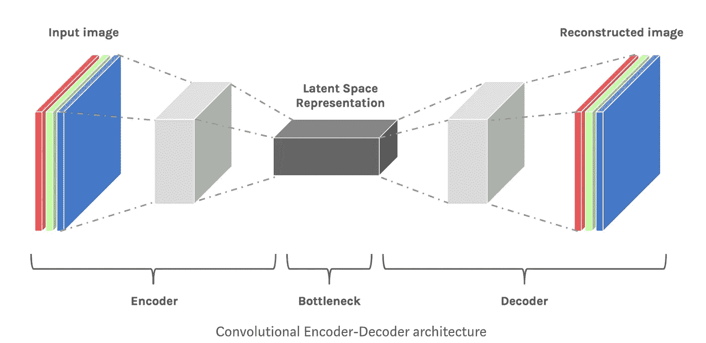
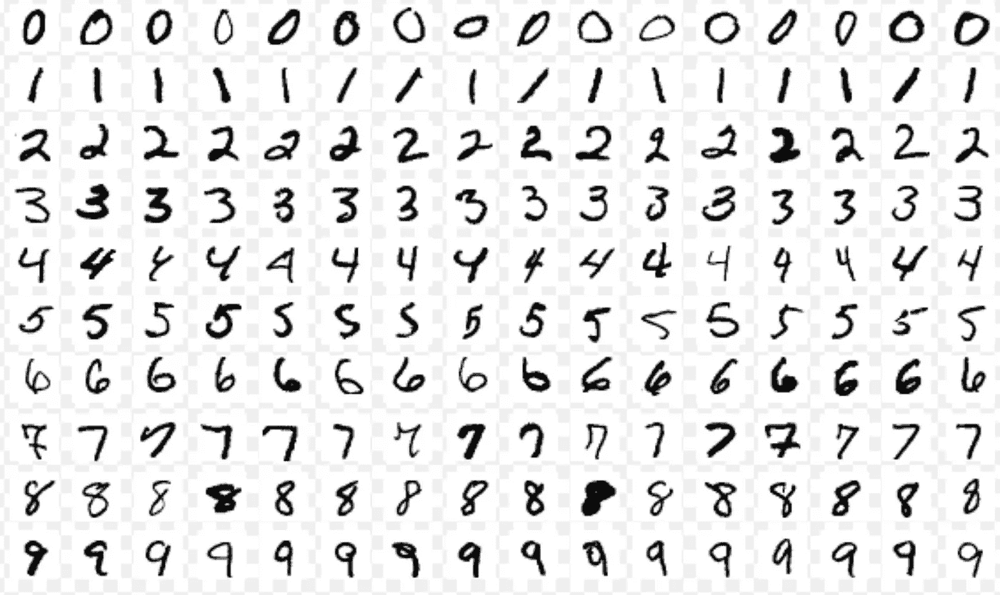
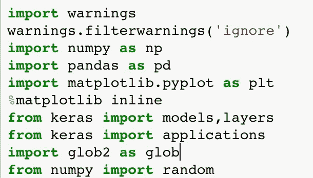
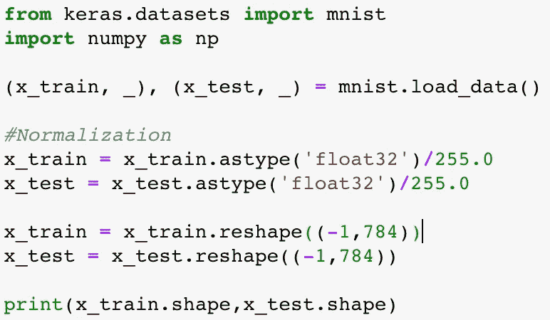
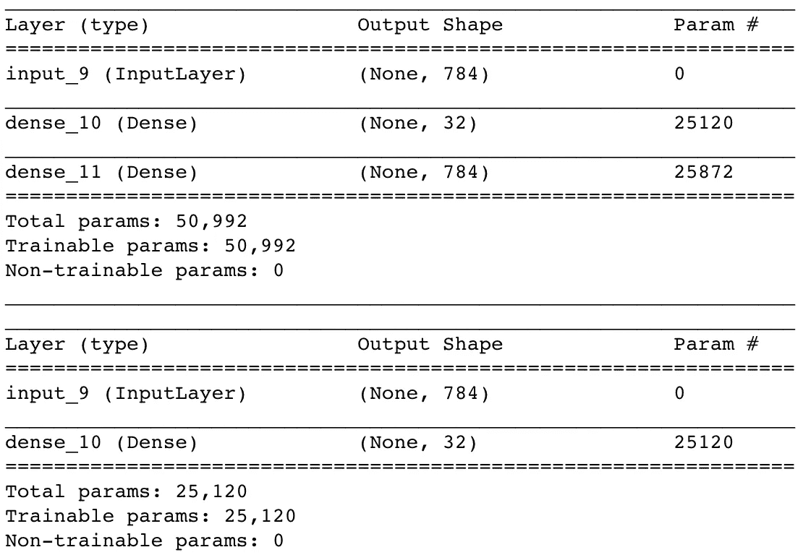
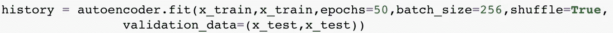
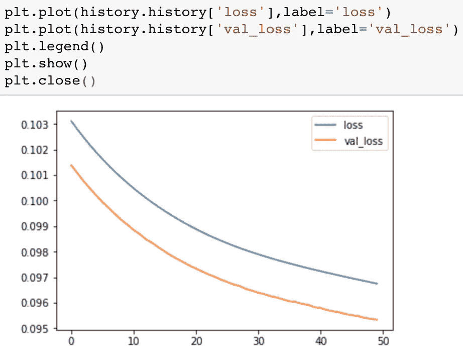
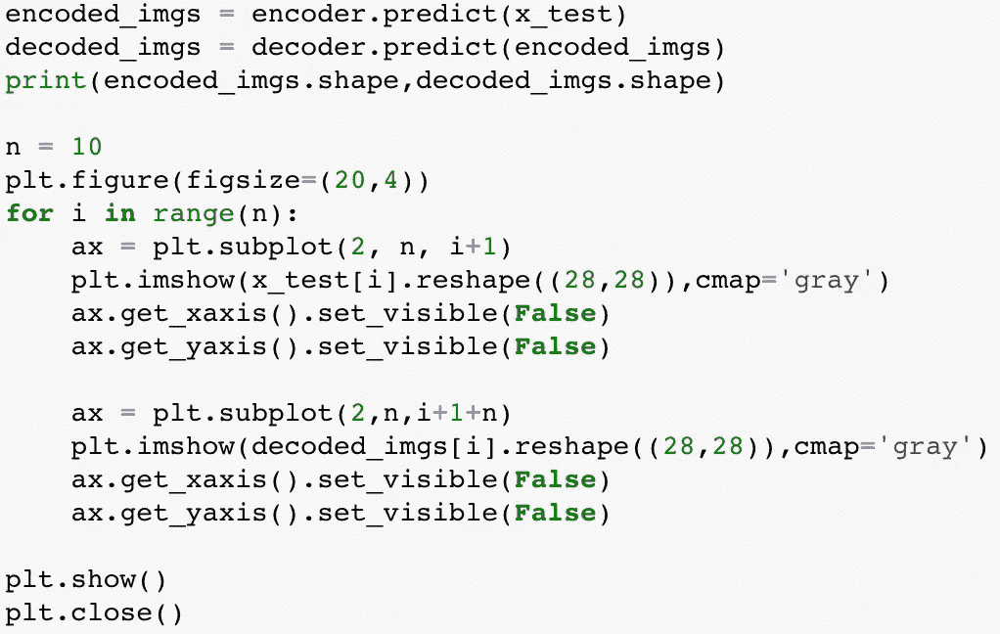
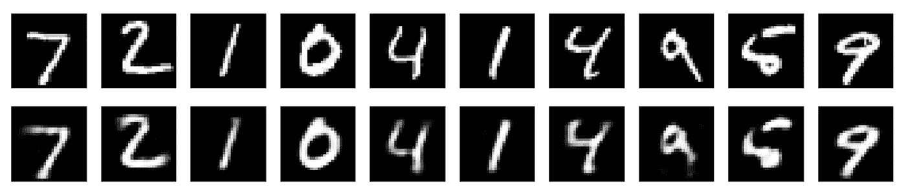

# 如何用 Python 代码将 AE (Autoencoder)应用于 Mnist 生成机器学习中的新数据

> 原文：<https://towardsdatascience.com/how-to-generate-new-data-in-machine-learning-with-vae-variational-autoencoder-applied-to-mnist-ca68591acdcf?source=collection_archive---------6----------------------->

[链接到 github](https://github.com/lbun/VAE_Variational_Autoencoders)

自动编码器是用于生成新数据的神经网络(无监督学习)。该模型用于为数据集生成新数据，或者在我们想要从数据中消除噪声的情况下使用。网络由多个神经网络组成；一个**编码器**和一个**解码器**通过一个瓶颈连接；这个瓶颈就是下图所示的潜在空间；

font: Hackernoon

**编码器**处理数据，直到瓶颈(**潜在空间**)减小尺寸，并且**解码器**获取数据并重构数据结构，以给出与我们的原始数据相同的输出。我们可以把潜在空间看作是我们数据的一种表示。

在这个具体的例子中，我们正在读取 28x28 像素(784 个元素)的数字(Mnist 数据集)图像，我们希望将它们减少到 32 个元素(潜在空间),再次创建 28x28 像素的图像。

[MNIST 数据集](https://en.wikipedia.org/wiki/MNIST_database) 是一个大型的 [c](https://en.wikipedia.org/wiki/Database) 手写数字集合，常用于图像处理。

font: [Wikipedia](https://en.wikipedia.org/wiki/MNIST_database)

我们可以开始导入我们将需要的所有库:

import

我们正在使用来自 keras.models 的[类模型](https://keras.io/models/model/)。为了更深入，使用 [keras 功能 API](https://keras.io/getting-started/functional-api-guide/) 的教程是有用的，这是定义复杂模型的方法，例如多输出模型、有向无环图或具有共享层的模型。

在所有的导入之后，我们需要导入数据集，在本例中是由 keras 提供的。

我们使用的图像是 28x28 像素的黑白图像。每个像素由 1 到 255 范围内的一个数字表示。

导入数据后，我们将对它们进行归一化，将每个像素值除以 255，这是可能的最大值，所有值的范围为 0-1。

标准化之后，我们需要为输入层重新调整数组的形状。

Importing and Data Normalization

一旦我们有了所有的数据，我们可以开始定义我们的模型，在这里我们可以清楚地看到 3 个部分(编码，瓶颈和解码。通过我们的模型结构，我们可以看到，我们有超过 25k 个参数需要训练，这些参数由权重和偏差表示。这些参数将帮助你生成新的数据。

模型架构的代码可以在 github 上看到。

在建模之后，我们需要编译(定义[优化器](https://keras.io/optimizers/)和[损失函数](https://keras.io/losses/))并使其适合我们的训练集。

Compiling the model

Plotting the Validation Loss

与训练损失相比，验证损失告诉我们我们的模型在泛化方面有多好。

现在我们已经编译和训练了模型，我们可以使用模型的预测功能生成新数据。

code for plotting

用这个代码我们绘制了两行，每行 10 个数字。第一行是真实的图像，第二行是生成的图像。正如我们所看到的，我们丢失了一些信息，但数量显然是相同的。

1s row real <***> 2nd row generated

这是一个非常强大的模型，可以与管道中的其他机器学习模型相结合，也可以用于预训练模型或减少数据中的噪声。

如果你愿意支持我写其他类似的文章， [**请我喝杯咖啡**](https://www.buymeacoffee.com/berlin) :)