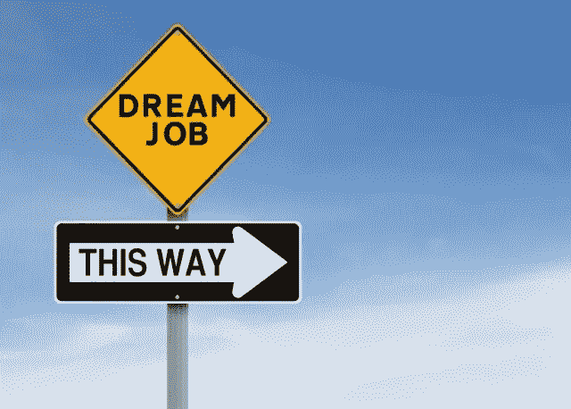

# 如何获得一份数据科学家的工作？

> 原文：<https://towardsdatascience.com/how-to-get-a-job-as-a-data-scientist-f417078fe13e?source=collection_archive---------0----------------------->

大家好。这篇博客文章来自我最近在 LinkedIn 发表的三篇文章。他们是第一部分的、[第二部分的](https://www.linkedin.com/feed/update/urn:li:activity:6356155058937217024)和[第三部分的](https://www.linkedin.com/feed/update/urn:li:activity:6356171894655373313)。

这是一个很难回答的问题。这一个和我一起挂吧(而这并不是关于宇宙、存在和一切的最终答案)。

这是我最常从我认识的人或我的关系@ LinkedIn 那里收到的问题之一。

我告诉你我的经历。我现在已经做了一段时间的数据科学家(尽管有些人仍然认为这不是一个职业，或者可能不是一个新的职业)。不过我还是要说说我是如何在 [**BBVA 数据&分析**](https://www.bbvadata.com) 得到现在这份工作的。

我去年完成了我的硕士学位，我做了一个关于宇宙学和贝叶斯机器学习的物理学。就在毕业前，我想了想我想做什么，我决定我想在数据科学领域工作。

我申请了将近 125 份工作(真的，也许你申请了更多)，我只收到了 25-30 份回复。有些人只是说:谢谢，但是不用了。我接受了将近 15 次采访。我从每一个人身上学到了东西。变好了。我不得不面对许多拒绝。一些我实际上没准备好的事情。但我喜欢接受采访的过程(说实话，并不是所有人)。我学习了很多，每天编程，看了很多文章和帖子。他们帮了大忙。

但是，我是怎么得到这份工作的？

很有耐心。这并不容易，但到了第七次面试时，我意识到了几件事:

*   有些人不知道什么是数据科学。
*   招聘人员是你面试时最好的朋友，他们想帮你进去。所以相信他们，让他们帮助你，提出问题！
*   人们更感兴趣的是你如何解决问题，如何处理一些特定的情况，而不是你的技术知识。

我真的做好了回答算法、机器学习、Python、Spark 等问题的准备。但是我还没有准备好回答关于我如何解决一个问题，或者我将如何处理一个情况的问题。

到第八次面试时，我回顾了我以前作为数据科学家、计算机工程师、物理学家和人类所做的一切。我准备好回答关于现实生活工作的问题，如何处理复杂的情况，如何处理新数据，如何做数据科学工作流，如何向经理解释困难的概念等等。

我做得好多了。我也平静下来了。我知道面试我的人是想让我进公司，这不是调查。

我的建议是找一份数据科学家的工作:

*   耐心点。在找到一份工作之前，你可能会申请上百份工作。
*   准备好。很多。不仅要学习重要的概念、编程和回答商业问题，还要记住你将是组织中的重要一员，你将与不同的人和情况打交道，准备好回答关于你在不同工作情况下如何表现的问题。
*   有一个投资组合。如果你正在寻找一份严肃的数据科学的有偿工作，做一些有真实数据的项目。如果你能把它们发布在 GitHub 上。除了 Kaggle 比赛，找一些你喜欢的事情或者你想解决的问题，用你的知识去做。
*   招聘人员是你的朋友。面试你的人也是。他们希望你进入公司，这是我每天都记得的一个强有力的建议。
*   询问人们是做什么的。我建议您关注马修·梅奥 关于“数据科学家的一天”的帖子，以便更好地了解我们的工作。
*   如果你想要一份实习工作，就要有你的学术技能。

祝你一切顺利，成功:)。

跟我来:【https://www.linkedin.com/in/faviovazquez/】T4。