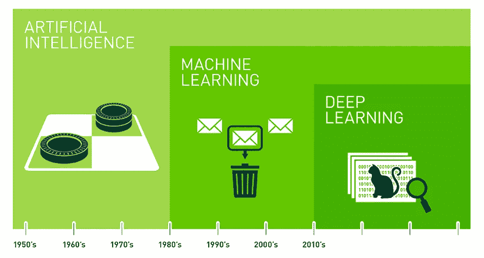

# 没有经验如何在 AI 找工作

> 原文：<https://towardsdatascience.com/how-to-get-a-job-in-ai-with-no-experience-16526874165d?source=collection_archive---------4----------------------->

Photo by [James Harrison](https://unsplash.com/@jstrippa?utm_source=medium&utm_medium=referral) on [Unsplash](https://unsplash.com?utm_source=medium&utm_medium=referral)

# 介绍

在我们开始之前，我想我应该给一些背景信息，关于我写这篇文章的动机。我刚刚从计算机科学学士学位毕业。大约在我第三年的中途，我知道我唯一想从事的领域是人工智能。我的大学没有任何人工智能的专门课程，在都柏林也没有多少人工智能实习。我很高兴地说，我现在作为一名毕业生在一个人工智能研发团队工作。

这篇文章将简要概述我是如何为一份没有经验的人工智能工作做准备的。现在承认，这些信息中没有一个是令人兴奋的，大多数提示都是显而易见的。然而，就像健康饮食和锻炼一样，我发现尽管每个人都知道这是你需要做的事情，但很多人还是不去做。我希望这篇文章能帮助人们制定自己的计划，进入令人兴奋的人工智能世界。我想指出的另一件事是，这个建议通常适用于软件开发的所有领域，然而具体的指导方针和主题显然将集中在 AI/ML 上。

# 人工智能的现状

Nvidia provides a nice infographic of how AI has progressed over the past several decades, [source](https://3gp10c1vpy442j63me73gy3s-wpengine.netdna-ssl.com/wp-content/uploads/2018/03/ai-machine-learning-deep-learning-1.jpg)

对于软件毕业生和初级开发人员来说，ML 是一个非常独特的领域。这个领域在过去 5 年才真正起步，而且还相对年轻。这为新的开发者和雇主提供了一个真正的问题/机会。

**毕业生**:对这个领域没有任何扎实的信息，大学里的模块很少，很难获得相关的经验。

**雇主:**发现很难找到有相关经验的人。

作为一名大学生，这是一个艰难的困境，但也提供了一个很好的机会。目前，合格的机器学习(ML)开发人员数量严重不足。所有公司都在招聘这些职位，但都招不到人。如果你能证明你有相关的专业知识，你将是一个非常理想的候选人，不仅会从毕业生中脱颖而出，也会在有经验的雇员中脱颖而出。

这在理论上听起来很棒，但当然没那么简单。很难找到这些人是有原因的。这是一个很难精通的领域，而且这个领域正在快速发展，每个月都有更多的进步需要跟上。下面我将介绍你需要努力的关键领域，以便建立你作为机器学习专家的品牌。

*   经验
*   对理论的理解
*   专业化
*   大学

# 经验

但是题目说没经验？？Wtf！

是的，我知道，但是说实话，没有人会雇佣一个完全没有经验的人。

[Source](https://www.google.ie/url?sa=i&source=images&cd=&cad=rja&uact=8&ved=&url=https%3A%2F%2Fimgflip.com%2Fi%2F1089l7&psig=AOvVaw0Ke8eCaSIkNIJoUN5qpL9y&ust=1541195678514692)

就像我之前说的，在做 ML 的公司工作很难获得经验。因此，如果这不是一个选项，你需要为自己提供所需的经验。下面是一些你可以做到这一点的好方法。

*   个人项目
*   黑客马拉松
*   编码挑战
*   开源项目

## 个人项目

你 100%需要在你的 GitHub 中有 ML 项目。这是从招聘过程中剔除人员的一个非常快速的方法，也是招聘人员在看完你的简历后首先要看的。现在，当你还在学习 ML 的时候，想出一个项目可能有点困难，没关系。它不需要很大或华而不实或创新，它只需要显示你对主题的理解，并给人们一个信号，表明你能够以良好的编码标准独立工作/研究。构建 GitHub 项目时需要关注的几件事。

1.  完成这个项目不会超过一个月
2.  确保你的代码是干净的，模块化的，有注释的
3.  为您的代码提供自述文件和其他文档，如使用的技术、参考教程、依赖项等
4.  如果可能，为代码库的关键部分提供单元测试

接下来的事情是选择做什么项目。你希望它足够简单，你可以在一个月内完成，并且足够相关，你可以在这个过程中学到有用的技能。以下是一些例子:

*   使用 CNN 的图像分类器。只是让它区分两种类型的图像(即狗/猫)。
*   标准前馈神经网络对数据进行分类。Kaggle.com 有很多很棒的数据集。以虹膜数据集为例，根据给定的数据对一种花的虹膜类型进行分类。
*   电影评论的情感分析。另一个受欢迎的 first 项目是使用神经网络对电影评论的情绪进行分类(好的或坏的)，你可以使用 IMDB 数据集，也可以在 kaggle 上找到。

## **黑客马拉松**

黑客马拉松之所以伟大，有几个原因。它迫使你走出去，建立一些东西，你会遇到更多有经验的人，你可以把它放在你不断增长的简历/投资组合中。试着去找专门的人工智能黑客马拉松，但也去找一般的软件黑客马拉松，试着在你的项目中加入人工智能元素。查看 meetup.com[的](https://www.meetup.com/)，看看你所在的地区是否有专注于人工智能或软件开发的 meetup 团体。这些团体通常每年至少有一次黑客马拉松。

## **编码挑战**

类似于黑客马拉松，编码挑战迫使你建立一个你所学的实际应用，当你申请你的 ML 工作时，这是值得的。作为一个额外的奖励，这些比赛通常很有趣，增加的竞争意识可以成为一个很好的动力。看看 [Kaggle](https://www.kaggle.com/) 、 [CodinGame](https://www.codingame.com/start) 和 [Halite.io](https://halite.io/) 等地方

## **开源项目**

这是你能得到的最接近真实世界的经验，除了真正得到一份 ML 开发者的工作。开源项目让你真正了解产品级代码，并教会你有价值的技能，如调试、版本控制、与其他人一起开发，当然还有大量的 ML(取决于项目)。

# 理解理论

好的，所以最主要的事情是获得一些项目和经验，但这不仅仅是跟随一些教程并贴在 GitHub 上(尽量不要这样做，:D)你需要了解你正在构建什么。很多大学生都知道，学习一个东西和理解它是有很大区别的。

有很多很好的资源，清楚地介绍了 ML 和深度学习的重要理论。另一个重要的事情指出，不要只关注深度学习。我知道这是 AI“更性感”的一面，但这只是一面。熟悉更多传统形式的 ML，如回归模型、支持向量机和所有主要的概率和统计概念。无论你在构建什么类型的人工智能，这些都是有价值的。

以下是我发现的一些更好的资源。

*   [斯坦福机器学习](https://www.coursera.org/learn/machine-learning#syllabus)是 coursera 上的一门免费课程，涵盖了你需要了解的从回归模型到深度学习的所有机器学习知识
*   [DeepLearning.ai](https://www.deeplearning.ai) 作者吴恩达。与之前的课程一样，Ng 对人工智能进行了非常全面的研究，然而这门课程是专门针对深度学习的，而不是一般的 ML。
*   安德鲁·特拉斯克的《探索深度学习》可能是我找到的关于深度学习的最好的书。除了 numpy，这本书没有使用任何库来构建神经网络。它更复杂，也更费钱，但如果你有时间仔细阅读，它是非常有价值的。
*   Siraj Raval' 的 youtube 频道是一个很好的地方，可以获得几乎所有相关 ML 主题的高水平概述，观看起来也很有趣。

# 专业化

diagram showing some of the major areas of AI today, [source](http://www.empcom.co/machine-learning-diagram.html)

对于雇主来说，这是一个去粗取精的好方法。ML 是一个巨大的领域。一个人不可能什么都知道。这就是为什么人们专门化并成为专家。如果你不仅能展示出你对 ML/Deep Learning 总体上有着扎实的理解，而且在某个领域有专长，你将对潜在雇主变得更有价值。但是注意不要把自己放在一个盒子里，你不必现在就决定你的整个职业道路，相反，试着找到一个真正让你兴奋的领域，了解更多，如果可以的话，也许可以做几个项目。这里有一些专业化的例子。

*   **计算机视觉:** CNN，分割，标记，描述，物体检测
*   **经常性网络:**时间序列数据如股票市场和一个视频，LSTM 细胞
*   **强化学习:**教代理学习技能，比如玩视频游戏或驾驶
*   **自然语言处理:**聊天机器人、情感分析、内容生成、内容摘要
*   **生成对抗网络:**学习生成内容，如图像、3D 模型、学习策略、音频
*   **元学习:学会学习**
*   **一次性学习:**用很少的数据学习
*   **神经网络可视化和调试:**巨大的研究领域，神经网络仍然是一个黑匣子，我们很难可视化它们，也很难理解为什么它们在损坏时不工作。

# 大学

这是很多人不同意的一点。成为软件开发人员的道路正在改变。大学不再像以前那样是进入这个行业的硬性要求。谷歌和苹果等科技巨头甚至已经开始放弃对学士学位的要求。这是因为创新型公司认识到，他们希望与之共事的人充满激情，自我驱动，渴望采取主动。所有这些都不需要明确的学位，有了互联网上的大量资源，你可以在家自学任何东西，只要你愿意付出努力。

话虽如此，在大学里表现良好是一个很大的奖励，不应该被低估。因此，我的建议是，如果你的情况不允许你上大学，不要纠结于此，还有许多其他途径向你敞开。如果你在大学，那么你需要粉碎它。

如果你执行了这篇文章中提到的所有其他事情，你很有可能在大学成绩不好的情况下找到一份工作。然而，如果你得了 1.1 分(根据爱尔兰教育系统，这是最好的成绩)或高 GPA，并且有一个围绕前面提到的主题的令人敬畏的最后一年项目(FYP)，你将处于一个更好的位置。所以这是你需要关注的事情。抱着“我要碾压这个”的攻击性心态进大学。每节课都去，记笔记，早点完成作业，好好学习，拿成绩。

# 结论

现在是进入人工智能行业的最好时机。就像互联网的出现一样，人工智能将影响所有领域的所有业务，使其成为任何组织最受追捧的工具之一。目前，我们仍处于人工智能能力的初级阶段。这意味着该行业正处于巨大的创新、发现和不确定状态。专家很少，没有人知道所有的答案。人工智能社区处于不断学习和完善的状态。所以，投入时间，尽可能多的学习，你很快就会发现你能多快提高你的技能。这不是一件容易的事，需要时间。所以要有耐心，坚持不懈，保持专注。