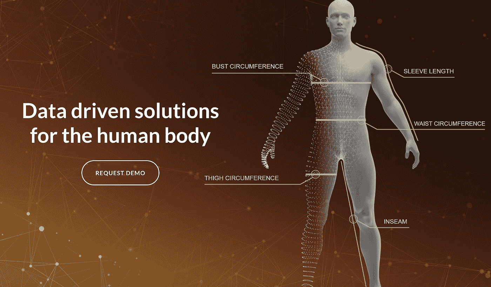
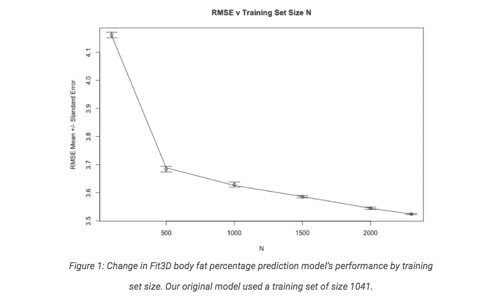
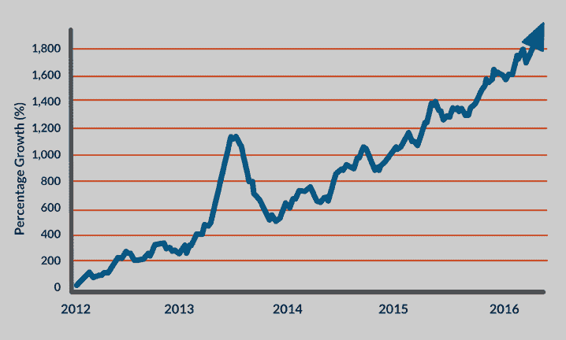
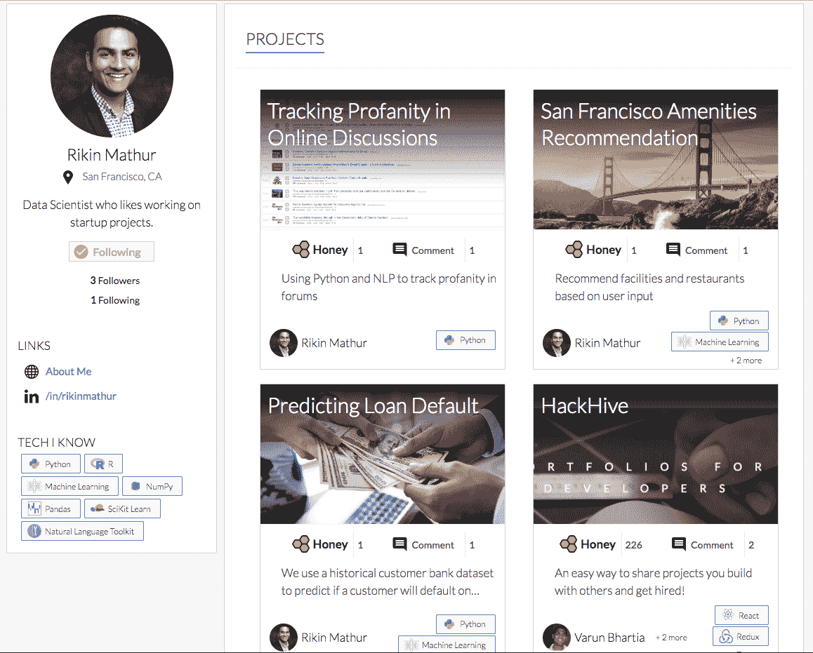

# 如何进入数据科学领域

> 原文：<https://towardsdatascience.com/how-to-get-into-data-science-ca61930360c8?source=collection_archive---------9----------------------->

几个朋友发现我的故事对他们自己的求职和进入数据科学很有用。我想分享我的故事，让更多人受益。我不仅想分享我是如何在没有工作的情况下收拾行李搬到旧金山的，还想分享我对数据科学的热情，以及为什么我认为这是目前最好的技术领域。

关于我自己的一点点。2017 年 4 月，我决定搬到旧金山，没有工作，但有几个面试在排队。这就是旧金山湾区的伟大之处——你周围的每个人都愿意提供帮助，也更愿意了解你的故事。你只需要问:)我在 Fit 3D 公司担任数据科学家，这是一家专注于健身和健康的 3D 人体扫描公司。找工作并不容易——我使用了所有的在线门户网站(Angellist、Linkedin、Kaggle 等。)终于收到 Fit3D 的 offer 了。

## 我的工作:你有多胖？

自从加入 Fit3D 以来，我已经参与了各种项目，包括使用人体测量数据预测身体脂肪成分，使用图像分类验证扫描，以及使用机器学习来建立可被消费者用作产品的预测模型。使用回归和统计概念，我们能够建立一种算法，该算法随着时间的推移不断改进，为**用户提供最准确的体脂值**。事实上，我开发的一个功能最终被现实世界中的客户所使用，这是所有这些中最有价值的部分。

*Check out Fit3D:* [*https://www.fit3d.com/solutions/*](https://www.fit3d.com/solutions/)

Complete blog post: [http://hd2i.org/blog/2018/03/07/fit3d-training-set-update.html](http://hd2i.org/blog/2018/03/07/fit3d-training-set-update.html)

上图显示了随着 Fit3D 积累了更多的身体数据，增加了我们的数据集，以及我对身体脂肪算法进行了改进，RMSE(均方根误差)随着时间的推移而减少。较低的 RMSE 意味着残差中的误差幅度较低(与样本均值的偏差，例如:DEXA 机器上的观察值)。

## **数据科学增长**

最棒的是，数据科学行业一直在快速发展，这使得找到更多与你的特定技术经验相关的职位变得很容易。数据科学行业的增长是有意义的。所有其他行业和公司都可以从使用数据进行数据分析和预测中受益。Fit3D 使用数据为人体提供测量/健身解决方案，谷歌和苹果都在其所有产品中使用机器学习来改善人工智能功能、客户参与、语音识别和计算机视觉，航空公司使用客户数据来波动机票价格。

# **狩猎**

*Percentage growth per year in DS jobs*

到了找工作的时候，我在研究生院的研究工作中是一名兼职数据科学家，但缺乏成为全职数据科学家的专业技能。在电气工程项目期间，我很幸运地被拉进了数据科学和机器学习项目。在哥伦比亚大学的两年里，电气工程是我的必修课，但机器学习是我的主要关注和兴趣。毕业后，我决定花几个月的时间，通过 Udemy(我强烈推荐任何在特定领域寻找工作的人)等在线资源上的编程课程，严格学习机器学习，同时练习我的编程技能。从我的经验来看，数据科学领域有三个关键领域(高度重叠)——分析、机器学习和编程，你越早决定要从事哪一个或两者的结合，找工作就越容易。成功找工作的关键是找到合适的机会，帮助你最好地利用技能，只有首先选择你想要学习的技能，你才能做到这一点。这一点非常重要，因为这将是你在工作中大部分时间要做的事情。

无论你属于光谱的哪个领域，R/Python 库如 caret 和 scikit-learn 都是最好的开始方式，机器学习概述(不是很必要)，基本(必要)和高级统计概念很重要。计算机科学中级和高级基础更多的是软件开发的角色。挑选数据集和从事预测/分析项目是练习这些技能的最佳方式。我建议使用 hackhive，这是一个非常容易使用的在线平台，可以向招聘人员展示你的项目(下面是我的项目的链接)，在这里你还可以与具有相似技能和兴趣的开发人员联系。如果你没有技术背景，也没有研究生学位，投资一个新兵训练营是个不错的主意。有一些非常有竞争力的训练营有奖学金，可以让你免费参加训练营，比如数据孵化器。我进入了数据孵化器奖学金的最后一轮，如果我能走到那一步，你也能。

*Hackhive Profile and Projects UI*

带有机器学习的 R 和 Python 课程是最便宜的，而且在 Udemy 上非常有吸引力。任何关于统计学的书都可以。通常，Hastie 的《统计学习元素》是很好地介绍统计学和机器学习背后的数学的最佳书籍。如果你觉得你已经很好地掌握了上面的概念和技巧，在线博客和关于面试的一般文章也非常有用。为了提高你的编程技能，破解编码面试是你最好的选择。你可以通过谷歌找到很多其他资源，但我提到的是我用过的。

数据真的让我兴奋，因为它真的是现在和未来。通过一个简单的散点图和几个字节的数据，你可以了解任何主题或行业的很多信息。我能够从 lending club 快速积累一个数据集，其中包含客户银行贷款和违约率的信息，并建立一个客户贷款违约分类器。一旦你真正开始详细探索一个主题，它会变得非常复杂和有趣，这就是数据科学的全部乐趣。

hack hive:[https://www.thehackhive.com/profile/kobe2792](https://www.thehackhive.com/profile/kobe2792)

LinkedIn(随意伸手):【https://www.linkedin.com/in/rikinmathur/T2

Instagram(关注我，因为我想多去旅行):【instagram.com/rikinmathur 