# 如何在你的博客上获得更多赞(1/2)

> 原文：<https://towardsdatascience.com/how-to-get-more-likes-on-your-blogs-1-2-f5a564c29d27?source=collection_archive---------5----------------------->

*使用数据分析揭开媒体博客上掌声的神秘面纱*


作为一个业余博主，我总是想知道是什么让一个好的博客变得“好”。重要的是内容，还是我们也必须关注其他方面？为了解开这个谜，我使用了我能想到的唯一工具——数据！

这是我和 [Neerja Doshi](https://medium.com/u/3dff2ff1664?source=post_page-----f5a564c29d27--------------------------------) 写的两篇博客中的第一篇，旨在了解影响媒体博客点赞/鼓掌的因素。第一部分包括网页抓取、特征提取和探索性数据分析。在[的第二篇博客](https://medium.com/@neerja.doshi/how-to-get-more-likes-on-your-blogs-2-2-f8ef0be21771)中，我们将应用包括一些机器学习算法在内的数据科学技术来确定特征的重要性，并有望尝试预测掌声。

> 免责声明:本博客的目的是出于好奇，应用数据科学获得有用的见解。我们绝不是在贬低博客实际内容的重要性。这是也将永远是决定一个博客质量的最重要的因素。此外，“鼓掌”是决定一个博客的有用性或质量的指标之一。还可以有其他指标，如“浏览量”。然而，我们只用“拍手”作为指标。

# 方法

## 擦

我们用 python 构建了一个 web-scraper(谢谢，美丽的汤&硒！)获得了大约 600 篇博文。为了保持一致性，我们只抓取与数据科学和人工智能相关的博客。我不打算在这里写 python 脚本(我们谦卑地试图保持博客的整洁)。但是特别好奇的人可以去这个 GitHub [链接](https://github.com/aswalin/Medium_Blogs_Analytics)上找到它。

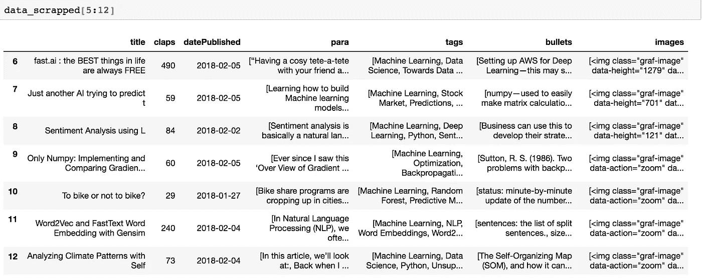

Raw Data Scrapped from Blogs

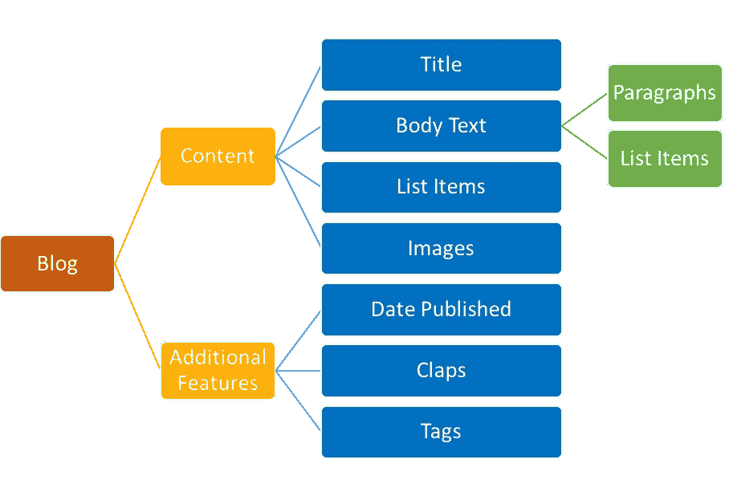

## 特征工程

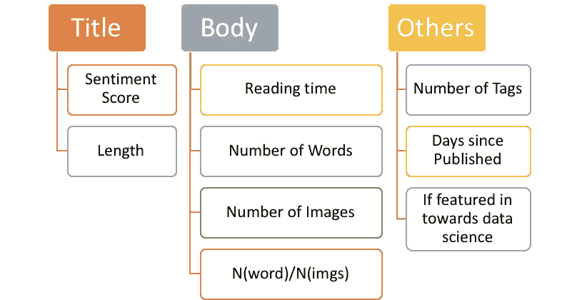

```
***#Title***
from nltk.sentiment.vader import SentimentIntensityAnalyzer
sid = SentimentIntensityAnalyzer()data = pd.DataFrame()
for i in range(data_scrapped.shape[0]):
    data.loc[i, "title_length"] = len(data_scrapped.loc[i, "title"])
    data.loc[i, "title_emot_quotient"] =  abs(sid.polarity_scores(data_scrapped.loc[i, "title"])['compound'])***#Body***data.loc[i, "ct_image"] = len(data_scrapped.loc[i, "images"])
    text =  " ".join(data_scrapped.loc[i, "para"] +      data_scrapped.loc[i, "bullets"]).split()
    data.loc[i, "ct_words"] = len(text)
    data.loc[i,'read_time'] = int(data_scrapped.loc[i,'read_time'])***#Additional***
    data.loc[i, "days_passed"] = (datetime.now() -     data_scrapped.loc[i,'datePublished'] ).days
    data.loc[i, "featured_in_tds"] = 'Towards Data Science' in data_scrapped.loc[i,'tags']
   data.loc[i, "ct_tags"] = len(data_scrapped.loc[i, "tags"]
```

## 数据汇总

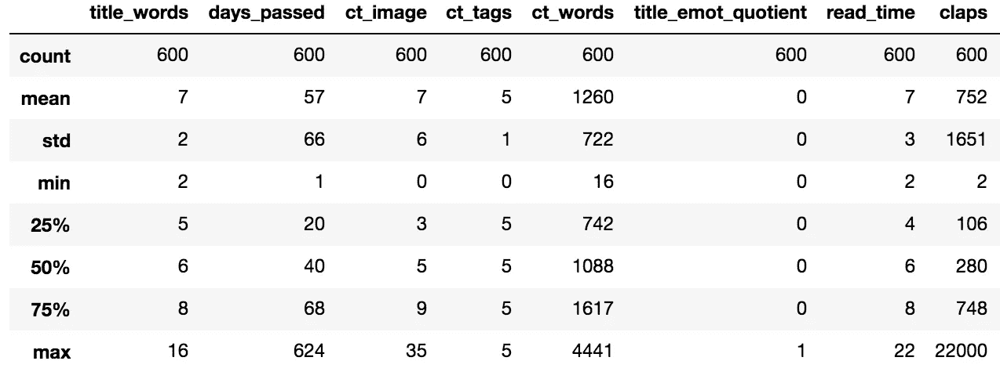

# 形象化

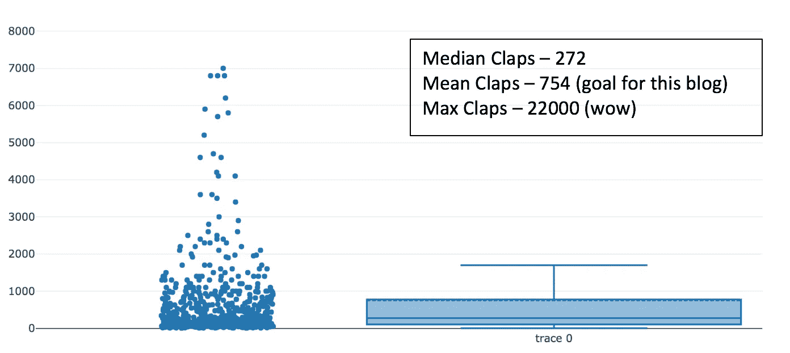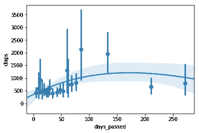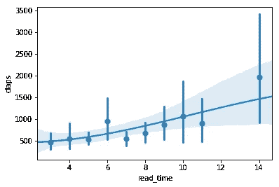

Scatter plot of Claps vs Features

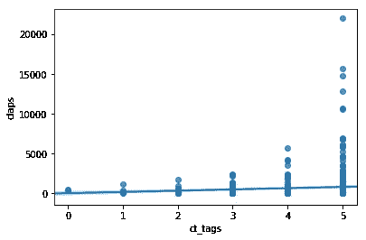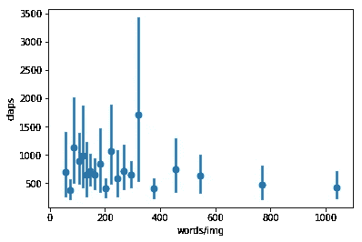

**片段与特征的相关图**

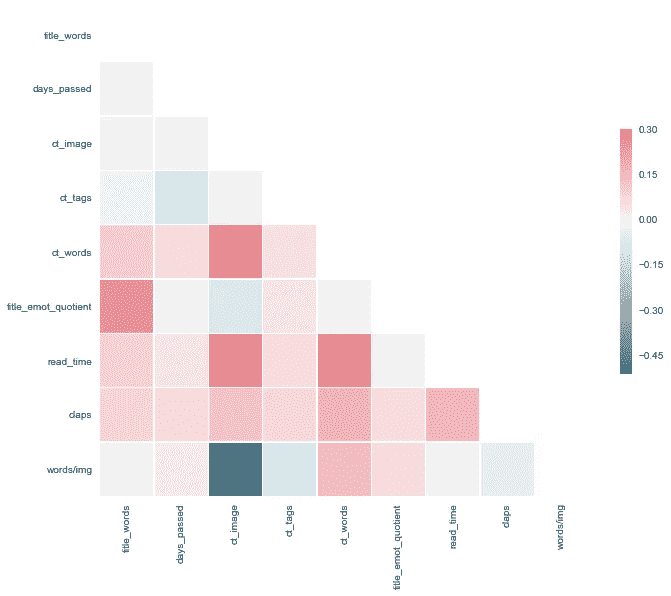

Correlation Plot

**最常用的词语**

```
from wordcloud import WordCloud, STOPWORDS
from nltk.corpus import stopwords
stop = STOPWORDS.union(set(stopwords.words('english')))
wordcloud = WordCloud(relative_scaling = 1.0, stopwords = stop, width=1500, height=800).generate(text)
plt.figure(figsize=(18, 16))
plt.imshow(wordcloud)
plt.axis("off")
plt.show()
```

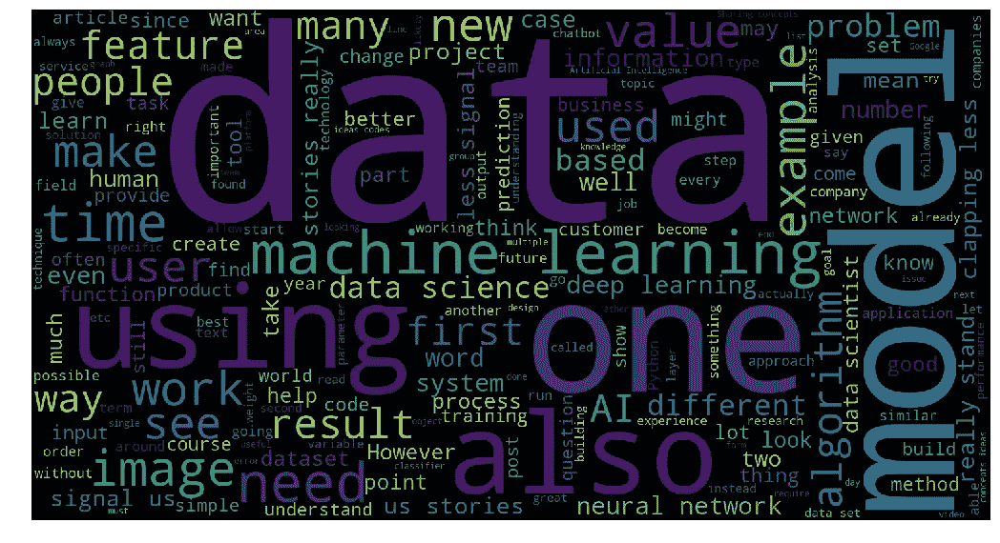

# 一些有趣的观察

1.  与中值相比，鼓掌次数的平均值要高得多。这表明，大多数博客获得的掌声数量较低，并且分布向右倾斜
2.  大多数标题在情感商数方面是中性的，在掌声和标题的情感内容值之间没有明显的趋势
3.  阅读时间、字数和图片数量与鼓掌次数正相关，这是我们通常所期望的(越长的博客获得越多的喜欢)。此外，words_count/img_count 具有负相关性，因为图像比文本更能吸引注意力。
4.  从上面的图表可以清楚地看出，标签数量越多的博客获得的掌声越多。所以下次别忘了加标签。
5.  标题的平均长度是 6-7 个单词。然而，具有 10 个单词的标题具有最高的平均鼓掌次数(异常值被移除以创建下图)。

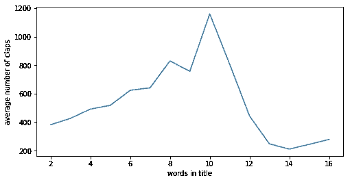

6.拍击次数随着天数的增加而增加，直到达到某个值。从图中可以看出，150 天后，days_passed 并不重要，因为 claps 已经饱和。

7.一个博客的平均阅读时间是 6-7 分钟。然而，长度为 11 分钟的博客拥有最高的平均鼓掌次数(异常值被删除以创建下图)。

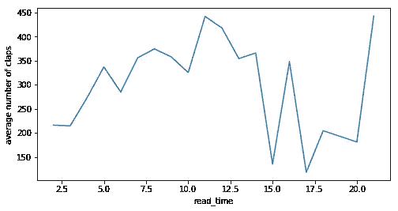

我希望你喜欢读它！更多有趣的观察，请阅读第二篇博客。对于探索性分析，我们只使用了 600 篇博客，但是对于采用机器学习技术，我们使用了更大的数据集——4000 篇博客。让我们看看这些推论中有多少仍然成立。

第二篇博客的链接可以在这里 **找到 [**。**](https://medium.com/@neerja.doshi/f8ef0be21771)**

**领英:**[**www.linkedin.com/in/alvira-swalin**](http://www.linkedin.com/in/alvira-swalin)

# 资源:

1.  网络报废的灵感来自于特伦斯·帕尔在 USF 的数据采集讲座
2.  [https://stack overflow . com/questions/21006940/how-to-load-all-entries-in-a-infinite-scroll-once-to-parse-the-html-in-pytho](https://stackoverflow.com/questions/21006940/how-to-load-all-entries-in-an-infinite-scroll-at-once-to-parse-the-html-in-pytho)