# 如何在你的博客上获得更多赞(2/2)

> 原文：<https://towardsdatascience.com/how-to-get-more-likes-on-your-blogs-2-2-f8ef0be21771?source=collection_archive---------7----------------------->

*估算你得到的掌声，数据科学的方式*

想知道如何让你的故事更有趋势吗？？是标题、图片、引语还是内容让你赢得更多掌声？在我和[阿尔维拉·斯瓦林](https://medium.com/u/185ec3b29f78?source=post_page-----f8ef0be21771--------------------------------)的这个系列中，我们试图探索一个博客的特征和它获得的点击量之间的关系。[第 1 部分](https://medium.com/@aswalin/f5a564c29d27)，讲述了特征提取和初步探索性数据分析(EDA)，而在第 2 部分，我们建立模型来预测一个博客可以获得的掌声。

# 数据

第 1 部分中的 EDA 基于 600 个数据科学博客，但是为了进一步分析，我使用了大约 4000 个中型博客。为了内容和受众的一致性，我们从数据科学、人工智能、技术和编程类别中挑选了这些博客。我们的功能包括博客的长度，图片/文字，标签数量，标题的情感分数，博客发表以来的持续时间和追随者的数量。从初步的 EDA 中，我们可以看到 claps 与阅读时间和标签数量成正相关。更多的标签似乎能获得更多的掌声，而标题的情感似乎对掌声没有太大的影响。

# 方法学

为了进一步研究这个问题，我们首先尝试先将这个问题视为回归，然后再进行分类。正如所料，回归没有做得很好，因为预测和变化的范围很大。因此，我们决定对这些数据进行分类处理，并将进一步讨论这种方法。

看看我们的初步分析是否适用于更广泛的博客——

*   3 标签分类，看看一个博客是否得到低，中或高的掌声
*   20 标签分类获得更精细的预测

# **特色工程**

总之，我包含了 24 个特征，包括直接提取的特征以及与内容、作者和日期相关的特征。

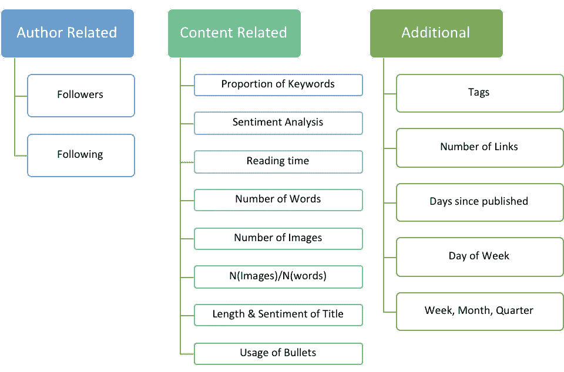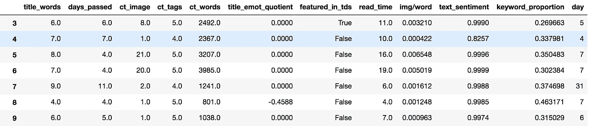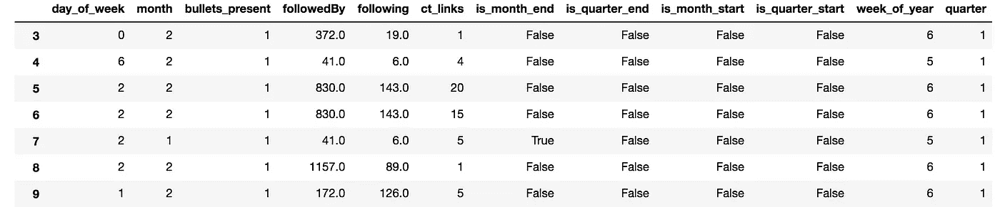

# **基于标签的预处理**

拍手的范围从 1 到 62，000，标准偏差为 2.8k！这是一个很大的预测范围，所以为了处理这种变化，我们在第 90 百分位截取数据。

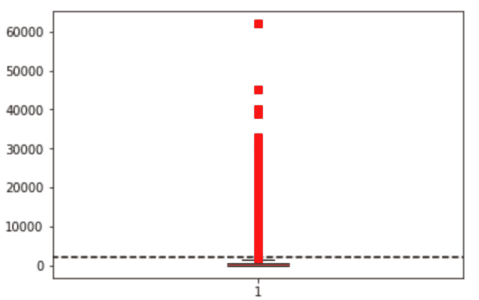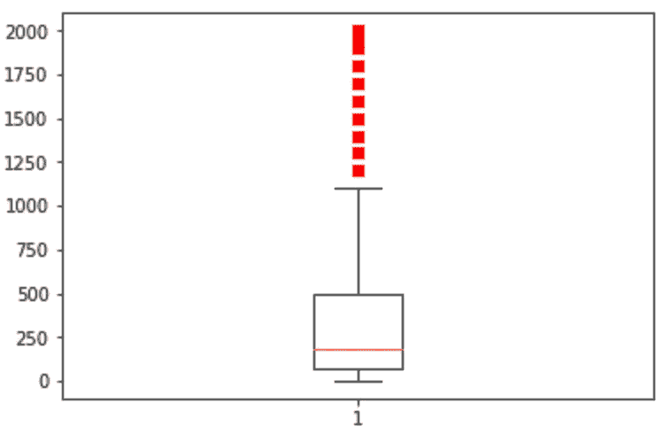

Before and after clipping the data

# 3 标签分类

为此，我根据鼓掌次数将博客分为低、中、高三个等级。

*   低:< 150 claps → corresponds to the 45th %ile
*   Medium: 150–750 claps → corresponds to the 85th %ile
*   High: > 750 拍手

> 我在两种方法中尝试的分类器是逻辑回归和随机森林，因为两者都是可解释的。随机森林优于后者，因为它可以捕捉非线性和逻辑回归不能捕捉的特征之间的相互作用。

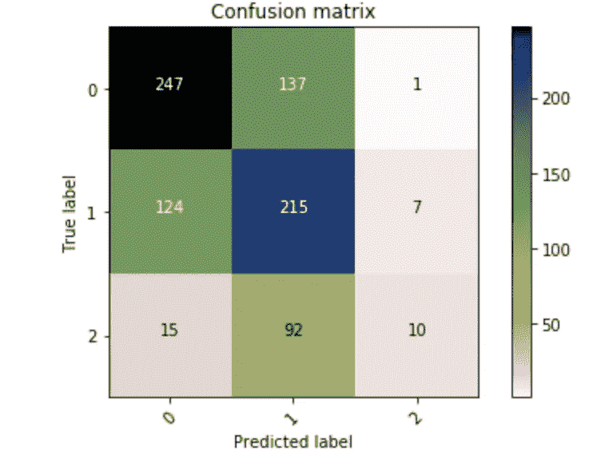

经过一些参数调整，我不会在这里深入讨论，我们得到以下结果—

我们的模型能够比类别 2 相对更准确地预测类别 0 和 1。这是由于在训练数据中跨类的观察分布的不平衡。

# 20 标签分类

为了将标签转换成类别，这里我根据它们的分布分类了拍手。这确保了观察值均匀地分布到所有类别中(不同于 3 标签方法),并且类别不平衡得到处理。以下是对应于箱的几个范围。

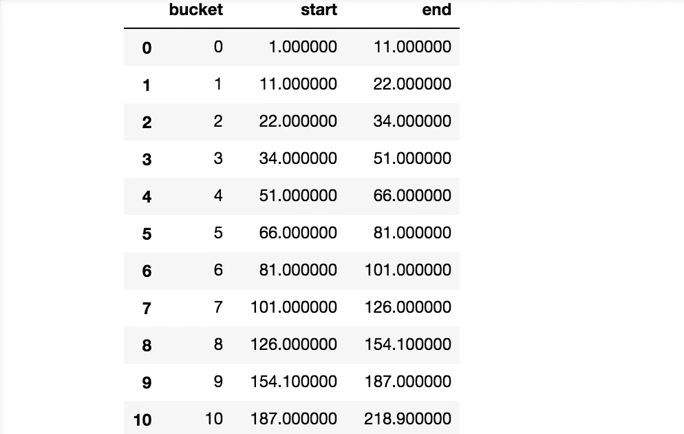

与前面的案例一样，我们使用 5 重交叉验证来调整参数，对大约 3300 个博客的训练数据建立了逻辑回归和随机森林模型。

# 结果和解释

我们在这里使用日志损失作为度量。该模型在预测拍手的 bin 时给出了 2.7 的对数损失。因为我们的类是连续的，所以我们也可以计算平均绝对误差。对于我们的模型，我们得到 MAE = 5.16。

多类分类的测井损失——

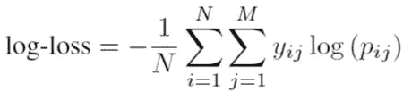

预测仓给了我们博客能获得的掌声范围。让我们来看看一些实际和预测的范围:

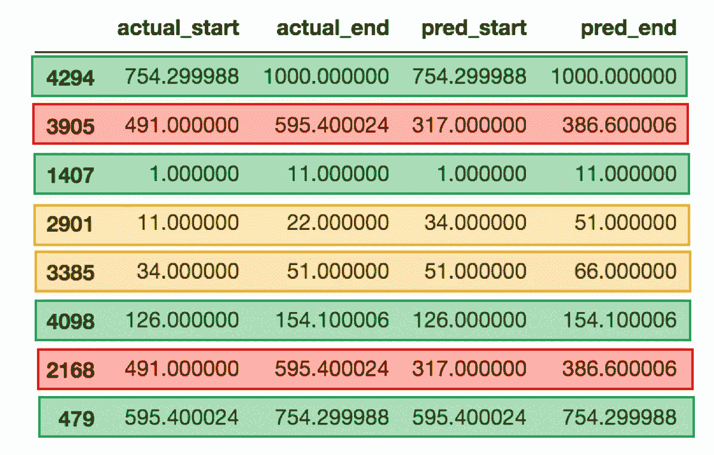

虽然有些预测(红色的)完全不准确，但也有一些预测(橙色的)实际上非常接近，但仍然被错误分类。

> 那么决定你的博客是否会流行的特征是什么呢？
> 在计算功能重要性时，我们看到**的关注者数量**和**的内容质量** t 是更多鼓掌数量的可靠指标，当然，除了博客发表后的天数。图片占博客长度的比例是另一个重要因素。

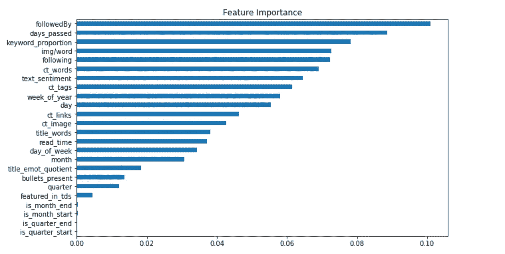

令人惊讶的是，标题的字数和阅读时间似乎不是一个非常关键的因素，这与我们在最初的 EDA 中观察到的情况相矛盾。

更进一步，让我们看几篇博客，试着解释这些因素的影响是积极的还是消极的(以及我们的预测有多接近)。

作为一个例子，我们选取了两个样本博客，分别有大约 760 和 1800 次点击。你可以在这里找到第[第](/intuitive-interpretation-of-random-forest-2238687cae45)和第[第二](https://codeburst.io/from-zero-to-deployment-how-i-secured-an-internship-with-one-amazing-side-project-3daf8a74daba)的博客。让我们先来看看他们的特点和预测:

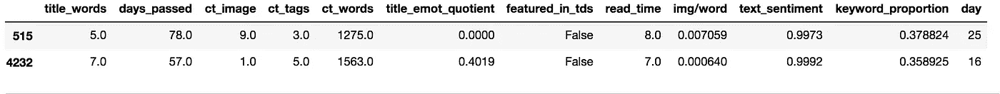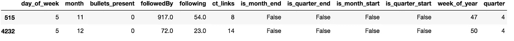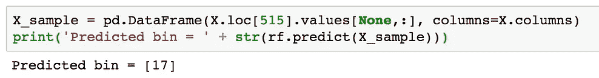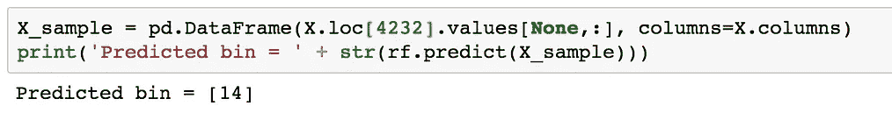

第一篇博客的预测是 17 次，即 754–1000 次鼓掌(砰！)和 14 秒，即 380-490 拍。这完全超出了 1400–2000 次拍手的实际范围。

要了解为什么我们对第二篇博客的预测如此错误，让我们再来看看那篇博客。对于这个博客来说，内容为王指出了我们模式的一个缺点。我们的模型无法捕捉博客在内容和写作风格方面的吸引力。为此，需要对文章本身进行更多的分析。目前，我们只能根据粉丝数量、图片、情感、篇幅等特征来评判博客。

# 结束注释

其他可以在博客上完成的工作可以是—

*   分析博客的目的——是否旨在教育、探索问题、提供问题的解决方案等
*   计算两个博客之间的相似度，以避免重复/抄袭
*   根据一个话题能获得多少掌声来决定它的受欢迎程度
*   如前所述，更多的 NLP 用于确定一个博客有多受欢迎，例如，我们可以检查一个博客是否包含当前的流行语(如加密货币)，它是否提供了相关主题的解决方案等。

我希望你喜欢读这篇文章！欢迎任何想法、建议或评论！

领英—**[**https://www.linkedin.com/in/neerja-doshi/**](https://www.linkedin.com/in/neerja-doshi/)**

# **参考**

1.  **[使用 Python 实现的 Github repo】](https://github.com/aswalin/Medium_Blogs_Analytics)**
2.  **这是一个关于写好博客的非常酷的博客作者[昆西·拉森](https://medium.com/u/17756313f41a?source=post_page-----f8ef0be21771--------------------------------)！**