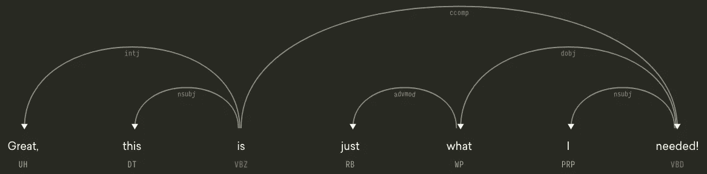
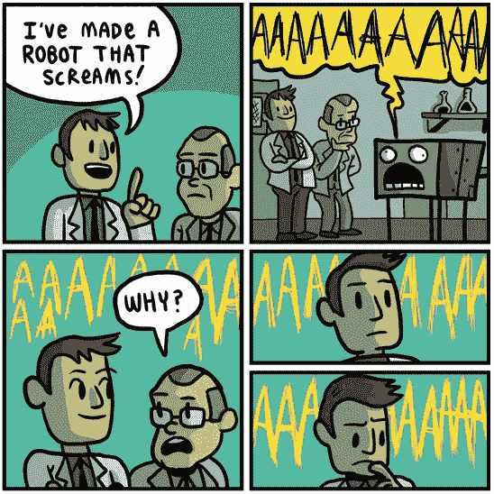

# 如何开始学习 NLP

> 原文：<https://towardsdatascience.com/how-to-get-started-in-nlp-6a62aa4eaeff?source=collection_archive---------0----------------------->

Dependency parse tree visualized by [displaCy](https://explosion.ai/demos/displacy)

我在某处读到过，如果你不得不回答同一个问题两次，把它变成一篇博客文章可能是个好主意。为了遵守这条规则，也为了给未来的自己节省一些时间，我现在给出了这个问题的标准答案:“我的背景是科学，我对学习 NLP 感兴趣。我从哪里开始？”

在您开始之前，请注意下面的列表实际上只是一个非常一般的起点(并且很可能是不完整的)。为了帮助浏览大量的信息，我在括号中添加了简短的描述和难度估计。建议掌握基本编程技能(例如 Python)。

## 在线课程

*   丹·茹拉夫斯基&克里斯·曼宁:自然语言处理【很棒的入门视频系列】
*   [Stanford CS224d:面向自然语言处理的深度学习](http://cs224d.stanford.edu/syllabus.html)【面向 NLP 的更高级的 ML 算法、深度学习和 NN 架构】
*   [Coursera:自然语言处理简介](https://www.youtube.com/playlist?list=PLLssT5z_DsK8BdawOVCCaTCO99Ya58ryR)【密歇根大学提供的自然语言处理简介课程】

## 图书馆和开源

*   **spaCy** ( [网站](https://spacy.io/)，[博客](https://explosion.ai/blog/))【Python；新兴开源库，包含[奇妙的使用示例](https://spacy.io/usage/spacy-101)、API 文档和[演示应用](https://spacy.io/docs/usage/showcase)
*   **自然语言工具包(NLTK)** ( [网站](http://www.nltk.org/)，[书籍](http://www.nltk.org/book/))【Python；NLP 编程实用入门，主要用于教学]
*   **斯坦福 CoreNLP** ( [网站](https://stanfordnlp.github.io/CoreNLP/))【Java；高质量的分析工具包]
*   **AllenNLP** ( [网站](https://allennlp.org/))【Python；NLP 研究库建立在 [PyTorch](https://pytorch.org/) 之上
*   **fastText** ( [网站](https://fasttext.cc/))[c++；用于文本分类和表示学习的高效库]

## 活跃的博客

*   [自然语言处理博客](https://nlpers.blogspot.com/) (Hal Daumé III)
*   [语言日志](http://languagelog.ldc.upenn.edu/nll/)(马克·利伯曼)
*   [谷歌研究博客](https://research.googleblog.com/)
*   [爆炸 AI 博客](https://explosion.ai/blog/)
*   [抱脸](https://medium.com/huggingface)
*   [塞巴斯蒂安·鲁德博客](http://ruder.io/#open)

## 书

*   [语音和语言处理](https://web.stanford.edu/~jurafsky/slp3/) (Jurafsky 和 Martin)[涵盖所有基础知识的经典 NLP 教科书，第 3 版即将出版]
*   [统计自然语言处理基础](https://nlp.stanford.edu/fsnlp/)(Manning and schütze)[更高级的统计 NLP 方法]
*   [信息检索导论](https://nlp.stanford.edu/IR-book/) (Manning，Raghavan，schütze)[排名/搜索优秀参考]
*   [自然语言处理中的神经网络方法](https://www.morganclaypool.com/doi/abs/10.2200/S00762ED1V01Y201703HLT037)(gold Berg)[NN 方法深度介绍 NLP，此处[引子](http://u.cs.biu.ac.il/~yogo/nnlp.pdf) ]
*   [自然语言处理的语言基础](http://www.morganclaypool.com/doi/abs/10.2200/S00493ED1V01Y201303HLT020)(Bender)[更成功的自然语言处理的形态学和句法基础]
*   [深度学习](http://www.deeplearningbook.org/)(古德费勒、库维尔和本吉奥)[深度学习最佳入门]

## 多方面的

*   [如何在 TensorFlow 中构建 word2vec 模型](https://www.tensorflow.org/versions/master/tutorials/word2vec/index.html)【教程】
*   [针对自然语言处理资源的深度学习](https://github.com/andrewt3000/dl4nlp)【针对深度学习的最先进资源概述，按主题组织】
*   最后一句话:计算语言学和深度学习——看看自然语言处理的重要性。(配员)【文章】
*   [分布式表示的自然语言理解](https://github.com/nyu-dl/NLP_DL_Lecture_Note/blob/master/lecture_note.pdf) (Cho)【关于 NLU 的 ML/NN 方法的独立讲稿】
*   [贝叶斯含泪推断](http://www.isi.edu/natural-language/people/bayes-with-tears.pdf)(骑士)【教程练习册】
*   计算语言学协会
*   [Quora:我如何学习自然语言处理？](https://www.quora.com/How-do-I-learn-Natural-Language-Processing)
*   [自然语言理解和计算语义学](https://docs.google.com/document/d/1mkB6KA7KuzNeoc9jW3mfOthv_6Uberxs8l2H7BmJdzg/edit) (Bowman)【带综合幻灯片的开源课程大纲】
*   [fast.ai](http://www.fast.ai/) [“让神经网络再次变得不酷”]

## **DIY 项目和数据集**

Source: [http://gunshowcomic.com/](http://gunshowcomic.com/comics/20120227-robotthatscreams.png)

Nicolas Iderhoff 已经创建了一个公开可用的 NLP 数据集的完整列表。除此之外，我还可以向任何想要尝试的 NLP 新手推荐一些项目:

*   基于[隐马尔可夫模型](https://en.wikipedia.org/wiki/Hidden_Markov_model) (HMM)实现[词性标注器](https://en.wikipedia.org/wiki/Part-of-speech_tagging)
*   实现 [CYK 算法](https://en.wikipedia.org/wiki/CYK_algorithm)来解析[上下文无关文法](https://en.wikipedia.org/wiki/Context-free_grammar)
*   实现文本集合中两个给定单词之间的[语义相似度](https://en.wikipedia.org/wiki/Semantic_similarity)，例如[点态互信息](https://en.wikipedia.org/wiki/Pointwise_mutual_information) (PMI)
*   实现一个[朴素贝叶斯分类器](https://en.wikipedia.org/wiki/Naive_Bayes_classifier)来[过滤垃圾邮件](https://en.wikipedia.org/wiki/Naive_Bayes_spam_filtering)
*   基于单词间的编辑距离实现一个[拼写检查器](https://en.wikipedia.org/wiki/Spell_checker)
*   实现一个[马尔可夫链](https://en.wikipedia.org/wiki/Markov_chain)文本生成器
*   使用[潜在狄利克雷分配](https://en.wikipedia.org/wiki/Latent_Dirichlet_allocation) (LDA)实现一个[主题模型](https://en.wikipedia.org/wiki/Topic_model)
*   使用 [word2vec](https://code.google.com/archive/p/word2vec/) 从大型文本语料库中生成单词嵌入，例如[维基百科](https://en.wikipedia.org/wiki/Wikipedia:Database_download)
*   使用 [k-means](https://en.wikipedia.org/wiki/K-means_clustering) 聚类 [tf-idf](https://en.wikipedia.org/wiki/Tf%E2%80%93idf) 文本向量，例如新闻文章
*   实现一个[命名实体识别器](https://en.wikipedia.org/wiki/Named-entity_recognition) (NER)(也称为名称标记器)，例如遵循 [CoNLL-2003 共享任务](https://www.clips.uantwerpen.be/conll2003/ner/)

## 社交媒体上的 NLP

*   推特: [#nlproc](https://twitter.com/hashtag/nlproc) ，[nl pers 名单](https://twitter.com/jasonbaldridge/lists/nlpers)(作者杰森·鲍德里奇)
*   Reddit:[/r/language technology](https://www.reddit.com/r/LanguageTechnology)
*   中: [Nlp](https://medium.com/tag/nlp)

*在推特上联系我****@ melto mene***