# 如何入门 Kaggle 竞赛和数据科学？或者“如何在没有机器学习或统计的情况下获得一个像样的分数”

> 原文：<https://towardsdatascience.com/how-to-get-started-with-kaggle-competitions-and-datascience-26d27108a444?source=collection_archive---------7----------------------->

这是一个面向初学数据科学和机器学习的程序员(比如我自己)的入门教程。它向人们介绍了 Kaggle 竞赛、Python 中的 Jupyter 笔记本，以及 Pandas 和 NumPy 库。

我展示了在没有任何统计、数据科学或机器学习的情况下，我们如何能够在 Kaggle 的泰坦尼克号竞赛排行榜上名列前三。

# 0.先决条件— Anaconda、Jupyter 笔记本

我们需要一些编程的基础知识(变量，基本的 Python 语法)。安装您需要的东西的最简单方法是前往 [Anaconda](https://www.anaconda.com/download/) 并下载 Python 3.7 GUI 安装包。它将自动安装最常用的库，包括下面我们正在使用的库。

一旦安装了 Anaconda，启动“Anaconda Navigator”启动程序，然后从它启动“Jupyter Notebook”。或者，从命令行输入“ *jupyter 笔记本*”。

这将打开一个 web 界面，您可以在其中浏览、打开和创建新的“笔记本”(一种 Python 程序，让您以交互方式编写和运行代码、编辑文本和绘制图像，大多数从事数据科学和机器学习的人都在使用它)。本教程就是在这样的笔记本上写的。你可以在我的 [GitHub 库](https://github.com/alexbrie/LearningDataScience/blob/master/titanic-tutorial.ipynb)上查看完整的笔记本并下载以运行它。

在 Jupyter 笔记本中，您可以编辑单元格，通常是代码或降价。

有许多可用的快捷键，您可以在帮助->键盘快捷键菜单中查看，或者在不编辑单元格时按“h”键查看。

您可以通过按下 **Ctrl+Enter** 来执行代码单元格内的代码(或者格式化一个 markdown 单元格)。您执行代码并通过按下 **Shift+Enter** 自动前进到下一个代码。

单击单元格的侧面将其选中，单击其内容或双击单元格开始编辑。按 Escape 键退出编辑模式。

# 1.首先，参加一个 Kaggle 比赛。

在全球最大的人工智能、机器学习和数据科学在线社区 [Kaggle](https://www.kaggle.com) 上创建一个用户账户。

Kaggle [泰坦尼克号幸存者](https://www.kaggle.com/c/titanic)比赛是任何 Kaggle 新人都应该开始的比赛，因为它总是开放的(排行榜定期清理)，简单易懂。

> 从列出泰坦尼克号灾难中幸存或未幸存乘客的样本训练集得知，我们的模型可以基于不包含幸存信息的给定测试数据集来确定测试数据集中的这些乘客是否幸存。

在你参加比赛之后，去数据区，点击“下载全部”,然后将下载的档案文件解压到你想要编写 Jupyter 笔记本程序的子文件夹中。

我在“ **MyWork** 文件夹下工作，已经将下载的测试和训练数据保存到“ **titanic_data** 子文件夹下。

# 2.导入用过的库

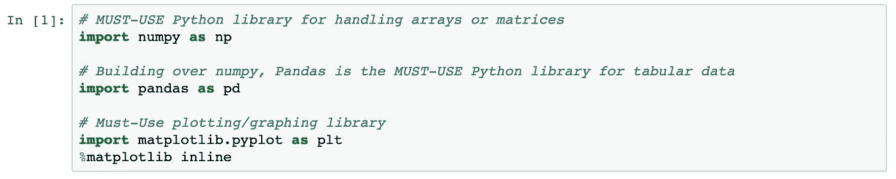

# 3.加载培训和测试数据

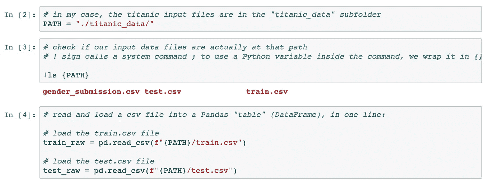

train_raw 和 test_raw 都是 Pandas 的“DataFrame”对象，为操作表格数据、访问任何行、列或单元格提供了有用的方法和变量。

我们通常使用语法 dataframe["ColumnName"]来访问一个列，但是偶尔，为了简洁起见，我们将使用 dataframe。请改为 ColumnName。

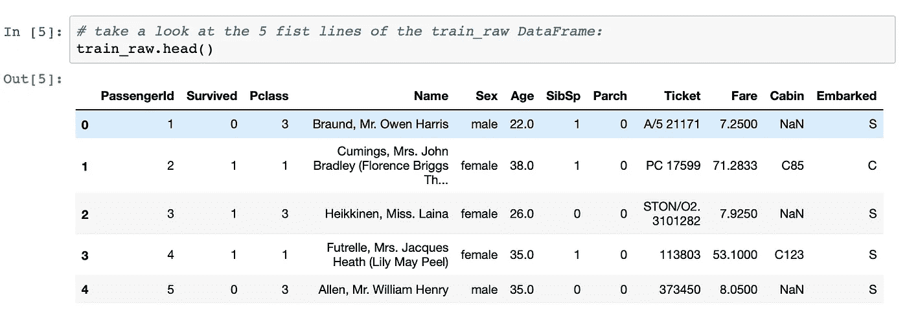

数据框的一个很棒的特性是我们可以对它们进行选择。例如，这是幸存的女性乘客名单:

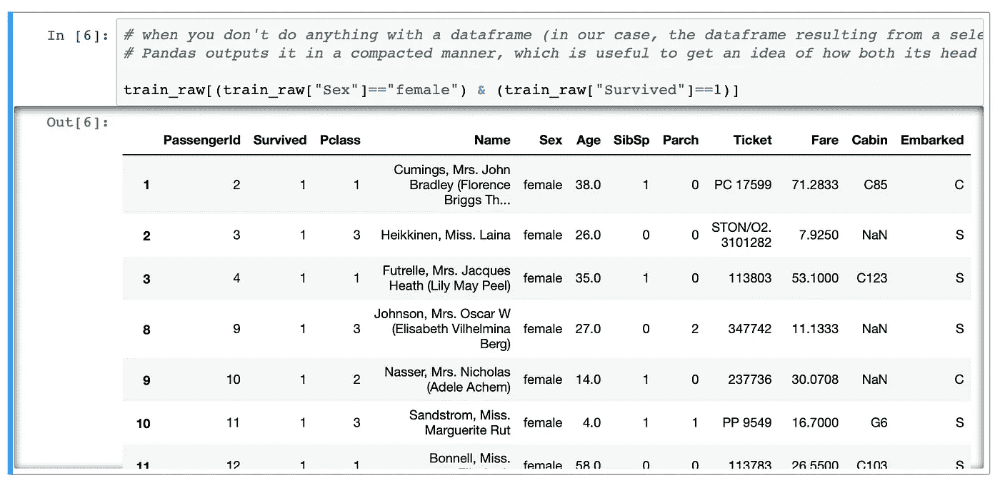

请在[竞赛数据页面](https://www.kaggle.com/c/titanic/data)上查看有关数据文件中各列含义的详细信息。

## 让我们看看存活率是如何与其他数据相关的:

Pandas crosstab 函数可以让您看到一个特性(列)如何与另一个相关联，它显示了一个漂亮的表格，在垂直方向上计算一个特性的值，在水平方向上计算另一个特性的值。

因为我们将熊猫作为 pd 导入(这是最常见的约定)，所以我们将这样使用它:

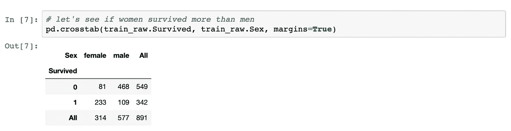

在 Pandas 中，我们可以通过它的名称(在我们的 csv 文件中，从第一行开始读取)来寻址一个列(特性)。我们通常会说

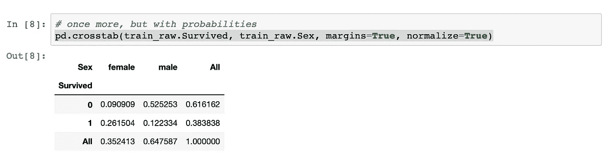

现在，我们可以根据训练数据文件得出初步结论:

1.  培训数据中 65%的人是男性(577 人)，35%是女性(314 人)
2.  在所有男性中，约 80%死亡(0.523 / 0.647，又名 468 / 577)
3.  在所有妇女中，不到 26%的人死亡(81 / 314)
4.  在所有人中，62%死亡，38%幸存(“所有”栏)

基于以上的见解，我们可以做一些琐碎的尝试来解决问题。

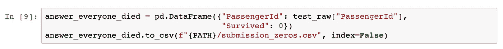

现在，我们前往 Kaggle 泰坦尼克号比赛页面，点击选项卡菜单上的“提交预测”按钮。将上面生成的“submission_zeros.csv”文件拖放到“上传文件”区域，然后单击“提交”按钮。

等待计算分数，然后…

我们获得了 0.72727 的准确度分数，这使我们在超过#10000 名竞争对手中排名大约#9000(在撰写本文之日，2018 年 11 月 16 日)。这意味着 1000 多人比我们错得更多——这比最微不足道的答案还要错。

# 4.首次提交——性别

不如说所有的男人都死了，所有的女人都活了下来？Kaggle 已经在这方面帮助了我们，他们在数据存档中提供了一个 gender_submission.csv 文件。您可以直接上传，或者我们可以在下面的单元格中自己生成一个:

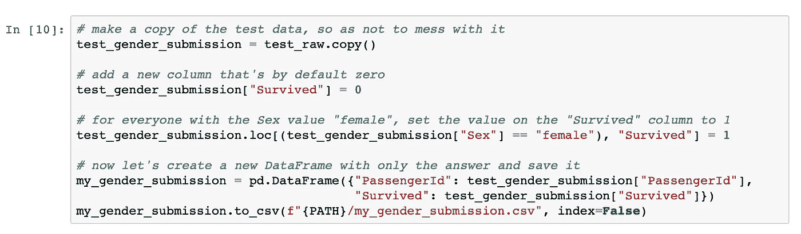

我们可以测试我们的版本和从 Kaggle 得到的版本之间的差异

> *diff-w my _ gender _ submission . CSV gender _ submission . CSV*

它们是相同的(除了空格之外，这取决于您的计算机/操作系统)。

将新文件上传到 Kaggle 并测试其得分，我们的得分为 0.76555，在 10000 多名竞争者中排名第 6300 位。

换句话说，近 4000 人(40%)除了上传他们从 Kaggle 得到的默认答案之外，并没有做得更好。

我们的基础教程大概可以到此为止，因为它已经达到了目的，向你展示了很多有用的东西:

*   如何参加 Kaggle 比赛
*   如何开始写代码给竞赛一个答案
*   如何在 csv 文件中加载数据
*   如何看数据的前 5 行(表头法)
*   如何使用交叉表命令查看一个要素与另一个要素的关系
*   如何为解决方案创建新的数据框架并将其保存到 csv 文件中
*   如何向 Kaggle 提交您的解决方案文件并了解您的分数

但是，我们的无编码“*性别解决方案*将我们置于最后 40%。我很好奇，用很少的编码或知识，我们是否能在排行榜上爬得更高一点。我们可能需要使用 pandas/numpy 库中的一些方法。

# 5.调整性别解决方案

我们已经达到了一个合理的分数，声称所有的男性都死了，所有的女性都活了下来。这显然不是 100%的真实。让我们看看是否能找到一些其他可以帮助我们取得更好成绩的唾手可得的果实。

我们可能看过电影，当一艘船正在下沉时，妇女和儿童通常被首先放在船上。

我将添加一个新列，说明乘客是妇女还是儿童(10 岁以下)，并将其命名为“MightSurvive”(也用于其他生存标准)

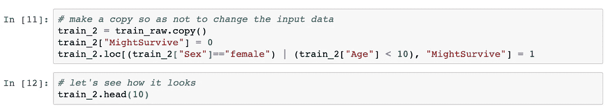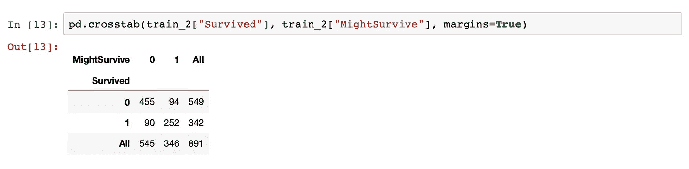

那么，这与我们声称只有女性幸存的时候相比如何呢？

在加载训练数据后生成的交叉表中，我们注意到，当我们说只有女性幸存而所有男性都死了时，在总共 891 次中，我们对了 233 次(女性实际幸存)+ 468 次(男性实际死亡)。这大约是正确的 78.6 倍。

在我们目前的情况下，如果我们说只有妇女或儿童幸存，891 次中我们有 252 + 455 次是正确的。这大约是 79.3% —一个小而显著的进步。

现在让我们将这个解决方案上传到 Kaggle，看看它的得分如何。

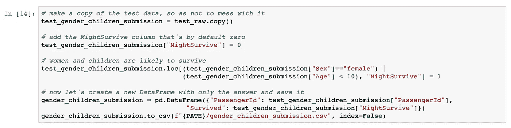

Kaggle 给了我们 0.77033 的分数，这是相当大的成就。在#10100 排行榜中，我们已经上升到了第 5500 名左右，位列前 55%。

# 如果“有钱人活下来了”呢？

在同一部《泰坦尼克号》电影中，看起来富人通常能活下来(凯特)，而穷人却不能。让我们使用现有的工具来检查这些假设。

乘客财富与乘客等级相关(一等比三等好)。让我们用生存来交叉分析乘客等级。

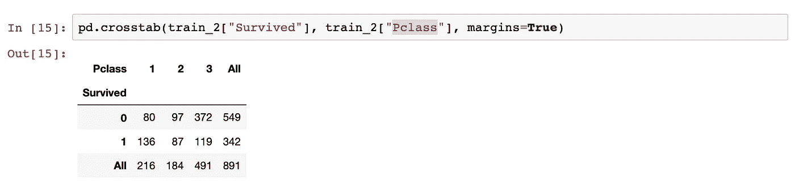

基于此，说只有 1 班的人活了下来，其他人都死了，那就对了 891 次中的 136 次(实际 1 班幸存者)+ 469 次(2 班实际非幸存者 97 次+ 3 班实际非幸存者 372 次)。这仅仅是 67%倍，比上面的估计还要差。

所以，现在我们可能不应该关注人工尝试的乘客等级，忽略这个假设。

# 6.大家庭里的小孩子怎么办？

这可能是轶事，但我可以想象贫穷移民的大家庭努力聚集所有留下的人，因此无法到达救援船。也许他们的父母幸存了下来，但大多数孩子没有。这可能不是一个普遍的事实，但在这种情况下，一些家庭可能会帮助我们获得更好的分数。因此，我想验证大家庭成员更容易死亡的假设。

SibSp(兄弟姐妹和配偶)和 Parch(父母和子女)列包含这些信息。交叉表显示，对于大量同胞来说，它确实与无存活率相关。

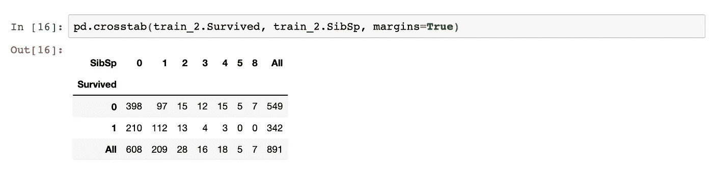

我们发现至少有 4 个兄弟姐妹的孩子存活的可能性更小(30 个孩子中只有 3 个存活)。

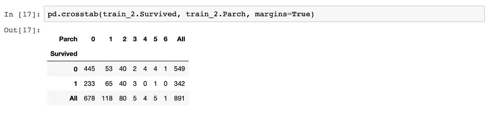

同样，至少有 4 个孩子的父母不太可能存活(只有十分之一存活)。

让我们将上述见解添加到我们的**可能幸存**标准中(到目前为止，该标准仅适用于妇女和儿童)

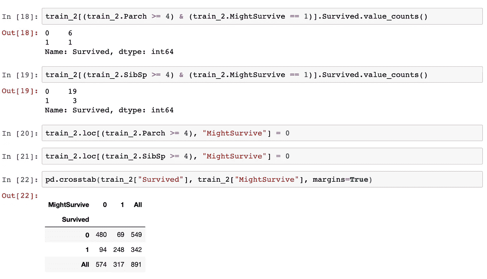

交叉表显示，我们的“**可能幸存于**”标准将是正确的(248 + 480)/891 = 81.7%倍。这明显比以前好，比性别解决方案提高了近 3%。

# 7.构建我们的解决方案并将其发送给 Kaggle

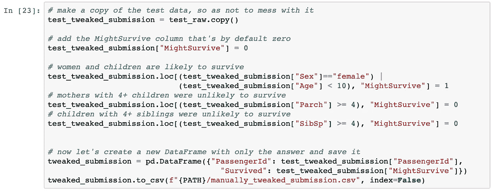

现在我们正在谈话！我们从 Kaggle 得到的分数是 0.78468，明显比以前好。

***这使我们在排行榜上排名第 3200 位左右——我们现在排名前 32%，没有使用机器学习或统计数据。***

我们的教程到此结束。分数的进一步提高和洞察力的提高可能需要统计、可视化和机器学习。但是今天我们已经做得足够好了。

## 恭喜你！