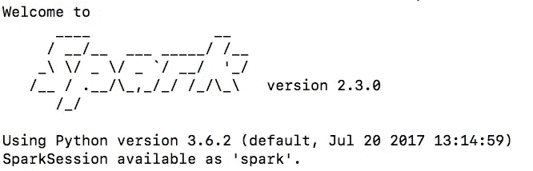

# 如何开始使用 PySpark

> 原文：<https://towardsdatascience.com/how-to-get-started-with-pyspark-1adc142456ec?source=collection_archive---------1----------------------->

[PySpark](http://spark.apache.org/docs/2.2.0/api/python/pyspark.html) 是使用 Spark 的 Python API，Spark 是运行大数据应用的并行分布式引擎。开始使用 PySpark 花了我几个小时——这是不应该的——因为我必须阅读大量的博客/文档来调试一些设置问题。这个博客旨在帮助您尽快开始使用 PySpark！

**更新**:我写了一篇关于 PySpark 以及如何使用一些托管服务(如 Databricks 和 EMR)和一些常见架构开始使用 Spark 的新博文。片名为 [**从熊猫到星火**。](/moving-from-pandas-to-spark-7b0b7d956adb)有兴趣了解更多就去看看吧！


How do we analyze all the “big data” around us?

这些步骤适用于 Mac OS X(我运行的是 OS X 10.13 High Sierra)和 Python 3.6。

## 1.开始新的康达环境

你可以[安装 Anaconda](https://www.anaconda.com/download/#macos) ，如果你已经有了它，使用`conda create -n pyspark_env python=3`启动一个新的`conda`环境。这将创建一个新的 conda 环境，使用最新版本的 Python 3，供我们尝试我们的 mini-PySpark 项目。
用`source activate pyspark_env`激活环境

## 2.安装 PySpark 包

你可以尝试使用`pip`来安装`pyspark`，但是我无法让`pyspark`集群正常启动。看了几个关于堆栈溢出的答案和官方文档，我发现了这个:

> Spark 的 Python 打包并不打算取代所有其他用例。Spark 的 Python 打包版本适合与现有集群(无论是 Spark standalone、YARN 还是 Mesos)进行交互，但不包含设置您自己的独立 Spark 集群所需的工具。你可以从 [Apache Spark 下载页面](http://spark.apache.org/downloads.html)下载 Spark 的完整版本。

使用上面的链接，我继续下载了`[spark-2.3.0-bin-hadoop2.7.tgz](https://www.apache.org/dyn/closer.lua/spark/spark-2.3.0/spark-2.3.0-bin-hadoop2.7.tgz)`,并将解压后的版本存储在我的主目录中。

## 3.安装 Java 8

一些说明建议使用 Java 8 或更高版本，我继续安装了 Java 10。当我试图在我的 Spark 集群中运行`collect()`或`count()`时，这实际上导致了如下几个错误:

```
py4j.protocol.Py4JJavaError: An error occurred while calling z:org.apache.spark.api.python.PythonRDD.collectAndServe.: java.lang.IllegalArgumentException
```

我最初的猜测是，它必须与`Py4J`安装做一些事情，我试图重新安装了几次，没有任何帮助。没有多少人谈论这个错误，在阅读了几篇堆栈溢出的帖子后，我看到了这篇帖子，它讨论了 Spark 2.2.1 如何与 Java 9 及更高版本发生问题。推荐的解决方案是安装 Java 8。

所以，[安装 Java 8](http://www.oracle.com/technetwork/java/javase/downloads/jdk8-downloads-2133151.html) JDK，进入下一步。

## 4.“改变”。“bash_profile”变量设置

为了告诉 bash 如何找到 Spark 包和 Java SDK，**在您的`.bash_profile`中添加**以下几行(如果您使用 vim，您可以做`vim ~/.bash_profile`来编辑这个文件)

```
export JAVA_HOME=$(/usr/libexec/java_home)
export SPARK_HOME=~/spark-2.3.0-bin-hadoop2.7
export PATH=$SPARK_HOME/bin:$PATH
export PYSPARK_PYTHON=python3
```

这些命令告诉 bash 如何使用最近安装的 Java 和 Spark 包。运行`source ~/.bash_profile`获取该文件或打开新终端自动获取该文件。

## 5.启动 PySpark

运行`pyspark`命令，您将会看到:



PySpark welcome message on running `pyspark`

您可以使用命令行来运行 Spark 命令，但是这不是很方便。可以使用`pip install jupyter notebook`安装 jupyter 笔记本，运行`jupyter notebook`时可以访问笔记本中的 Spark 集群。您也可以使用`vim`或`nano`或您选择的任何其他代码编辑器将代码写入 python 文件，您可以从命令行运行这些文件。

## 6.用 PySpark 计算圆周率！

运行一个小而快速的程序来估算`pi`的值，看看你的火花簇在起作用！

```
import random
NUM_SAMPLES = 100000000
def inside(p):
 x, y = random.random(), random.random()
 return x*x + y*y < 1count = sc.parallelize(range(0, NUM_SAMPLES)).filter(inside).count()
pi = 4 * count / NUM_SAMPLES
print(“Pi is roughly”, pi)
```

## **7。接下来的步骤**

PySpark 中有很多东西可以探索，例如弹性分布式数据集或 rdd(更新:现在 DataFrame API 是使用 Spark 的最佳方式，rdd 谈论“如何”完成任务，而数据帧谈论“什么”——这使得数据帧更快和优化)和 [MLlib](https://spark.apache.org/docs/2.2.0/ml-guide.html) 。

2021 年 6 月更新:我写了一篇关于 PySpark 以及如何开始使用 Spark 的一些托管服务(如 Databricks 和 EMR)和一些常见架构的新博客。它的名字叫 [**从熊猫到星火**。](/moving-from-pandas-to-spark-7b0b7d956adb)有兴趣了解更多就去看看吧！感谢您的阅读。