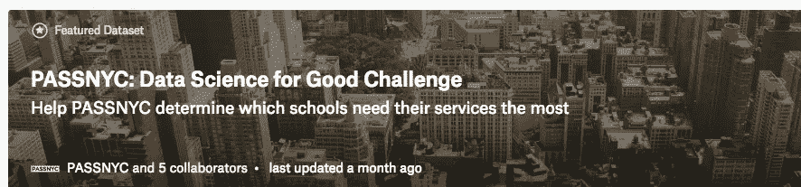
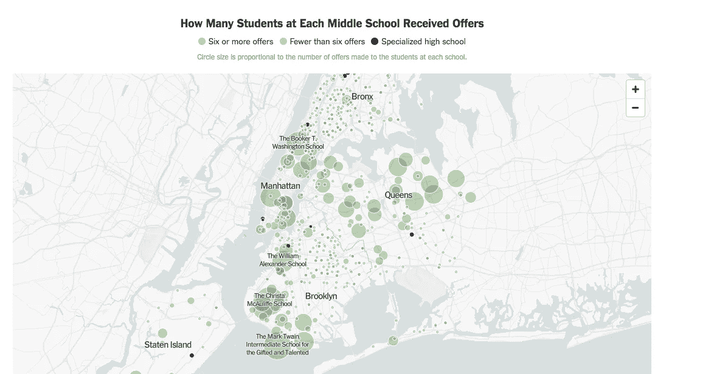
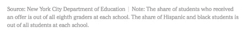

# 如何获得正确的数据？试着要求它。

> 原文：<https://towardsdatascience.com/how-to-get-the-right-data-why-not-ask-for-it-d26ced1bbd46?source=collection_archive---------8----------------------->

## 为什么数据科学中最重要的技能可能不是技术性的

虽然数据科学的技术技能——想想用梯度推进机器建模——得到了最多的关注，但其他同样重要的通用问题解决能力可能会被忽视。熟练地提出正确的问题、坚持不懈和利用多种资源对于数据科学项目的成功至关重要，但当人们问及成为数据科学家需要什么时，编码能力往往退居其次。

最近，我在从事一个数据科学促进良好发展的项目时，想起了这些非技术技能的重要性。这个项目目前在 Kaggle 上运行，它包括确定纽约市的学校，这些学校将从鼓励弱势学生参加 T2 高中入学考试(SHSAT)的项目中受益最大。这项任务带有一个小数据集，包括 2016 年的测试结果，但组织者鼓励使用任何公开可用的数据。

Data Science is for more than just getting people to click on ads [(Get Started Here)](https://www.kaggle.com/passnyc/data-science-for-good/home)

知道数据科学项目的成功与数据的质量和数量成正比(T4)，我开始寻找更新的测试结果。毫不奇怪，有了现在唾手可得的大量资源，我最终获得了成功，并且在这个过程中，我学到了一些关于数据科学所必需的“其他”技能的经验，我在下面列出了这些经验。

## 第一步:问正确的问题/有正确的目标

资源的广泛可用性可能是一件好事，也可能是一件坏事:有这么多选择，有时可能很难找到一个起点(当人们想学习数据科学时，我经常看到这种现象)。正确的问题或目标可以帮助你缩小选择范围。

如果我问“有没有我可以使用的纽约市的数据？”我可能会被各种可能性淹没，就像“想学习 Python”的人面对令人眼花缭乱的资源一样(更好的目标是“我想为 x 学习 Python *，因为这将限制选择)。*

如果你在最初的目标上没有成功，你总是可以撒更大的网或者改变问题/目标。此外，有时你可以用一组与你想象中不同的数据来回答你最初的问题，或者你可能会发现有一个更好的问题要问。记住这一点，我带着一个问题开始了我的搜索:我能找到 SHSAT 的最新结果吗？

## 第二步:探索资源

对于我的唯一一个重点问题，最好的起点是纽约市开放数据门户网站。像许多大城市一样，纽约市有大量的数据可供免费下载并在您的项目中使用。[开放数据门户](https://www.opendatasoft.com/a-comprehensive-list-of-all-open-data-portals-around-the-world/)是探索问题和利用数据科学产生影响的绝佳起点。

不幸的是，尽管纽约市的数据很广泛，但没有一个涵盖 SHSAT。所以我扩大了搜索范围——这意味着我在谷歌搜索结果列表中走得更远——看到了《T4 时报》的一篇文章，这篇文章准确地分析了我想要的数据(带有一些很棒的信息图表)！

One of several interactive maps in [the article](https://nyti.ms/2KzvfOn)

## 第三步:伸出手

很明显，如果 NYT 能够得到的话，这些数据是可以公开获取的！因为我已经检查了开放数据门户，所以我决定尝试一个更直接的途径来联系作者。我以前用这种方法取得过成功——我曾经通过给作者发电子邮件获得了一本绝版的免费大学教材——现在很容易找到社交媒体或专业联系地址。只要你的请求是有礼貌的(一两句赞美不会有什么坏处)，大多数作者都会尽可能地乐意帮忙。

然而，在这种情况下，我的直接方法失败了，因为作者在我使用的任何渠道上都没有回应。老实说，我不怪她:作为一个作家，处理所有的请求可能很难，我更希望她专注于写更多的文章，而不是回复每一条评论！

## 步骤 4:坚持不懈

作为一名数据科学家，最重要的一点是关注细节的能力。有价值的信息可能隐藏在意想不到的地方(如文件名)，在这种情况下，阅读信息图下的小字可以发现来源:纽约市教育局，我已经通过开放数据门户搜索过了！

Always read the details

虽然我已经尝试过这个来源，但我还是回到了门户网站，并决定从联系人页面发出一个[请求。我提交了一张包含我想要的具体数据的票，并收到了一个稍微令人沮丧的通知，可能需要 2 周才能听到回复。幸运的是，这似乎是一个悲观的高估，两天之内我就收到了回复——来自一个真实的人类！我所要求的数据是可用的。同一天，](https://opendata.cityofnewyork.us/engage/)[的全部数据](https://data.cityofnewyork.us/Education/2017-2018-SHSAT-Admissions-Test-Offers-By-Sending-/vsgi-eeb5/)出现在纽约市数据门户网站上，供全世界免费使用，以造福纽约市的学生。公开数据没有任何障碍，有人**只需要问一下就行了！**

## 第五步:向前分享

虽然这个项目在技术上是 Kaggle 上的一个竞赛，但我不可能对这些数据的可用性保密。我立即建立了一个讨论线程，并分享了数据源的链接。几个小时内，其他数据科学家就开始使用这些数据进行自己的分析，然后分享他们的发现。这就是数据科学社区的伟大之处:它不是关于竞争，而是关于相互学习。

一个人只能有这么多的经验，但一个群体的集体知识可以是巨大的。这意味着，当你发现一些有趣的事情时，不要把它藏在心里，而是与他人分享，这样其他人也可以学习！从 Kaggle 上的其他数据科学家那里获得了这么多，能够回馈一点感觉很好。

这个小例子说明了几个关键点:第一，问一问无妨！我以前写过这方面的文章，但当你向某人寻求帮助时(只要要求合理)，他们最糟糕的回答是不。第二，利用多种资源并坚持不懈的能力会比你职业生涯中的任何特定技能都更能让你进步。我采取的所有步骤都不涉及任何编码，但是如果不完成这些步骤，我就无法获得进行分析所需的数据！最后，不要害怕向人们寻求帮助，或者使用我们现在可以利用的任何伟大的资源。

一如既往，我欢迎评论、建设性的批评和讨论。可以在推特上找到我