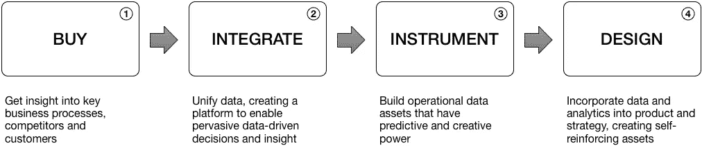

# 如何增长数据

> 原文：<https://towardsdatascience.com/how-to-grow-data-7d1892792b6f?source=collection_archive---------3----------------------->

Image by [Staleybk](https://pixabay.com/users/staleybk-2301462/?utm_source=link-attribution&utm_medium=referral&utm_campaign=image&utm_content=3274116) from [Pixabay](https://pixabay.com/?utm_source=link-attribution&utm_medium=referral&utm_campaign=image&utm_content=3274116)

数字化和人工智能这两股浪潮已经高涨到任何企业都无法忽视的地步。它已经从幕后成为价值和创新的驱动力。难怪最近一期[的《经济学人》宣称“世界上最有价值的资源不再是石油，而是数据”。](https://www.economist.com/news/leaders/21721656-data-economy-demands-new-approach-antitrust-rules-worlds-most-valuable-resource)

由于现在几乎每一项人类活动都会产生数字痕迹，优势在于那些能够利用数据中的洞察力的人。顾客什么时候会购买？最好的产品组合是什么？什么时候应该做保养？什么使我的员工最有效率？

令人惊讶的是，驱动这些见解的算法并不是秘方。尽管定价很高，但使用它们的数据科学家也不感兴趣。价值在于数据本身，以及应用于您的业务时的潜力。

尽管使用数据来降低成本或优化流程会带来很多好处，但这还不是全部。大量的数据创造了未来的可能性和竞争优势。例如，通过交付联网汽车，特斯拉获得了对驾驶模式的独特和巨大的洞察力:对抗竞争对手的壁垒，以及在未来创新中可以利用的丰富资源。

通过运营当前业务来创造这种未来潜力的能力是数据驱动的最终定义:当价值而不仅仅是决策由数据驱动时。

这使得数据访问成为每个人的当务之急。增加数据储备的计划应该在每一项企业战略中占据首要位置。但是你怎样才能让它成为现实呢？

不断增长的数据投资有四个层次:购买、集成、工具和设计。真正的数据驱动型企业参与所有四个层面。

Four levels of growing data investment

## 购买数据

获得洞察力的最快方法之一是购买数据，这对许多企业来说并不新鲜。由于 Acxiom、LexisNexis 或 Hoovers 等信息公司，购买数据已经成为消费者和竞争情报领域几十年的行业惯例。金融数据、天气和地理数据都是许多企业的主要需求。
通过获取第三方数据，您可以更深入地了解现有运营，并改善决策支持。然而，可供出售的数据往往局限于大规模数据集，主要是环境性质的数据集。购买数据可以推动业务发展，但你无法通过购买数据来实现竞争优势。

## 整合您的数据

甚至在大数据时代之前，公司就产生了大量信息，这些信息可以用来推动增长和创造更多价值。整合这些信息的潜力很大。组合数据集往往会对数据的功效产生倍增效应，而不仅仅是累加效应。

公司的每个系统都在不断地创造数据。然而，[数据孤岛是一个系统性问题](https://hbr.org/2016/12/breaking-down-data-silos)，严重限制了这些数据的有用性。孤岛来自软件应用程序和流程，这些应用程序和流程是在数据的价值未被真正认识到的时代构建的，在这个时代，资源约束更加严格。面向流程的一个自然副作用是导致业务功能之间的语义差异，并增加了进一步的复杂性:遇到诸如“客户”等概念的多种不同定义并不罕见。

## 工具

当你真正专注于使用数据来推动决策和价值时，下一步就是使用仪器。插装是将数据生成嵌入到过程和系统中的行为，它报告它们随时间的状态。多亏了运筹学领域，这个概念并不新奇，但是随着数字化程度的提高，仪器化的范围越来越大，成本也越来越低。

举一个软件方面的例子:软件检测的范围曾经是记录错误，以便给支持技术人员诊断的希望。现在，记录用户的每一次交互，鼠标的每一次移动都是可行的，我们可以问的问题进一步延伸:不仅仅是“为什么会出错”，而是“这个产品使用起来有多容易？”再举一个零售业的例子，无线电信标现在可以监控商店的客流量，从而评估实体布局的有效性。

仪器和数据科学的结合使我们能够收集细节并解决问题，这在以前需要昂贵的人工干预。

## 面向数据的设计

任何在上述三个层面深度投入的组织都已经处于强大的领先地位，只是在实现数据的潜力方面还有一步。如果您真正理解数据的力量，那么围绕数据的积累和利用来设计活动，将数据构建为战略资产。

达到这一点就是开始对谷歌、亚马逊和脸书这些科技巨头有了答案。作为以数据为基础的公司，它们的灵活性、数据积累和财务实力使它们能够在新市场中令人信服地发起挑战。

为数据而设计的业务的本质是，产品或服务的交付产生进一步增强服务的数据，并为下一步的创新和扩展创建平台。客户不是孤立的接受者，而是生态系统的一部分，他们的参与使产品对每个人都更好。与前三个阶段的带外应用相比，以客户生成的数据为基础，分析和人工智能被用作产品的一部分。

数据不是一种可替代的商品，因此它的积累给竞争对手设置了一个令人望而生畏的障碍:也许正如《经济学人》所观察到的，一种新的反垄断方法将在未来变得必要。

**如果你喜欢这个**并想听更多，请[加入我的简讯](https://tinyletter.com/ewilderj)。