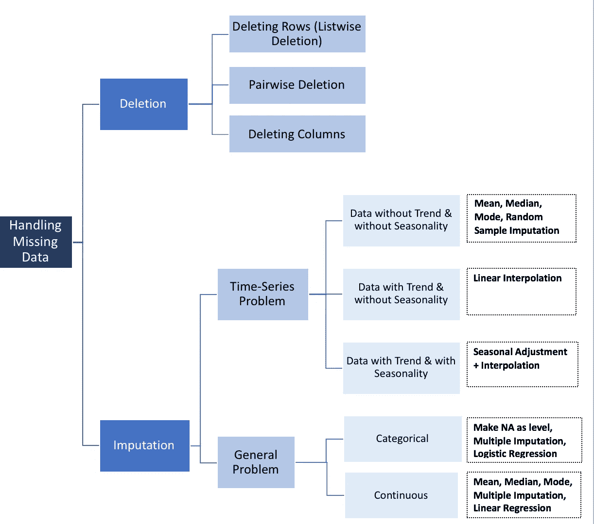
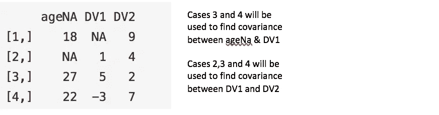
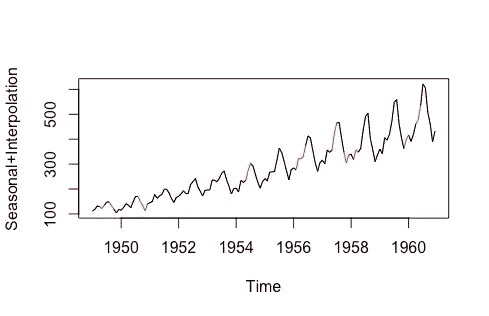
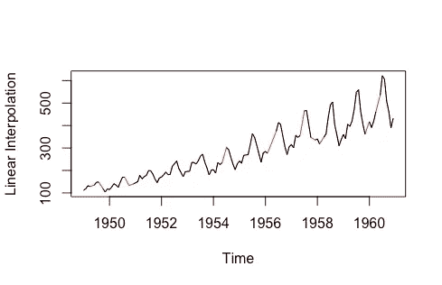
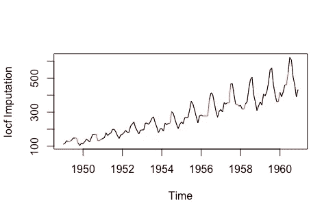
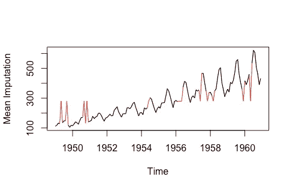
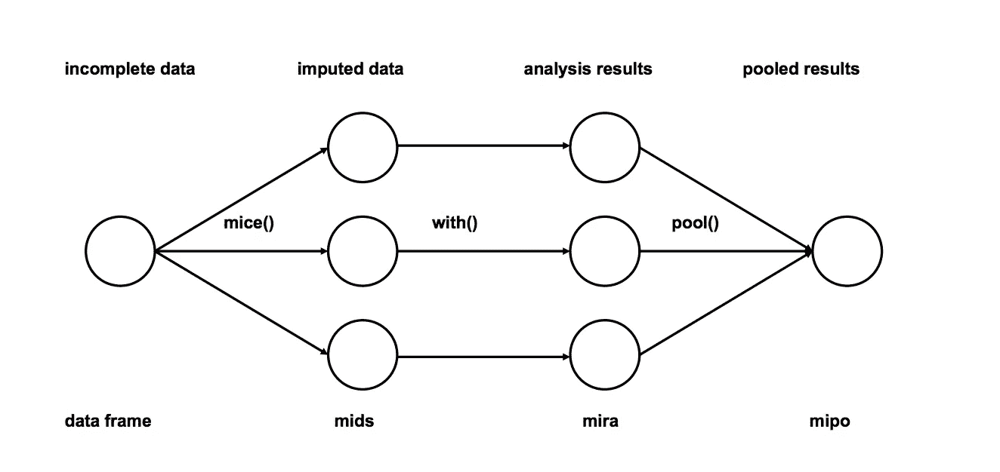

# 如何处理丢失的数据

> 原文：<https://towardsdatascience.com/how-to-handle-missing-data-8646b18db0d4?source=collection_archive---------0----------------------->

*“归罪的想法既诱人又危险”(R.J.A Little & D.B .鲁宾)*


我在数据清理/探索性分析中遇到的最常见的问题之一是处理丢失的值。首先，要明白没有好的方法来处理丢失的数据。我遇到过不同的数据插补解决方案，取决于问题的类型——时间序列分析、ML、回归等。并且很难提供通用的解决方案。在这篇博客中，我试图总结最常用的方法，并试图找到一个结构性的解决方案。

## 插补与删除数据

在讨论数据插补方法之前，我们必须了解数据丢失的原因。

1.  **随机缺失(MAR):** 随机缺失是指一个数据点缺失的倾向与缺失数据无关，但与一些观察到的数据有关
2.  **完全随机缺失(MCAR):** 某个值缺失的事实与其假设值无关，也与其他变量的值无关。
3.  **非随机缺失(MNAR):** 两种可能的原因是，缺失值取决于假设值(例如，高收入的人一般不愿意在调查中透露自己的收入)或缺失值取决于其他一些变量的值(例如，我们假设女性一般不愿意透露自己的年龄！这里年龄变量中的缺失值受性别变量的影响)

在前两种情况下，根据缺失值的出现情况删除缺失值的数据是安全的，而在第三种情况下，删除缺失值的观测值会在模型中产生偏差。因此，在删除观察值之前，我们必须非常小心。请注意，插补不一定给出更好的结果。



## 删除

*   **列表式** 列表式删除(全病例分析)删除具有一个或多个缺失值的观察的所有数据。特别是如果缺失的数据仅限于少量的观察值，您可以选择从分析中排除这些情况。然而，在大多数情况下，使用列表式删除通常是不利的。这是因为 MCAR 的假设(完全随机缺失)通常很难得到支持。因此，列表式删除方法会产生有偏差的参数和估计值。

```
newdata <- na.omit(mydata)# In python
mydata.dropna(inplace=True)
```

*   **成对** 成对删除分析感兴趣的变量存在的所有情况，从而最大化分析基础上可用的所有数据。这种技术的一个优点是它增加了你的分析能力，但是它也有很多缺点。它假设丢失的数据是 MCAR。如果你成对地删除，那么你会得到不同数量的观察值，这些观察值对你的模型的不同部分有贡献，这会使解释变得困难。



```
#Pairwise Deletion
ncovMatrix <- cov(mydata, use="pairwise.complete.obs")#Listwise Deletion
ncovMatrix <- cov(mydata, use="complete.obs")
```

*   **丢弃变量** 在我看来，保留数据总是比丢弃好。有时，如果超过 60%的观测数据缺失，您可以删除变量，但前提是该变量不重要。话虽如此，插补法总是优于剔除变量的选择

```
df <- subset(mydata, select = -c(x,z) )
df <- mydata[ -c(1,3:4) ]In python
del mydata.column_name
mydata.drop('column_name', axis=1, inplace=True)
```

## 时序特定方法

*   **上一次观察结转(LOCF) &下一次观察结转(NOCB)**
    这是纵向重复测量数据分析的常用统计方法，其中一些随访观察可能会丢失。纵向数据在不同的时间点跟踪相同的样本。这两种方法都可能在分析中引入偏差，并且当数据有明显趋势时表现不佳
*   **线性插值**
    这种方法适用于具有某种趋势的时间序列，但不适用于季节性数据
*   **季节性调整+线性插值**
    该方法适用于同时具有趋势和季节性的数据



Data: tsAirgap form library(imputeTS), Interpolated Data in Red

```
library(imputeTS)na.random(mydata)                  # Random Imputation
na.locf(mydata, option = "locf")   # Last Obs. Carried Forward
na.locf(mydata, option = "nocb")   # Next Obs. Carried Backward
na.interpolation(mydata)           # Linear Interpolation
na.seadec(mydata, algorithm = "interpolation") # Seasonal Adjustment then Linear Interpolation
```

## 平均值、中间值和众数

计算总体均值、中位数或众数是一种非常基本的插补方法，它是唯一一种没有利用时间序列特征或变量之间关系的测试函数。它非常快，但有明显的缺点。一个缺点是均值插补减少了数据集中的方差。

```
library(imputeTS)na.mean(mydata, option = "mean")   # Mean Imputation
na.mean(mydata, option = "median") # Median Imputation
na.mean(mydata, option = "mode")   # Mode ImputationIn Python
from sklearn.preprocessing import Imputer
values = mydata.values
imputer = Imputer(missing_values=’NaN’, strategy=’mean’)
transformed_values = imputer.fit_transform(values)# strategy can be changed to "median" and “most_frequent”
```

## **线性回归**

首先，使用相关矩阵来识别具有缺失值的变量的几个预测值。选择最佳预测值并将其用作回归方程中的独立变量。有缺失数据的变量作为因变量。预测变量数据完整的案例用于生成回归方程；然后，该方程用于预测不完整情况下的缺失值。在迭代过程中，插入缺失变量的值，然后使用所有情况来预测因变量。重复这些步骤，直到从一个步骤到下一个步骤的预测值之间的差异很小，即它们收敛。它“理论上”为缺失值提供了很好的估计。然而，这种模式有几个缺点，往往大于优点。首先，因为被替换的值是从其他变量中预测出来的，它们往往“太好”地吻合在一起，所以标准误差被缩小了。我们还必须假设回归方程中使用的变量之间存在线性关系，而实际上可能没有线性关系。

## 多重插补

1.  **插补**:对不完整数据集的缺失条目进行插补 *m* 次( *m* =图中 3)。请注意，估算值来自分布。模拟随机抽取不包括模型参数的不确定性。更好的方法是使用马尔可夫链蒙特卡罗(MCMC)模拟。这一步产生了 m 个完整的数据集。
2.  **分析**:分析每个 *m* 完成的数据集。
3.  **汇总**:将 *m* 分析结果整合成最终结果



Source: [http://www.stefvanbuuren.nl/publications/mice%20in%20r%20-%20draft.pdf](http://www.stefvanbuuren.nl/publications/mice%20in%20r%20-%20draft.pdf)

```
# We will be using mice library in r
library(mice)
# Deterministic regression imputation via mice
imp <- mice(mydata, method = "norm.predict", m = 1)

# Store data
data_imp <- complete(imp)# Multiple Imputation
imp <- mice(mydata, m = 5)#build predictive model
fit <- with(data = imp, lm(y ~ x + z))#combine results of all 5 models
combine <- pool(fit)
```

这是目前最受欢迎的插补方法，原因如下:
-易于使用
-无偏差(如果插补模型正确)

## 分类变量的插补

1.  模式插补是一种方法，但它肯定会引入偏差
2.  缺失值本身可以被视为一个单独的类别。我们可以为缺失的值创建另一个类别，并将它们用作不同的级别。这是最简单的方法。
3.  预测模型:在这里，我们创建一个预测模型来估计将替代缺失数据的值。在这种情况下，我们将数据集分成两组:一组没有变量的缺失值(训练)，另一组有缺失值(测试)。我们可以使用逻辑回归和方差分析等方法进行预测
4.  多重插补

## KNN (K 个最近邻居)

还有其他机器学习技术，如 XGBoost 和随机森林用于数据插补，但我们将讨论 KNN，因为它被广泛使用。在这种方法中，基于某种距离度量来选择 k 个邻居，并且将它们的平均值用作插补估计。该方法需要选择最近邻的数量和距离度量。KNN 可以预测离散属性(k 个最近邻中最频繁的值)和连续属性(k 个最近邻中的平均值)
距离度量根据数据类型而变化:
1。连续数据:连续数据常用的距离度量有欧几里德、曼哈顿和余弦
2。分类数据:在这种情况下通常使用汉明距离。它接受所有的分类属性，并且对于每个属性，如果两点之间的值不相同，则计数 1。然后，汉明距离等于值不同的属性的数量。
KNN 算法最吸引人的特点之一是它简单易懂，易于实施。KNN 的非参数性质使其在某些数据可能非常“不寻常”的情况下具有优势。
KNN 算法的一个明显缺点是在分析大型数据集时变得非常耗时，因为它会在整个数据集中搜索相似的实例。此外，对于高维数据，KNN 的精度会严重下降，因为最近的和最远的邻居之间几乎没有差别。

```
**library**(DMwR)
knnOutput <- **knnImputation**(mydata)In python
from fancyimpute import KNN    

# Use 5 nearest rows which have a feature to fill in each row's missing features
knnOutput = KNN(k=5).complete(mydata)
```

在上面讨论的所有方法中，多重插补和 KNN 被广泛使用，而更简单的多重插补通常更受青睐。

如果你对这个帖子有任何问题，请在评论中提问，我会尽力回答。

**资源:** *1。*[*https://www.bu.edu/sph/files/2014/05/Marina-tech-report.pdf*](https://www.bu.edu/sph/files/2014/05/Marina-tech-report.pdf) *2。*[*https://arxiv.org/pdf/1710.01011.pdf*](https://arxiv.org/pdf/1710.01011.pdf)*3。*[*https://machinelingmastery . com/k-nearest-neighbors-for-machine-learning/*](https://machinelearningmastery.com/k-nearest-neighbors-for-machine-learning/) *4 .*[*https://kevinzakka.github.io/2016/07/13/k-nearest-neighbor/*](https://kevinzakka.github.io/2016/07/13/k-nearest-neighbor/) *5。纳撒尼尔·史蒂文斯在旧金山大学的时间系列讲座*