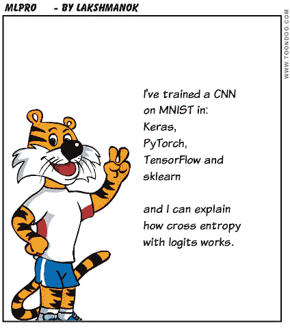
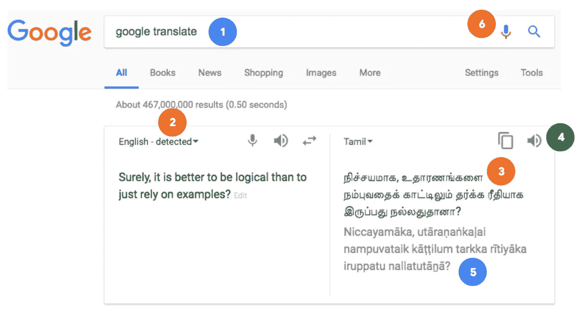
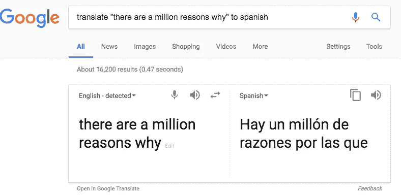
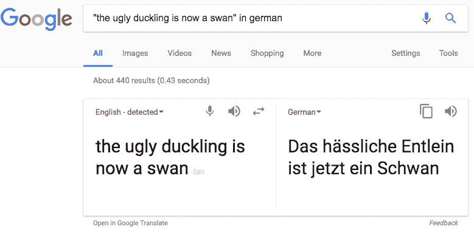
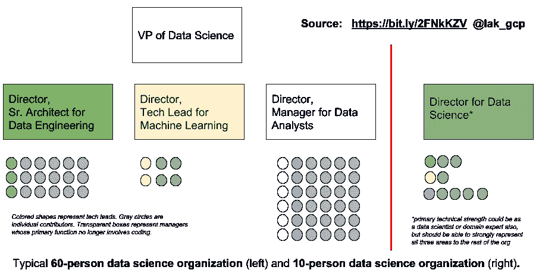

# 如何建立一个机器学习团队

> 原文：<https://towardsdatascience.com/how-to-hire-a-machine-learning-team-b8055fff57f?source=collection_archive---------10----------------------->

## 领域专家、ML 实践者和数据工程师的正确组合，在机器学习中取得成功

我偶尔会做的事情之一是建议谷歌云的客户建立他们的机器学习团队。一家公司可能会启动一项计划，在整个组织中注入机器学习，这对于他们雇佣一名高级数据科学家并建立一个从业者团队非常重要。他们给我看了几份简历，问我的想法，或者问他们应该去参加什么样的招聘会议。

我在一个能为价值数百万美元的机器学习项目提供强有力的技术领导的人身上寻找什么？团队中资历较浅的成员怎么样？

## 你在 ML 团队成员身上寻找什么

想象你正在面试一个程序员。“你以前编过程序吗？，“你问得微妙。“是的！候选人声称，“这是一个 GitHub repo，包含我在参加的在线编程课程中编写的 Hello World 程序。”

“我希望有一些真实世界的程序，”你坚持说，“比你好世界更深刻的东西。”

“我学会了用 Python、Java 和 C++编写 Hello World 程序，”候选人回答，“我甚至修改了它们，让它们说 Hello Earth”。

你会雇佣这个人吗？

You wouldn’t hire a programmer whose entire experience consists of “Hello World” in 3 languages. Why would you do that when it comes to machine learning?

然而…这正是许多机器学习候选人的简历所表明的！在线和大学课程教授理论和玩具示例，许多学习者只是止步于此。你需要你的 ML 从业者超越这一点。

他们应该知道如何建立端到端的机器学习解决方案来解决现实世界的问题，我的意思是他们需要收集/整理数据，摄取数据，探索数据，并清理数据。他们还需要编写模型，训练它，评估它，迭代它，最后部署它进行批量和在线预测。然后，也只有到那时，他们才能声称知道如何进行机器学习。

在招聘你的 ML 团队成员时，确保区分希望从事机器学习研究的人和希望将机器学习应用于你的业务问题的人。对于你的 ML 团队，雇佣优秀的程序员，他们通常会重用现有的框架和库，但是对数据科学中固有的模糊性感到舒服。

## 你在 ML 技术领导中寻找什么

知道如何进行机器学习并不等于精通它，就像知道如何编写 Java 类并不意味着面向对象和企业设计模式是你的第二天性。你不会为你的团队雇佣一个不能创造性地组装高级组件的高级架构师，你也不应该为机器学习领导这样做。

知道如何端到端地实现机器学习模型并不等同于创造性地使用机器学习。因此，机器学习课程可能会教你如何建立序列到序列的模型，这是建立翻译模型的良好起点。但是，野外的翻译系统不仅仅是使用欧洲议会的演讲记录来编写和训练一个英语到德语的模型。

我什么意思？让我用谷歌搜索“谷歌翻译”时发生的事情来说明一下。在链接页面的顶部，我有一个框，我可以在里面输入我想翻译的文本并选择目标语言:

Even a simple user journey will involve multiple ML models. You need a technical lead for ML who can creatively think through a use case and identify all the machine learning models you will build, the data you will collect to train those models, the model architecture you will use, and how you will evaluate those models.

在这个简单的用户旅程中，我可以识别至少六个机器学习模型(见上图中的数字):

Whether or not to bring up this translation UI in response to a search involves ML.

1.  当我搜索“谷歌翻译”时，我得到的不仅仅是一组链接——我还得到了这个特殊的用户界面(见左图)。还有哪些搜索词可以调出翻译界面？我甚至成功地找到了一个甚至不包含“翻译”这个词的查询。

Whether or not to bring up this translation UI in response to a search involves ML — notice that is not as simple as looking for the word “translate” in the search term.

决定什么时候把盒子拿出来？那很可能是 ML 型号。

2.请注意，UI 显示“检测到英语”。检测源文本使用的语言？另一个机器学习模型。

3.然后当然是核心的翻译模型。在我的第一个例子中，我以一种辩论的语气写英语，泰米尔语以类似的语气回复。让事情变得更难的是，泰米尔语的自然顺序是把第二个短语(“而不是仅仅依靠例子”)放在前面，翻译就是这样做的。

4.翻译后的文本出现在一个框中，该框为我提供了文本到语音转换的选项，即大声朗读泰米尔语文本。如果我在国外，只是想让我的设备用外语和我的对话人交流，这非常有用。

5.但是万一我想读，又不读泰米尔文字，有一个很有帮助的拼音指南。这是另一种 ML 模型，一个音节一个音节地转录翻译的文本。

6.最后，当然，可以选择完全通过语音进入翻译界面。模型 4 和 6 向谷歌助手用例开放了基于网络的翻译服务。

熟悉机器学习意味着能够创造性地思考一个用例，并确定您将建立的所有机器学习模型，您将收集来训练这些模型的数据，您将使用的模型架构，以及您将如何评估这些模型。当你为你的 ML 团队雇佣一个高级领导时，你希望有人有能力做到这一点。

*不幸的是，没有任何课程或书籍谈论机器学习的这一方面。我目前正与 Coursera 合作，根据我为谷歌云客户提供咨询的经验，为决策者创建一个机器学习课程。*

## 完整的数据科学组织

构建各种模型并让它们协同工作的需求意味着您的大型数据科学团队还需要许多其他角色。我的同事凯西列了一张[便利清单](https://hackernoon.com/top-10-roles-for-your-data-science-team-e7f05d90d961)。

特别是，你还需要一个数据工程团队和一个数据分析团队来支持 ML 团队。数据工程师构建管道来定期接收和转换数据。数据分析师构建仪表板并创建报告，以支持整个组织的决策制定-除非您的分析团队已经手动进行了几次分析，并且您了解到这是您的企业通常会做出的决策，否则您不会想要构建 ML 模型来自动化任何决策制定。

这是员工人数约为 60 人的数据组织的典型设置，也是适合员工人数约为 10 人的组织的简化版本:

My suggestion for typical 60-person and 10-person data science organizations. The colored shapes represent tech leads while the gray circles represent individual contributors. Transparent shapes are managers whose primarily role is organizational (i.e. they lead either programs or people).

## 构建组织

在 Google Cloud，我们确实为所有这些角色提供培训，以便您可以提升现有团队成员的技能。参见 https://cloud.google.com/training/data-ml报名参加在线课程和面授课程，或者咨询您的 Google Cloud 销售或客户代表。

对于数据工程职位，谷歌云提供了[数据工程认证](https://cloud.google.com/certification/data-engineer)和 Coursera [数据工程专业认证](https://www.coursera.org/specializations/gcp-data-machine-learning)来帮助培训你的组织获得该认证。对于 GCP 的数据分析，我们提供[从数据到洞察](https://www.coursera.org/specializations/from-data-to-insights-google-cloud-platform)专业化。

为了跟上实际机器学习的速度，我建议 GCP 的[带 TensorFlow 的机器学习](https://www.coursera.org/specializations/machine-learning-gcp)和 GCP 的[高级机器学习](https://www.coursera.org/specializations/advanced-machine-learning-tensorflow-gcp)Coursera 的专门化。我有偏见，但我认为它们是最实际、最实用的机器学习课程。他们专注于帮助你建立一个 ML 从业者的团队，而不是研究人员。