# 如何通过 7 个简单的步骤在 AWS 云上托管一个 R Shiny 应用程序

> 原文：<https://towardsdatascience.com/how-to-host-a-r-shiny-app-on-aws-cloud-in-7-simple-steps-5595e7885722?source=collection_archive---------0----------------------->

## **R Shiny App 是什么？**

闪亮的应用程序是一个交互式网络界面。R shiny app 有两个组件用户界面对象(UI。r)和服务器功能(server。r)。这两个组件作为参数传递给创建闪亮 app 对象的闪亮 app 函数。更多关于如何构建闪亮应用的信息，请参考这个链接。[R Shiny App 基础知识](https://shiny.rstudio.com/articles/basics.html)

## **步骤 1** : **创建一个 EC2 实例**

登录 AWS 帐户，点击“计算”标题下的 EC2 或点击“最近访问的服务”下的 EC2

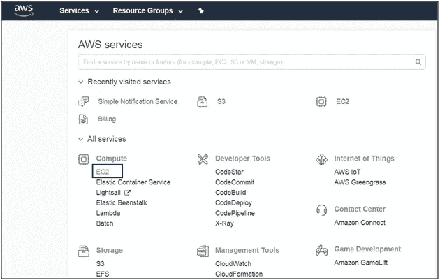

单击启动实例

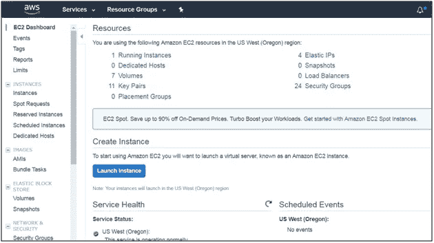

选择你选择的机器镜像，这里我选择了 Ubuntu server 16.04 LTS (HVM)

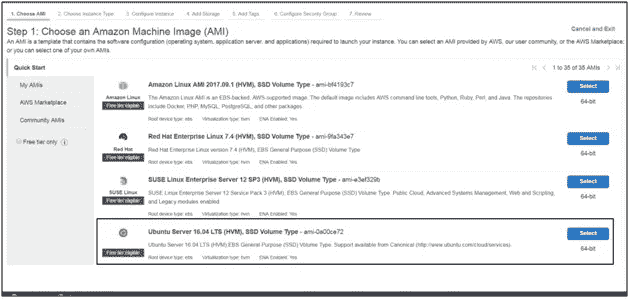

选择实例类型；可以从 t2.micro、t2.small 或 t2.medium 实例开始。对于较大的应用程序，可以使用 t2.large 或更大的。

然后单击“启动实例”,您将转到下面的页面

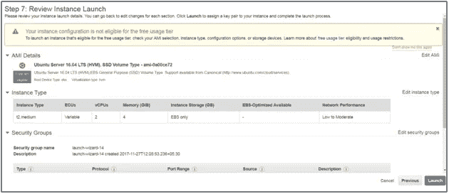

单击编辑安全组，您将被定向到下面的页面(配置安全组)。

在 SSH 行中，将 source 更改为“我的 IP”

单击添加规则，将添加自定义 TCP 规则。在“端口范围”下输入 3838。这是 R shiny 服务器的端口。

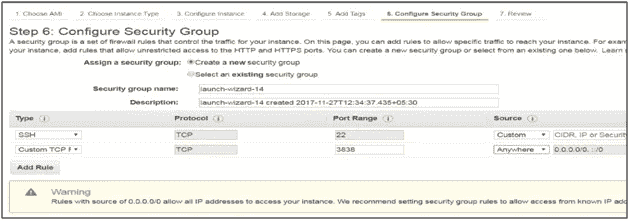

单击“查看并启动”，然后单击“启动”。这样做后，你会看到一个如下的对话框。该对话框有助于创建一个私钥，这将使我们能够 ssh 到 EC2 实例。为密钥命名，然后单击“下载密钥对”。你会得到。pem 文件。**保存了。pem 文件/密钥安全**。

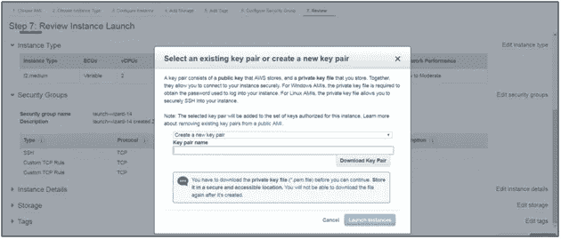

按启动实例。您将看到如下屏幕

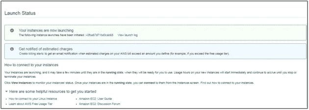

如果实例创建成功，实例状态将显示为“正在运行”

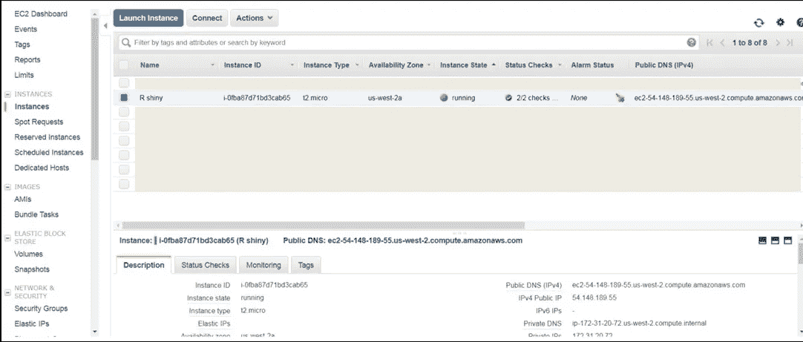

复制公共 DNS (IPv4)下的 IP 地址，这将是我们以后托管 R shiny 应用程序的 URL 的基础。

## **步骤 2:通过 SSH 从 Putty(基于 Windows)访问 EC2 实例**

下载 putty，下载后，转换。pem 文件转换为 ppk 文件。

皈依。pem 文件保存到 ppk，请在 windows 开始对话框中键入 puttygen。点击“puttygen”。应该会出现下面的框。

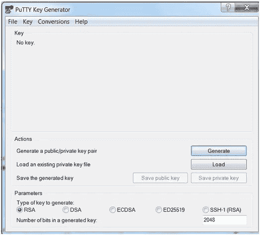

单击文件选项卡，然后单击加载“私钥”。

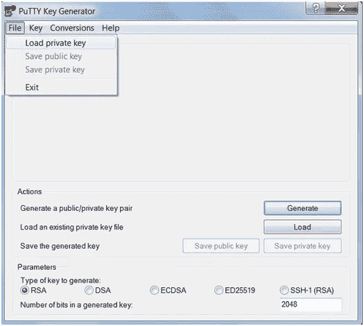

导航到保存的文件夹或路径。pem 文件并选择它。的。pem 文件将被导入，您应该会看到如下画面。

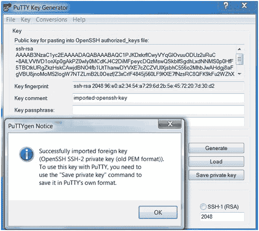

现在将密钥保存为“保存私人密钥”，为密钥命名，并将其保存在您想要的位置。保存密钥后，应出现以下图标。

打开 putty，在主机名框中输入 EC2 实例的 IP，即一个相邻的 IPv4 公共 IP(54.148.189.55 ),如图 a 所示

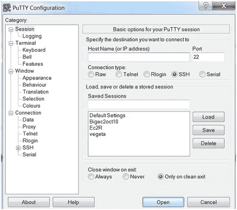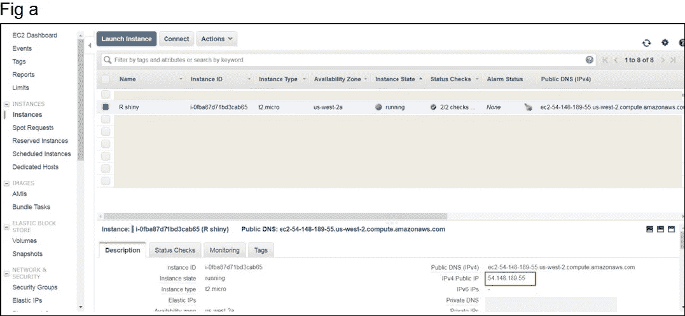

接下来导航到左侧面板上的“Auth ”,并浏览您之前保存的 ppk 密钥。

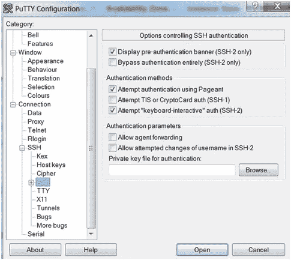

浏览 ppk 密钥后，单击打开。如果您的密钥有效，您将会看到如下所示的命令提示符屏幕。输入您的登录凭据，然后按 Enter 键

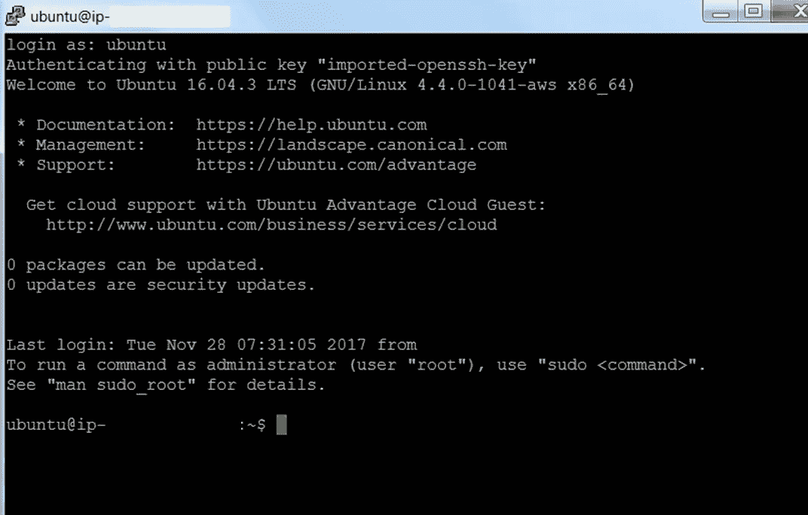

## **步骤 3:安装 WinSCP，将文件从主机传输到 EC2 实例，反之亦然**

在主机名框中输入 EC2 实例的 IP 地址。点击“高级”。

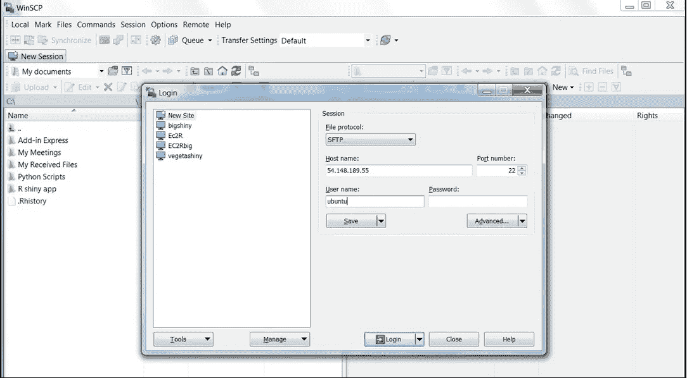

导航到左侧面板，在 SSH 下单击“Authentication ”,输入私钥，如下所示

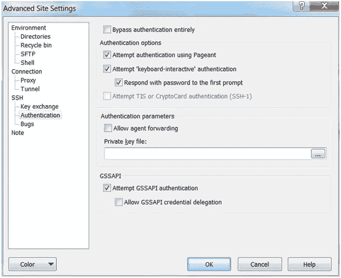

输入私钥后，单击确定。你会看到下面的屏幕。点击“登录”。

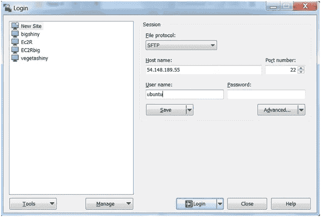

你会看到一个如下的对话框。只需点击“是”。

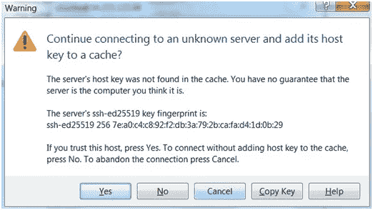

最终结果将是下面的屏幕

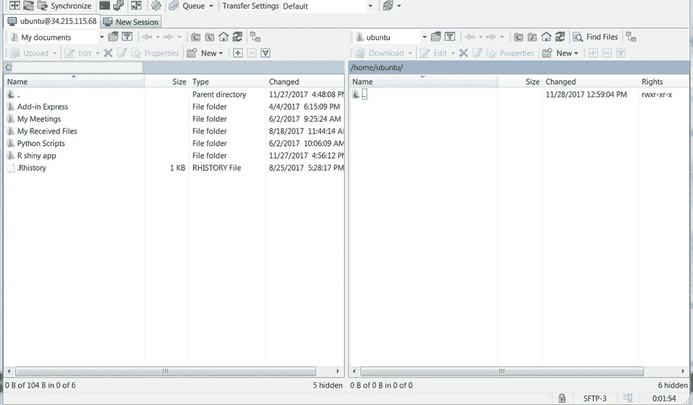

## **步骤 4:在 EC2 实例中安装 R base 和 R shiny 服务器。**

运行 R shiny app 的首要前提是安装 r base、shiny server、shiny package 以及关联包。

要安装上面的，第一步是去根目录安装它们。原因是如果你在 Ec2 中作为非根用户登录，你将有你自己的库路径，并且可能 R 包，r base，shiny 服务器可能不会在系统范围内安装。要在系统范围内安装它，请转到 root 并安装上面的

转到根目录的步骤:

在提示中键入以下内容

**须藤一号**

然后，您应该会看到一个#符号，如下所示

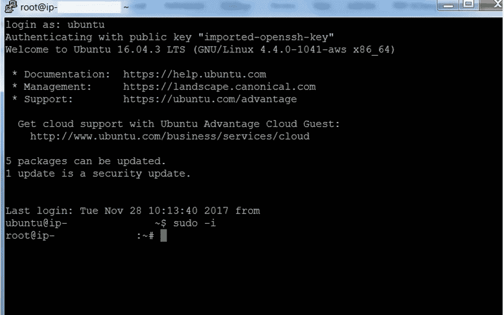

现在运行以下命令

**sudo apt-get 更新**

**sudo apt-get 安装 r-base**

**sudo apt-get 安装 r-base-dev**

*下面的命令安装 R 闪亮包*

**sudo su—-c " R-e \ " install . packages(' shiny '，repos = ' http://cran . R studio . com/')\ " "**

*下面的命令安装闪亮服务器*

**wget**[**https://download 3 . rstudio . org/Ubuntu-12.04/x86 _ 64/shiny-server-1 . 4 . 4 . 807-amd64 . deb**](https://download3.rstudio.org/ubuntu-12.04/x86_64/shiny-server-1.4.4.807-amd64.deb)

**sudo dpkg-I shiny-server-1 . 4 . 4 . 807-amd64 . deb**

## **第五步:转移 R 闪亮 app 组件**

执行上述步骤后，将在路径/srv/shiny-server/中创建一个名为“shiny-server”的目录(文件夹)

下一步是在 shiny-server 目录中创建一个文件夹，我们可以在其中放置我们的 R shiny 应用程序组件(UI。r，服务器。R、配置文件、R 工作空间、数据文件或 R 程序)。

起初，我们可能无法在 shiny-server 文件夹中创建文件夹，首先执行以下命令

**须藤 chmod 777 /srv/shiny-server**

**sudo mkdir/SRV/shiny-server/myapp**

在上面的命令中，我创建了一个文件夹‘myapp’来放置所有的 R shiny 应用程序组件。

## **步骤 6:使用 Winscp 将 R shiny app 组件从本地机器转移到 Ec2 实例**

现在将 R shiny app 组件从本地机器复制到 Ec2 实例，路径如下/srv/shiny-server/myapp/

需要考虑的一件重要事情是**配置 shiny-server.conf**

shiny-server.conf 可以在 **/etc/shiny-server/** 中找到

同样，您可能无法访问/etc/下的 shiny-server 目录。

因此运行下面的命令

**须藤 chmod 777 /etc/shiny-server**

执行上述命令后，您可以将配置文件复制到本地系统，编辑它，然后将编辑后的配置文件传输回/etc/shiny-server 位置。

要制作的版本如下:请注意#后面的单词是注释。

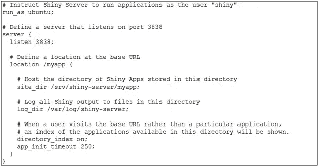

下面的结果显示了在路径/srv/shiny-server/myapp 中复制的 shiny 组件

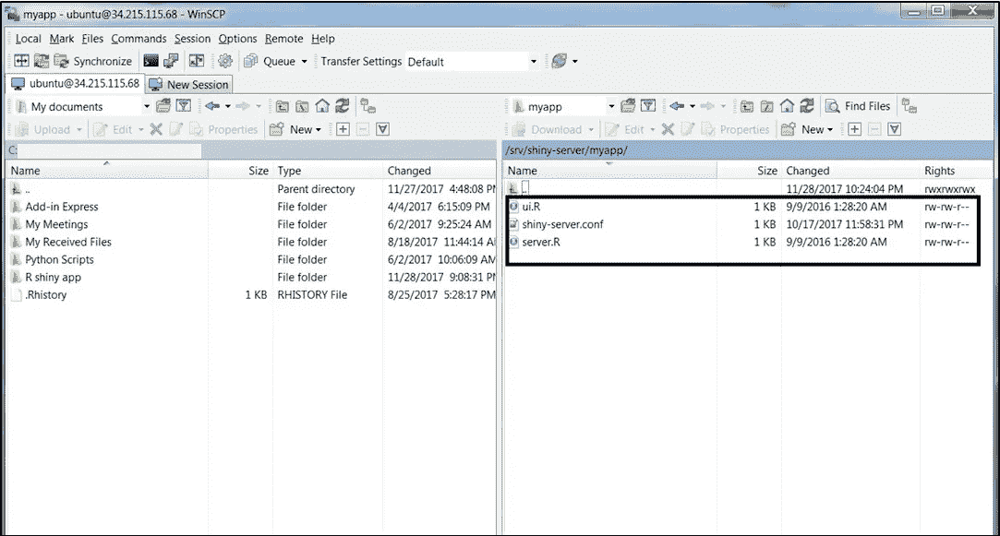

## **第七步:托管应用**

现在是最后一步。在 amazon 控制台中，转到正在运行的 EC2 实例。复制公共 DNS (Ipv4)，例如:**ec2–34–215–115–68.us-west-2.compute.amazonaws.com**。

在浏览器中复制这个并像下面一样加上后缀 **: 3838/myapp** 然后按回车键。

你的 R shiny app 托管成功！！！！

**需要考虑的重要注意事项:**

复制 R 工作空间是很重要的，因为它将在创建的文件夹(即 myapp)中包含 R 对象和数据文件。在上面的例子中，我们使用了一个简单的闪亮的应用程序“hello world equivalent ”,因此我们没有任何 R 工作空间或数据文件。

有时，应用程序可能会因为某些原因无法加载，或者屏幕可能会“变灰”。请刷新并重试。

**来源:**

[在 AWS 上运行 R](https://aws.amazon.com/blogs/big-data/running-r-on-aws/)

[在亚马逊 EC2 上托管 shiny](http://www.exegetic.biz/blog/2015/05/hosting-shiny-on-amazon-ec2/)

[闪亮的服务器故障排除](https://www.r-bloggers.com/deploying-shiny-server-on-amazon-some-troubleshoots-and-solutions/)

如果你喜欢我的文章，给它几个掌声。

你可以在 Linkedin 上联系我