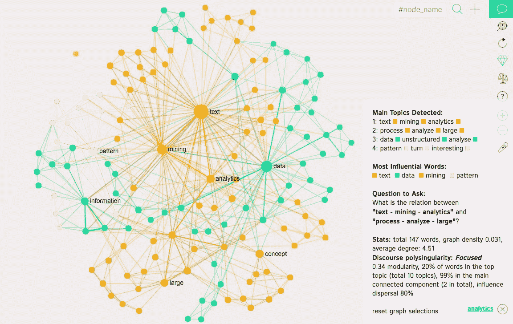
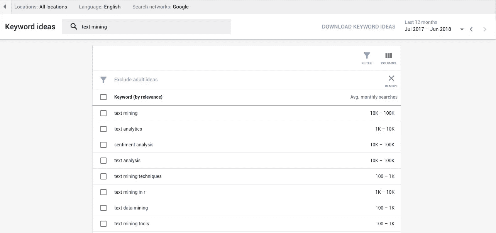
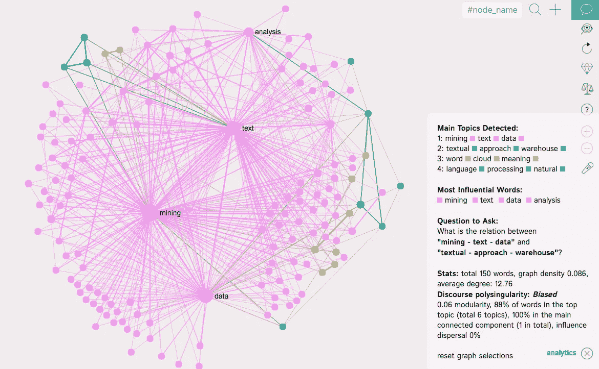
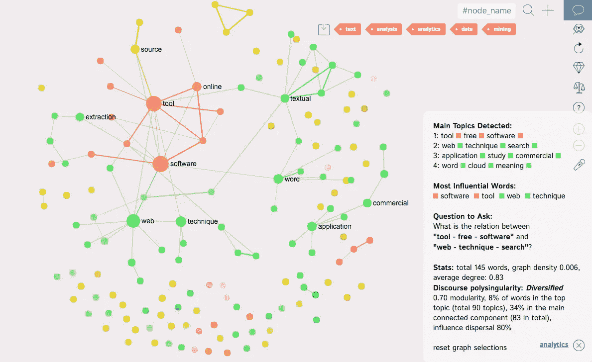
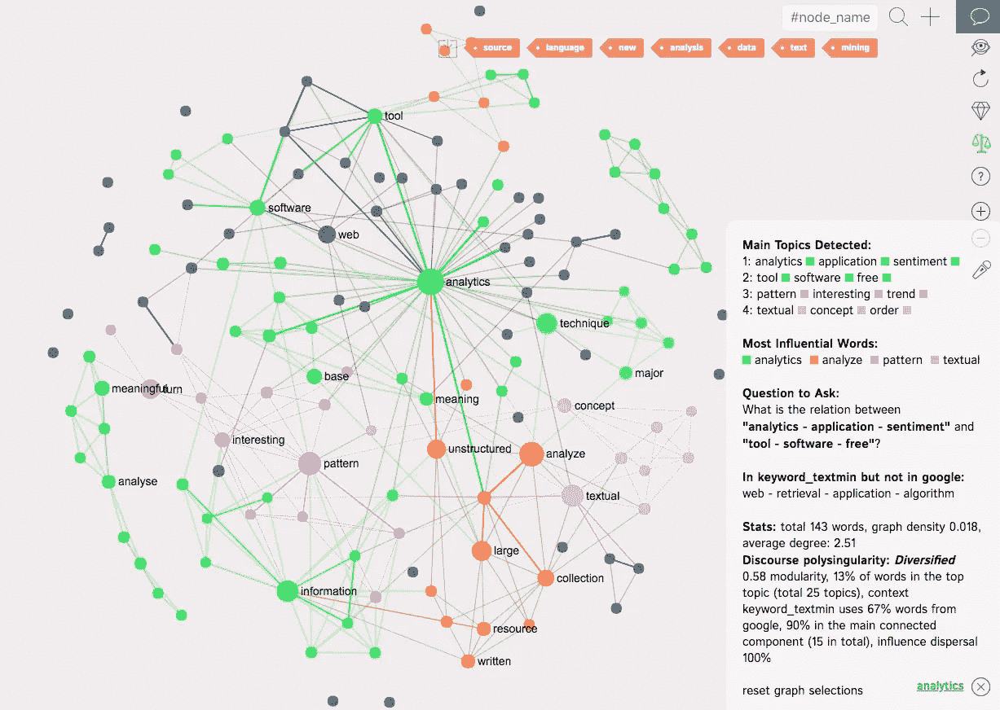
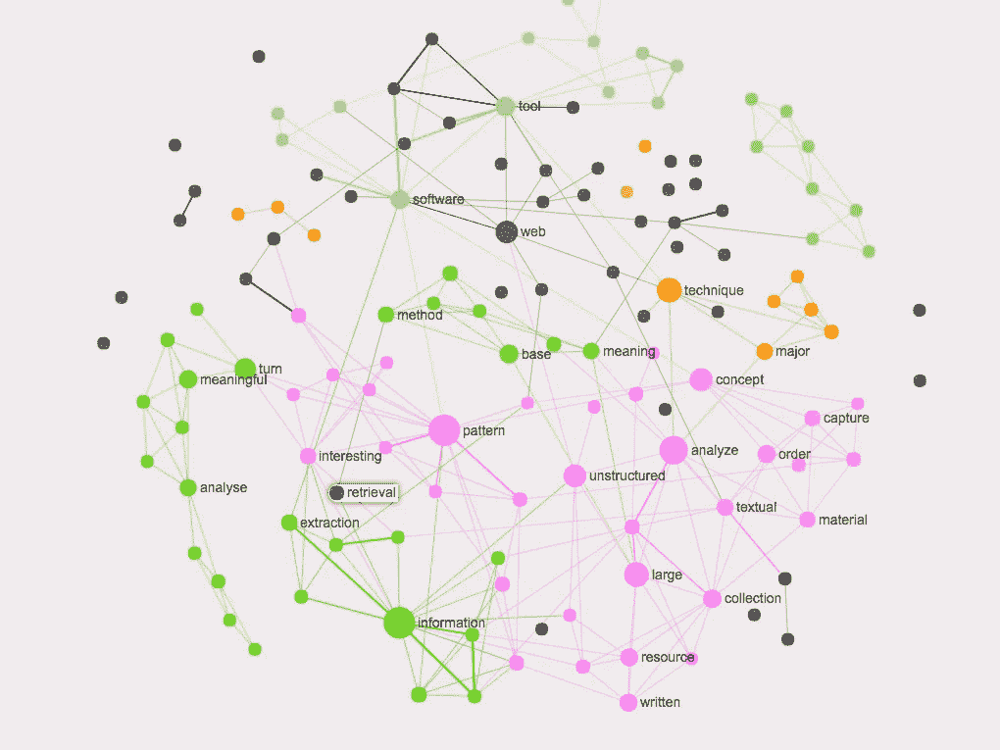

# 如何使用搜索引擎优化和文本挖掘识别公共话语中的空白

> 原文：<https://towardsdatascience.com/how-to-identify-gaps-in-public-discourse-using-seo-and-text-mining-f5e468f265da?source=collection_archive---------6----------------------->

搜索引擎优化(SEO)通常用于将内容推至谷歌搜索结果页面的顶部。然而，使用今天可用的数据以及文本分析和可视化技术，我们可以将 SEO 方法应用于更有趣的事情:发现公共话语中的差距。这些差距是人们寻找的东西和他们实际发现的东西之间的差异。一旦我们确定了这些差距，我们就可以制作相关的内容来弥补需求和供给之间的不足，无论是政治话语、利基市场还是科学研究。

我们提出的方法的核心是基于文本网络分析、可视化技术和文本挖掘的结合。

# 问题#1:当前话语的状态是什么？

第一步是确定目标和兴趣。例如，在[我们之前的一项研究](https://noduslabs.com/cases/google-seo-strategies-text-mining/)中，我们专注于“文本挖掘”这一主题。我们的目标是吸引在互联网上搜索这个主题的观众到我们研究实验室的网站， [Nodus Labs](https://noduslabs.com) ，为这些观众提供 [InfraNodus](https://infranodus.com) 文本网络可视化工具。

我们使用 InfraNodus 来可视化“文本挖掘”的当前搜索结果——人们在谷歌上搜索时实际看到的内容。

Text network visualization of Google search results for “Text Mining” — what people actually find when they look for this search query, visualized using [InfraNodus](https://infranodus.com)

我们发现，很明显，有一个占主导地位的主题集群
*文本——挖掘——分析*

以及其他主题集群如
*流程—分析—大型*
和
*数据—非结构化—分析*
和
*模式—转折—有趣*

这向我们表明，当人们在谷歌上搜索“文本挖掘”时，他们实际上找到的大多是对它的好处(识别非结构化数据中的模式)及其工作方式的一般性描述。

当然，为了获得更好的图片，建议查看几个不同的相关关键字，以便构建更好的表示。例如，在我们的例子中，我们可以添加“数据挖掘”、“文本分析”等。

# 问题 2:人们实际上在寻找什么？

一旦我们确定了当前话语的状态，我们现在就可以发现当人们想要进入话语时，他们实际上在寻找什么。这将有助于我们了解人们想要的和他们实际得到的之间是否有任何差异，因此我们可以在以后用新的内容、想法、产品或服务来针对这种差异。

为了做到这一点，我们可以使用[谷歌关键词规划工具](https://adwords.google.com/aw/keywordplanner/home)，它是 AdWords 平台的一部分。首先，我们需要看到与我们的搜索查询“文本挖掘”相关的搜索词列表。

这些包括“文本分析”、“情感分析”、“文本数据挖掘”等。然后我们可以将它们下载为 CSV 文件，在 Google Sheets 中打开，然后将表格中的关键字列复制并粘贴到 [InfraNodus](https://infranodus.com) 中，以可视化主要术语及其之间联系的图表:

What people search for when they look for “text mining” — related queries from Google Keywords Tool visualized with [InfraNodus](https://infranodus.com)

我们可以看到，“文本挖掘”和“数据分析”这两个词在人们搜索这个话题时使用的关键词列表中相当突出。这些都是不言而喻的，所以我们可以从图表中删除它们(和其他主题),看看当我们删除所有我们已经知道的主题时，还剩下哪些主题:

“Text mining” associated search queries with “text”, “analytics”, “analysis”, “data”, “mining” removed from the graph

我们现在可以看到，当人们搜索“文本挖掘”(和相关搜索)时，他们的搜索查询中有一个主题集群，由以下内容组成:

*软件—工具—在线*

这意味着人们寻找在线软件工具来进行文本挖掘，识别文本处理工具的内容和市场中的潜在缺口。

# 问题 3:人们寻找的和他们发现的有什么区别？

既然我们已经确定了人们在搜索“文本挖掘”时所寻找的特殊主题群，我们现在可以将其与谷歌搜索结果的文本图进行比较。为了做到这一点，我们可以使用结节下比较特征。它向我们展示了第二张图中的哪些术语(人们寻找的内容)没有出现在第一张图中(人们得到的搜索结果)，并根据它们的重要性对它们进行了排序:

The black nodes on the graph are the terms that people look for (in relation to “text mining”) but don’t really find in Google search results — identifying a gap and, thus, a potential content / product / service opportunity.

这些术语是:
*web —检索—应用—算法*

正如我们所看到的，需要找到基于 web 的文本检索应用程序和各种可以在线使用的文本挖掘算法。

因此，如果我们要创建新的内容，它将是相关的，具有较低的竞争性，并满足某种需求，这是其他内容所不能满足的，我们就需要写与基于 web 的应用程序和算法相关的“文本挖掘”。这就是人们寻找却没有找到的东西。

此外，这也向我们展示了市场中一个潜在的有趣缺口，一个我们可以用新产品或服务来填补的缝隙。

当然，需要进行更彻底的研究，包括围绕“文本挖掘”的所有搜索词，但上面介绍的这个通用简化示例可用于研究任何公共话语，并根据受众的需求确定潜在的有趣领域，以增加话语的价值。

如果你想尝试这种方法，你可以在 www.infranodus.com 的**上建立一个新账户。要导入谷歌搜索结果，请前往*[*infranodus.com/google*](http://infranodus.com/google)*。**

**