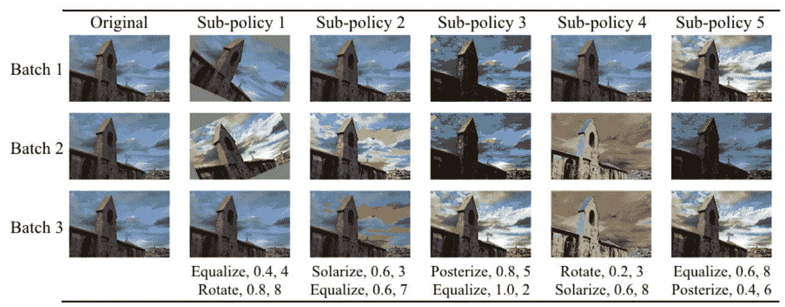
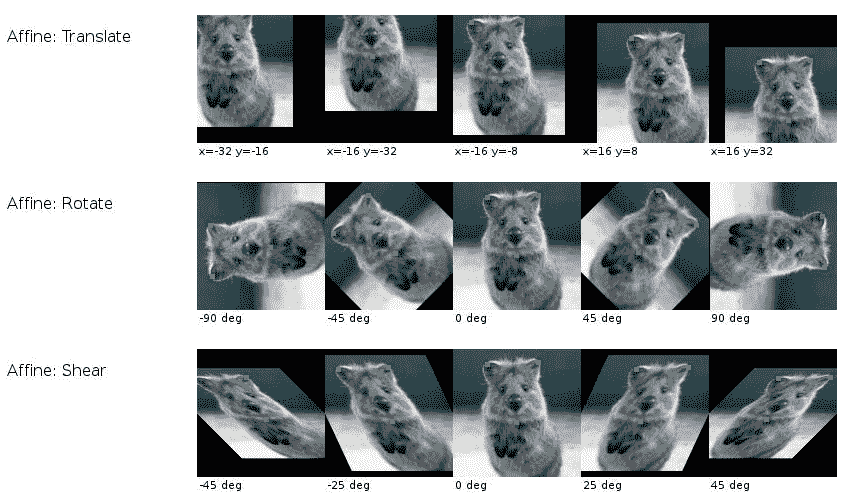
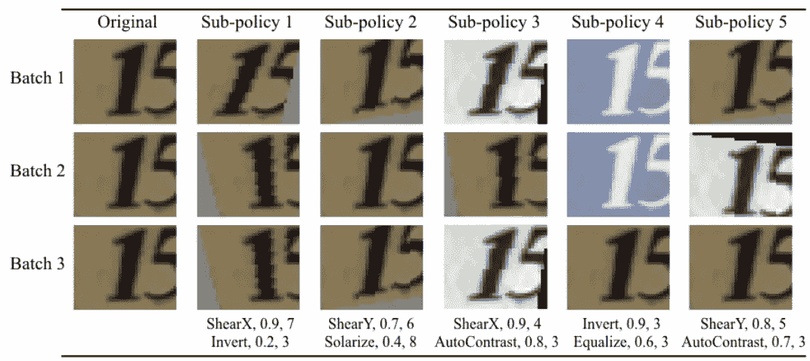
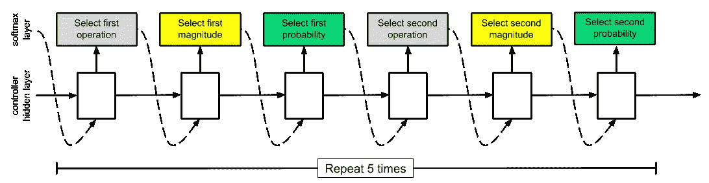
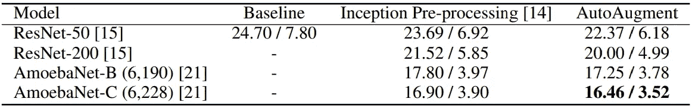
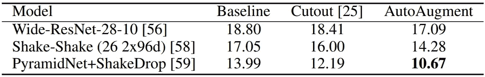
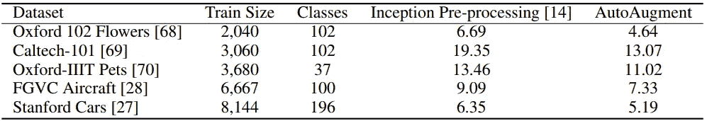
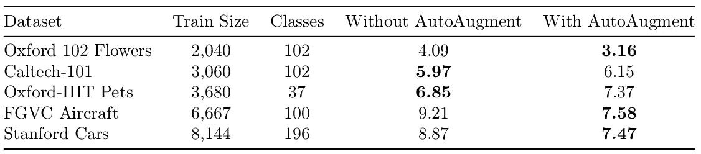
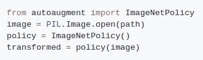
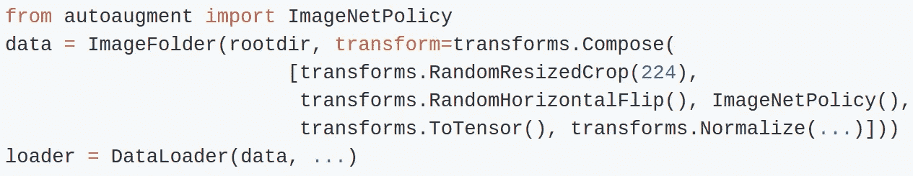

# 如何用谷歌的自动增强功能改进你的图像分类器

> 原文：<https://towardsdatascience.com/how-to-improve-your-image-classifier-with-googles-autoaugment-77643f0be0c9?source=collection_archive---------1----------------------->

*通过使用优化的数据增强技术，获得了关于 CIFAR-10、CIFAR-100、SVHN 和 ImageNet 的最新结果。自己从这个* [*仓库*](https://github.com/DeepVoltaire/AutoAugment) *中使用它们。*

Some of the best augmentations found for ImageNet. From [https://arxiv.org/abs/1805.09501v1](https://arxiv.org/abs/1805.09501v1)

AutoML——使用机器学习来改善机器学习设计选择，如[架构](https://arxiv.org/abs/1707.07012v4)或[优化器](https://arxiv.org/abs/1709.07417)的想法——已经达到了数据扩充的空间。这篇文章解释了什么是数据增强，Google 的[自动增强](https://arxiv.org/abs/1805.09501v1)如何搜索最佳增强策略，以及如何将这些策略转换为您自己的图像分类问题。

## 数据扩充

数据扩充意味着在训练机器学习模型时，对您的输入随机应用各种转换。随着新的可能的输入-输出对的生成，这人为地扩大了您的训练数据。这也有助于防止过度拟合，因为网络几乎不会两次看到完全相同的输入，也不能只记住它们。用于图像的典型数据扩充技术包括从输入图像中随机裁剪部分，水平翻转它们，并应用仿射变换，如平移、旋转或剪切。

From [https://github.com/aleju/imgaug](https://github.com/aleju/imgaug)

事实上，正如 [AutoAugment](https://arxiv.org/abs/1805.09501v1) 的作者所指出的，近年来已经投入了大量的努力来为 ImageNet 寻找更好的网络架构，而 Krizhevsky 等人在 2012 年为 [AlexNet](http://papers.nips.cc/paper/4824-imagenet-classification-with-deep-convolutional-neural-networks.pdf) 使用的数据增强技术仍然基本相同，只有微小的变化。

## 现状

选择使用哪种数据扩充的标准方法是提出不同的假设，说明哪种变换适合您的数据集，然后进行试验。你可以从随机裁剪或[随机调整大小裁剪](https://pytorch.org/docs/stable/torchvision/transforms.html#torchvision.transforms.RandomResizedCrop)和水平翻转开始，因为它们几乎总是有效的，接下来可以尝试小的旋转。由于重复训练运行导致的验证性能的随机波动，很难确定这些添加的旋转是否提高了模型性能。你可以从一次运行到另一次运行得到随机的改进，这并不是因为增加了增强。

通常，因为你的实验是高度不明确的，你没有时间或资源来严格测试所有可能的组合，你会放弃整个搜索或坚持一些增强，而不知道它们是否有很大贡献。但是，如果有一种方法可以转移有益的数据增强技术，就像我们在迁移学习中从预训练模型转移权重一样，会怎么样呢？

## 从数据中学习增强策略

[自动增强](https://arxiv.org/abs/1805.09501)的想法是在强化学习(RL)的帮助下，学习给定数据集的最佳增强策略。因为在图像上应用和组合变换的所有可能方式的搜索空间是巨大的，他们用几个设计选择来限制它。一个策略由 5 个子策略组成，每个子策略按顺序应用 2 个映像操作。这些图像操作中的每一个都有两个参数:应用它的概率和操作的幅度(例如，在 70%的情况下旋转 30 度)。

这种策略如何应用于训练时的图像？对于我们当前批次中的每个图像，首先随机统一选择一个子策略，然后应用该子策略。让我们来看一个应用于来自 [SVHN](http://ufldl.stanford.edu/housenumbers/) 数据集的图像的具有 5 个子策略的示例策略:

子策略 1 在 90%的情况下在任一 x 方向上剪切幅度为 7 的图像。然后，以 20%的概率，图像的颜色被反转。子策略 4 在 90%的情况下反转颜色，然后在 10 次中均衡颜色直方图 6。操作的幅度是固定的，但是由于子策略应用的随机性和操作的概率，对于单个图像有许多可能的增强结果。

Example of applying some of the best found augmentations to an SVHN image. From [https://arxiv.org/abs/1805.09501v1](https://arxiv.org/abs/1805.09501v1)

让我们看看 AutoAugment 的 RL 模型的搜索空间。他们考虑了 16 种操作:14 种来自 Python 图像库 [PIL](https://pillow.readthedocs.io/en/5.1.x/) 的操作，如旋转、颜色反转和不太为人所知的操作，如色调分离(减少像素位)和曝光(反转阈值以上的颜色)，加上数据增强领域的新来者[剪切](https://arxiv.org/abs/1708.04552v2)和[样本配对](https://arxiv.org/abs/1801.02929v2)(类似于[混合](https://arxiv.org/abs/1710.09412v2))。将 11 个离散化的概率值(0.0，0.1，…，1)和 10 个从 0 到 9 的均匀间隔的量值相加，这对于一个子策略来说等于(16 * 11 * 10)个可能性，对于 5 个子策略来说等于(16 * 11 * 10)个⁰ ≈ 2.9 * 10 个可能性。强化学习拯救世界！

## 自动增强是如何训练的？

自动增强像 [NASNet](https://arxiv.org/abs/1707.07012) 一样被训练——这是谷歌的一篇早期 AutoML 论文，其中 RL 系统为图像分类找到了最先进的模型架构。方法如下:我们有一个控制器，它决定目前哪种数据扩充策略看起来最好，并通过在特定数据集的小子集上运行子模型实验来测试该策略的泛化能力。在子实验完成后，使用称为[近似策略优化算法(PPO)](https://arxiv.org/abs/1707.06347v2) 的策略梯度方法，用验证准确度作为奖励信号来更新控制器。让我们更详细地看看控制器和子模型实验，因为解释 PPO 超出了本文的范围。

## 控制器

控制器以 softmax 的形式输出要应用哪个操作的决定。这个决定然后作为输入输入到控制器的下一步。这是可行的，因为控制器是 RNN(对于 NASNet，使用了具有 100 个隐藏单元的 LSTM)。然后，控制器决定以何种幅度应用该操作。在第三步中，选择概率。因此，为了做出下一个最好的选择，控制者拥有所有其他操作的上下文、概率和大小。(这是一个说明性的例子，因为该论文目前没有告诉我们以什么顺序选择运算、大小和概率)。

Illustrative controller model architecture. Adapted from [https://arxiv.org/abs/1707.07012](https://arxiv.org/abs/1707.07012)

总共有 30 个 softmax 预测，因为有 5 个子策略，并且每个子策略需要关于操作、幅度和概率的两个决策(5 * 2 * 3 = 30 ),用于其顺序应用的两个操作。

## 子模型

我们如何告诉控制器哪些策略选择得非常好，哪些策略没有真正提高性能(想象一下将亮度设置为零)？为此，我们对使用当前数据扩充策略的子神经网络进行了一个泛化实验。实验结束后，RNN 控制器的权值以验证精度作为奖励信号进行更新。当最终将总体最佳的 5 个策略(每个策略有 5 个子策略)合并到最终策略(现在有 25 个子策略)中时，这样做 15，000 次。该最终策略用于该数据集的所有结果。

## 结果

由于副标题已经泄露，自动增强改善了数据集的最先进水平，如 [CIFAR-10](https://www.cs.toronto.edu/~kriz/cifar.html) 、 [CIFAR-100](https://www.cs.toronto.edu/~kriz/cifar.html) 、 [SVHN](http://ufldl.stanford.edu/housenumbers/) 、 [ImageNet](http://www.image-net.org/) 等。此外，还有一些特别有趣的细节:

*   CIFAR-10 和 ImageNet 的最佳策略主要是基于颜色的转换。对于 SVHN，与 CIFAR-10 相比，AutoAugment 选择了非常不同的转换:剪切图像和反转颜色，这对门牌号有意义。

Test set error rates (%) on CIFAR-10\. Lower is better. From [https://arxiv.org/abs/1805.09501v1](https://arxiv.org/abs/1805.09501v1)

Validation set Top-1 / Top-5 error rates (%) on ImageNet. Lower is better. From [https://arxiv.org/abs/1805.09501v1](https://arxiv.org/abs/1805.09501v1)

*   **在数据较少的情况下，使用自动增强功能可以更好地改善结果。这是数据增强技术的预期行为，但值得注意。**
*   在 CIFAR-10 上发现的最佳数据增强策略转化为在 CIFAR-100 上的实质性改进，从 12.19%的错误率降低到 10.67%。

Test set error rates (%) on CIFAR-100\. From [https://arxiv.org/abs/1805.09501v1](https://arxiv.org/abs/1805.09501v1)

*   将在 ImageNet 上找到的最终策略应用于 5 个不同的困难数据集显著提高了准确性。**这是数据增强而非权重的迁移学习。**这些结果是在从头开始训练 [Inception v4](https://arxiv.org/abs/1602.07261v2) 而不是从 ImageNet 微调权重时获得的。

Test set Top-1 error rates (%) on FGVC datasets. An Inception v4 was trained from scratch with an without applying the best ImageNet augmentation policy. From [https://arxiv.org/abs/1805.09501v1](https://arxiv.org/abs/1805.09501v1)

## **双转移学习**

如果我们想解决我们自己的图像分类问题，我们通常从使用 ImageNet 的预训练权重开始，并根据我们的问题对这些权重进行微调。我们刚刚看到，在从头开始训练时使用 AutoAugment 的最佳 ImageNet 策略也有类似的积极效果。如果我们双管齐下:在使用 ImageNet 自动增强策略的同时微调 ImageNet 权重，会怎么样？**积极的效果会累积起来，并为我们提供解决任何新的图像分类问题的新的最佳方法吗？**

为了回答这个问题，我使用了相同的 5 个 FGVC 数据集(牛津 102 Flowers，加州理工学院 101，牛津-IIIT Pets，FGVC Aircraft 和 Stanford Cars)，并在应用或不应用来自 AutoAugment 的 ImageNet 策略的情况下对盗梦空间 v4 进行了微调。

**实验设定**

*   初始 v4 在一个 GPU 上训练，批量为 32，SGD 动量为 0.9，学习速率为 0.01。
*   如果验证准确性在 5 个时期内没有增加，则将学习率除以 2。在 3*5=15 个阶段的验证准确度无改善后，停止培训。
*   本报告使用了[提供的经过预先培训的 ImageNet 权重。仅交换顶部的输出层，以说明不同类别的数据集。所有层从开始都是可以训练的。](https://github.com/Cadene/pretrained-models.pytorch)
*   输入图像大小为 448x448，如自动调整纸上所示。
*   两种微调场景都使用随机水平翻转和[随机调整大小裁剪](https://github.com/pytorch/vision/blob/master/torchvision/transforms/transforms.py#L513)作为基线数据增强。随机调整大小裁剪的最小裁剪百分比是根据较小 ResNet18 模型的验证集性能选择的。
*   在随机调整大小裁剪之后，将应用 ImageNet 自动调整策略。实验表明，无论是在种植前还是种植后应用，这似乎都无关紧要。
*   利用这些选定的超参数，最终模型在训练和验证集的组合上训练，并在测试集上测试。为了确保稳定的结果，以这种方式训练了五个模型，并对测试结果进行了平均。

Test set Top-1 error rates (%) on FGVC datasets averaged over five runs. An Inception v4 was fine-tuned from ImageNet weights with and without the AutoAugment ImageNet policy. Interestingly, fine-tuned results are better on only 3 out of 5 datasets in comparison to the results trained from scratch from the AutoAugment paper above. Fine-tuning does not seem to benefit the performance in all cases as also discussed in “Do Better ImageNet Models Transfer Better (Kornblith et al. 2018)” [https://arxiv.org/abs/1805.08974](https://arxiv.org/abs/1805.08974)

对不同数据集应用最佳 ImageNet 策略**可使 5 个数据集中的 3 个数据集的错误率平均降低 18.7%** 。在 2 个数据集上，错误率略微增加，平均为 5.3%。

这些结果表明，当您通常需要微调 ImageNet 的权重时，您应该尝试额外应用 ImageNet 自动调整策略。通常情况下，您基本上可以免费获得显著的改进。

## **如何对您的问题应用自动建议策略**

我已经创建了一个**存储库，其中包含了本文附录中的最佳 ImageNet、CIFS-10 和 SVHN 策略。一些实施细节仍不清楚，但我正在与作者联系，一旦我知道更多，将尽快更新回购协议。**

**使用此基本语法，ImageNet 策略的随机子策略将应用于 PIL 映像:**

****

**要将其应用为 PyTorch 转换，您将执行以下操作:**

****

## **结论**

**AutoML 再次做到了这一点:给定数据集的最佳数据扩充操作是可以学习的，甚至可以转移到类似的数据集。这可能只是即将到来的许多 AutoML 优化数据增强策略中的第一个。提高学习这些策略的效率是另一个令人兴奋的途径，以使任何人都能够使用这些技术(无需 GPU 服务器群)。ENAS 表明这是可能的。**

**祝你好运，把这个新工具应用到你自己的问题中。让我知道你的结果，如果他们同意或不同意我的实验。关于错误和问题，请发电子邮件到 philip@popien.net 给我。**