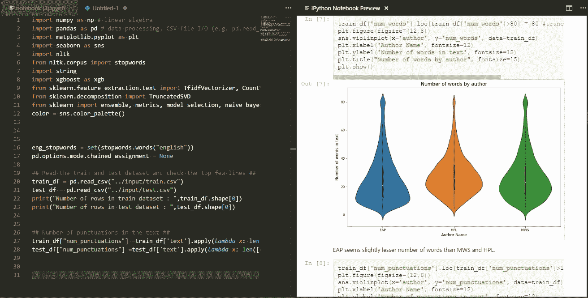
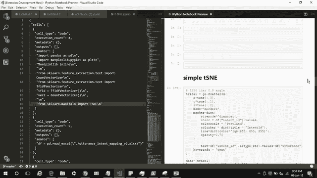
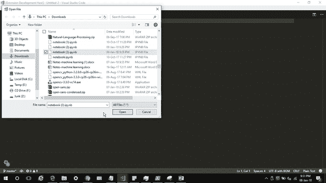

# 如何用 VS 代码和 Jupyter 笔记本改善你的工作流程💘

> 原文：<https://towardsdatascience.com/how-to-improve-your-workflow-with-vs-code-and-jupyter-notebook-f96777f8f1bd?source=collection_archive---------2----------------------->

我喜欢 VS 代码，也喜欢 Jupyter 笔记本😍。两人都擅长自己的世界。但是为了改进我的工作流程，我必须在他们的世界之间建立一座桥梁。

数据科学家喜欢 Jupyter 笔记本。它们是创建可重复实验的最佳选择。Visual Studio 代码将经典的轻量级文本编辑器的易用性与更强大的 IDE 类型的功能结合在一起，只需要很少的配置。它附带了许多令人敬畏的扩展，使它成为常规使用的一个非常强大的工具。

不幸的是，每次查看 IPython 文档时，您都必须运行 Jupyter 实例并在浏览器中打开笔记本。如果我们在 VS 代码中打开一个 IPython 笔记本，我们只能看到一个 JSON 文档，而看不到漂亮的渲染文档。

我的工作流程包括在 Jupyter 笔记本上做原型和实验，然后用 VS 代码创建一个独立的 Python 脚本。Python 代码的 Git 版本简化了我的工作流程。

让我有点失望的是，即使是为了查看预览，我也必须启动一个 Jupyter 实例，并打开我的 RAM hungry Chrome 浏览器。:)

所以我决定不运行 Jupyter 实例来解决这个预览笔记本的小问题。为了更进一步，我决定在 VS 代码中实现。

结果是 nbpreviewer，一个 VS 代码扩展，帮助你在 VS 代码中预览渲染 Jupyter notebook。你甚至可以用 VS 代码与交互式图形可视化进行交互。

在这里尝试一下

 [## VS 代码 Jupyter 笔记本预览器- Visual Studio 市场

### 这是一个易于使用的扩展，用于在 VS 代码中预览 Jupyter 笔记本

marketplace.visualstudio.com](https://marketplace.visualstudio.com/items?itemName=jithurjacob.nbpreviewer) 

# **演示**

Playing with plotly 3D visualization within VS Code

Bridging two worlds 😃

如果您对扩展的源代码感兴趣，请访问我的 GitHub 库。请关注我的下一篇博文，了解我是如何创建扩展的，以及您如何轻松地创建自己的扩展。

 [## jithurjacob/vscode-nbpreviewer

### 一个 VS 代码扩展，用于预览 Jupyter 笔记本

github.com](https://github.com/jithurjacob/vscode-nbpreviewer) 

*记得给本帖一些💚如果你喜欢的话。关注我了解更多内容:)*