# 如何整合 Google Sheets 和 Jupyter 笔记本

> 原文：<https://towardsdatascience.com/how-to-integrate-google-sheets-and-jupyter-notebooks-c469309aacea?source=collection_archive---------2----------------------->


Jupyter 笔记本的功能非常强大。与 Google Sheets 或 Microsoft Excel 不同，它们可以轻松处理大量数据。只需几行代码，您就可以执行复杂的统计操作或操纵数据。你可以运行复杂的 for-loops 来创建[蒙特卡洛](https://en.wikipedia.org/wiki/Monte_Carlo_method)模拟，而不需要像[水晶球](http://www.oracle.com/technetwork/middleware/crystalball/overview/index.html)这样昂贵的附加组件。

但是有时您需要将这种强大的功能与简单且几乎普遍理解的电子表格 UI 结合起来。

例如，您可能想在一个小数据集上练习您的 Python 代码，您可以在 Google Sheets 中轻松直观地操作它。或者你可能需要将复杂分析的结果输出到电子表格中，以便你的非编码人员 CEO 或客户能够阅读和理解。或者，您可能会发现在电子表格中做一些简单的数据工作更容易，而在 Python 中只做最复杂的部分。

我曾经在 Google Sheets 中完成我的电子表格工作，下载一个 CSV 文件，将 CSV 文件数据拉入 Jupyter，处理我的数据，导出另一个 CSV 文件，然后将其上传回 Google Sheets。对每次调试或新的数据迭代进行清洗和重复。呸。

但后来我意识到，谷歌提供了一个 API，可以将工作表连接到你能想到的任何第三方应用，包括 Jupyter 笔记本。在修补了一会儿之后，我想出了如何轻松地将最新的数据从我的 Google Sheets 导入 Jupyter，并将数据从 Jupyter 输出回 Google Sheets。

这需要一点一次性设置。但是，如果您发现自己在工作表和 Jupyter 之间来回切换，或者偶尔想念电子表格的易用性，或者需要从 Jupyter 快速更新工作表中的数据，那么本教程就是为您准备的。

注意:我使用的是 Python 2.7.14 和 Anaconda 4 . 3 . 30 版本。你可以在这里看到我的完整环境[，在这里](https://github.com/kmclaugh/Jupyter-GoogleSheets/blob/master/environment.yml)看到我在第 2 部分[中使用的完整示例笔记本。](https://github.com/kmclaugh/Jupyter-GoogleSheets/blob/master/Jupyter%20-%20Google%20Sheets.ipynb)

[*订阅我的简讯*](https://slideruletech.com/subscribe/tech-tips/?mcsul=https://towardsdatascience.com/how-to-integrate-google-sheets-and-jupyter-notebooks-c469309aacea&)

# 第一部分——创建你的谷歌开发者证书

在将我们的 Jupyter 笔记本连接到我们的 google sheets 之前，我们首先必须创建允许访问我们的 google Drive 的 Google 开发人员凭据。这一部分有点长也有点难，但是你只需要对所有的笔记本和纸张做一次。

## 创建一个 Google 开发者项目

进入[谷歌开发者控制台](https://console.developers.google.com/project)。

点击**创建项目**。

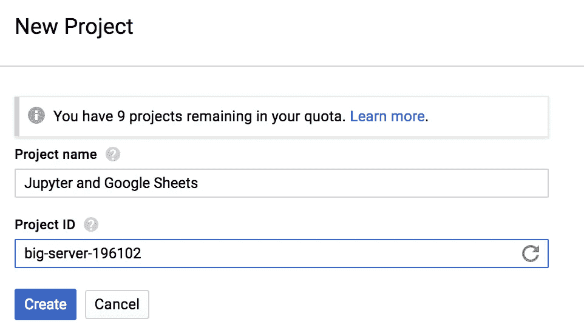

输入一个项目名称——我只为我所有的笔记本使用一个项目，而不是为每个项目创建一个新项目，所以我将我的项目命名为“Jupyter 和 Google Sheets”。如果愿意，您还可以重命名项目 ID。

点击**创建**。

## 启用 Google Drive API

创建项目后，Google 会带你回到开发者控制台。我必须刷新页面才能看到我的新项目。单击您的新项目。

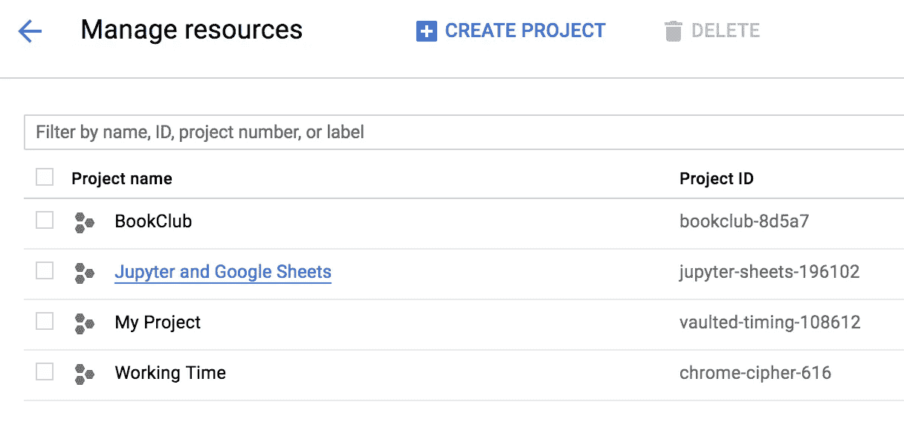

点击左侧的汉堡菜单，进入 API & Services 仪表盘，选择**API&Services**>**仪表盘**。

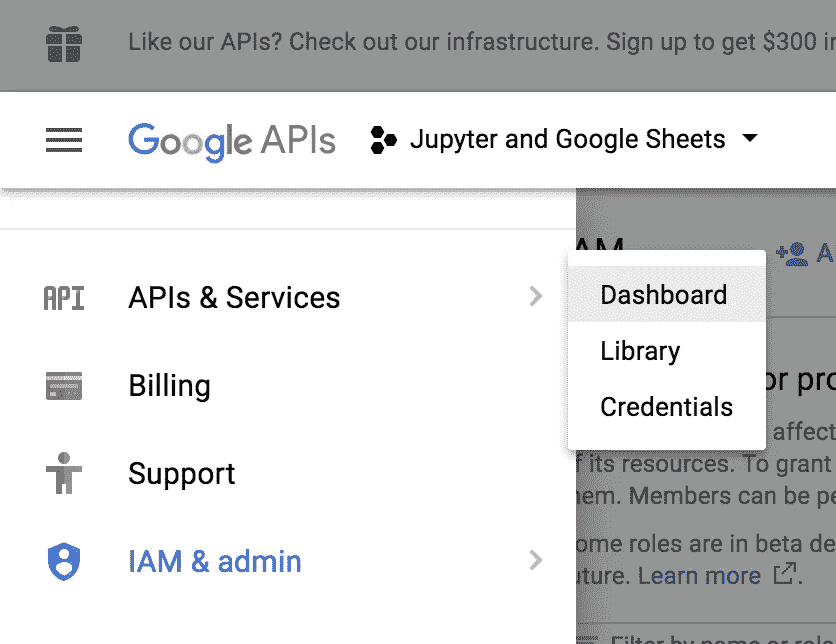

点击 **Google Drive API** 。

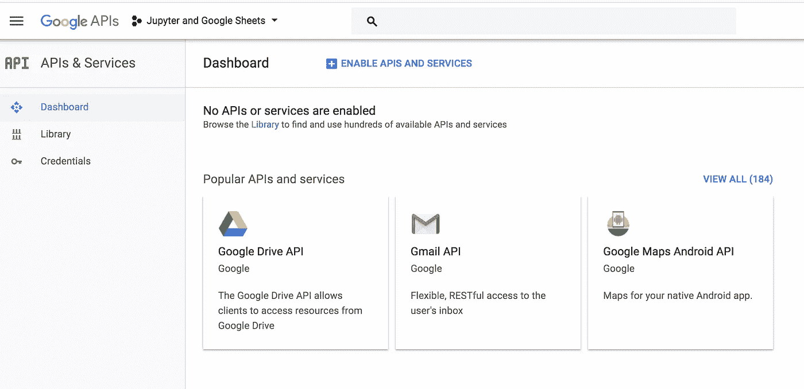

点击**启用**。

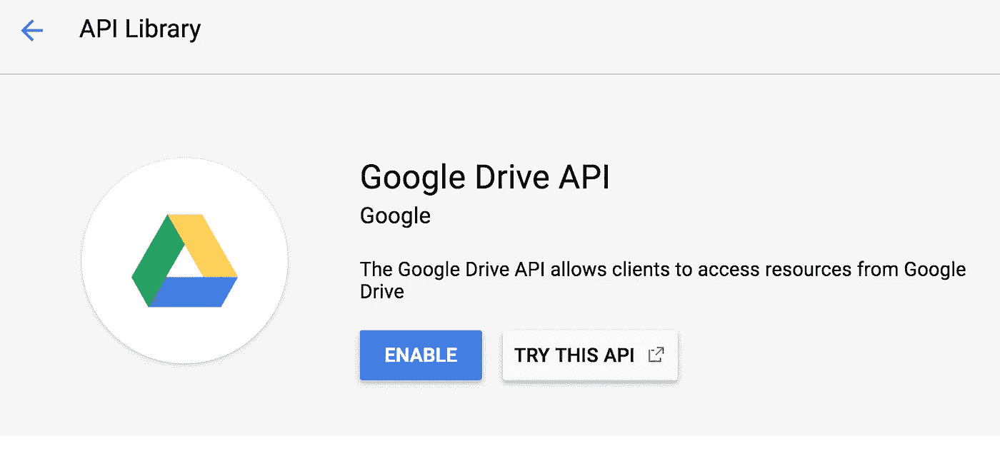

好吧。现在我们已经创建了我们的 Google Drive 项目。让我们获得使用它的凭证。

## 创建凭据以使用 Google Drive API

启用 Google Drive API 后，Google 应该会带您进入项目的 Google Drive API 控制台。

点击**创建凭证**。

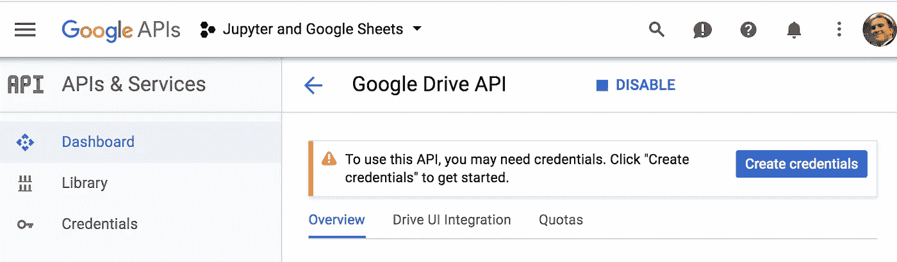

选择**其他用户界面**中的“您将从哪里调用 API？”。


选择**用户数据**用于“您将访问哪些数据？”然后点击**我需要什么凭证？**。


输入名称并点击**创建客户端 ID** 。


选择您的电子邮件地址，输入产品名称，然后单击**继续**。

下载您的凭证，并将其保存到您打算创建 Jupyter 笔记本的文件夹中。

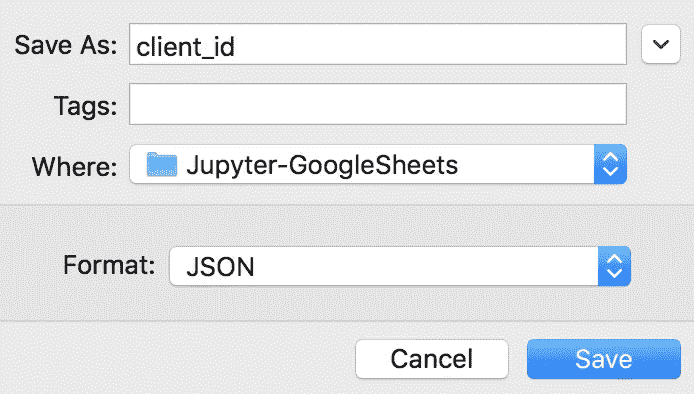

## 创建服务帐户凭据

设置凭据的最后一步是创建服务帐户凭据，这样我们就可以将我们的客户端(我们刚刚创建的)连接到我们实际的个人 Google Drive。

返回凭证仪表板，创建一个**服务帐户密钥**。

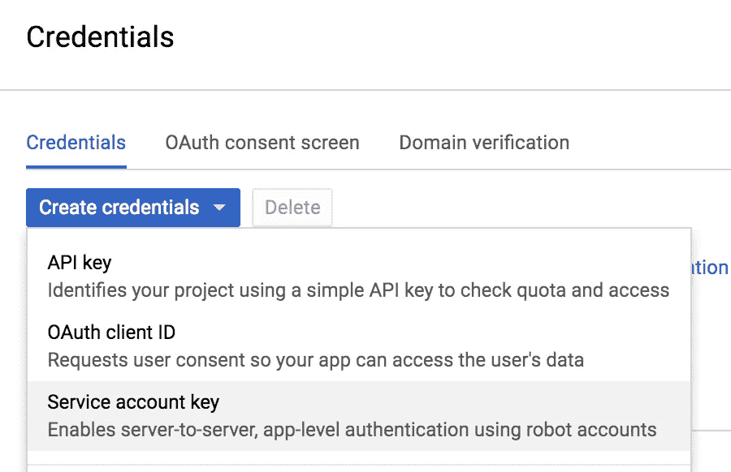

选择**新建服务账户**，将服务账户名称设置为 **Google Sheets** ，将角色设置为**服务账户用户**，将密钥类型保留为 **JSON** ，点击**创建**。

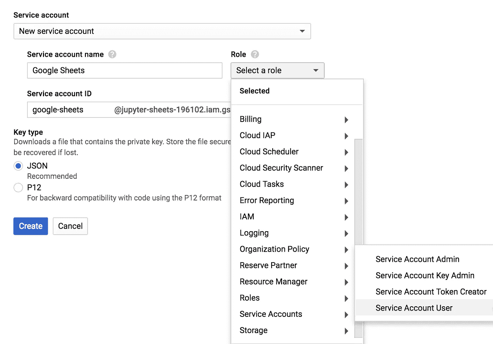

将 JSON 文件保存到您打算创建 Jupyter 笔记本的文件夹中(确保文件名中没有像这样的空格)。

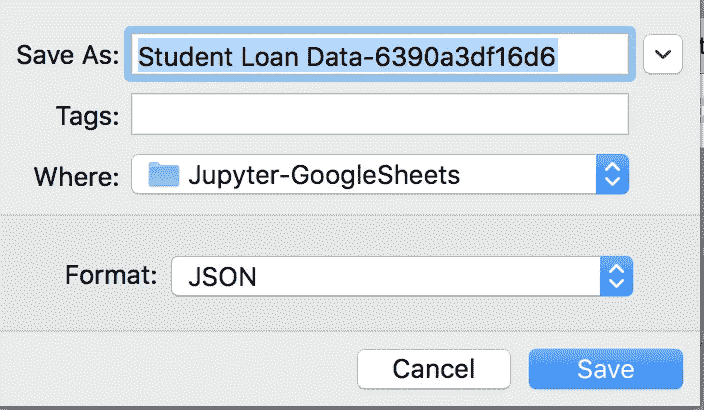

好吧。咻。我们有我们的谷歌开发人员证书，有权访问我们的谷歌驱动器，因此谷歌表。

# 第二部分—将 Jupyter 连接到 Google Sheets

现在让我们将 Jupyter 笔记本连接到 Google Sheet。

## 使用 conda install 和 pip 安装所需的软件包。

```
conda install pandas jupyter pip install gspread oauth2client df2gspread
```

上面所有的工作你只需要做一次。从现在开始，将数据从 Google Sheet 放入 Jupyter 笔记本变得很容易，反之亦然。

首先，你需要一张谷歌表。这可以是任何工作表。我们将使用我的[美国首席执行官](http://www.countingcalculi.com/features/does_presidential_experience_matters/?utm_source=JupyterSheets)文章中的[候选人得分数据](https://docs.google.com/spreadsheets/d/1f0OwtmuTk1fTdhnn4tuvVcPCZjdb00D79dWw4RFhYs0/edit?usp=sharing)。

要允许您的 Jupyter 笔记本访问 Google 表单，您需要与您在第一部分中创建的 Google 开发者凭证共享该表单。为此，请在 Jupyter 或文本编辑器中打开服务帐户凭据文件。

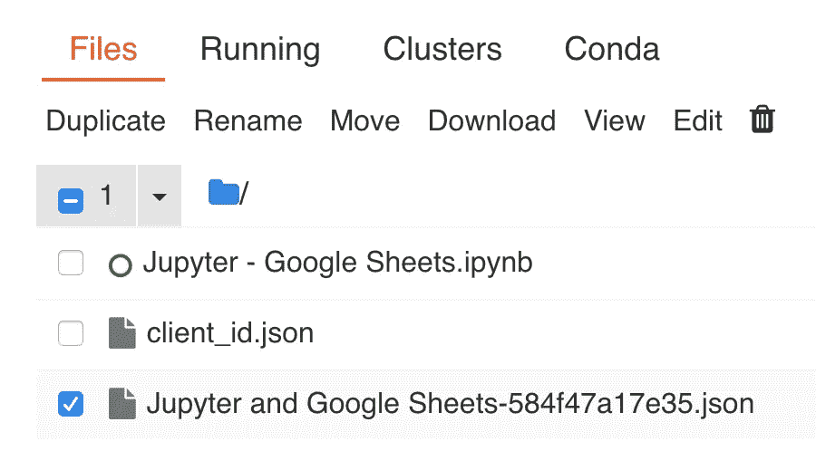

复制 client_email 属性。


回到你的谷歌表单，点击**分享**。

将 client_email 粘贴到人物框中，点击**发送**。

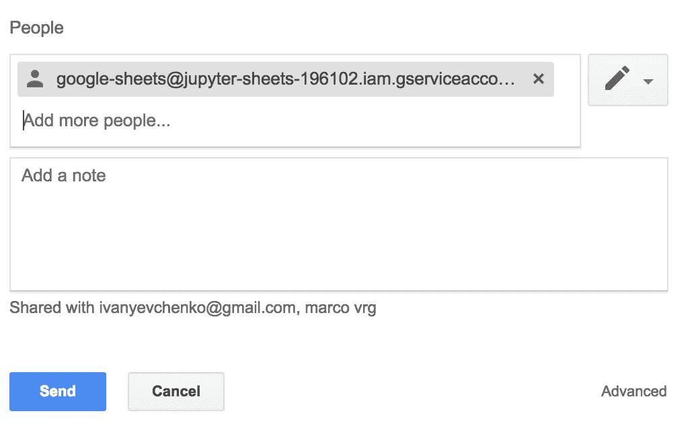

您需要对任何想要放入 Jupyter 笔记本的工作表重复上述步骤。

## 将谷歌工作表数据放入 Jupyter 笔记本

打开或创建 Jupyter 笔记本。我的笔记本的完整版本可以在这里[找到](https://github.com/kmclaugh/Jupyter-GoogleSheets/blob/master/Jupyter%20-%20Google%20Sheets.ipynb)。

## 导入库

```
import pandas as pd import gspread from oauth2client.service_account import ServiceAccountCredentials
```

## 连接到您的服务帐户

```
scope = ['https://spreadsheets.google.com/feeds'] credentials = ServiceAccountCredentials.from_json_keyfile_name('./<YOUR CREDENTIALS FILENAME>.json', scope) gc = gspread.authorize(credentials)
```

## 将谷歌电子表格中的数据导入 Jupyter

在电子表格的 url 中找到您想要导入的电子表格的 *Google Sheet key* ，如下所示。

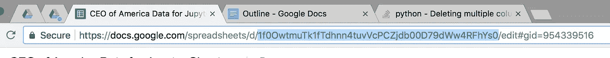

复制密钥并将其粘贴到以下代码中。

```
spreadsheet_key = '1f0OwtmuTk1fTdhnn4tuvVcPCZjdb00D79dWw4RFhYs0' book = gc.open_by_key(spreadsheet_key) worksheet = book.worksheet("Candidate Data") table = worksheet.get_all_values()
```

输入要导入到上述代码中的工作表的名称。

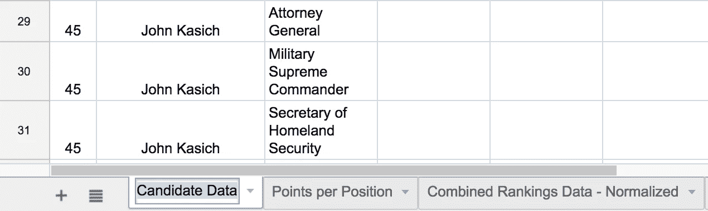

如果您运行代码，您会看到*表*变量现在有了来自 Google 工作表的行，如下所示。

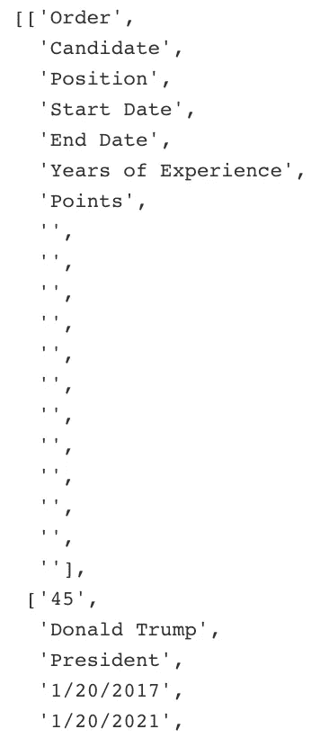

## 将工作表数据转换成熊猫数据框架

现在我们已经在 Jupyter 笔记本中有了工作表数据，我们想要将包含在*表*变量中的数据转换成一个干净的 pandas 数据框架，以便于操作。

```
##Convert table data into a dataframe df = pd.DataFrame(table[1:], columns=table[0]) ##Only keep columns we need df = df[['Order', 'Candidate', 'Position', 'Start Date', 'End Date', 'Years of Experience', 'Points']] ##Convert number strings to floats and ints df = df.apply(pd.to_numeric, errors='ignore') ##Convert date strings to datetime format df['End Date'] = pd.to_datetime(df['End Date'],infer_datetime_format=True) df['Start Date'] = pd.to_datetime(df['Start Date'],infer_datetime_format=True) df.head()
```

还有瓦拉！你已经将你的谷歌表单数据转换成了一个漂亮、干净的熊猫数据框架。如果您更改了工作表中的数据，并希望更新数据框架，只需重新运行以下所有代码:

```
book = gc.open_by_key(spreadsheet_key)
```

前进。

## 从 Jupyter 笔记本推送到 Google Sheet

我们还可以将 Jupyter 笔记本中的数据发送回 Google Sheet。

首先，让我们处理数据。数据帧的 groupby 功能很难在一个工作表中复制，所以我们就这么做吧。

```
candidate_groups = df.groupby('Candidate') scores_df = candidate_groups.sum() scores_df['Order'] = candidate_groups.first() scores_df.head()
```

这将创建一个新的分数数据框架，如下所示…

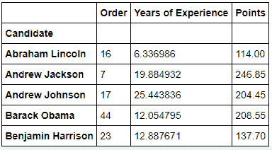

要将这些数据输出到名为“Jupyter Manipulated Data”的工作表下的同一个 Google 工作表中，只需运行以下代码。

```
from df2gspread import df2gspread as d2g wks_name = 'Jupyter Manipulated Data' d2g.upload(scores_df, spreadsheet_key, wks_name, credentials=credentials, row_names=True)
```

然后嘣。谷歌表用我们的 Jupyter 数据更新…

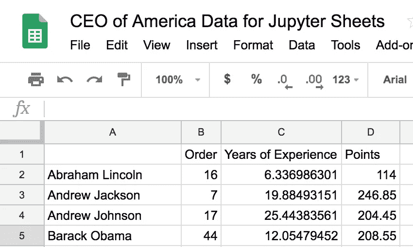

现在，在 Google Sheets 和 Jupyter notebook 之间来回推送数据简直易如反掌。我每天都在使用它，并不断为它寻找新的功能和工作流程。我希望你会和我一样觉得它很有用。

获取更多科技小技巧， [*订阅我的简讯*](https://slideruletech.com/subscribe/tech-tips/?mcsul=https://towardsdatascience.com/how-to-integrate-google-sheets-and-jupyter-notebooks-c469309aacea&) *！*

*原载于*[*www.countingcalculi.com*](http://www.countingcalculi.com/explanations/google_sheets_and_jupyter_notebooks/)*。*