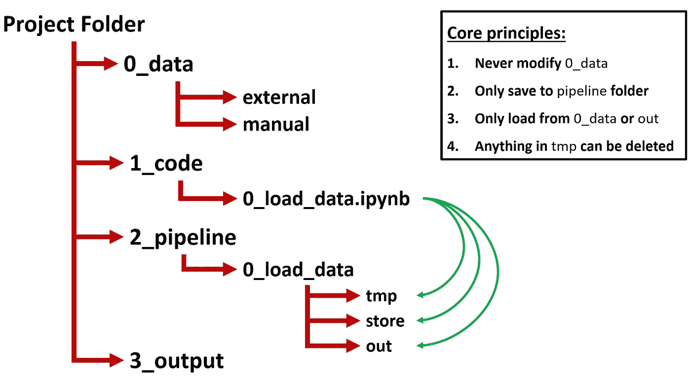
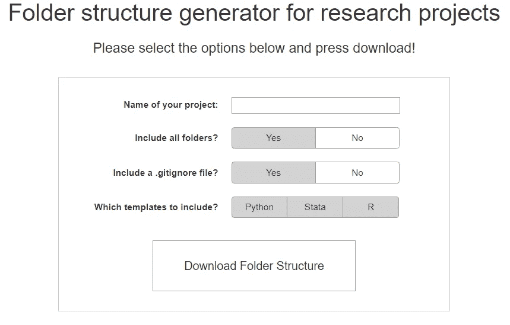
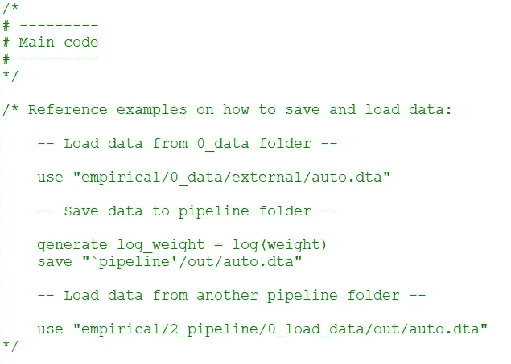

# 如何组织你的研究项目:文件夹结构

> 原文：<https://towardsdatascience.com/how-to-keep-your-research-projects-organized-part-1-folder-structure-10bd56034d3a?source=collection_archive---------2----------------------->

## 一个文件夹结构，带有在线工具，让你的研究项目有条不紊。

所有的研究人员都知道以一种清晰而有条理的方式发表论文的重要性。然而，对于我们在研究项目的后端(即代码和数据层)组织和维护代码和数据的方式，情况往往就不一样了。项目的这一部分通常是不可见的，当截止日期临近时，保持项目有序的良好意图往往是最先飞出窗外的事情之一。虽然可以理解，但我认为这是一个有很大改进空间的领域。我们花了大部分时间与项目的这一部分互动，如果我们保持它的整洁和有组织性，我们可以节省很多时间和挫折！

在这一系列文章中，我将描述和分享一些我多年来复制、改编和开发的最佳实践，以保持我的研究和编码项目有条理。诚然，我没有比任何人更多的资格来谈论这个话题。然而，我认为缺少面向易于使用和实现，同时仍然有效地保持事物有序的最佳实践。因此，本系列文章旨在为这种最佳实践提供一个起点。我希望这是一个社区驱动的努力，所以如果你有额外的提示或建议，请通过评论或给我发电子邮件来分享，以便我可以整合和添加它们！

**第一部分:文件夹结构**

我想开始的第一个主题是文件和文件夹的组织。从正确的文件夹结构开始项目，甚至在编写第一行代码之前，可以提供一种简单且相对不引人注目的方式来保持有序。Matthew Gentzkow 和 Jesse Shapiro 的指南是一个很好的起点，该指南名为“[社会科学的代码和数据:从业者指南](https://web.stanford.edu/~gentzkow/research/CodeAndData.pdf)”。它们描述了各种核心“规则”，值得一读。然而，他们的实际建议，至少对我来说，从来没有真正解决过我的组织问题。但这是一个很好的起点！基于他们的基本原则，我开发了一个适应版本的目录结构，它更加全面，同时仍然保持直观和易于使用。下图用图形表示了这一点:

这种文件夹结构背后的主要思想是，您有一个顶层项目文件夹，它包含 4 个子文件夹:*0 _ 数据*、*1 _ 代码*、*2 _ 管道*和*3 _ 输出*。我将在下面更详细地描述每个文件夹:

> **0_data** 包含从外部来源检索或手动创建的所有输入数据。例如，这包括从数据库(如 Compustat)下载的数据，但也包括包含您手动分类的数据的 Excel 表。这里的核心原则是该文件夹中的任何内容都不应该被修改。此文件夹中的数据应该与您检索或手动创建的方式保持一致。
> 
> **1_code** 包含你所有的代码文件。这包括例如 Python、Stata、R 或 SAS(或其组合)的代码文件。此外，我建议以数字开头来命名代码文件，以表示执行的顺序。这使得文件应该以什么样的顺序执行变得显而易见(您还可以在. bat /中进一步形式化)。sh 文件，如果你想的话)。
> 
> **2_pipeline** 为 *1_code* 文件夹中包含的每个代码文件包含一个单独的子文件夹，它们根据名称(减去文件扩展名)进行对应。这意味着，例如， *1_code* 中的代码文件“0_load_data.ipynb”将在 *2_pipeline* 文件夹中有一个名为“0_load_data”的子文件夹。主要思想是，由代码文件生成的所有输出最终都在它们对应的管道文件夹中。这使得理解数据如何在代码文件之间流动变得非常容易，因为数据位置指示了它是在哪里生成的。为了进一步组织生成的输出，我建议在每个子文件夹中包含以下文件夹: **out** 、 **store** 和 **tmp** 。
> 
> **2_pipeline - > *子文件夹* - > out** 包含您保存的文件，以便在将来的代码文件中加载它们。这些通常是当前代码文件的“最终产品”。
> 
> **2_pipeline - > *子文件夹* - > store** 包含您保存的打算加载到当前代码文件中的文件。例如，在需要一段时间来运行部分代码的情况下，可以使用这种方法，以避免每次需要间歇地将生成数据的进度保存到 *store* 文件夹时都必须重新运行这些部分。
> 
> **2_pipeline - > *子文件夹* - > tmp** 包含您出于检查目的或其他临时原因而保存的文件。基本原则是你不必担心 *tmp* 文件夹中的任何东西会被删除，因为它只是一个临时的目的。
> 
> **3_output** 包含任何要进入纸张的最终输出文件。这包括表格和图表等文件。

还有几个额外的原则值得一提:

*   您应该只从 *0_data* 文件夹或 *2_pipeline* 子文件夹中的 *out* 文件夹中加载数据。
*   您应该只从属于代码文件的 *out* 文件夹中加载数据，这些代码文件在您正在处理的当前代码文件之前执行。例如，当您在代码文件“ *2_process_data* ”中工作时，千万不要从“ *5_run_analysis* ”的 *out* 文件夹中加载数据。这是为了保证代码文件能够按顺序执行。
*   务必将工作目录设置为顶级项目文件夹。这使您能够使用相对路径来引用各种文件夹，从而使整个项目文件夹可移植。换句话说，使用相对路径，您可以将项目文件夹复制到另一台计算机，只要工作目录设置为顶级项目文件夹，所有代码都将正常工作。
*   我通常会将 *0_data* 、 *1_code* 、 *2_pipeline* 、 *3_data* 文件夹放在一个名为“experimental”的父文件夹中，并创建其他几个父文件夹，如:“administrative”、“explorative”和“paper”。通过这种方式，我也可以把我所有的其他文件，比如那些写论文的文件，组织好。

如果遵循这种文件夹结构，任何人都应该能够很容易地分辨出原始数据是什么，代码应该如何执行，以及数据如何在不同的代码文件之间流动。这不仅对试图使用或复制您的代码的其他人有益，而且当您在一段时间没有使用代码之后需要与代码进行交互时，这也是一个巨大的时间节省器。

**但是等等，还有！**

正如我前面提到的，从研究项目一开始就使用这样的文件夹结构是很重要的。然而，我完全理解，在热情地开始一个新的研究项目的过程中，不得不处理所有这些文件夹的创建是不太吸引人的。幸运的是，我为这个问题创建了一个解决方案！使用我的在线工具，在选择一些基本选项后，您可以简单地下载一个 zip 文件，其中已经为您设置了整个目录结构。只需将该文件夹解压缩到所需的位置，就可以开始了！

[https://www.tiesdekok.com/folder-structure-generator/](https://www.tiesdekok.com/folder-structure-generator/)

我还包含了 Python 的入门模板(都是。py 文件和笔记本)、Stata 和 R 代码，用于将工作目录更改为项目文件夹并创建管道文件夹。你所需要做的就是将你需要的模板文件复制到 *1_code* 文件夹中，并将其重命名为你想要对该文件执行的任何操作。然后，如果您在代码文件中修改 NAME 参数(如果您使用 Stata / R 还有 PROJECT_DIR 参数)并运行代码，它将自动检查相应的管道文件夹是否存在，如果不存在，则为您生成它。它还提供了一个特定于该代码文件夹的“管道”变量，以便您在保存文件时可以轻松地引用它。每个模板文件还包含如何加载和保存数据的参考示例，例如:

我希望这是一个有趣的阅读，如果你有意见，评论，或建议，请让我知道评论下面或给我发电子邮件！