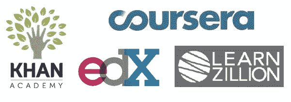
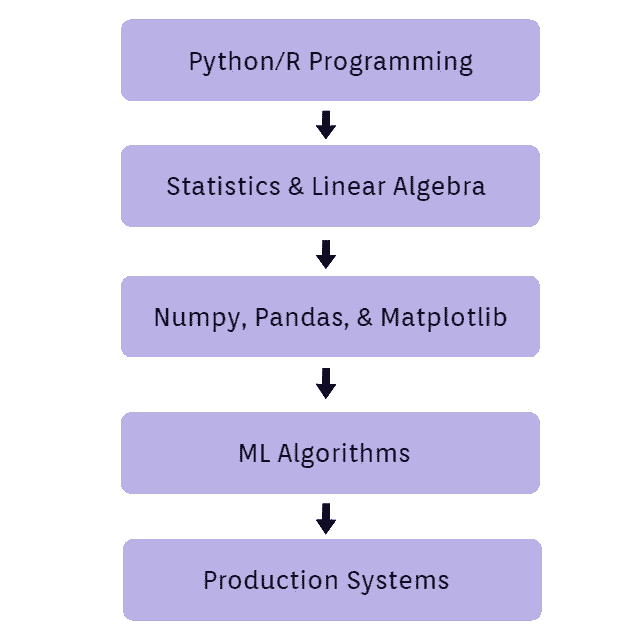
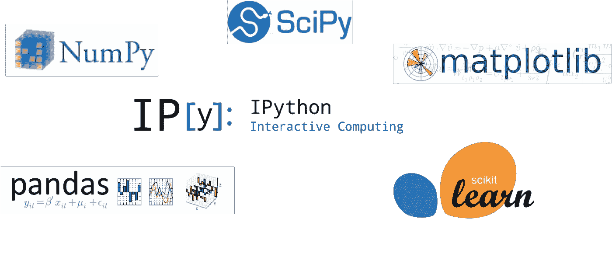
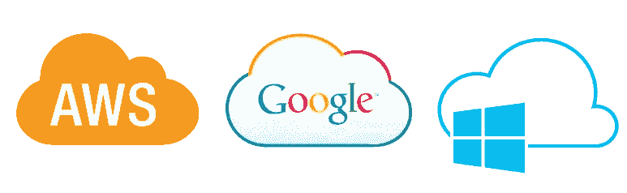
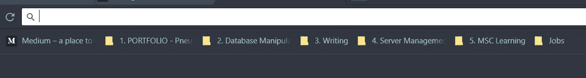
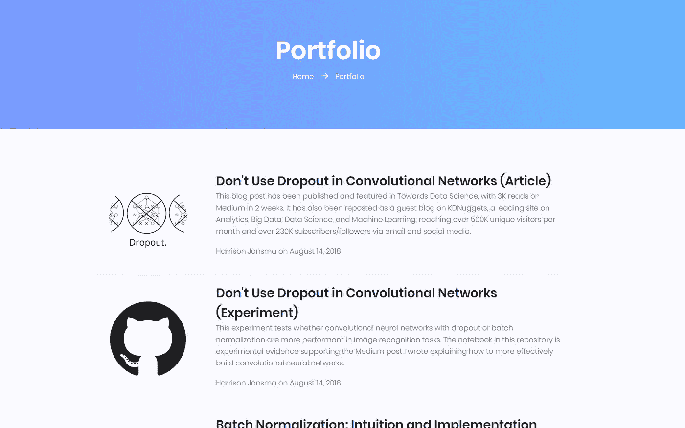

# 如果你破产了，如何学习数据科学

> 原文：<https://towardsdatascience.com/how-to-learn-data-science-if-youre-broke-7ecc408b53c7?source=collection_archive---------1----------------------->

去年，我自学了数据科学。我从数百个网上资源中学习，每天学习 6-8 个小时。同时在一家托儿所拿最低工资。

我的目标是开始一项我热爱的事业，尽管我缺乏资金。

因为这个选择，我在过去的几个月里完成了很多。我发布了我自己的[网站](https://harrisonjansma.com)，发表在一个主要的在线数据科学[出版物](https://www.kdnuggets.com/2018/09/dropout-convolutional-networks.html)上，并获得了一个竞争性计算机科学研究生项目[的奖学金](https://cs.utdallas.edu/)。

在下面的文章中，我给出了指导方针和建议，以便您可以制定自己的数据科学课程。我希望给别人工具，让他们开始自己的教育之旅。因此，他们可以开始在数据科学领域从事更有激情的职业。

## 快速笔记

当我说“数据科学”时，我指的是将数据转化为现实世界行动的工具集合。这些包括机器学习、数据库技术、统计学、编程和特定领域技术。

# 开始你的旅程的一些资源。

互联网是一个混乱的烂摊子。从中学习常常感觉像从消防水管的有趣一端喝水。

[source](https://unsplash.com/@darwiiiin?utm_source=medium&utm_medium=referral)

有更简单的替代方法可以帮你整理混乱的局面。

像 [Dataquest](https://www.dataquest.io/subscribe) 、 [DataCamp](https://www.datacamp.com/pricing) 和 [Udacity](https://www.class-central.com/pricing-charts/udacity-nanodegrees) 这样的网站都可以教你数据科学技能。每个人都创建了一个教育计划，引导你从一个话题到另一个话题。每一个都不需要你做什么课程规划。

问题？它们花费太多，它们没有教你如何在工作环境中应用概念，它们阻止你探索自己的兴趣和激情。

还有一些免费的选择，比如 edX 和 coursera，它们提供深入特定主题的一次性课程。如果你从视频或课堂环境中学得很好，这些都是学习数据科学的绝佳方式。

Free Online Education Platforms

查看此[网站](https://www.class-central.com/subject/data-science)，获取可用的数据科学课程列表。你也可以使用一些免费的课程。查看[大卫·文丘里](https://medium.com/@davidventuri/i-dropped-out-of-school-to-create-my-own-data-science-master-s-here-s-my-curriculum-1b400dcee412)的帖子，或者[开源 DS Masters](http://datasciencemasters.org/) (一个更传统的教育计划)。

如果你读书学得好，就看看[数据科学从零开始](http://shop.oreilly.com/product/0636920033400.do)这本书。这本教材是一个完整的学习计划，可以用在线资源补充。你可以在网上找到这本书的全文，或者从亚马逊网站(27 美元)得到一本纸质书。

**这些只是为数据科学提供详细学习途径的免费资源中的一部分。还有很多。**

为了更好地理解你在教育之旅中需要获得的技能，在下一节中，我将详细介绍一个更广泛的课程指南。这是高层次的，而不仅仅是一个课程或书籍的清单。

# 课程指南

Data Science Curriculum Guideline

## **Python 编程**

编程是数据科学家的一项基本技能。熟悉 Python 的语法。了解如何以多种不同方式运行 python 程序。(Jupyter 笔记本 vs 命令行 vs IDE)

我花了大约一个月的时间复习了 [Python 文档](https://docs.python.org/3/tutorial/)、[Python 搭便车指南](https://docs.python-guide.org/intro/learning/)，以及 [CodeSignal](https://codesignal.com/) 上的编码挑战。

提示:留心程序员常用的解决问题的技巧。(读作“算法”)

## **统计学&线性代数**

机器学习和数据分析的先决条件。如果你已经有了一个坚实的理解，花一两周时间温习关键概念。

特别关注描述性统计数据。能够理解一个数据集是一项价值连城的技能。

## **Numpy，熊猫，& Matplotlib**

了解如何加载、操作和可视化数据。掌握这些库对你的个人项目至关重要。

快速提示:不要觉得你必须记住每一个方法或函数的名字，这需要练习。如果你忘记了，谷歌一下。

查看[熊猫文档](http://pandas.pydata.org/pandas-docs/stable/)、 [Numpy 文档](https://docs.scipy.org/doc/numpy/user/index.html)和 [Matplotlib 教程](https://matplotlib.org/tutorials/index.html)。有更好的资源，但这些是我用的。

记住，你学习这些库的唯一方法就是使用它们！

## **机器学习**

学习机器学习算法的理论和应用。然后将您学到的概念应用到您关心的真实世界的数据中。

大多数初学者从使用来自 UCI ML 知识库的玩具数据集开始。摆弄数据，浏览指导式 ML 教程。

Scikit-learn 文档中有关于常用算法应用的优秀教程。我还发现这个[播客](http://ocdevel.com/mlg)是 ML 理论背后的一个伟大的(免费的)教育资源。你可以在上下班的路上或者健身的时候听。

## **生产系统**

获得一份工作意味着能够获得真实世界的数据并将其转化为行动。

要做到这一点，你需要学习如何使用企业的计算资源来获取、转换和处理数据。

Amazon Web Services, Google Cloud, Microsoft Azure

这是数据科学课程中教授最少的部分。主要是因为你使用的具体工具取决于你要从事的行业。

然而，数据库操作是一项必需的技能。你可以在 [ModeAnalytics](https://modeanalytics.com/) 或 [Codecademy](https://www.codecademy.com) 上学习如何用代码操作数据库。你也可以(便宜地)在 [DigitalOcean](https://www.digitalocean.com/) 上实现自己的数据库。

**另一个(经常)需要的技能是** [**版本控制**](https://git-scm.com/book/en/v2/Getting-Started-About-Version-Control) **。**你可以通过创建一个 [GitHub](https://github.com/) 账户并使用命令行每天提交你的代码来轻松获得这项技能。

当考虑学习其他什么技术时，重要的是要考虑你的兴趣和激情。例如，如果你对 web 开发感兴趣，那么就去看看这个行业的公司所使用的工具。

# 执行课程的建议。

by [Ugur Akdemir](https://unsplash.com/@ugur?utm_source=medium&utm_medium=referral) on [Unsplash](https://unsplash.com?utm_source=medium&utm_medium=referral)

# 1.概念会比你学习的速度更快。

有成千上万的网页和论坛解释常用数据科学工具的使用。正因为如此，在网上学习时很容易偏离主题。

当你开始研究一个课题时，你需要牢记你的目标。如果你不这样做，你就有被任何吸引你眼球的链接所吸引的风险。

解决方案，**获得一个好的存储系统来保存有趣的网络资源**。这样你就可以把材料留到以后，然后把注意力集中在与你当前相关的话题上。

My current Chrome Bookmarks Bar

如果你做对了，你就可以制定一个有序的学习路径，告诉你应该关注什么。你也会学得更快，避免分心。

警告，**随着你探索自己感兴趣的新话题，你的阅读清单将很快增长到数百个。别担心，这引出了我的第二条建议。**

# 2.不要有压力。这是一场马拉松，不是短跑。

拥有一个自我驱动的教育经常感觉就像试图阅读一个永无止境的知识图书馆。

如果你想在数据科学领域取得成功，你需要将你的教育视为一个终生的过程。

只要记住，学习的过程就是它自己的回报。

**在你的教育之旅中，你将探索自己的兴趣，发现更多驱动你前进的动力**。你对自己了解得越多，你从学习中获得的乐趣就越多。

# 3.学习->应用->重复

不要满足于仅仅学习一个概念，然后再去做下一件事。学习的过程不会停止，直到你能把一个概念应用到现实世界中。

by [Allef Vinicius](https://unsplash.com/@seteales?utm_source=medium&utm_medium=referral) on [Unsplash](https://unsplash.com?utm_source=medium&utm_medium=referral)

不是每个概念都需要在你的投资组合中有一个专门的项目。但重要的是要脚踏实地，记住你正在学习，这样你才能对世界产生影响。

# 4.建立一个投资组合，这表明其他人可以信任你。

归根结底，**怀疑是你在学习数据科学时将面临的最大逆境之一。**

这可能来自别人，也可能来自[自己](https://en.wikipedia.org/wiki/Impostor_syndrome)。

你的作品集是你向世界展示你有能力并且对自己的技能有信心的方式。

因此，建立投资组合是你在学习数据科学时可以做的最重要的事情。一份好的投资组合可以让你找到一份工作，让你成为一名更自信的数据科学家。

在你的文件夹中装满你引以为豪的项目。

你是从零开始构建自己的 web 应用程序的吗？是自己做的 IMDB 数据库吗？你写过有趣的医疗保健数据分析吗？

把它放在你的文件夹里。

只要确保文章可读，代码被很好地记录，并且投资组合本身看起来不错。

[https://harrisonjansma.com/archive](https://harrisonjansma.com/archive)

这是我的作品集。发布您的作品集的一个更简单的方法是创建一个 GitHub 资源库，其中包含一个很棒的 ReadMe(摘要页面)以及相关的项目文件。

这是一个美观又简单的 [GitHub 文件夹](https://github.com/alexhuang1117/Data-Science-Portfolio)。对于更高级的投资组合，请查看 GitHub-IO 来托管您自己的免费网站。([举例](https://alexisbcook.github.io/#blog))

# 5.数据科学+ _______ =充满激情的职业

## 填空。

数据科学是一套旨在改变世界的工具。一些数据科学家构建计算机视觉系统来诊断医学图像，其他人遍历数十亿个数据条目来发现网站用户偏好的模式。

数据科学的应用是无穷无尽的，这就是为什么找到让你兴奋的应用是很重要的。

如果你找到了自己感兴趣的话题，你会更愿意投入工作去完成一个伟大的项目。这引出了本文中我最喜欢的一条建议。

当你在学习时，睁大眼睛寻找让你兴奋的项目或想法。

[Stefan Steinbauer](https://unsplash.com/@usinglight?utm_source=medium&utm_medium=referral) on [Unsplash](https://unsplash.com?utm_source=medium&utm_medium=referral)

一旦你花了时间学习，试着把这些点联系起来。找到让你着迷的项目之间的相似之处。然后花些时间研究从事这类项目的行业。

一旦你找到一个你热爱的行业，就把获得该行业所需的技能和专业技术作为你的目标。

如果你能做到这一点，你将会把你对学习的努力和奉献变成一份充满激情和成功的事业。

# 结论

如果你喜欢探索这个世界。如果你对人工智能着迷。那么无论你的情况如何，你都可以闯入数据科学行业。

这并不容易。

为了激励你自己的教育，你需要毅力和纪律。但是如果你是那种能推动自己进步的人，你完全有能力自己掌握这些技能。

毕竟，这就是作为一名数据科学家的意义所在。好奇心强，自我驱动，对寻找答案充满热情。

## **想要更多高质量的数据科学文章，关注我。👍**