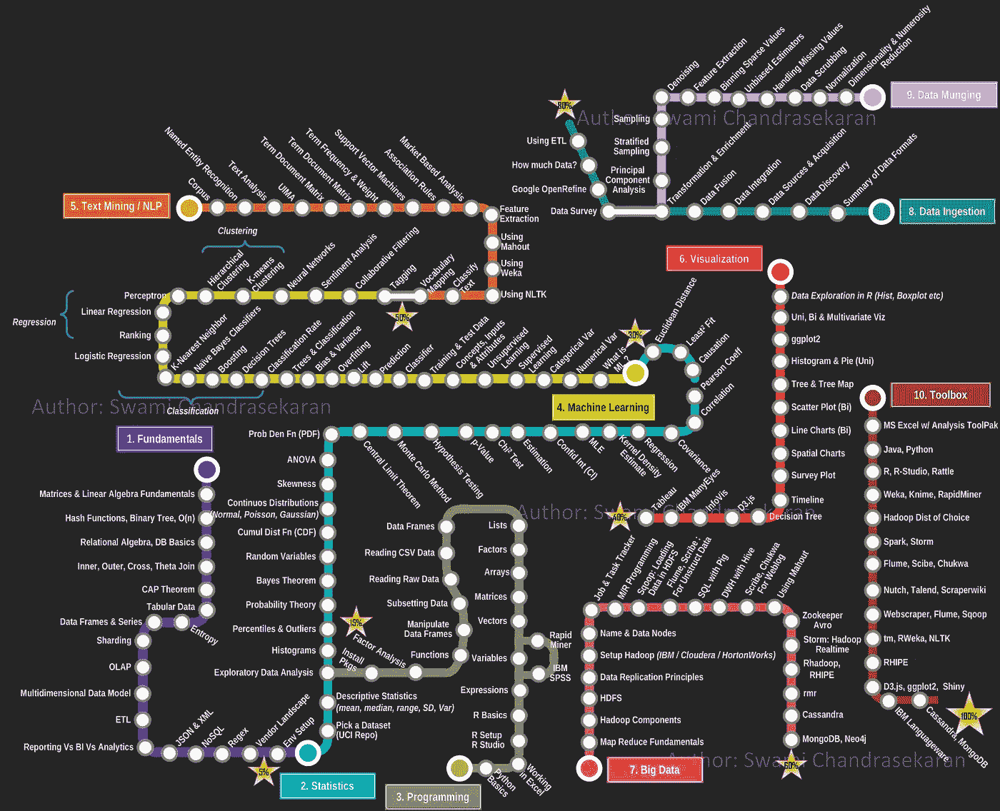

# 保持学习数据科学的动力。

> 原文：<https://towardsdatascience.com/how-to-learn-data-science-staying-motivated-8665ed649687?source=collection_archive---------5----------------------->

## 关于如何在你的教育之旅中保持一致的建议。

Photo by [Victoria Heath](https://unsplash.com/@vheath?utm_source=medium&utm_medium=referral) on [Unsplash](https://unsplash.com?utm_source=medium&utm_medium=referral)

在过去的几周里，我暂停了写作，专注于申请实习。但是当我今天开车去上课的时候，一个问题开始困扰我。

**互联网上有这么多可供我们使用的资源，为什么我们很难保持学习数据科学的动力呢？**

在过去的一年里，我不得不非常努力地保持学习数据科学的动力。我完全用(免费)网络资源制作了自己的课程，每天，不管我的动机如何，我都会留出至少四个小时来拓展我的技能。

这种追求祝福了我的人生，很多都是从奋斗中得来的。就在过去的六个月里，我建立了我的[投资组合网站](https://harrisonjansma.com)，并创建了一些非常惊人的数据科学项目([分析了 140 万个媒体故事](https://github.com/harrisonjansma/Analyzing_Medium/blob/master/Medium_EDA_expanded.ipynb))。

然而，去年也经历了非常艰难的日子。那些日子里，尽管我已经取得了很大的成就，但我仍在努力奋斗，几乎要放弃。

根据我的经验，无论你走哪条通往数据科学的道路，你都将面临可能会扼杀你动力的挑战。你会承担一些可能让你觉得自己渺小无力的任务，或者是在你耳边低语“这太难了。你应该放弃”。

但你不必一个人去。在这篇文章中，我将描述一些可能威胁你学习数据科学动机的陷阱。我希望通过意识到这些障碍，你在数据科学领域的职业道路会比我更容易。让我们开始吧。

# 在开始之前，确保数据科学是合适的。

Photo by [Glenn Carstens-Peters](https://unsplash.com/@glenncarstenspeters?utm_source=medium&utm_medium=referral) on [Unsplash](https://unsplash.com?utm_source=medium&utm_medium=referral)

数据科学是一份性感的工作。薪水很高，工作很有趣，头衔也带来了巨大的声望。因此，许多人想成为数据科学家。

不幸的是，即使你对数据科学充满热情，并且能把工作做得非常好，你也不能强迫自己热爱这个过程。这给有抱负的数据科学家带来了一些令人不安的建议。

**你可以对数据科学着迷，但如果你讨厌日复一日的任务和随之而来的感觉，那就很难保持你的动力**。

对于大多数刚开始学习的人来说，你可能需要几个月的时间才能真正进入教育的“实践”阶段。(在那里你实际上建立了全面的数据科学项目。)在这一点上，意识到你讨厌这个过程对你个人来说是一个沉重的打击。为了省去你的麻烦，我整理了一份数据科学家面临的一些常见挫折的清单。

如果你选择从事数据科学领域的职业，以下是你需要适应的一些任务和感受:

## 感受:

*   学不完的感觉。
*   力不从心/不知所措的感觉。
*   失败了很多很多次才获得一次成功的感觉。
*   那种你花了几周时间做的事情失败或被忽视的感觉。

## 任务:

*   **自学一门你一无所知的技能。**
*   花几十个小时来回答一个看似简单的问题。
*   将自己与(表面上)更成功的人进行比较。
*   与不了解(或不关心)数据科学的人交流。
*   做 95%准备，5%执行的工作。
*   做很多不“性感”的工作。(数据库工作、数据管理等)
*   编码…大量编码。

## 我的建议是:在你跳下去之前做好你的研究。

数据科学是一个令人敬畏的职业，但随之而来的肯定是一些严重的挫折。

对于有抱负的数据科学家，我鼓励你在投身数据科学事业之前，了解更多关于普通数据科学家所做的工具和任务的知识([本文](https://medium.com/@rchang/my-two-year-journey-as-a-data-scientist-at-twitter-f0c13298aee6)、[此视频](https://www.youtube.com/watch?v=8LucP1wiX1g))。

开始的时候，做一点点研究将会大大增加你完成教育之旅的机会。

# 学会如何应对焦虑。

当你开始研究如何成为一名数据科学家时，你会发现一个关于这个职业的不幸事实。也就是说，成为一名数据科学家需要广泛而深入的工具、技术和技能知识。所有这些都让成为数据科学家的前景变得非常可怕。

你可能会开始问这样的问题:我必须回学校拿个博士学位吗？没有工作经验的我如何获得这些技能？我有能力学会所有这些吗？

Photo by [Nathan Dumlao](https://unsplash.com/@nate_dumlao?utm_source=medium&utm_medium=referral) on [Unsplash](https://unsplash.com?utm_source=medium&utm_medium=referral)

**当你踏上通往数据科学的旅程时，你会感到很多焦虑和压力。这是完全正常的反应，每个处于你的处境的人都会有同样的感觉。**

要知道，在你教育旅程开始的这段时间对你的长期成功绝对至关重要。你在最初几周采取的行动将决定你为自己树立什么样的习惯，结果将决定你如何应对整个旅程中压力和焦虑的负面影响。

如果你能从一开始就找到应对压力和焦虑的健康方法，随着时间的推移，你的信心和动力将变得不可动摇。

然而，这里有一个需要解决的危险。在这段时间里，避免用不健康的方式应对负面压力是绝对重要的。

不幸的是，健康和不健康在很大程度上取决于你是谁。但在我自己的旅程中，我已经认识到一些不健康的应对机制，它们在过去损害了我的动力。

这里有一些你应该避免的处理压力的不健康方式。

## 避免不知所措:购买全包课程或教材。

这一次真的让我栽了大跟头。每当我开始对我需要学习的大量东西感到不知所措时，我就有一种强烈的冲动，想放弃自学，去购买别人的教案。

如果我最终真的买了包罗万象的课程或教材，学习就开始感觉像是别人交给我的苦差事。更糟糕的是，因为我没有努力去计划我需要学习什么，我变得和我为什么要学习一个特殊的技能或概念脱节了。结果呢？每当我购买在线课程时，我快速学习的动力就消失了。

**为什么要避免这种情况:**即使你可以从别人的课程中学到很多东西，我仍然建议不要这样做。为什么？因为在你迈向数据科学的旅程中，最重要的技能是能够自学。

自学是识别你的技能组合中的漏洞，研究新技术来缩小差距，并制定可行的计划来获得该技能的过程。如果你在旅途中仅仅依靠手把手的课程，你在这个过程中的经验会少得多。

随着时间的推移，这真的很糟糕。当你真正得到这份工作时，你可能会面临一个非常独特的、特定领域的、你几乎没有经验的问题。如果没有一个 MOOC 或教科书可以教你所需的技能，你将会非常艰难。

## 避免压力:推迟，或者指定一天来学习。

在旅程开始时，你可能犯的最大错误就是推迟学习。如果你觉得自己太忙也没关系，如果你想在旅途中获得成功，你需要每天留出时间来学习。

如果你不每天练习和学习，你的动力会很快消失，你将不可避免地对一个潜在的令人满意的职业失去兴趣。

**为什么要避免这些:**追求数据科学是一场马拉松，而不是短跑。这项工作所需的技能是如此的多样化，只有通过长时间的不懈努力才能获得。如果你试图在短时间内学习，你最终会耗尽你自己，熄灭你继续下去的动力。

更糟糕的是，如果你把学习推迟到你觉得有时间的时候，你可能永远也不会开始你的旅程。而且，如果你这样做了，你就会在你的头脑中形成这样一种观念:学习是你在时间允许的情况下做的事情。在数据科学中，这种心态是职业生涯的快速终结。

## 我的建议是:尽早养成健康的习惯。

无论你是全职工作，想做一个职业支点，还是正在读大学，想走一条让你兴奋的职业道路；无论哪种方式，你都需要找到让你克服压力的健康习惯。

**几个你可以从一开始就养成的健康习惯:**

*   每天留出时间学习新东西。
*   尝试加入数据科学社区。你会惊讶有多少人会认同你的焦虑感。
*   如果你因为学习而感到疲惫和焦虑，那就休息一段时间，用你最近学到的东西建立一个项目。这是一个减压的好方法，可以让你重新认识到你为什么要学习。

# 学会如何应对不知所措。

当你真正开始学习数据科学技能时，你会注意到有很多事情需要关注。此时此刻，我可能会列出未来 6 个月内我想获得的 8-12 项技能。

不幸的是，这不仅仅是我。在您迈向数据科学的旅程中，拥有一长串您想要学习或实践的技能将是每天的现实。只要看看 [Swami Chandrasekaran](http://nirvacana.com/thoughts/author/swamichandra/) 的数据科学路线图，你就会明白我在说什么。

[Swami Chandrasekaran](http://nirvacana.com/thoughts/author/swamichandra/)

当我第一次看到这个路线图时，我的直觉反应是被这个清单的庞大所淹没。一个人怎么可能指望自己学会所有这些？到目前为止，我所学到的只是列表中的一小部分，我真的取得了任何进步吗？

不幸的是，这种不知所措的感觉将伴随你走向数据科学的旅程。

有一天，你可能会觉得你已经掌握了一个概念/技能，只是意识到有五个新的东西需要添加到你的学习清单中。随着时间的推移，随着你需要学习的技术变得更新更复杂，这个问题只会变得更糟。

如果你没有想出一个计划来处理这种不知所措的感觉，有两件事会发生在你身上。

首先，你会开始对你需要掌握的技能的广度感到非常焦虑。如果这种感觉继续恶化，你会发现越来越难专注于一件事。结果，你可能会花几个月的时间在技能之间摇摆不定，拼命想一次学会所有技能，最后当你没有掌握任何一项技能时，你会感到沮丧。

第二，你会开始因为你需要学习的技能数量而感到压力。这样下去，你学习的动力就岌岌可危了。过去的每一天都会让你更加沮丧，因为你会将已经取得的进步与尚未完成的艰巨任务进行比较。在某些时候，你会开始相信你迄今为止取得的任何进展都是毫无价值的，成为一名数据科学家的任务是不可能的。

如果允许这两种感觉中的任何一种在你的头脑中增加重量，它们将慢慢粉碎你学习数据科学的动力。但是不要担心，这些负担可以通过深思熟虑的计划和战略重点在早期得到解决。

## 我的建议是:保持条理，保持短视。

数据科学本质上是一个广阔的领域，掌握如此多样的技能的唯一方法是一点一点地学习，一次学习一项技能。不管你选择如何从事数据科学，你都需要制定某种线性的、有组织的学习计划。这将有助于您通过一次专注于一项技能来应对数据科学技能集的广度。

如果你想建立自己的课程，你可以选择像 Swami 那样建立一个端到端的路线图。然而，你可能会开始对清单的深度感到不知所措。

这就是有点近视真正有帮助的地方。

根据我的经验，处理不知所措的感觉的最好方法是设定短期目标，将你的注意力集中在最重要的技能上。我的原则是，在任何时候，我都应该有一个清单，上面列有我下个月应该掌握的三项最重要的技能。

整个月我的注意力都集中在学习这三项技能上，我取得的任何进步都让人觉得非常充实和值得。当我觉得自己在进步时，激励自己每天学习就变得容易多了。在月末，我会重新评估我的技能，并尝试确定我应该关注的三个更有价值的技能。

如果你想自己做这件事，只需做以下几件事。问问你自己，“根据我现在所学的，接下来我需要的三个最重要的技能是什么？”把它们写下来，然后坚持到下一步去学习。

如果你想知道从哪里开始，或者你应该以什么顺序学习数据科学技能，请查看下面链接的我以前的帖子。在这个故事中，我给出了指导方针和建议，以便您可以执行自己的数据科学课程。

 [## 如果你破产了，如何学习数据科学

### 去年，我自学了数据科学。我从数百个在线资源中学习，学习了 6-8 个小时…

towardsdatascience.com](/how-to-learn-data-science-if-youre-broke-7ecc408b53c7) 

# 结论

归根结底，我们学习数据科学的动力是我们拥有的最宝贵的资源。如果我们要持续地掌握我们的手艺，我们需要保护我们的动机，使其免受威胁消灭它的挑战。

具体来说，我们需要对焦虑或不知所措的感觉保持警惕。这些负担可以通过健康的学习习惯以及有组织和有意识的专注来解决。

如果你可以保护和培养你学习数据科学的动机，那么没有什么可以阻挡你。你将拥有不可动摇的决心，推动你成为尽可能最好的数据科学家。

保持热情。保持动力。感谢阅读。

## 想要更多高质量的数据科学文章就关注我吧。👍