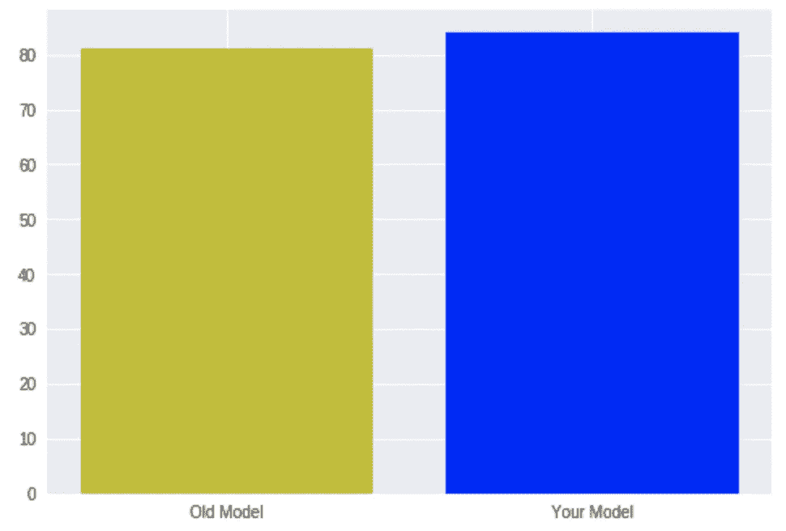
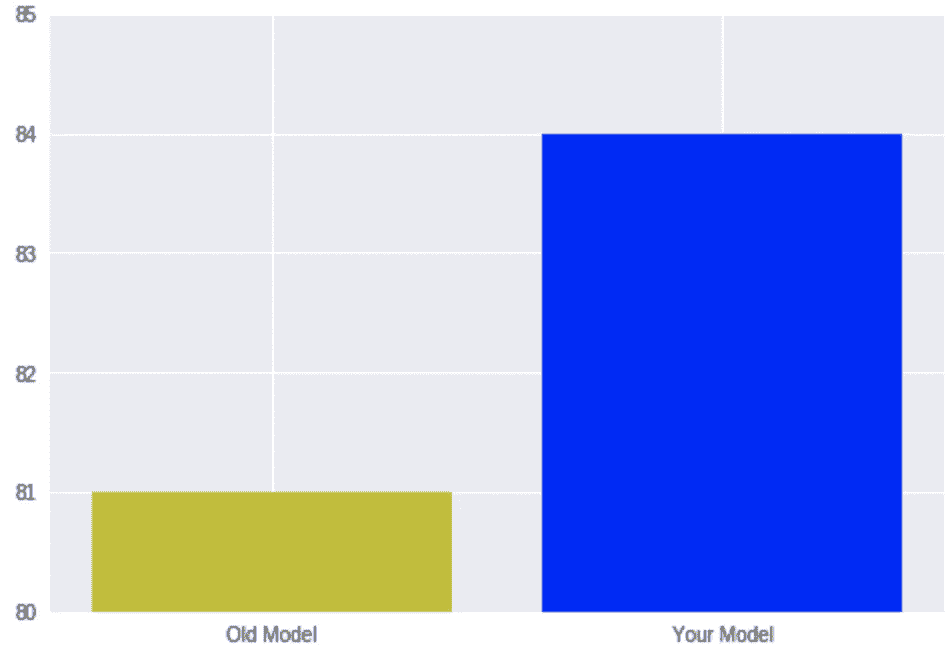
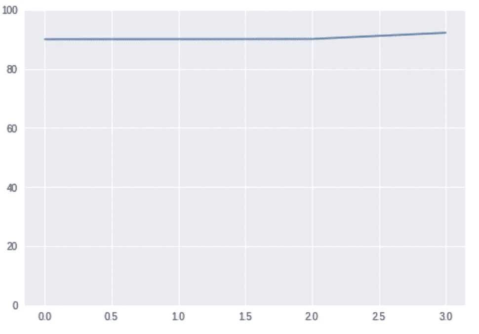
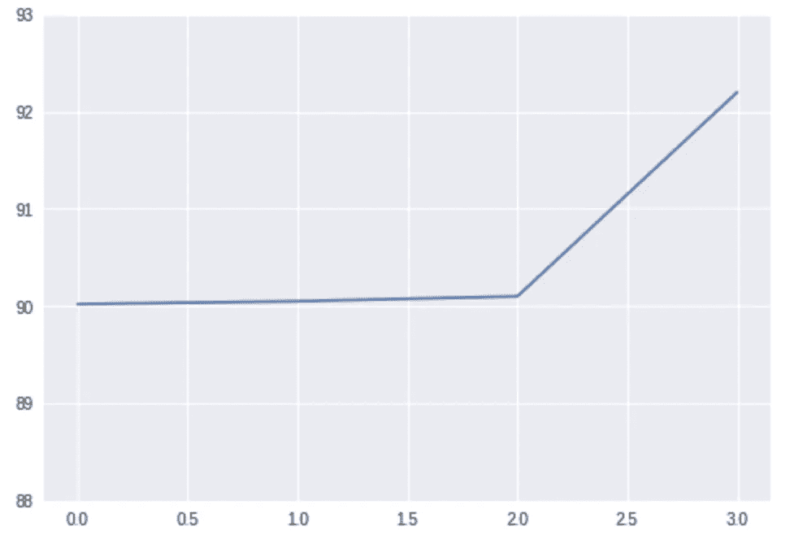

# 如何与数据科学撒谎

> 原文：<https://towardsdatascience.com/how-to-lie-with-data-science-5090f3891d9c?source=collection_archive---------6----------------------->


最近，我读了达雷尔·赫夫写的《如何用统计撒谎》一书。这本书谈到了如何利用统计数据让人们得出错误的结论。我发现这是一个令人兴奋的话题，我认为它与数据科学非常相关。这就是为什么我要把“数据科学”版书中的例子展示出来。其中一些是书中的，其他的是我看到的可能发生在现实生活数据科学中的例子。
这篇文章实际上并不是关于如何**用数据科学撒谎**。相反，它是关于我们如何可能因为没有对管道不同部分的细节给予足够的关注而被愚弄。

**图表**


把自己想象成某个公司的新数据科学家。这家公司已经有一个数据科学团队，他们建立一个模型来预测一些重要的事情。您是一位非常有才华的数据科学家，仅仅一个月后，您就能够将他们的模型准确性提高 3%。难以置信！你想向某人展示你的进步，所以你准备了这张图表:



现在，这看起来不错，但不是很令人印象深刻，你想留下深刻的印象，所以你能做什么(除了进一步改进你的模型)？为了更好地展示同样的数据，你需要做的只是稍微改变一下图表。你需要让它专注于改变。所有这些低于 80%或高于 85%的数字都没有“真正的”需求。所以它看起来像这样:



看起来你的模型比旧的要好四倍！当然，聪明的读者会明白到底发生了什么，但这个图表看起来令人印象深刻，许多人会记住这个巨大的差距，而不是确切的数字。

随着时间的推移，我们可以用过程做同样的事情。假设你和你的团队在研究某个模型，最近几周你有了突破，所以你的模型性能提高了 2%，非常好。看起来是这样的:



很难看出变化，实际数字是。同样，也许 2%是一个显著的进步，但在这张图表中，它看起来并不那么好。所以让我们像以前一样改变它:



同样，这些数字是相同的，但是这张图看起来比上一张好得多。

**测量值**


通常，初级数据科学家并没有足够重视使用什么度量标准来度量他们的模型性能。这可能会导致使用一些默认的、大多数时候是错误的度量标准。以准确性为例，在现实生活中(在大多数情况下)，这是一个非常糟糕的指标。这是因为现实生活中的大多数问题，数据都是不平衡的。考虑一个预测泰坦尼克号幸存者的模型，这是一个非常受欢迎的 Kaggle 教程。如果我告诉你我建立了一个 61%准确率的模型。好吃吗？很难说。我们没有任何可以与之比较的东西(稍后会详细介绍)。听起来还行。这可能比什么都没有好得多，对吗？让我展示一下我到底做了什么:

```
predicted = np.zeros(len(test_df))
print accuracy_score(predicted, test_df['Survived'])
```

没错，我所做的就是预测所有实例的“零”(或“否”)。我能得到这个准确率(61%)仅仅是因为活下来的人比没活下来的人少。还有更极端的情况，数据非常不平衡，在那些情况下，甚至 99%的准确率可能什么都不是。这种极端不平衡数据的一个例子是当我们想要正确地分类一些罕见的疾病时。如果只有 1%的人患有这种疾病，那么每次预测“不”，就会给我们 99%的准确率！

这不仅关系到准确性。当我们阅读一些研究/试验/论文的结果时(或者万一我们发表了我们的结果),我们需要确保所使用的度量标准适合它试图测量的问题。

关于测量，我们需要做的另一件重要的事情是了解结果的好坏。即使我们使用了正确的衡量标准，有时也很难知道它们的好坏。90%的精度对于一个问题来说可能是极好的，但对于其他问题来说则非常糟糕。这就是为什么一个好的实践是创建一个基准。创建一个非常简单的(甚至是随机的)模型，并将其与你/他人的结果进行比较。对于泰坦尼克号问题，我们已经知道，仅仅对每个人说“不”就会给我们 61%的准确率，所以当某个算法给我们 70%的时候，我们可以说这个算法贡献了一些东西，但很可能它可以做得更好。

**泄密**


我想谈谈我在数据科学历史中遇到的 3 种漏洞。特征工程/选择泄漏、从属数据泄漏和不可用数据泄漏。

特征工程/选择泄漏:

在大多数情况下，我们需要对我们的数据做一些预处理和/或特征工程，然后再将它推入一些分类器。很多时候使用一些类(Transformer)很容易做到这一点，这里有一个`sklearn`例子:

```
X, y = get_some_data()X = SomeFeaturesTransformer().fit_transform(X)X_train, X_test, y_train, y_test = train_test_split(X, y)classifier = SomeClassifier().fit(X_train, y_train)
```

对于那些不熟悉`sklearn`或`python`的人来说:在第一行，我用一些方法得到我的数据。然后我使用`SomeFeaturesTransformer`类从数据中提取特征。然后，我将数据分为训练和测试，最后训练我的分类器。

你看到这里的漏洞了吗？大多数时候，特征提取/选择是模型的一部分，所以通过在分割之前执行这个步骤，我在测试集上训练我的模型的一部分！一个简单的例子是当我们想要使用一些关于我们特征的统计数据时。例如，我们的特征之一可能是偏离平均值。假设我们有房屋大小-价格预测，我们想使用当前房屋大小与平均房屋大小的差异作为一个特征。通过计算整个数据(而不仅仅是训练集)的平均值，我们将测试集的信息引入到我们的模型中！(数据的平均值是模型的一部分)。在这种情况下，我们可能会在我们的测试集上获得出色的结果，但是当我们在生产中使用这个模型时，它会产生不同/更差的结果。

我们的模型不仅仅是管道末端的分类器。我们需要确保模型的任何部分都不能访问关于测试集的任何信息。

从属数据泄漏:

在我的论文工作中，我建立了一个系统，试图将话语录音分为典型和非典型语音。我有 30 个参与者，15 个句子，每个重复 4 次。所以总共 30*15*4=1800 次录音。这是非常少的数据，所以我想做交叉验证来评估我的算法，而不是仅仅将其分为训练和测试。然而，我需要非常小心，即使没有交叉验证，当我随机选择我的数据的某个百分比作为测试集时，我将(很可能)获得测试集中所有参与者的记录！这意味着我的模型是在将要测试的参与者身上训练的！当然，我的结果会很棒，但我的模型将学会识别不同参与者的不同声音，而不是典型或非典型的讲话！我会得到高分，但实际上，我的模型没什么价值。

正确的方法是在参与者级别拆分数据(或进行交叉验证)，即使用 5 名参与者作为测试集，另外 25 名参与者作为训练集。

这种类型的相关数据可能出现在不同的数据集中。另一个例子是当我们试图在工作和候选人之间创建一个匹配算法。我们不想向我们的模型显示将出现在测试集中的作业。我们需要确保模型的所有部分都不会看到来自测试集的任何数据。

不可用数据泄漏:

这是很常见的一个。有时，我们的数据中有一些列在将来对我们来说是不可用的。这里有一个简单的例子:我们想预测用户对我们网站上产品的满意度。我们获得了大量的历史数据，因此我们利用这些数据建立了模型。我们有一个名为 `User Satisfaction`的字段，它是我们的目标变量。我们取得了优异的成绩，我们很高兴。然而，当我们在生产中使用我们的模型时，它预测绝对没有意义。原来除了一般的用户满意度，用户提供的其他领域。像用户是否对交付、运输、客户支持等满意的字段。这些字段在预测时间中对我们不可用，并且与一般用户满意度非常相关(并且具有预测性)。我们的模型使用它们来预测总体满意度，并且做得非常好，但是当这些字段不可用时(并且我们估算它们)，该模型不必做出太多贡献。

**机会/运气**


让我们回到典型-非典型言语问题。正如我所说的，只有 30 名参与者，所以如果我做一个简单的 20%-80%的训练测试分割，我将只有 6 名参与者进行测试。六个参与者非常少。我可能会碰巧对其中的 5 个进行正确的分类。我甚至可以正确地将它们分类，只是因为我很幸运。这将给我 100%的准确性！(或者在只有 5 个正确的情况下为 83%)。它可能看起来很棒，当我发布我的结果时，它会看起来非常令人印象深刻，但事实是这个分数并不重要(甚至不真实)。

如果我们假设有 50%的人有非典型的言论，那么仅仅通过随机猜测，我就有 50%的机会是正确的，这意味着如果我试图猜测 6 名参与者，我会将他们全部正确分类 0.5⁶=0.01 (1%)次。也就是说，100 个随机模型中有 1 个会有 100%的准确率！(100 个中有 3 个会有 83%的准确率)。

这里正确的方法是“留下一个交叉验证”,将所有的参与者作为一个测试。

**人类**


将学习算法比作人类是非常诱人的。这在很多医学领域都很常见。但是，对比人类和机器，一点都不琐碎。假设我们有一种算法可以诊断一种罕见的疾病。我们已经看到，对于不平衡的数据，使用准确性作为度量并不是一个好主意。在这种情况下，如果我们使用精确度和召回率来进行模型评估和比较，可能会好得多。我们可以使用某个医生的精确度和召回率，并将其与我们的算法进行比较。然而，在精确度和召回率之间总是有一个权衡，我们并不总是清楚我们更想要什么，高精确度还是高召回率。如果我们的算法得到 60%的准确率和 80%的召回率，医生得到 40%的准确率和 100%的召回率，谁更胜一筹？我们可以说精度更高，因此我们的算法“比人更好”。此外，作为一种算法，我们可以控制这种权衡，我们需要做的只是改变我们的分类阈值，我们可以将精度(或召回)设置为我们希望的点(并看看召回会发生什么)。因此，更好的选择是使用 ROC AUC 得分或“平均精度”进行模型评估。这些指标考虑了精确度-召回率的权衡，并提供了关于我们的模型如何“预测”的更好的指标。人类没有 ROC AUCs，也没有“平均精度”。我们无法在任何一个医生身上控制(大多数情况下)这个门槛。有不同的技术可以为一组人类决策者提供精确回忆曲线，但这些技术几乎从未使用过。关于这一点，这里有一个很棒而且更详细的帖子:

[](https://lukeoakdenrayner.wordpress.com/2017/12/06/do-machines-actually-beat-doctors-roc-curves-and-performance-metrics/) [## 机器真的会打败医生吗？ROC 曲线和绩效指标

### 医学领域的深度学习研究目前有点像狂野的西部；有时你会找到金子，有时会找到…

lukeoakdenrayner.wordpress.com](https://lukeoakdenrayner.wordpress.com/2017/12/06/do-machines-actually-beat-doctors-roc-curves-and-performance-metrics/) 

**结论**

在这篇文章中，我展示了当我们试图发布一些算法结果或解释其他结果时可能出现的不同陷阱。我认为从中得出的主要观点是“当它看起来好得难以置信时，它很可能是真的”。当我们的模型(或其他模型)看起来出奇的好时，我们必须确保我们的管道中的所有步骤都是正确的。