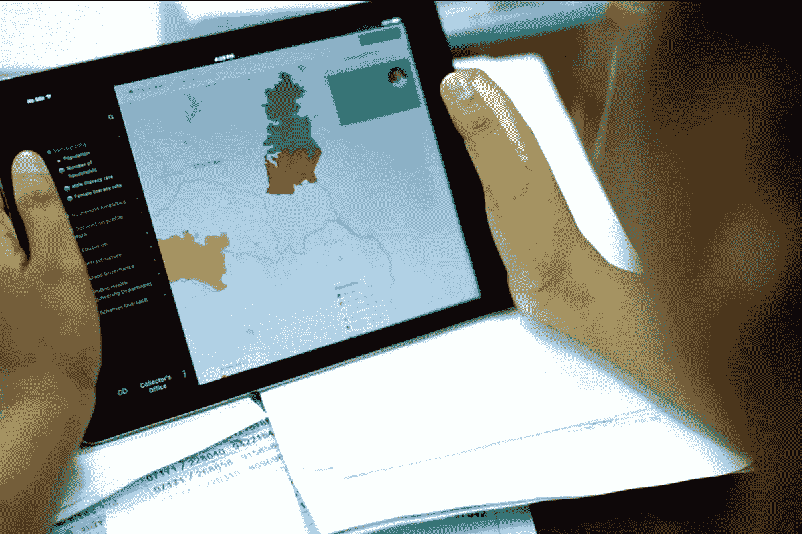
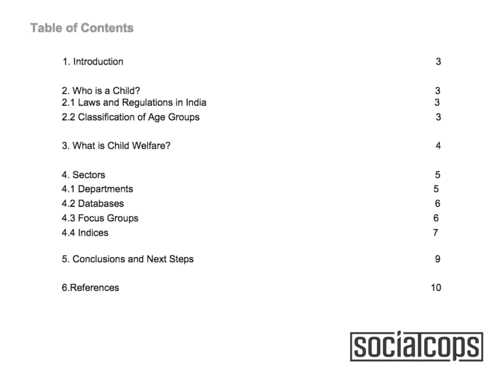
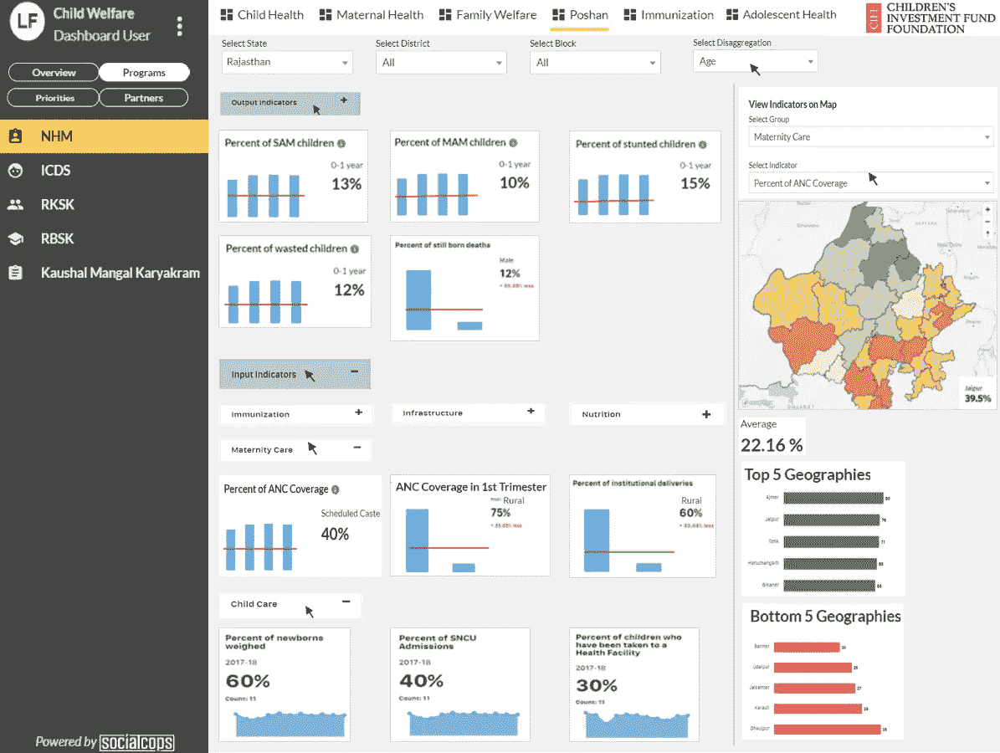
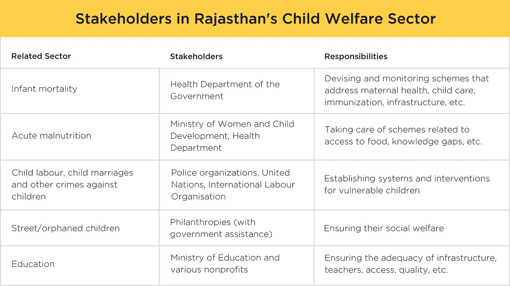
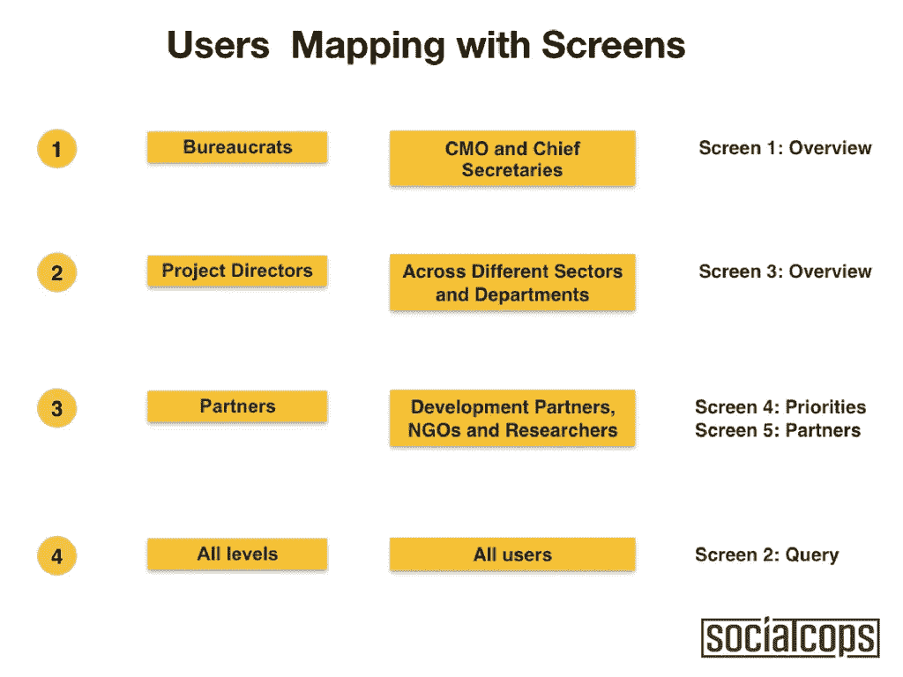
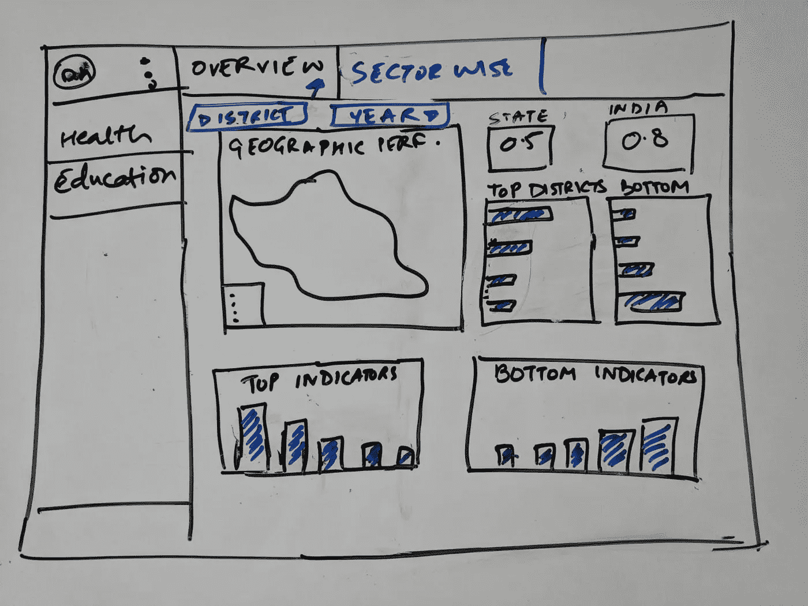
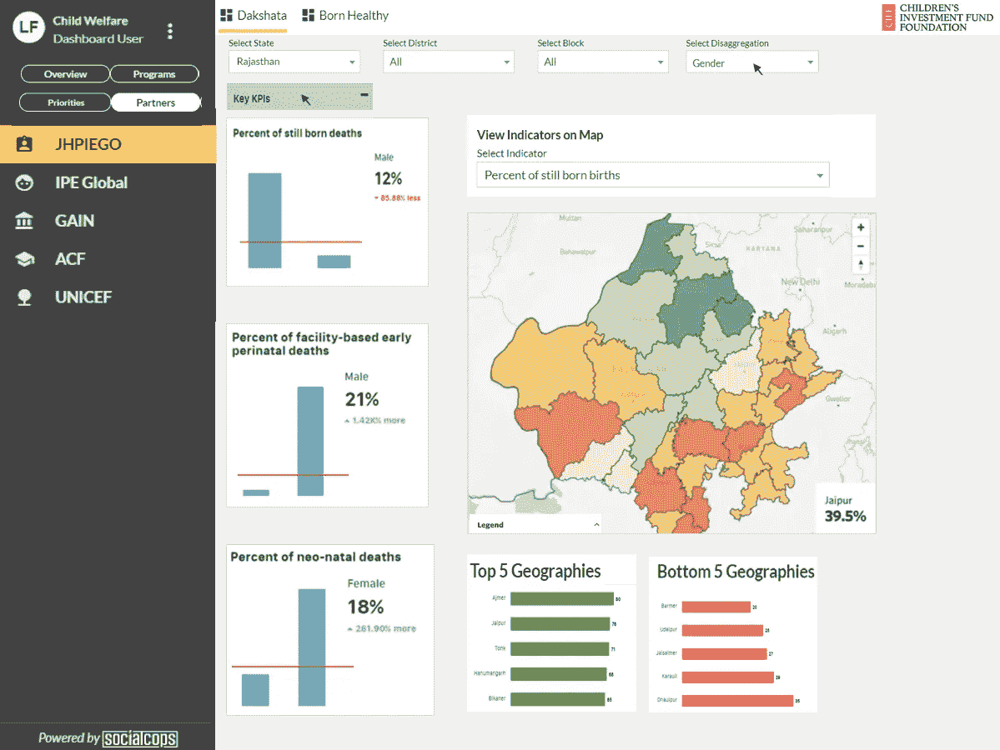

# 如何制作人们会真正使用的仪表板

> 原文：<https://towardsdatascience.com/how-to-make-dashboards-that-people-will-actually-use-16c6ec35334a?source=collection_archive---------8----------------------->

当今的组织在构建仪表板上花费了大量的金钱和时间。“只要我们有一个令人眼花缭乱的仪表板，我们最终将成为数据驱动的，”他们承诺——但这与事实相去甚远。根据 Logix 的一份 [2017 年报告](https://www.logianalytics.com/report/2017-state-analytics-adoption/)，实际上，只有 45%能够使用 BI 工具的人报告说他们实际上在使用它们。他们提到的最常见的挑战是，仪表盘太难使用了。

不同的人做不同的决定。如果您想要构建仪表板来帮助他们做出更好的决策，您首先必须了解他们如何以及为什么做出这些决策。你可以坐在一个数据宝库上，做出最精美的图表，但如果你不能从噪音中过滤出数据，并以正确的方式呈现正确的数据，那就没有意义了。

在 SocialCops，我们积极尝试避免这种“令人眼花缭乱的仪表板”陷阱。我们的核心价值观之一是“问题第一，解决方案第二”将这转化为现实的一种方式是，我们将 80%的时间集中在解决问题上，然后用 20%的时间设计解决方案(通常是一个仪表板)。我们花在问题陈述上的时间越多，花在实现上的时间就越少，实现就变得越有效。

作为一个在遇到问题时总是跳出来执行的人，这与我一生所知道的事情是如此的违背直觉。但是我为儿童投资基金基金会(CIFF)做的一个项目完全改变了我的想法。随着项目的进行，在处理数据或构建仪表板之前，弄清楚用户和他们正在做的决定是如此重要，这一点变得很明显。

在这篇文章中，我将使用 CIFF 的故事，通过 8 个步骤来讲述我们在如何构建用户会真正使用和喜欢的仪表盘方面的学习。

# 第一步:文献综述:不仅仅是学术界

*绕过文献综述似乎很诱人，但它对构建一个伟大的仪表板至关重要。在进行用户访谈之前，不能跳过作业。文献综述奠定了坚实的基础，有助于你更深入地理解问题陈述。*

CIFF 是一个捐助组织，致力于改善发展中国家弱势儿童和青少年的生活。他们在拉贾斯坦邦开展了几个以儿童为中心的项目。他们向我们提出了一个非常有趣的问题陈述——建立一个仪表板，帮助他们深入评估他们的儿童福利项目的实际影响。

当然，我们知道儿童福利，但它实际上意味着什么呢？它是如何定义的？为了给仪表板打下良好的基础，我们广泛查阅了儿童福利文献，使用了我们能找到的所有相关资料——研究论文、期刊和书籍。在此过程中，我们首先做了以下工作:

*   为儿童定义的年龄段(例如，0-1 岁为婴儿，1-5 岁为儿童)
*   为本项目定义了“儿童福利”的范围和目标
*   概述了儿童福利部门，如教育、卫生、营养和犯罪
*   确定了我们指数的焦点群体——易受伤害和需要立即关注的儿童。

我们还研究了印度和全球的儿童相关指数。这些指数向我们展示了在全球范围内被追踪的重要指标。这也给了我们一些有趣的见解。

Screenshot highlighting the table of contents from our research report for CIFF

例如，一个国家的指数中使用的指标类型因该国的发达程度而异。在像美国这样高度发达的国家，儿童福利指数可能倾向于高等教育、社会保障和教育歧视等指标；而在印度，指标更侧重于消除营养不良、提供高中教育和学校适当的卫生设施。

# 第二步:总是从用户开始

最好的仪表板始于真正使用它们的人。确定不同的用户组，他们需要解决的问题，以及他们需要从仪表板中得到什么。最好的方法是实地考察和亲自采访；但是，如果这是不可能的，呼吁帮助。

我们的下一步是了解仪表板的用户，他们关心什么，什么信息和见解对他们很重要。于是我们出发去拉贾斯坦邦的首府“粉红之城”实地考察。

由于并非所有用户都有相同的行为或目标，因此必须分析每个用户的个性、角色和职责。我们采访了斋浦尔的不同用户组，然后根据他们需要使用仪表板做出的决策绘制了用户组。举个例子，

*   ****和** **首席秘书**对拉贾斯坦邦儿童福利的总体状况感兴趣，并将其表现与其他邦进行比较。因此，对他们来说，仪表板需要帮助通知和推动他们的政策和战略。**
*   ****项目** **和** **方案主管**需要跟踪他们项目的进度和成果。因此仪表板需要指出他们各自项目中的具体瓶颈，并帮助他们影响实际活动。**
*   ****CIFF 和他们的非政府组织伙伴**热衷于了解他们在与儿童相关的部门中应该针对的关键优先事项。这将有助于他们资助和设计满足这些优先事项及其触发因素的干预措施。**

# **第三步:首先是问题，而不是数据**

***从你的仪表板需要回答的问题开始。从关于问题的宽泛问题转移到可操作问题的综合列表，这将为您指出解决方案。这些问题将是你仪表板的核心。***

**我们没有查看 CIFF 的数据，也没有弄清楚如何展示这些数据，而是接下来查看了 CIFF 的需求(在用户访谈中公布)。CIFF 需要回答什么问题来衡量它的影响？我们回到绘图板，从非常基本的问题开始:“项目在实现其结果方面有多成功？”，“节目的覆盖范围是什么？与印度相比，拉贾斯坦邦的表现如何？“，等等。**

**然而，我们并没有就此止步。这些问题将有助于 CIFF 了解他们做得如何，但不是他们下一步该做什么。为了使我们的解决方案更加面向行动，我们更进一步:“什么是最脆弱的儿童群体？”，“它们位于哪里？”、“这些领域需要哪些项目和干预措施？”“对他们来说，哪些干预措施最成功？”、“现在的节目在哪里破？”**、**什么外围因素在起作用等等。**

****

**A screenshot from our dashboard mockup for CIFF that is helping them track various programs and interventions**

**在这个练习的最后，我们都同意回答这些问题将使每个仪表板用户具备他们需要的洞察力，以了解哪些程序执行得不好，暴露关键的瓶颈，并显示潜在的后续步骤。**

# **第四步:关注北极星指标**

***将一系列问题整合成一组核心指标或指标，这些指标或指标能让您一目了然地从较高层面了解他们的行业或问题。这有助于用户关注真正重要的东西，而不是被一大堆指标和图表分散注意力。***

**下一步是找出如何回答这些问题，并以数据驱动的方式揭示实际情况。挑战——儿童福利是一个非常复杂的课题。它包含无数的政策、法律和部门，以及一系列复杂的利益攸关方(政府部门和部委、慈善机构、国家和国际机构等等)。**

****

**挑战不仅限于涉及多个不同的利益攸关方。另一个挑战是，我们想要回答的问题不能用一组简单的指标来解释，因为我们的利益相关者以不同的方式理解和衡量它们。此外，儿童福利绝不简单，所以每个问题都不可避免地涉及多个部门。为了解决这一复杂性并将这些问题和部门整合在一起，我们创建了单独的部门指数——每个影响儿童福利的部门一个指数，如教育和营养。然后我们将这些指数合并成一个单一的指数，拉贾斯坦邦的 C *儿童福利指数*，它将作为我们单一的、统一的北极星指标。**

**这一指数将通过把所有部门和发展伙伴的数据整合到一个平台上来创建。因此，它将自动考虑不同项目的不同“定义措施”,并以清晰、简洁的方式呈现它们。这将有助于用户理解拼图中他们自己的部分，并描绘出这些部分是如何与拉贾斯坦邦儿童福利的大图景联系在一起的。**

# **步骤 5:故事板用户将如何做决定**

***抓住每个用户群，专注于他们需要做出的决定，并为可视化或屏幕创建一个布局，展示他们需要的准确洞察力。逐个用户组地查看，以确保您的仪表板能够满足每个用户的特定需求。在白板或纸上画一个粗略的草图会有很大帮助。***

**接下来，我们需要为仪表板创建“决策流”,或者用户如何导航仪表板以做出决策。我们的用户研究在我们用故事板列出用户需要做出的决定时派上了用场。在头脑风暴时，我们意识到这三类用户需要三种不同类型的屏幕。**

****

**Different screens help users navigate better on the dashboard and make to better decisions**

**让我举几个例子来说明这到底意味着什么:**

*   **教育部长**需要跟踪拉贾斯坦邦教育部门的整体表现。对于像他这样的用户，我们设计了一个带有行业指数的概览屏幕，以及地理位置和关键指标的表现。****
*   **NHM (国家健康使命)的**儿童健康** **项目主管会被 *aanganwadi* 中心注册人数的下降所激励，所以他需要找出原因并解决任何障碍。对于这组用户，我们设计了测量项目输出(或成果)的屏幕，以及成功获得这些输出所需的输入。****
*   **如果 **CIFF 及其伙伴组织**了解到导致儿童辍学的因素(例如，童婚、针对儿童的犯罪、疾病等。)，他们可以通过他们的项目和投资来解决这些问题。对于他们，我们设计了包含主要 KPI 及其触发指标的屏幕，以显示指标在不同领域之间的关系。**

**当我们创建这些设计时，我们从用户那里得到了关于定义、数据集等的反馈。定期反馈有助于我们确保仪表板满足他们的需求和要求。我们采纳了他们的建议，并着手解决他们指出的任何问题——这确实为我们节省了大量时间。**

# **第六步:找到可用的数据，以及它的样子**

***数据范围界定可能很乏味，但知道哪些数据可用以及数据看起来像什么是很重要的。深入研究所有可能的数据系统的结构和指标，以确定最终指标。(如果数据集本身不可用，您可以通过查看用于收集数据的表单来了解它们。)***

**下一个任务是检查这个仪表板有哪些数据可用。拉贾斯坦邦的政府数据比其他许多邦更先进。然而，它的所有数据系统都存在于私有的筒仓中——没有集成或挂钩使这些数据系统能够相互通信。**

**我们知道我们必须将这些数据集和系统整合在一起，所以我们首先必须从里到外了解它们。这意味着找到不同政府部门、行业、项目和计划的所有相关数据集。**

**我们研究了我们发现的每个数据集的特征，例如来源(例如政府机构、民间社会、智库)、数据类型(例如管理信息系统、报告、调查)和格式(例如 Excel、CSV、PDF)。这有助于我们全面了解可用的数据集及其元数据。然后，我们一个接一个地深入研究数据集，了解它们的指标和变量。我们关注他们的粒度(州、地区、街区、村庄、受益人等)。)、分类(按性别、年龄、种姓、地区等)。)，以及可用年份连同周期(数据更新的频率)。**

**创建指数的最大挑战是指数中的指标需要保持一致。如果它们来自不同的数据源，这可能会很棘手。例如，它们需要(1)以必要的粒度出现，(2)在相同的时间段内被记录，以及(3)都被一致地定义。因此，我们做了一些基本的数据清理，以处理缺失值和异常值或方差。**

**为了完成数据范围界定，我们开始了第二个研究阶段。我们审查了计划和项目目标，最终确定了投入和产出指标清单。此外，我们还进行了实践研究，以制定儿童福利关键绩效指标及其相关指标。**

# **第 7 步:完善北极星指标的方法**

***下一步是最终确定仪表盘北极星指标的方法。这是应该咨询数据科学家和统计学家的地方。它们可以帮助您了解如何构建一个强大的指数，以及您可以对这些指数进行哪些其他分析。***

**现在我们已经知道了哪些数据集和指标可用，我们可以为儿童福利指数创建最终的方法。建立一个索引包括创建一个指标列表，并以数学逻辑的方式将它们组合起来。**

**我们精心挑选了最重要的指标，并对其进行标准化。我们首先给予所有指标同等的权重，因为我们认为所有涉及儿童福利的部门都同样重要。但是，我们计划通过咨询行业专家并使用[主成分分析](https://en.wikipedia.org/wiki/Principal_component_analysis)和[奇异值分解](https://en.wikipedia.org/wiki/Singular-value_decomposition)等统计方法进行降维，来提高这些权重。**

**我们还通过按性别、年龄、种姓和地区等分层因素对指数进行分解，从而完善了指数。我们还建议跨时间计算该指数，以便用户能够了解不同地区的儿童福利如何逐年变化。**

# **第 8 步:为用户反馈和设计迭代构建一个原型**

****

**One of the rough layouts for the visualization of the dashboard before we built the Powerpoint mocks and Invision prototypes**

***你不需要一个最终的仪表盘来查看你的用户怎么想。即使是一个简单的原型也是在用户反馈和设计迭代之间启动反馈循环的好方法。像 Invision 甚至交互式 PPT 这样的平台就足够了。***

**一旦我们有了故事板的草图，我们就开始着手创建模型，这是一个实际仪表板外观和功能的表示或原型。然后，我们将原型带给 CIFF 和其他利益相关者，并要求他们使用它。这有助于我们深入了解他们是否能够利用仪表板上的见解做出决定。**

**这个过程也非常有用，因为它让用户对问题感兴趣，并鼓励他们分享一些非常有价值的反馈。换句话说，模型就像一个底座，帮助他们获得清晰。这些反馈循环一直持续到每个人都确信仪表板是正确的。**

# **这个过程值得花时间吗？**

**显然，这个仪表板范围和设计过程需要时间。我们需要 8 个步骤来提出以用户为中心的设计，这还没有考虑到未来的数据处理、清理和标准化，建立数据管道，或建立实际的仪表板。**

**那么这个过程值得吗？我们认为是。**

**看着数据，找出最好的指标，并以最漂亮的方式将它们可视化，这很诱人，但往往只会导致一个令人眼花缭乱的仪表板，每年只使用一次或两次。相反，瞄准将使用仪表板的人和它最终需要驱动的决策可以帮助你建立一个你的用户永远不会放下的仪表板。**

**在我们的例子中，这非常重要，因为仪表板本身非常重要。通过这个仪表板，CIFF 和他们的合作伙伴将能够跟踪他们的投资是如何帮助遏制儿童死亡率和营养不良的；政府官员将能够追踪像[宝山](http://nrhmrajasthan.nic.in/POSHAN.htm)和 [RJJSY](http://nrhmrajasthan.nic.in/POSHAN.htm) 这样的计划是如何帮助抑制婴儿死亡率和产妇死亡率的；项目主管将能够追踪哪些因素导致了小学教育质量的飙升。如果这个仪表板不容易理解和使用，CIFF 和他们所有的利益相关者将会浪费大量的时间和金钱，而不会更接近他们需要的答案。**

****

**A screenshot of from our dashboard mockup that will help CIFF partners identify and address problems based on their projects and investments**

**此外，我们发现，广泛的范围界定和设计流程有助于我们预见并预防在我们实际创建仪表板时会出现的挑战。例如，广泛的数据范围有助于我们了解最终的仪表板可以包含什么，不可以包含什么。DISE(印度最大的教育数据集)中的大多数指标都有很多分类，但这些分类在其他数据集中是不可用的。如果没有数据范围，我们可能会以不一致的指标或糟糕的索引而告终。**

**因此，这一范围界定过程有助于我们为这些挑战做好准备，并在它们脱离我们的仪表板之前找出解决它们的方法。这也有助于我们让利益相关者意识到这些挑战，以便他们准备好并愿意在需要时提供额外的帮助或资源。**

**有兴趣了解更多关于如何确定范围和设计优秀仪表板的信息吗？这里有一些关于设计思维的资源可以帮助你开始:**

*   **[https://www . interaction-design . org/literature/topics/design-thinking](https://www.interaction-design.org/literature/topics/design-thinking)**
*   **[https://medium . com/Wharton-innovation-design/what-is-design-thinking-反正-c59428031331](https://medium.com/wharton-innovation-design/what-is-design-thinking-anyways-c59428031331)**
*   **https://www.ideou.com/pages/design-thinking**
*   **[https://dschool . Stanford . edu/resources-collections/a-virtual-crash-course-in-design-thinking](https://dschool.stanford.edu/resources-collections/a-virtual-crash-course-in-design-thinking)**
*   **[http://www.creativeconfidence.com/tools](http://www.creativeconfidence.com/tools)**

**祝您构建自己的直观、用户友好的仪表板好运！**

## **嘿伙计们，快速个人更新！我们在 Locale.ai 推出了我们的产品，希望您能试用并分享您的反馈。报名链接此处[为](https://demo.locale.ai/demo?utm_source=medium&utm_medium=blog&utm_campaign=launch)。**