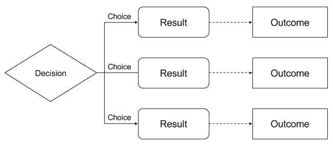
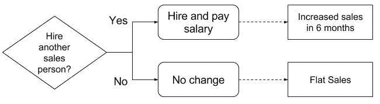
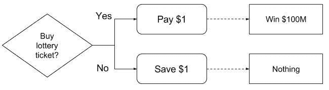
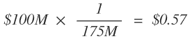
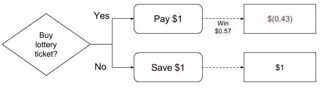
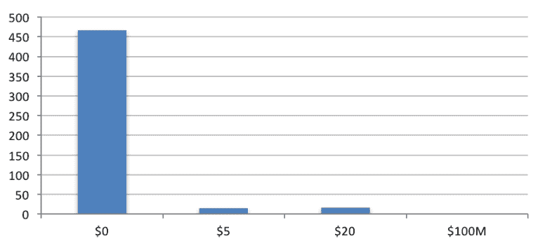

# 如何像老板一样做出数据驱动的决策

> 原文：<https://towardsdatascience.com/how-to-make-data-driven-decisions-like-a-boss-fffc088470da?source=collection_archive---------5----------------------->

> *理论上，理论和实践没有区别。但实际上是有的。―* [*瑜伽熊*](https://www.goodreads.com/author/show/79014.Yogi_Berra)

决策可能很难。你每天需要做的决定多得令人不知所措。研究表明，我们一天中做的决定越多，我们做决定的能力就越差([决策疲劳](https://en.wikipedia.org/wiki/Decision_fatigue))。有时你会做出非常非常艰难的决定，在这种疲劳中，你很难选择一个选项而不是另一个选项，即使使用了你所拥有的所有数据。

[决策理论](https://en.wikipedia.org/wiki/Decision_theory)是逻辑、博弈论和概率的结合，旨在将决策形式化为您更容易解决的结构化问题。很好，但是你为什么要在乎？因为它提供了许多通用的框架和工具，您可以使用它们来确保决策方法的一致性。你越善于使用这些框架和工具，你就越能更好地做决策——你就越不容易被淹没和成为决策疲劳的受害者。

决策理论是一个很大的领域，所以我们将只涵盖你需要开始的基础知识。具体来说，我们将涵盖:

*   [什么是决策？(决策模型)](http://outlier.ai/2017/01/17/decision-theory-decision-models/)
*   [可能的结果是什么？(期望值分析)](http://outlier.ai/2017/01/18/decision-theory-expected-value-analysis)
*   [结构化决策(决策树)](http://outlier.ai/2017/01/19/decision-theory-decision-trees/)
*   [模拟决策(蒙特卡洛模拟)](http://outlier.ai/2017/01/20/decision-theory-simulating-decisions)

让我们从建模决策开始，使它们更容易评估。

> [**离群值**](http://outlier.ai/about-outlier/) **监控您的业务数据，并在发生意外变化时通知您。**我们帮助营销/发展&产品团队从他们的业务数据中获取更多价值。 [**今天安排试玩。**](http://outlier.ai/)
> 
> - Outlier 是 Strata+Hadoop World 2017 观众奖得主。

# 决策模型

**可视化决策**

什么是决策？简而言之，这是在许多不同的选项中做出选择，每一个选项都会导致某种预期的结果。你可以用我称之为决策模型的东西来想象一个决策，它实际上只是流程图。您可能在过去使用过流程图来捕捉流程，这正是我们决策过程所需要的！例如，下面是一个非常通用的决策模型:

A simple flow diagram describing decisions

决策模型帮助您获取做出最佳决策所需的所有信息:

1.  列举所有可能的选择。
2.  理解每个选择的结果。
3.  对最终结果的理解。

决策模型使得这三者都很容易可视化。例如，假设我们需要决定是否应该为我们的销售团队再雇用一名销售人员。如果我们雇佣销售人员，短期内会花费一些钱(工资),但可能会在 6 个月内带来更多的销售。该决定可能如下所示:

A hypothetical flow evaluating the hire of a sales person

如你所见，决策模型只是一种简单的方法，通过强迫你写下来来确保你理解所有的选择和决策结果。你不会对每个决定都这样做，但对最重要的决定来说，这是一个重要的工具。

接下来，我们将讨论当存在不确定性时如何理解结果，这在现实生活中几乎总是如此！

# 期望值分析

**了解成果**

在昨天讨论决策模型时，我们分解了如何考虑决策和可供选择的选项。在许多方面，比你的选择更重要的是这些选择的最终结果。

例如，让我们说你正试图决定你是否应该买一张彩票。我们可以对决策建模如下:

Flow diagram for expected value analysis

看那里的决定，显然我们应该买票！然而，我们没有捕捉到的是，获胜的概率并不是 100%。事实上，对于大多数彩票来说，中奖的概率非常小。让我们假设赢得彩票的概率是 1 . 75 亿分之一(强力球的典型概率)。那么，我们如何衡量这一潜在结果的价值呢？

期望值是评估受概率(也称为随机变量)影响的结果的一种方式。期望值允许您在量化事件时考虑事件的可能性，并将其与其他不同概率的事件进行比较。

要计算期望值，您需要将事件的概率乘以事件的值。在这种情况下，我们将中奖金额(1 亿美元)乘以中奖概率:

简单来说，中奖的回报是巨大的，但中奖的机会是微乎其微的，所以买票的预期价值只有 57 美分。

现在，我们可以在决策模型中使用它来明确决策:

现在选择很清楚，我们不买票并节省 1 美元比买票损失 0.43 美元要好得多！这就是期望值的力量，在比较选项时，它们允许我们快速而容易地计算概率。

当然，大多数决策将包括许多不同的概率。接下来，我们将讨论多阶段决策，其中一个决策可能导致许多其他决策，并将我们迄今为止讨论的内容汇集在一起，以做出一些实际的决策！

# 决策树

在生活或商业中，很少有决策是独立的。一个决定导致更多的决定，反过来又导致更多的决定。当你做决定的时候，如果你要做一个最优的选择，你需要考虑那些后来的决定。

决策树是我们之前讨论的决策模型的扩展，它允许您理解相互关联的决策的关系和最终结果。决策模型和决策树的唯一区别在于，在决策树中，一个选择的结果可以是另一个决策！

举个例子，让我们回顾一下我们是否要雇佣一名销售人员的决定。不要把它想成是雇用销售人员的决定，让我们把它想成是现在还是以后雇用销售人员的决定。这将决策变成一棵树，如下图所示:

Taking the decision tree to the next level with dependencies

如果我们现在决定不雇佣销售人员，我们可以选择以后雇佣他们。这既有成本也有收益，现在您已经绘制了决策树，可以开始分析了。

这个简单的例子体现了现实世界决策的许多特征，以及您在构建决策树时应该考虑的事情:

*   仅仅因为有大量的决策，就可能只有少量的可能结果。在许多真实世界的情况下，任何决策都只有几种可能的结果，这可以大大简化你的过程。通过从首选结果开始回溯，您可以确定最有可能帮助您实现目标的决策路径。
*   根据我们在第一个决定中所做的选择，其他各种决定要么可用，要么丢失。这是做决定时要考虑的一个重要因素，因为一些选择可能会在未来保留更多选择，从而增加你未来决策的灵活性。
*   你的决策树的许多分支也将引入不确定性，因为一些决策和结果将依赖于某些概率。在这里，使用期望值是非常强大的，因为您可以计算一个选择的期望值，即使真实的结果是删除了许多决策！

你的决策树越大，就越难处理它可能引入的越来越多的概率。明天，我们将回顾一个有用的工具，来减少这种复杂性，并使这些决定变得稍微容易一些。

# 模拟决策

**赌博可以变好**

即使使用了我们本周讨论的工具，仍然很难做出艰难的决定。如果你的决策树有很多不确定性，或者你的期望值很难预测，即使这些框架也没什么帮助。

好消息是你可以作弊！在你真正做出决定之前，你可以把同一个决定重复上千次，看看结果如何。这个过程被称为[蒙特卡罗模拟](https://en.wikipedia.org/wiki/Monte_Carlo_method)，它使用软件来模拟多次做出相同的决定，并使用您提供的概率来确定结果。通过研究这么多测试的结果，你可以了解最有可能的结果，并将其作为你决策的一部分。

例如，让我们回到是否购买彩票的决定。请记住，门票价格为 1 美元，中奖奖金为 1 亿美元，但中奖几率仅为 1.75 亿分之一。如果同一张彩票也有 1/20 的机会赢得 5 美元，1/50 的机会赢得 20 美元呢？那我们怎么做决定呢？

对于这个简单的例子，我们可以直接计算期望值，但为了好玩，我进行了蒙特卡洛模拟，结果如下:

我进行了 500 次模拟，其中 467 次我一无所获，5 次 15 美元，20 次 16 美元，可悲的是，1 亿美元 0 次。平均结果是赢得 0.79 美元——仍然低于票价！

然而，考虑 500 次模拟中涉及的概率可能不足以得到一致的结果。与任何概率模拟一样，运行的次数越多，结果的分布就越能反映真实的概率，所以要尽可能多运行几次。我再次运行同样的模拟 500 次，得到的平均值是 0.54 美元，这是非常不同的！这凸显了这种方法的危险，因为结果中有太多的可变性，所以你需要使用结果作为指导，而不是事实。

**回顾:**我们已经讲述了决策理论的基础，包括如何可视化决策，以确保您捕捉所有可能的选择和结果(决策模型和树)，并考虑结果中的不确定性(期望值)。我希望这能给你一个开始，用一种系统的方式来处理你的决定，这将帮助你做出更好的决定！

> [**离群值**](http://outlier.ai/about-outlier/) **监控您的业务数据，并在发生意外变化时通知您。**我们帮助营销/发展&产品团队从他们的业务数据中获取更多价值。 [**今天安排试玩。**](http://outlier.ai/)
> 
> - Outlier 是 Strata+Hadoop World 2017 观众奖得主。