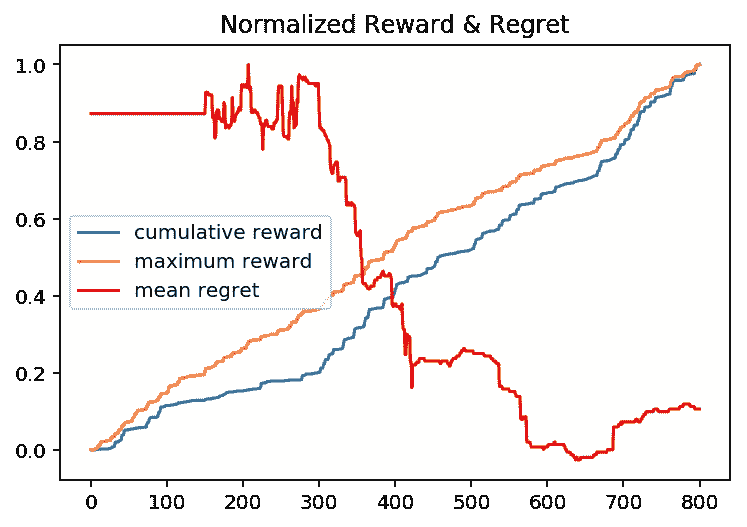
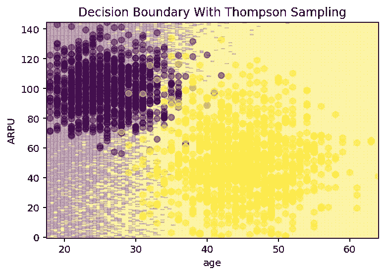
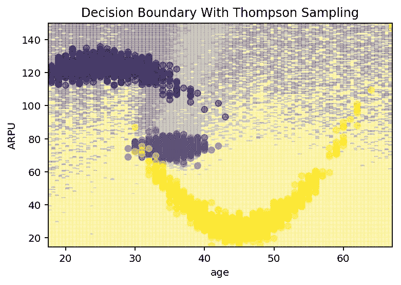

# 如何利用上下文土匪做出数据驱动的决策

> 原文：<https://towardsdatascience.com/how-to-make-data-driven-decisions-with-contextual-bandits-the-case-for-bayesian-inference-cc2f2913ebec?source=collection_archive---------8----------------------->

## 贝叶斯推理的案例

2018 年，几乎每个行业都面临着巨大的压力，要做出**数据驱动的决策**。在强大的机器学习算法时代，这不仅仅是一个好主意；[这是生存](/become-data-driven-or-perish-why-your-company-needs-a-data-strategy-and-not-just-more-data-people-aa5d435c2f9)。

但是我们如何应用“预测分析”来做决策呢？那么，如果我们可以预测客户流失或转换的可能性呢？一个好的预测*真的*能给你的组织带来价值吗？

## 数据科学是时候成长了

监督学习创造了奇迹，但它从根本上说是有限的。决策的直接优化——最广泛地说，强化学习(RL)领域— **对于大联盟来说已经足够成熟了**。

我们已经看到了 RL 的一些巨大突破，但是一个可靠的通用解决方案仍然缺乏。

众所周知并且**有效解决了**的是 RL 的特殊情况，称为**上下文强盗问题**。

[什么是语境土匪？](/contextual-bandits-and-reinforcement-learning-6bdfeaece72a)很像 RL；你有一系列的决定要做，任务是学习最佳的选择来优化一些奖励。唯一的区别是上下文强盗公式没有状态。

约翰·舒尔曼是 OpenAI 深度增强现实领域的领先研究人员，他在[2017 年的演讲](https://www.youtube.com/watch?v=2h7mxAAMOes)中对任何希望在实际环境中应用深度增强现实的人的直接建议是将其作为一个上下文相关的土匪问题。

> “通常你可以把(你的问题)近似为一个没有国家的背景强盗问题。对背景强盗问题有了更好的理论理解。”约翰·舒尔曼，OpenAI

# **深度语境强盗来了——而且效果很好**

也许被关于深度学习的头条新闻掩盖了，背景强盗问题研究的最新进展在很大程度上被忽视了。deep RL 中有一些令人惊讶的结果，它是优秀的 clickbait，但在野外，**我们数据科学家有职业责任关注相关研究**。

尤为重要的是 2018 谷歌大脑论文[深度贝叶斯土匪对决](https://arxiv.org/pdf/1802.09127.pdf)。这篇论文算不上创新，但却是一个里程碑。作者们看了一些最近最有希望的解决方案，并在各种不同的任务上对它们进行了比较。

主要外卖？**这些方法中的大多数都能很好地解决各种各样的问题**。

# 探索与利用

所有的 RL 问题都面临一个基本的悖论:我们是尝试新事物来寻找更好的解决方案，还是简单地重复我们知道行之有效的行为？这个经典难题被称为[探索/利用权衡](https://medium.com/the-strategic-review/background-ops-11-finale-explore-exploit-tradeoffs-13169b1ddc68)。

大多数关于上下文强盗的研究都集中在用一般的方法解决这个难题上。每个问题都不一样；我们能创造出一种在任何地方都适用的算法吗？

一个简单有效的解决方案被称为**ε贪婪策略**。ε是超参数；当ε= 0.01 时，我们利用 99%的时间，探索 1%的时间。这个简单有效。我们只需要选择一个运行良好的 epsilon，我们可以找到一个解决方案，同时最大限度地提高性能。

epsilon-greedy 的问题是它需要调优。我们是从高ε开始，然后随着时间降低它吗？我们要选择一个 epsilon 并把它留下吗？

在这里摆弄的真正风险是，当我们调整时，**由于次优决策，真正的钱正在损失**。

# 汤普森取样

真正的解决方案是找到一种算法，自我调节探索利用问题。事实证明，贝叶斯公式给了我们一个可靠的方法来做到这一点。

汤普森取样是一个可以追溯到 1933 年的想法。它给了我们一种聪明探索的方式。汤普森抽样的主要思想是:

> "当有疑问时:探索！"—迈克尔·克莱尔，试图解释汤普森抽样。

使用 Thompson 采样可以很容易地解决更简单的情况，即所谓的[多臂强盗问题](/solving-the-multi-armed-bandit-problem-b72de40db97c)。

这个想法很简单:利用我们对每个行动背后的预期回报分布的*先验理解*，让我们抽取样本并选择 argmax 作为我们选择的行动。这就是汤普森抽样政策:既贪婪又随机。

这个策略的结果是深远的:当我们的模型对一个决定有信心时，**它会不断重复那个行为**。当它不太自信时，它会探索可能性更高的其他选项。

对多臂土匪很管用。棘手的部分是将它应用到上下文案例中。

## 汤普森抽样的贝叶斯回归

当我们将**背景**引入多臂强盗问题时，我们不再能够简单地学习每一个动作的奖励分配。我们需要根据一组特性或者一个**环境**来决定这个分布。

贝叶斯线性回归为我们提供了一个很好的方法。贝叶斯线性回归不是简单地拟合一个线性回归模型，而是允许我们在预测中加入不确定性。更具体地说，它允许我们将某些结果(比如说，我们的报酬)的**预期分布**取决于一些特征。这种分布可以从采样，打开了在上下文土匪情况下汤普森采样的大门。

Bayesian regression reward optimization — Maximum Reward is the known-best policy, and cumulative reward is the trained policy. Bayesian LR + Thompson Sampling implicitly optimizes explore-exploit behavior. (Each decision and timestep is the x-axis.)

## 非线性函数呢？

线性模型是有效的，但是限于给定独立特征的近似线性信号。如果我们需要对非线性函数建模呢？

一种完全有效的方法是从我们的原始特征中设计出一组大致独立的特征。你能做到的。

但是特征工程是老派的。2018 年，我们有神经网络来为我们做这件事。

# **进入深度学习**

2018 年上下文土匪摊牌论文探索了贝叶斯线性回归解决方案的巧妙适应。简称为*神经线性*算法，谷歌大脑研究人员应用神经网络来学习一组特征，以馈入贝叶斯线性回归模型。

结果呢？一个在各种任务中表现卓越的模型。这很简单，计算效率高，而且证据就在布丁里。

> “…根据对深度网络最后一层提供的表示进行贝叶斯线性回归来做出决策，提供了一种可靠且易于调整的方法。”——Riquelme 等人，谷歌大脑

# 你可以应用最先进的研究

这种算法是普遍适用的，本质上是简单的。研究人员甚至开源了他们的代码供公众使用。

但直接应用前沿研究可能会令人生畏。

我在 [Launchpad 主持一个数据科学家培训会议。AI](https://launchpad.ai/) ，作为培养[数据科学人才进入该领域](https://fellowship.ai/)的国际活动的一部分。

教授梯度推进和随机森林很容易，因为开源软件非常用户友好。初露头角的数据科学家只需要导入一些类，她就可以立即开始实验。

因此，当我站在一群受训的数据科学家面前，向他们讲授深层贝叶斯语境强盗时，他们迫不及待地想要尝试。

唯一的问题？他们不能直接从 scitkit-learn 导入。**唯一可用的选择，从零开始手工编码实现，当你有最后期限来满足**时，并不总是可行的。

# **太空盗匪诞生**

我决定把谷歌大脑的开源代码打包，这样我的学员就可以使用它了。

我没有野心；我从 [Tensorflow 开源代码](https://github.com/tensorflow/models/tree/master/research/deep_contextual_bandits)中取出最简单的模型(贝叶斯线性)和最好的模型(神经线性)，优化后用于规模化使用，[上传到 PyPI](https://pypi.org/project/space_bandits/) 。

它只需要一个名字。我有很多想法，但我对天文学的热爱和“太空强盗”这个愚蠢的名字吸引了我。 [**太空盗匪**](https://github.com/AlliedToasters/space_bandits) **诞生**。

目前的版本是 v0.0.9，是一个 alpha 版本，但是它可以工作。一个玩具问题表明，图书馆的模型[可以在线学习，也可以从历史数据中学习](https://github.com/AlliedToasters/space_bandits/blob/master/toy_problem.ipynb)。

这是 Google Brain 的贝叶斯方法的另一个优势:**学习不需要直接获取决策政策**。这意味着来自任意活动的记录可以用于优化。

Space Bandits is able to learn a “soft” decision boundary with Thompson sampling and a Bayesian linear model — only observing rewards given actions

## 关于报酬设计的一个注记

> “我已经开始把 deep RL 想象成一个恶魔，它故意曲解你的奖励，并积极地寻找最懒惰的可能的局部最优解。”— [Alex Irpan](https://www.linkedin.com/in/alexander-irpan-b2aa355b) ，Google，[深度强化学习还没起作用](https://www.alexirpan.com/2018/02/14/rl-hard.html)

亚历克斯可能说得最好，但任何有机器学习经验的人都不应该对此感到惊讶。

RL 算法，包括上下文土匪，不容易推广。他们只有在别无选择时才会这么做。

在受监督的环境中，这种想法表现为过度适应。当简单地记忆训练数据是一种选择时，为什么要一般化呢？

同样的问题在 RL 里就不那么清楚了。当你的模型找到优化奖励的方法时，是否过度拟合？只有当你的奖励函数有缺陷的时候才会这样。

这一块应该不难，不要想多了。**在现实生活中，奖励(通常)是金钱**。如果你的模型找到了优化回报的“窍门”，只要回报是利润，你就应该高兴。

A Space Bandits Neural Linear model learns nonlinear decision boundaries. Thompson sampling encourages more exploration closer to “true” decision boundaries, and optimal choices in regions with higher certainty.

# 部署深度贝叶斯上下文盗匪模型

你没有借口了。该算法已被证明在实践中对广泛的问题有效。您可以通过基于前沿研究的决策优化给同事留下深刻印象。也许最好的是，你可以 pip 安装一个 python 包为你做所有的艰苦工作。

你还在等什么？