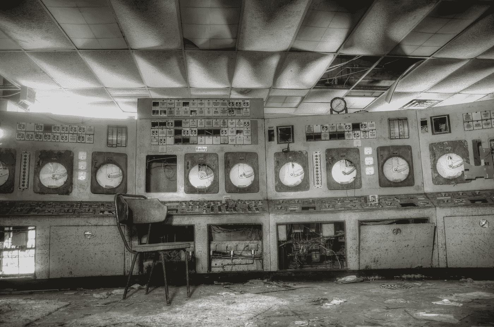
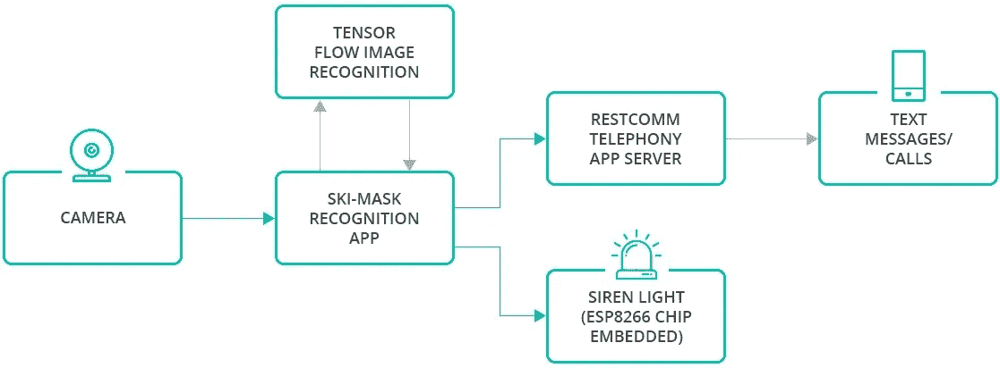
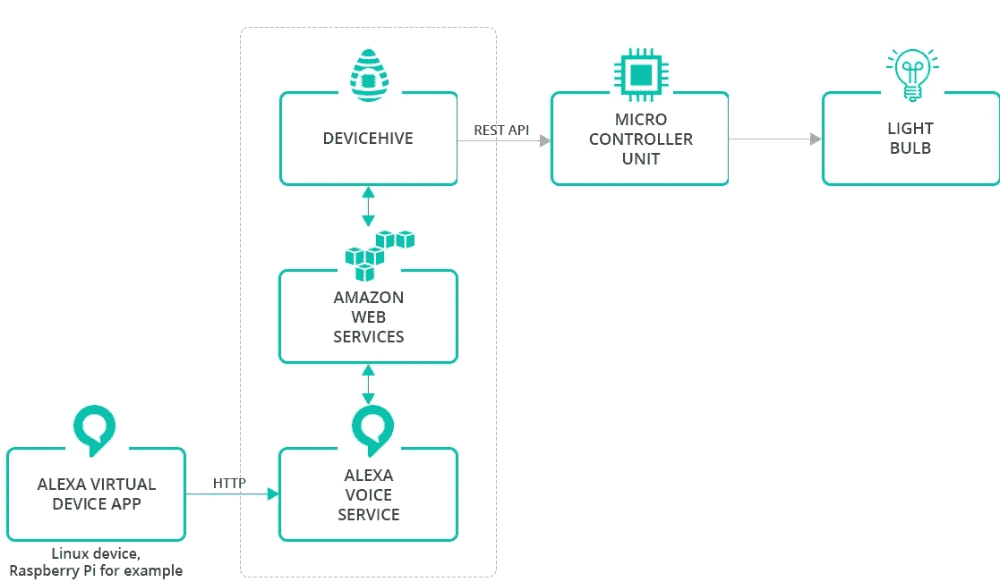

# 如何让设备变得智能

> 原文：<https://towardsdatascience.com/how-to-make-devices-smart-10dff00c2a8c?source=collection_archive---------6----------------------->

## 使用机器学习算法，亚马逊 Alexa 和 DeviceHive

在一切都趋于智能的时代，仍然有设备和遗留设备保持不变。他们很好地履行了自己的职责，但如果他们能做得更多呢？

我们考虑了一个简单的电梯连接到由新功能和服务支持的互联网的场景。人们每天都使用电梯。所以，让我们让它更安全、更智能、更可靠。

# 应用支持

开发新功能总是要花相当多的时间。但是如果你可以通过安装一个新的应用程序把它添加到你的设备上呢？

我们将集成服务打包到 Canonical 的 snap 包中。其架构允许任何开发者创建自己的品牌应用商店，并上传快照进行分发。

一旦设备支持应用程序，它就成为 snap 生态系统的一部分，为该平台提供了大量解决方案。这项技术允许在不改变设备主要功能的情况下向设备添加新的服务。整个演示旨在展示如何轻松完成。

# 更安全的

为了提高安全性，让电梯更安全，我们使用了机器学习算法。这些算法允许我们跟踪攻击行为、武器、衣服、情绪、健康状况等。

Ski-mask detection

通常入侵者在实施抢劫/袭击前会试图隐藏自己的脸。我们以这一事实为出发点，训练机器学习算法来识别人们身上的面具，但不对仅仅持有面具的人做出反应。

一旦检测到滑雪面罩，系统就会触发警报，发送短信，并呼叫安全官员。此外，理论上它可以锁定电梯门，直到警察到来。

来自电梯摄像机的视频流使用 TensorFlow 模型进行分析，该模型被训练来识别滑雪面罩。在肯定识别的情况下，发生警报。

*   对 RestComm 电话服务器的 API 调用被调用——这触发了预先配置的动作(比如发送文本消息或打电话)；在调用时，它也可以提供一些信息。
*   警报声响起——为了让这成为可能，我们用定制的 [DeviceHive](https://devicehive.com/?utm_source=medium&utm_medium=social&utm_campaign=d-spring-2018) 固件刷新了 ESP8266 芯片。

Solution architecture

# 聪明的

在上一篇文章中，我们讨论了如何将任何基于 Linux 的设备转变为 Amazon Echo 设备。我们在这里也实现了它，为了演示实际的解决方案，我们将 Alexa 与 DeviceHive 集成在一起。

 [## 如何将 Alexa 添加到树莓派中

### 或者任何 Linux 设备

medium.com](https://medium.com/iotforall/how-to-add-alexa-to-a-raspberry-pi-6cedfe15662e) 

我们使用 DeviceHive 云解决方案来控制一个 LED 灯条，用于语音命令的可视化演示。主要的挑战是开发一个可以在多种电路板上运行的语音激活解决方案。Ubuntu 为这些主板提供支持，包括 x64 和 ARM 主板，如 Raspberry Pi。

对 Alexa 的每个请求都必须由人类语言触发。因此，我们添加了一个本地语音识别算法来检测' Alexa '关键字。一旦它听到这个关键词，它就会记录声音，直到语音停止，并将其发送到亚马逊 Alexa 云服务。

为了获得广泛的硬件支持，我们开发了一个基于 Amazon Alexa API 的包。然后，我们将这个应用程序打包到一个规范的 snap 包中，以提供简单的设置和事务性更新。

我们使用 WS2812B LED 灯条作为视觉设备，通过 DeviceHive 固件连接到 ESP8266 芯片。该固件提供与 DeviceHive 服务器的连接，还支持 LED 灯条设备，并提供控制它们的命令。因此，我们完全可以通过从 Alexa Skills 应用程序发送不同的命令来控制 LED 灯条。

Alexa integration architecture diagram

我们创建了一个语音控制电梯系统，led 灯带上的灯代表建筑楼层。

此外，该系统被编程为播放关于在所选楼层可以找到的位置的广告。它还可以回答诸如“这栋楼里最好的餐厅在哪里？”

# 可靠的

我们通过其 RESTful API 将演示与 Salesforce 物联网云集成，以记录使用统计数据并分析收集的数据。这可用于构建预测性/预防性维护解决方案。

# 利益

我们开发了一个与现代服务和技术相集成的复杂解决方案，为用户和客户增加了新的价值:

*   语音识别使语音命令成为物联网生态系统的一部分。该解决方案使用基于 web 的服务，这使得它可以扩展到更大的系统，并且可以轻松地从一个硬件平台迁移到另一个硬件平台。
*   利用机器学习方法可以提高安全性。
*   云技术使公司更具创新性，更快地开发商业模式，并在定制解决方案中使用众所周知的高质量产品。
*   Salesforce 物联网云集成可记录和分析使用数据。
*   作为应用程序添加新特性和功能的能力。

# 技术

技术栈包括:亚马逊 Web 服务、亚马逊 Alexa、DeviceHive 云服务、DeviceHive 固件、Linux、Python、C、Ubuntu Snaps、Snapcraft、Java、JavaScript、TensorFlow、Restcomm。

*由* [*DataArt*](https://www.dataart.com/industry/iot-and-m2m-solutions?utm_source=medium&utm_medium=social&utm_campaign=i-spring-2018) *物联网负责人伊洛宁撰写。*