# 如何让 Goodreads.com 跻身 400 强？

> 原文：<https://towardsdatascience.com/how-to-make-goodreads-com-top-400-list-8e3a26e509bf?source=collection_archive---------2----------------------->

我是一个书虫。我一个月读 3-4 本书(仅限非小说类书籍), 80%的句子以“我在某处读到过……”开头

我对书籍的兴趣促使我创办了全球最大的读者和书籍推荐网站[goodreads.com](https://www.goodreads.com/)，亚马逊于 2013 年收购了该网站。

这个项目的目标是分析 goodreads.com 的前 400 本书的**共同特征，并根据书评预测一本书的成功。**

# 刮 Goodreads.com

我从“[有史以来最好的书”](http://www.listchallenges.com/goodreads-best-books-ever2)列表中刮出了这些书。为了获取我的分析所需的所有信息，我必须抓取三个不同的页面模板。

下面是一个页面模板的例子，它列出了我的分析所需的一些元素(用橙色突出显示)。

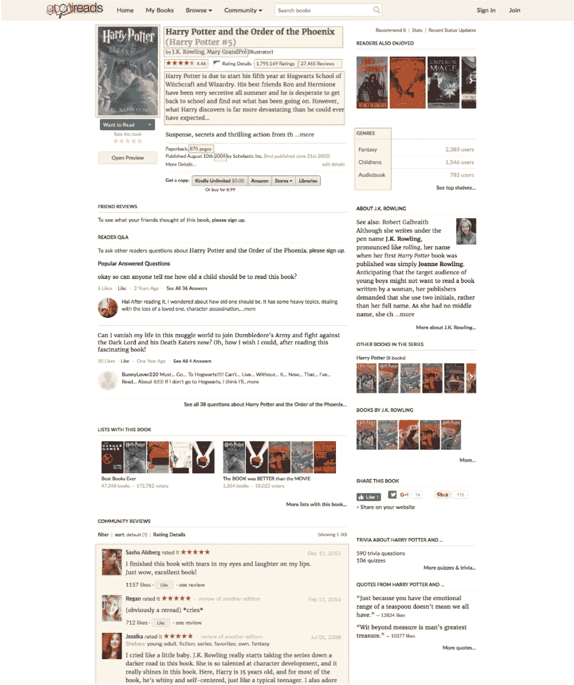

**分析**

我将我的分析分为三个部分，每个部分由一组问题引导:

*   **写作:**
*   哪种流派在 400 强榜单中最具代表性？
*   有最佳页数吗？
*   **出版**
*   出版年份重要吗？
*   **预测**
*   评论的数量是成功的预测因素吗？
*   哪些词，在哪个频率下，可以预测成功？

前两部分的目的是在作者写书之前为他/她提供指导，而最后一部分的目的是预测一本书出版后的成功。

我使用 Python 进行分析，使用 Python 的散景包进行可视化。

# **1-写作**

**哪种流派在 400 强榜单中最具代表性？**

小说、经典和奇幻是 400 强榜单中最具代表性的类型。请注意，由于一本书可能被归类到多个流派下，因此这些流派之间可能会有重叠。

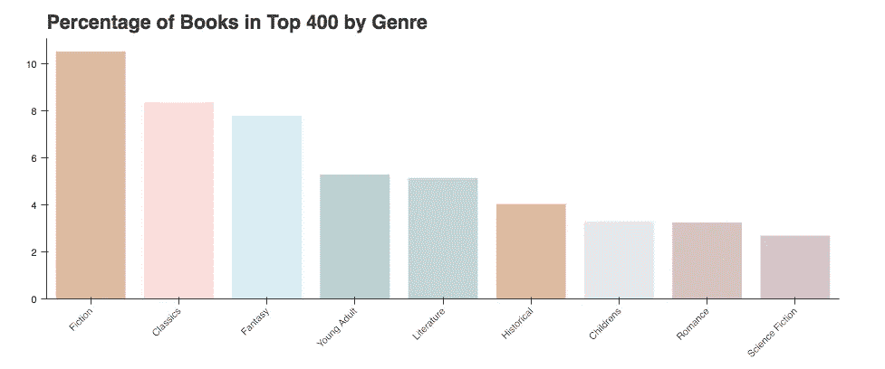

**上面的直方图提出了几个问题:**

*   各流派在 400 强榜单中的分布情况如何？比如，小说类书籍主要在前 100 名还是在前 400 名榜单的底部？
*   如果一本书的体裁是小说、幻想或经典，它更有可能进入前 400 名吗？如果这三种类型在 Goodreads.com 有很高的代表性呢？人们应该预料到一个流派进入前 400 名的可能性与该流派在所有 Goodreads.com 书籍中的流行程度成正比。

*400 强榜单内各流派分布*

下面的热图回答了第一个问题:它按排名类别显示了前 16 个流派的分布(例如，前 100、前 200 等。).颜色描述了书籍的数量。

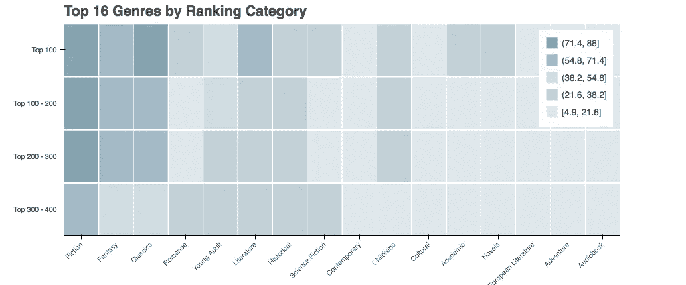

一个有趣的发现:文学体裁不属于三大体裁。然而，它在 100 强名单中占有很高的比例。

*引入另一个数据集:我们的控制列表*

如上所述，如果我们不能把它和最差的 400 个榜单进行比较，那么前 400 个榜单就毫无意义。可惜没有这样的名单…

在没有“史上最差书籍”榜单的情况下，我随机抽取了 1 万本关于 goodreads.com 的书籍，作为我的“对照”榜单。

*免责声明:我后来才知道，goodreads.com 上的确有最差书籍***排行榜。**

*下面的直方图比较了控制列表和最佳书籍列表之间的流派分布。*

*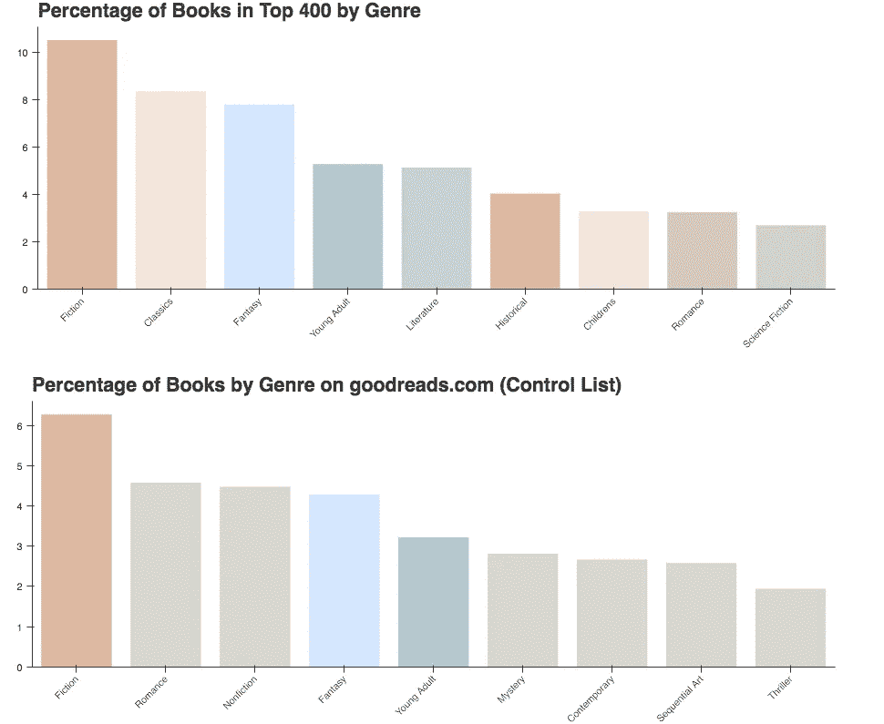*

*一个有趣的发现:虽然经典作品在 goodreads.com 上的代表性不足，但它在 400 强榜单中却占有很高的比例，这表明读者更有可能投票支持经典作品。*

*另一方面，小说、幻想和青少年体裁在 goodreads.com 书籍中占有相当大的比例。它们进入前 400 名的可能性高于像古典文学这样代表性不足的流派。*

*有最佳页数吗？*

*简而言之，答案是否定的。如下图所示，对照名单和前 400 名名单之间也有类似的趋势。页面数量不是成功的预测因素。*

*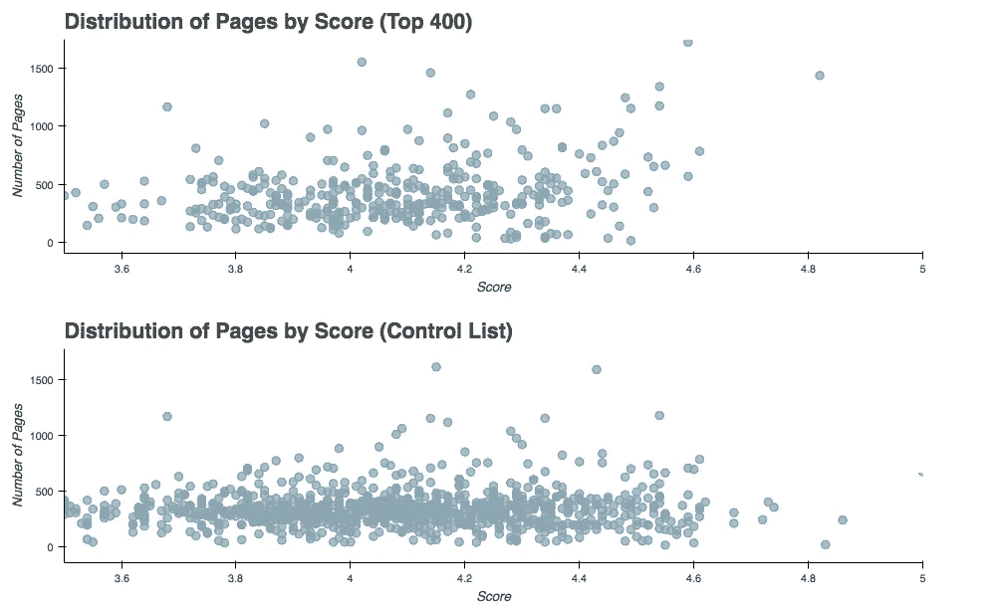*

# ***2-发布***

*出版年份有关系吗？*

*对于这一部分，我查看了每年排名前 400 的书籍的分布，并调查了一个可能的**关联:***

*   ***每年出版的平均页数***
*   *每年售出的图书总数*

**总计数与平均页数(按出版年份)**

*排名前 400 的书籍中有很大一部分是在 2003 年至 2006 年间出版的。尽管平均出版页数的一些峰值与排名前 400 的书籍数量的峰值一致，但这两个变量之间没有相关性。*

*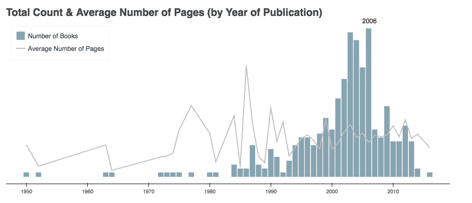*

*有趣的是，控制列表(下图)的趋势与前 400 名列表的趋势不同。尽管很多书是在 2010 年后出版的，但它们在 400 强榜单中的代表性不足。*

*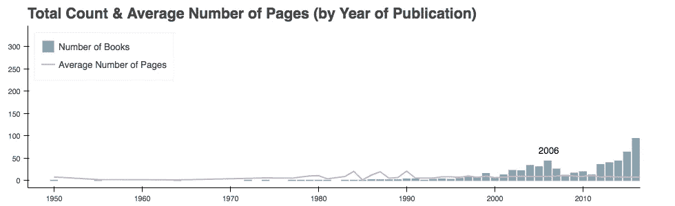*

*对于那些对细节感兴趣的人来说，下面是 2003 年、2004 年和 2006 年十大畅销书的名单。*

*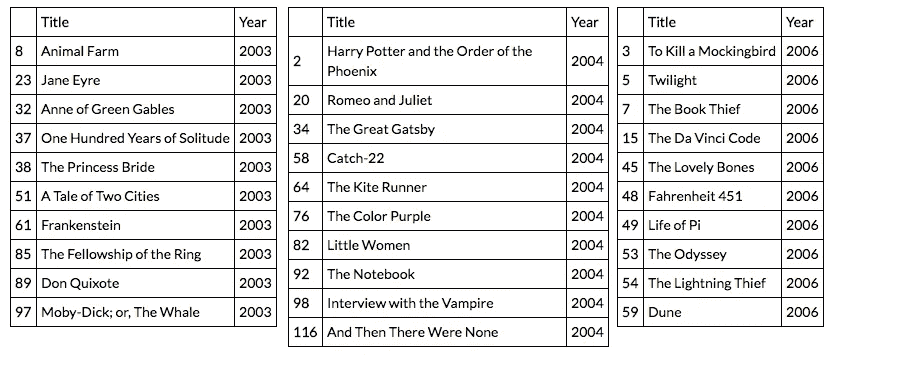*

**售出图书数量与前 400 名图书数量之比**

*每年前 400 的图书分布和当年的图书销量有关联吗？如下图所示，情况似乎并非如此。*

*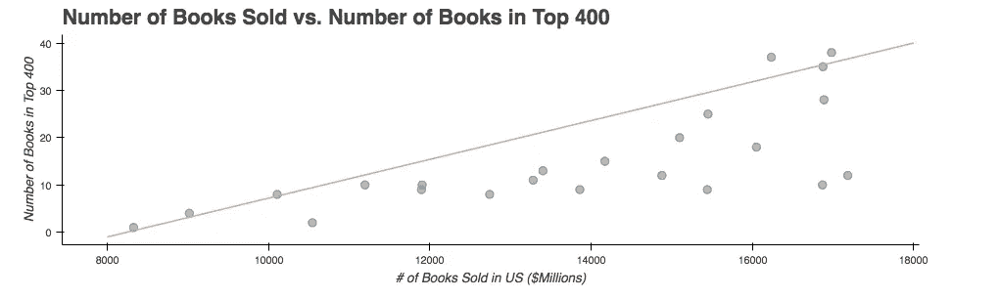*

*然而，数据集是有偏差的(如下所述)，所以对结果不能全信。*

*我使用了来自美国人口普查局的数据集，该数据集提供了每年售出的图书数量。该数据集仅包括 1992 年至 2014 年美国书店销售的图书数量。换句话说:*

*   *样本量有限(23 年)。*
*   *网上销售没有被计算在内，我们预计这意味着本世纪的大量图书销售没有被计算在内。不幸的是，由于没有网上图书销售的官方记录，实际数字无法核实。*
*   *它没有报告售出的独特书籍的数量，这意味着我们一年可以卖出 1000 本全部是哈利波特系列的书。*

# ***3-预测***

***评论的数量是成功的预测因素吗？***

*评论的数量是排名前 400 的指标。我们看到一个明显的趋势，前 100 本书比前 100-200 本书收到的评论更多，而前 100-200 本书收到的评论又比前 200-300 本书多，等等。*

*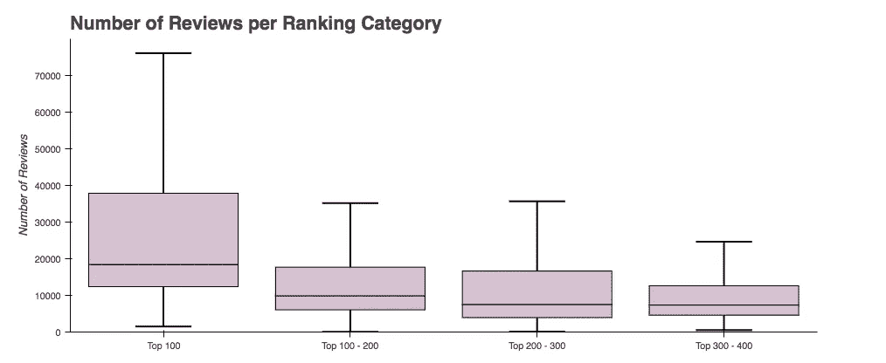*

***是否应该得出评论越多越好的结论？**或者说评论数量和评分之间的关系是一条最好和最差的书获得更多评论的倒钟形曲线？毕竟，一本普通的书不会引发强烈的情绪(无论是积极的还是消极的)；只有最好的和最差的才知道。*

*控制列表没有证实倒钟形曲线的假设。相反，五星的书得到的评论比四星的书少，而一两星的书几乎得不到任何评论。*

*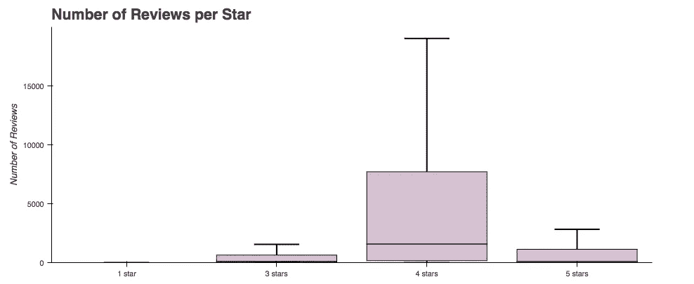*

***哪些词，在哪个频率下，可以预测成功？***

*我使用 AFINN 字典开始对评论专栏进行情感分析。*

*AFINN 方法的输出是一个浮动变量(AFINN 分数)，如果大于零，则表示正面情绪，小于零，则表示负面情绪。**刻度范围从-5 到+5。***

**首先测试控制列表上的 AFINN 方法**

*需要高水平的粒度来识别哪些单词可以预测一本书在 Top 400 列表中的排名。在将 AFINN 方法应用于前 400 名名单之前，我在一个更广泛的名单上检查了它的可靠性，即控制名单。*

*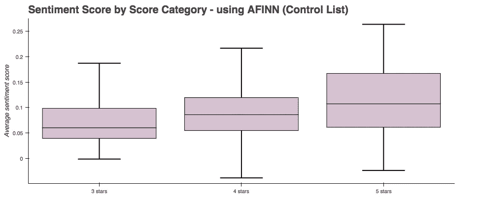*

*AFINN 词典似乎是一个很好的成功预测器(如上图所示)。下一步是看它是否能帮助区分前 100 名和前 300 名的书…*

*不幸的是，如下图所示， **AFINN 词典的粒度不足以预测“有史以来最好的书”名单中的排名**(根据定义，所有的书都是成功的)。*

*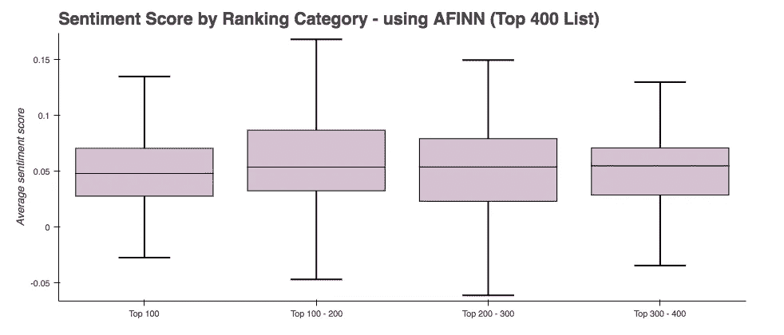*

*下面的散点图提供了与箱线图相同的见解，只是我使用了连续变量(得分)而不是离散变量(排名类别)，并通过颜色区分了排名类别。*

*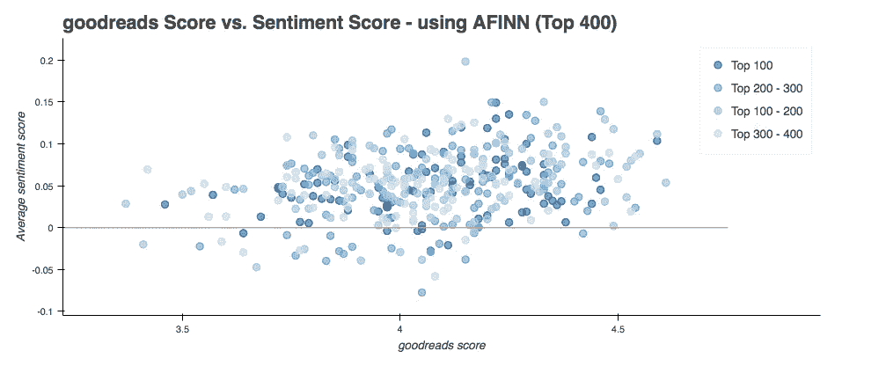*

*在上面的散点图中，分数没有下降到-1.5 以下，这是有意义的，因为我们不希望“有史以来最好的”书籍有很高的负面情绪分数(即-3，-4 或-5)。然而仍然有**少量的预测误差**；一些排名前 100 的书有负面情绪得分。*

*我的情感分析需要一些微调:*

*   *我**没有查看书评的总得分，而是分析了书评中的每个单词**，以了解**的 AFINN 得分和频率**如何预测一本书的排名。*
*   *我还查看了另一个库， **Vader 词典，**它提供了更多的粒度。*

**观察单个的正面和负面词汇，以及它们如何影响一本书的排名**

*如下图所示，一个单词的出现频率和 goodreads 平均得分之间没有相关性。*

*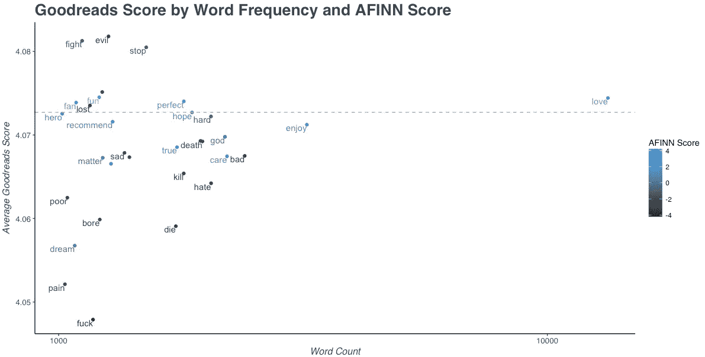*

*有趣的是，一些 AFINN 得分较低的词在成功书籍的评论中出现得相当频繁。这是因为 AFINN 词典是用 **unigram 特征构建的，其中忽略了语法甚至单词的顺序**，这意味着句子“我不喜欢”中的“喜欢”将被正面解释。*

**查看另一个库——Vader lexicon——以帮助更好地预测分数**

*我对 AFINN 词典不太满意，决定看看 Vader 词典。它的算法似乎更精细，因为它输出 4 类情感:*

*   *阴性:阴性*
*   *neu:中性*
*   *位置:正*
*   *复合:复合(即，通过将评论中每个词的化合价分数相加来计算的总分数，根据 Vader 规则进行调整，然后标准化为-1(最极端的负面)和+1(最极端的正面)之间的分数)*

*我使用配对图来分析以下各项之间的相关性:*

*   *Vader 正分数(pos)和 goodreads 分数*
*   *维德负分数(neg)和古德里德分数*
*   *维德复合得分(复合)和古德里德得分*

*pearson's r 值为 0.5 或更高的图表显示相关性，为绿色。Pearson r 的范围从-1 到 1，其中:*

*   *r 为-1 表示变量之间完全负线性关系，*
*   *r 为 0 表示变量之间没有线性关系，以及*
*   *r 为 1 表示变量之间完全正线性关系。*

*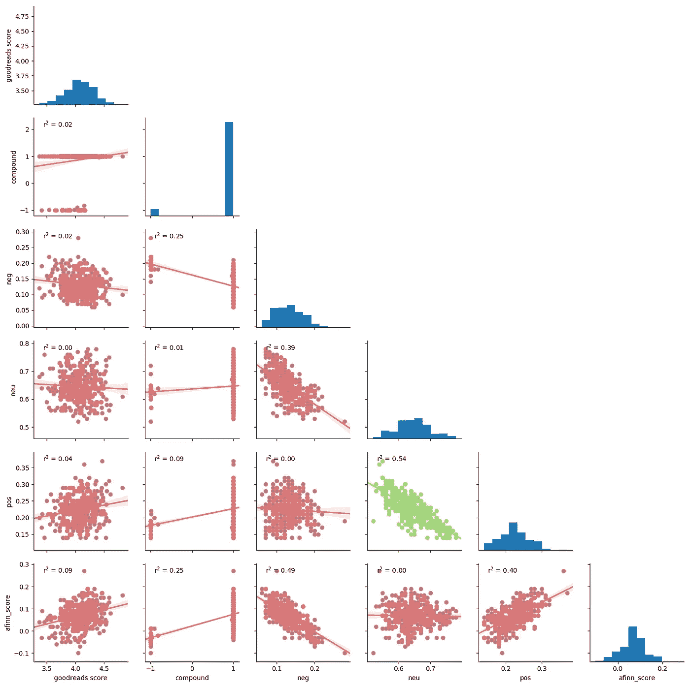*

*Vader 中性和阳性分数之间存在负相关，这是有意义的:分数毕竟来自同一个词典。然而，Vader 正负分数之间没有相关性，这令人惊讶。*

*最后，我感兴趣的变量之间没有关联(例如，Vader 正、负、复合分数与 goodreads 分数)。*

# ***会有，应该会有，可能会有***

*我的分析表明，经典类的**书更有可能进入前 400 名榜单**。*

*虽然排名前 400 位的书籍大多平均有 300 页，但没有明确的模式表明出版年份或页数。*

*评论的数量是成功的一个很好的预测指标:越多越好。然而，这无助于区分四星和五星的书籍。也就是说，五星级的书可能比四星级的书卖得好，这不是我分析的一部分。*

*最后，情感分析部分在预测一本书在排行榜前 400 名中的成功是不成功的。AFINN 和 Vader 方法帮助预测了 goodreads.com 获得高分的可能性。然而**一旦一本书进入前 400 名榜单，并且需要高水平的粒度来将其与其他成功的书籍区分开来并预测其排名，这两种方法就不可靠了**。*

***如果给我更多的时间和数据，下面是我可以、将要和应该完成的分析的快速列表:***

*   ***更多关于用户写评论的数据**:我希望这些评论包括写评论的人的人口统计数据，以回答一些问题，例如:来自特定城市、特定年龄组或性别的人在评论时更无情吗？*
*   ***使用单文法与 n 文法:**情感分析是用单文法特征构建的。这意味着整个文本被分割成单个单词，使单词脱离了上下文，从而降低了检测评论情感的准确性。n-gram 越长(n 越高)，需要处理的上下文就越多。我希望我已经知道了基于 n-grams 的词典或者 R 中的 Syuzhet 包，这将我带到下一个要点。*

*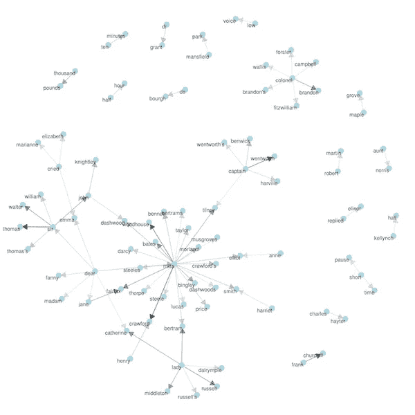*

*   ***使用 R** :总的来说，我觉得对于情感分析部分，R 可能是一种更好的语言。事实上，我开始用 R 编写代码，并为这一部分用 Python 翻译了我的代码。*
*   ***每本书的评论数量有限:**我只抓取了一本书的前 30 篇评论，这确实限制了情感分析，并且可能会引入一些偏见(尽管第一篇评论是随机显示的，并且没有按照新近度排序)。*
*   *更多见解:我希望我的分析更有成果，尤其是情感分析部分。*