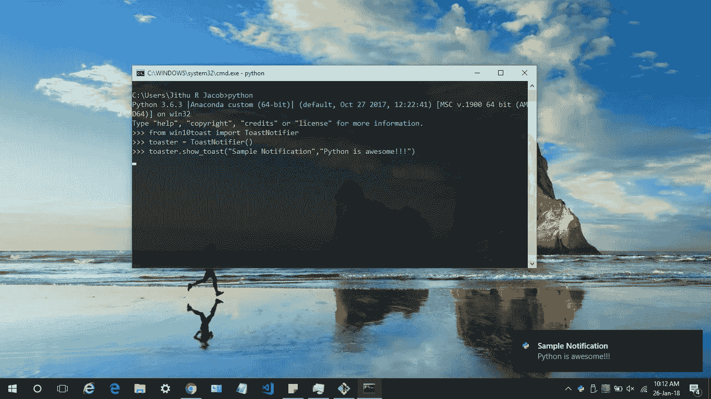
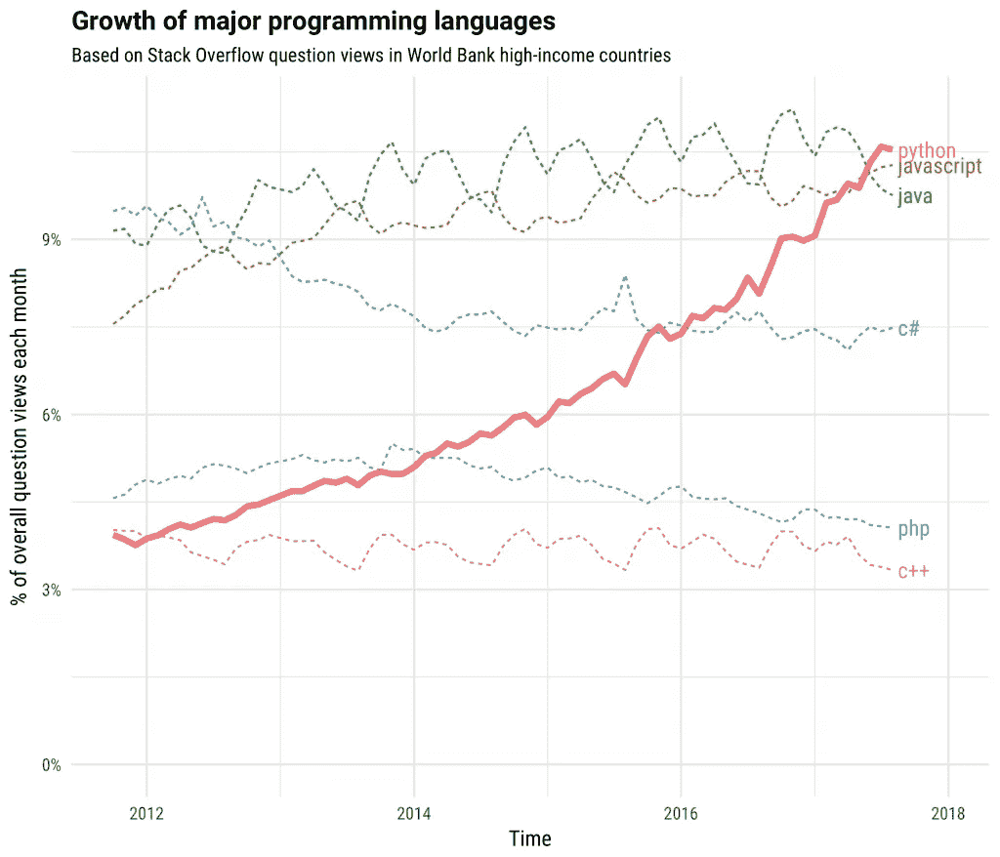

# 如何用 Python 制作 Windows 10 吐司通知

> 原文：<https://towardsdatascience.com/how-to-make-windows-10-toast-notifications-with-python-fb3c27ae45b9?source=collection_archive---------1----------------------->



Sample Toast Notification

# **Python！！那是什么？**

[Python](https://www.python.org/) 是一门漂亮的编程语言。它拥有你可能需要的一切。它有一个易于使用的软件包管理器，可以帮助我们建立网络应用程序，桌面应用程序，网络应用程序和基于数据的应用程序。

如果你正在寻找 2018 年学习 Python 的理由，请阅读这篇 Stack Overflow 博文。

[](https://stackoverflow.blog/2017/09/06/incredible-growth-python/) [## Python |堆栈溢出的惊人增长

### 我们最近探讨了富裕国家(被世界银行定义为高收入的国家)如何倾向于访问不同的…

stackoverflow.blog](https://stackoverflow.blog/2017/09/06/incredible-growth-python/) 

# **win10toast**

作为一名[机器学习工程师](https://linkedin.com/in/jithurjacob/)，我在开源社区消费了很多才华横溢的人构建的包。我很高兴能回馈给这个了不起的社区一个小包裹。

在我的工作中，我习惯于运行需要几个小时的神经网络，所以我会一边看电影一边等它结束。我想有一种简单的方法在脚本运行结束时得到通知，而不是打断我的电影并检查进度。所以我创建了一个包来给我发送 Toast 通知😃

# **如何入门？**

该软件包已经在 Pypi 中发布，可以很容易地与 pip 一起安装。

```
pip install win10toast
```

一旦安装完成，你可以尝试一个简单的通知。

```
from win10toast import ToastNotifier
toaster = ToastNotifier()
toaster.show_toast("Sample Notification","Python is awesome!!!")
```

有关高级使用说明，请参考[文档](https://github.com/jithurjacob/Windows-10-Toast-Notifications/blob/master/README.md)。

如果你喜欢这个包，或者对扩展的源代码感兴趣，请访问我的 GitHub 库。

[](https://github.com/jithurjacob/Windows-10-Toast-Notifications) [## jithurjacob/Windows-10-Toast-通知

### 显示 Windows 10 Toast 通知的 Python 库

github.com](https://github.com/jithurjacob/Windows-10-Toast-Notifications) 

*记得给本帖一些*👏如果你喜欢的话。关注我了解更多内容:)

**我以前的帖子**

[](/how-to-improve-your-workflow-with-vs-code-and-jupyter-notebook-f96777f8f1bd) [## 如何用 VS 代码和 Jupyter 笔记本改善你的工作流程

### 增强您的数据科学工作流程。Jupyter 笔记本+ VS 代码=💘

towardsdatascience.com](/how-to-improve-your-workflow-with-vs-code-and-jupyter-notebook-f96777f8f1bd)