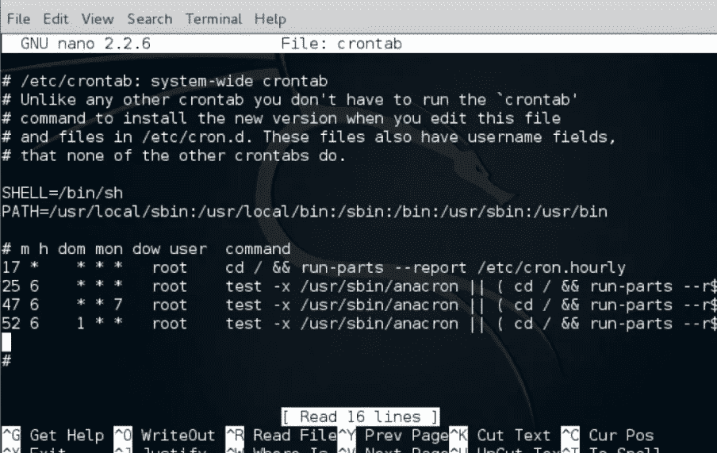
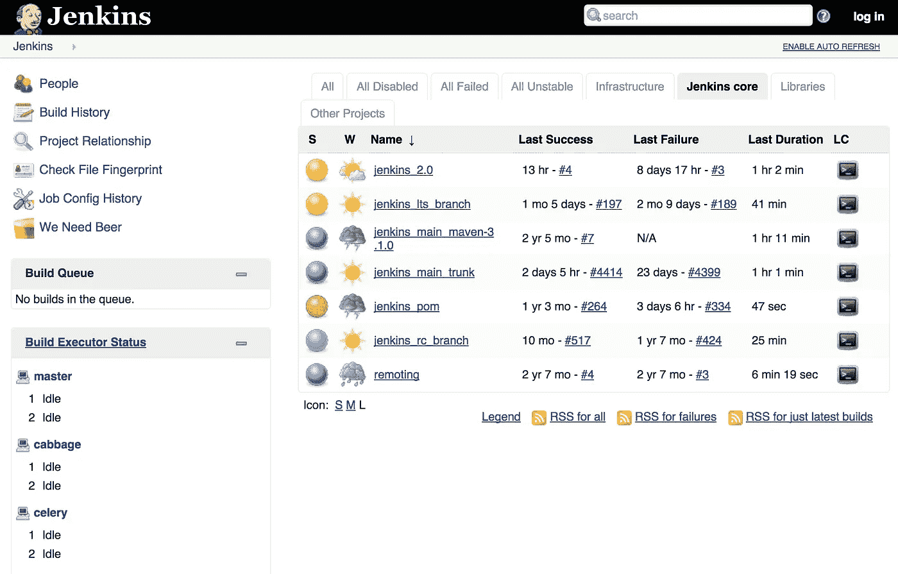
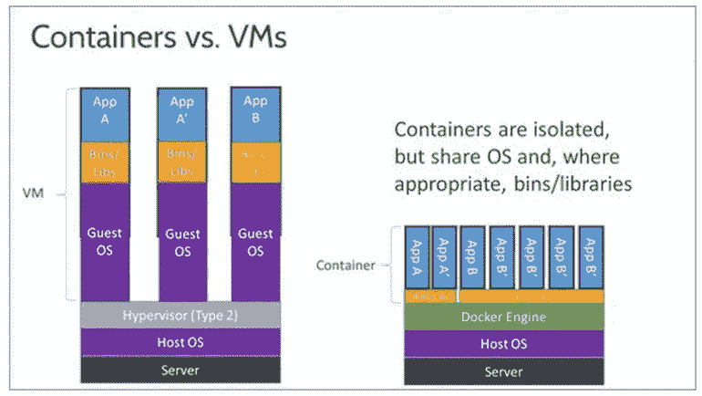
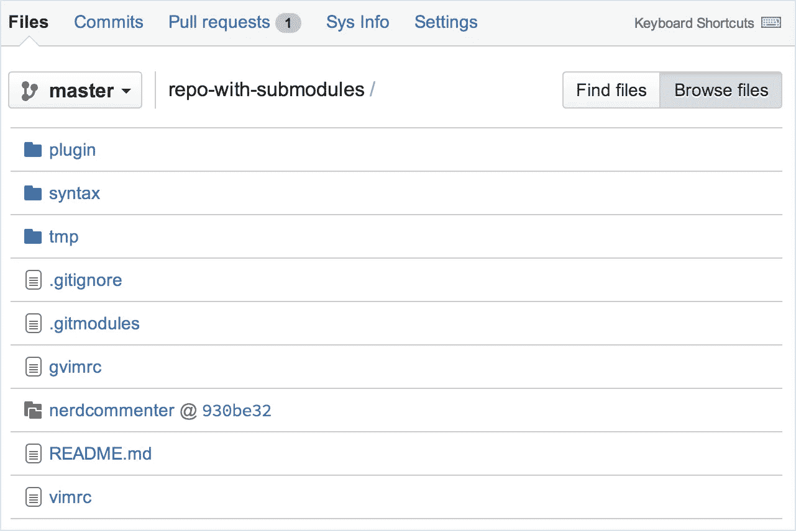
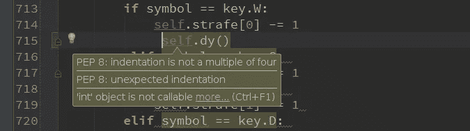

# 如何让你的软件开发体验…没有痛苦…

> 原文：<https://towardsdatascience.com/how-to-make-your-software-development-experience-painless-2591ebcc69b6?source=collection_archive---------4----------------------->

在各种形式的组织中工作(从面向大型软件开发的小型初创企业到学术实验室)，我注意到人们倾向于让自己的生活比实际需要的更艰难。因此，我将利用这篇文章来解释如何让你的软件开发经历不那么痛苦。

# **作业调度器**

如果它简单、乏味且令人讨厌地重复，那么你可以自动完成它。如果你是一个 Unix 用户(像大多数程序员一样…我讨厌 Windows…)，你将可以访问 cron 作业。cron 软件实用程序是一个基于时间的作业调度程序，在类似 Unix 的计算机操作系统中。建立和维护软件环境的人使用 cron 来安排作业在固定的时间、日期或间隔定期运行。学习 Unix [crontab](http://www.adminschoice.com/crontab-quick-reference) 命令。

# **自动化测试**

如果你一个人或者团队中的多个成员独立地开发同一个代码库，很可能有人会在代码中引入某种形式的 bug。通常的程序是花几个小时追踪整个代码中的微小错误，同时以胎儿的姿势哭泣(如果你还没有哭够，那么你可能不是一个真正的程序员)。就自动化测试而言，有很多选择。单元测试非常普遍。JUnit 面向 Java 用户，而[非 ittest](https://docs.python.org/3/library/unittest.html) 库面向 Python 开发者。然而，在将代码投入生产之前，有些人可能会忘记在团队中正确运行单元测试。为了避免这样的灾难，自动化测试是很重要的。虽然你可以使用 [crontab](http://www.adminschoice.com/crontab-quick-reference) 来运行自动化测试，但我会推荐使用更专业的工具，比如 [Jenkins](https://jenkins.io/) 。Jenkins 允许你安排测试，从版本控制库中挑选特定的分支，如果有问题就发邮件给你，如果你想用沙箱保护你的测试，甚至可以旋转容器图像。

# **集装箱**

沙盒是编码的重要组成部分。这可能涉及到为各种应用程序提供不同的环境。它可以简单地将生产环境复制到开发中。这甚至意味着拥有多个不同软件版本的生产环境，以迎合更大的客户群。如果您想到的最佳方法是使用带有[虚拟箱](https://www.virtualbox.org/)的虚拟机，我相信您已经注意到，您要么需要使用完全相同的虚拟机进行多轮测试(糟糕的 DevOps 卫生状况)，要么为每次测试重新创建一个干净的虚拟机(根据您的需要，这可能需要近一个小时)。一种更简单的替代方法是在虚拟机上使用容器而不是完整容器。容器只是一个 unix 进程或线程，看起来、闻起来和感觉起来都像 VM。它的优势在于低功耗和低内存消耗(这意味着你可以在几分钟内随意启动或关闭它)。流行的容器化技术包括 [Docker](https://www.docker.com/) (如果你希望只使用一个容器)或 [Kubernetes](https://kubernetes.io/) (如果你喜欢为多服务器工作流编排多个容器)。

# 版本控制

想象一下将您的代码推向生产。而且很管用！完美。没有抱怨。随着时间的推移，您会不断添加新功能并开发它。然而，这些特性中的一个给你的代码引入了一个错误，严重扰乱了生产应用程序。您希望您的许多单元测试中的一个能够发现它。然而，仅仅因为一些东西通过了你所有的测试并不意味着它没有错误。这只是意味着它通过了当前编写的所有测试。因为这是生产级代码，所以你没有时间去调试。时间就是金钱，你有愤怒的客户。回到代码工作的时候不是很简单吗？？？这就是版本控制的用武之地。在[敏捷](https://www.agilealliance.org/agile101/)风格的代码开发中，产品在一个不确定的时间周期内保持零碎的开发。对于这样的应用程序，某种形式的版本控制将非常有用。我个人喜欢 [Git](https://git-scm.com/) ，但是 [SVN](https://subversion.apache.org/) 用户依然存在。Git 可以在所有形式的平台上工作，如 [GitHub](https://github.com/) 、 [GitLab](https://gitlab.com/) 和 [BitBucket](https://bitbucket.org/) (每种平台都有自己独特的优缺点)。如果你已经熟悉了 git，可以考虑在 Atlassian 上学习更高级的 Git 教程。我推荐查找的一个高级特性是 [Git 子模块](https://git-scm.com/book/en/v2/Git-Tools-Submodules)，在这里您可以存储多个独立 Git 存储库的特定提交散列，以确保您可以访问一组稳定的依赖项。

# 设计模式和代码味道

当人们开始自学程序员时，很多时候我们想的是创建一个简单的应用程序。成功了，完美！下一个受害者！然而，一旦我们试图扩大规模，各种各样的随机问题就开始出现。糟糕的编码实践，缺乏文档和紧密耦合。为了开发一个更加灵活、可重用和可维护的代码库，理解设计模式和代码味道的基础是很重要的。我强烈推荐阅读的一本书是由 Erich Gamma、Richard Helm、Ralph Johnson 和 John Vlissides 撰写的《设计模式:可重用面向对象软件的元素》。SourceMaking.com 的[也是一个非常好的参考网站，提供了 Python、Java 和 c 语言的例子。我已经在以前的博客中提到过一些例子:](https://sourcemaking.com/)[软件开发设计原则](https://medium.com/@sadatnazrul/software-development-design-principles-79d15ef765f3)

# 评论

最后，防止软件开发过程失控的最显而易见的方法是拥有某种程度的文档。虽然拥有多个包含每个微小功能的详细文档并随着代码的发展而更新它们的 pdf 文件是很好的，但这很可能是不实际的。在高节奏和高压力的软件开发环境中，即使是最自律的开发人员也会面临某种程度的不幸。记录代码的最佳方式是在脚本中添加注释。当人们开发脚本时，评论会发生变化。不同的编程语言有特殊的注释规则。作为一名 Python 程序员，我非常依赖 [PEP8](https://www.python.org/dev/peps/pep-0008/) 。评论很重要的一点是，它应该是显而易见的。如果你需要大量的注释来解释一段简单的代码，很可能你的代码写得不好(一种很常见的[代码味道](https://sourcemaking.com/antipatterns))。把评论当成讲笑话。如果需要解释，不会让任何人发笑。