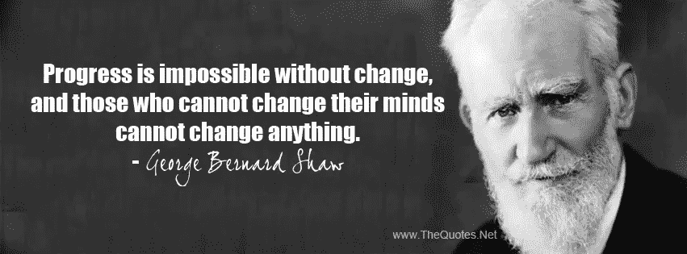

# 如何从 tf.contrib.learn 估计器过渡到核心 Tensorflow tf？估计量

> 原文：<https://towardsdatascience.com/how-to-move-from-tf-contrib-learn-estimator-to-core-tensorflow-tf-estimator-af07b2d21f34?source=collection_archive---------4----------------------->

我有一堆使用“原始”估计器 API 构建的机器学习模型，在 tf.contrib.learn 中的那个。在 Tensorflow 1.2 中，它的一部分被移到了 core，在 Tensorflow 1.4 中，我需要的剩余部分最终到达了 core Tensorflow。所以，是时候开始迁移到核心评估 API 了。

当 Tensorflow 团队将代码从 contrib 转移到 core 时，他们趁机清理 API。另一种方法是在 contrib 接受之前对所有东西进行昂贵的代码审查，而不仅仅是证明有用的东西。那会减缓创新…

在任何情况下，如果我们发现 contrib 中的一个实验包是有用的，我们应该准备好花一点时间和精力将我们的代码迁移到核心。这通常不仅仅是将包名(例如)从 tf.contrib.learn.Estimator 改为 tf。估计者又收工了。

让我们分四个部分来看看从 tf.contrib.learn 到 tf.estimator 的过程:

1.  如果您正在将一个固定的估计器(例如，tf.contrib.learn.DNNClassifier)移动到 tf。估计器. dnn 分类器)
2.  如果您正在移动一个定制的估计器(例如，如果您做了一些类似于我在[文本卷积](/how-to-do-text-classification-using-tensorflow-word-embeddings-and-cnn-edae13b3e575?source=user_profile---------8----------------)或[时间序列预测](https://medium.com/google-cloud/how-to-do-time-series-prediction-using-rnns-and-tensorflow-and-cloud-ml-engine-2ad2eeb189e8?source=user_profile---------9----------------)上的博文，因此需要从 tf.contrib.Estimator(model_fn)更改为 tf。估计器(model_fn)。
3.  如何从代码中移除 tf.contrib.learn.Experiment 和 learn_runner？
4.  对您的云 ML 引擎脚本的更改

# 没有变化就不可能有进步

哇哦。变化真大！考虑到这里的巨大变化，你将来使用 contrib 中的类的可能性有多大？你是否认为你宁愿等待尘埃落定，并在它们进入核心后使用它们？



当然，如果你想要一个稳定的 API，你应该坚持使用核心 Tensorflow 中的东西。但是我想你和我一样，相信萧伯纳的格言:不改变就不可能进步，你决定使用 contrib，因为你知道你将来必须做出一些改变。

不过，一切都完了，是时候付出代价了！让我们一个一个地看一下这些变化。

# 如何移动固定估计量

对固定估计量的更改主要涉及特性列。走这几行:

```
import tensorflow.contrib.layers as layers
is_male = layers.sparse_column_with_keys('is_male', 
                            keys=['True', 'False'])
age = layers.real_valued_column('mother_age')b_age = layers.bucketized_column(age, np.arange(15,45,1).tolist())crossed = layers.crossed_column([b_age, ...], 200)
embed = layers.embedding_column(crossed, 3)
```

功能列包和方法名称已更改。以下是替代产品的外观:

```
import tensorflow.feature_column as fc
is_male = fc.categorical_column_with_vocabulary_list('is_male',                       
                             ['True', 'False'])
age = fc.numeric_column('mother_age')b_age = fc.bucketized_column(age,
                        boundaries=np.arange(15,45,1).tolist())crossed = fc.crossed_column([b_age, ...], 
                        hash_bucket_size=200)
embed = fc.embedding_column(crossed, 3)
```

在不熟悉这些术语的情况下，关于特性列的 [Tensorflow 文档非常有用。改变后的方法名(分类的代替了稀疏的，数字的代替了实数的)得到了字段的特征而不是它们的表示，新的 API 有了更多的灵活性。](https://www.tensorflow.org/versions/master/get_started/feature_columns)

一旦您有了特性列，创建评估器仍然是一样的。例如，改变，

```
tf.contrib.learn.DNNLinearCombinedRegressor
```

收件人:

```
tf.estimator.DNNLinearCombinedRegressor
```

你完了。

但是，您还应该收紧您的服务输入 fn(例如，Tensorflow 将使用这个函数来解析接收到的 JSON，并将其输入到您的模型中)。你可能会有这样的想法:

```
return tf.contrib.learn.utils.input_fn_utils.InputFnOps(
     features,
     None,
     feature_placeholders)
```

现在，它将变成:

```
return tf.estimator.export.ServingInputReceiver(
           features, 
           feature_placeholders)
```

实际上，没有人需要的第二个参数已经去了它的休息处。

# 如何移动自定义评估员

在向核心迁移的过程中，定制估算器变得更加灵活和强大。

在您的自定义估算器中，您曾经有一个这样定义的模型函数:

```
def cnn_model(features, target, mode):
   # stuff ... return tf.contrib.learn.ModelFnOps(
      mode=mode,
      predictions=predictions_dict,
      loss=loss,
      train_op=train_op)
```

这现在变成了:

```
def cnn_model(features, labels, mode, params):
    # STUFF if mode == tf.estimator.ModeKeys.TRAIN or mode == tf.estimator.ModeKeys.EVAL:
       eval_metrics = {'acc': tf.metrics.accuracy(tf.argmax(logits,1), labels)}
    else:
       eval_metrics = None   return tf.estimator.EstimatorSpec(
      mode=mode,
      predictions=predictions_dict,
      loss=loss,
      train_op=train_op,
      eval_metric_ops=eval_metrics,
      export_outputs={'classes': tf.estimator.export.PredictOutput(predictions_dict)}
    )
```

让我们打开它。这些是关键的变化:

1.  请注意，您现在获得了一个额外的参数。您可以使用它向您的模型传递一个额外的字典。当您使用 Cloud ML 引擎并且想要超参数调整模型参数时，这非常方便。稍后会有更多内容。
2.  以前是 TF . contrib . learn . mode keys . train 之类的模式现在是 tf.estimator.ModeKeys.TRAIN，这里没什么大不了的。它们映射到的数字还是一样的，所以即使你不改变代码，也不会发生什么疯狂的事情。但是最好清理一下，用核心包。
3.  你现在返回一个 tf.estimator.EstimatorSpec，而不是返回一个 tf.contrib.learn.ModelFnOps，但是 EstimatorSpec 有一些新的功能。具体来说，您现在可以指定要评估的指标列表。EstimatorSpec 还提供了导出预测字典的不同部分的能力。

模型函数本身被传递到一个估计器中，如下所示:

```
tf.contrib.learn.Estimator(model_fn=cnn_model,
            model_dir=output_dir),
```

相反，您将像这样传递它:

```
training_config=tf.estimator.RunConfig(save_checkpoints_steps=1000)
hparams = parser.parse_args().__dict__tf.estimator.Estimator(model_fn=cnn_model,                                  
    model_dir=output_dir,                               
    config=training_config,                               
    params=hparams),
```

请注意，我将命令行参数作为 params 传入。这就是上面 cnn_model()的第四个参数——在 Cloud ML Engine 中，这个传递允许我对模型进行超参数调整。

# 摆脱实验

实验，原谅我的双关语，是一个失败的实验。替换核心 Tensorflow 功能是使用 tf。Estimator.train_and_evaluate()。

您可能有这样的设置:

```
def make_experiment_fn(output_dir):
  def experiment_fn(output_dir):
     wide, deep = get_wide_deep()
     return tf.contrib.learn.Experiment(
          estimator,    
        train_input_fn=read_dataset('train'),
        eval_input_fn=read_dataset('eval'),
        eval_metrics={
            'rmse': tf.contrib.learn.MetricSpec(
                metric_fn=metrics.streaming_root_mean_squared_error
            )
        },
        train_input_fn=read_dataset('train', PATTERN),
        eval_input_fn=read_dataset('eval', PATTERN),
        export_strategies=[saved_model_export_utils.make_export_strategy(
             serving_input_fn,
             default_output_alternative_key=None,
             exports_to_keep=1
         )],
        train_steps=TRAIN_STEPS
     )
   return experiment_fnlearn_runner.run(make_experiment_fn, output_dir)
```

这将变成:

```
train_spec=tf.estimator.TrainSpec(
                         input_fn=read_dataset('train', PATTERN),
                         max_steps=TRAIN_STEPS)
exporter = tf.estimator.LatestExporter('exporter',serving_input_fn)
eval_spec=tf.estimator.EvalSpec(
                         input_fn=read_dataset('eval', PATTERN),
                         steps=None,
                         exporters=exporter)
tf.estimator.train_and_evaluate(estimator, train_spec, eval_spec)
```

本质上，以前调用 learn_runner.run()的地方，现在调用 TF . estimator . train _ and _ evaluate()。您向它传递了 estimator 和 train_spec，它们封装了有关您的训练数据的细节，还传递了 eval_spec，它们对您的评估数据执行相同的操作。导出发生在评估期间，因此您在那里指定您的导出器(LatestExporter 或 FinalExporter)。

请注意，在实验中，您曾经指定 eval_metrics，但是它已经被移到 EstimatorSpec 中(参见上一节，关于定制估计器)。我不清楚如果你使用一个固定的评估器，你如何获得额外的评估指标…幸运的是，我还没有遇到这种需求。

# 对您的云 ML 引擎脚本的更改

你必须对你的开发环境做什么改变？

嗯，云数据实验室现在带有 Tensorflow 1.4，所以只需启动一个新的实例，并在其中运行您的笔记本电脑。不需要其他更改。

在提交培训作业的 gcloud 命令中，指定 runtime _ version 1.4 而不是 1.2。所以改变:

```
gcloud ml-engine jobs submit training $JOBNAME \
   ...
   --runtime-version 1.2 \
   ...
```

收件人:

```
gcloud ml-engine jobs submit training $JOBNAME \
   ...
   --runtime-version 1.4 \
   ...
```

contrib 中的 saved_model_export_utils 用于将导出的模型写入名为 Servo 的目录中。嗯，Servo 是构建 Tensorflow 服务的 Google 项目的内部项目代号…该目录现在被称为“exporter”而不是“Servo”。据推测，这是为了防止另一个团队出现并构建更好的东西。因此，如果你有一个脚本:

```
MODEL_LOCATION=$(gsutil ls gs://${BUCKET}/babyweight/trained_model/export/Servo/ | tail -1)
```

您将把它改为:

```
MODEL_LOCATION=$(gsutil ls gs://${BUCKET}/babyweight/trained_model/export/exporter/ | tail -1)
```

当您部署模型时，请确保指定 Tensorflow 运行时版本:

```
gcloud ml-engine versions create ${MODEL_VERSION} --model ${MODEL_NAME} --origin ${MODEL_LOCATION} --runtime-version 1.4
```

其他一切都保持不变。

编码快乐！