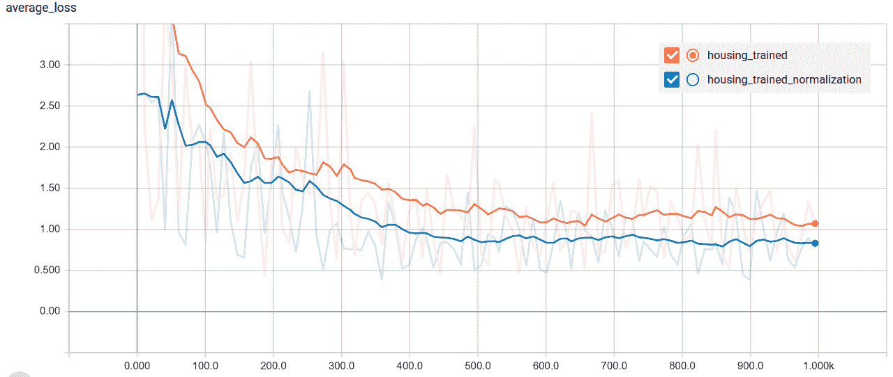

# 如何归一化 TensorFlow 中的特征

> 原文：<https://towardsdatascience.com/how-to-normalize-features-in-tensorflow-5b7b0e3a4177?source=collection_archive---------3----------------------->


Photo by [Karsten Würth (@inf1783)](https://unsplash.com/@inf1783?utm_source=medium&utm_medium=referral) on [Unsplash](https://unsplash.com?utm_source=medium&utm_medium=referral)

***TL；DR*** *使用* `*tf.estimator*` *时，使用* `*tf.feature_column.numeric_feature*` *中的* `*normalizer_fn*` *参数，使用相同的参数(均值、标准差等)进行归一化。)进行培训、评估和服务。*

```
def zscore(col):
  mean = 3.04
  std = 1.2
  return (col — mean)/stdfeature_name = ‘total_bedrooms’
normalized_feature = tf.feature_column.numeric_column(
  feature_name,
  normalizer_fn=zscore)
```

## **归一化为**

神经网络激活通常喜欢它们的输入被标准化。将网络中节点的输入标准化有助于防止所谓的消失(和爆炸)梯度。[批量规范化](/how-to-use-batch-normalization-with-tensorflow-and-tf-keras-to-train-deep-neural-networks-faster-60ba4d054b73)是最全面的规范化方法，但是它会产生额外的成本，并且对于您的问题来说可能是多余的。因此，您可能只想规范化您的输入。

使用`tf.estimator` API(这是构建 TensorFlow 模型最简单的方法)时，有两种规范化输入的方法:在`input_fn`内部和创建`feature_column`时。我将向您展示一个执行阶梯的示例，然后我将向您展示如何使用 [ML 引擎](https://cloud.google.com/ml-engine/)训练多个模型。

## **样板代码:使用** `normalizer_fn` **参数**进行规范化

查看[这款笔记本](https://github.com/GoogleCloudPlatform/training-data-analyst/tree/master/blogs/feature_column_normalization)的完整工作示例。

规范化 input_fn 中的[允许更大的灵活性(您也可以在这里执行特征工程)，但是我发现将`normalizer_fn`与`tf.feature_column.numeric_column`一起使用更优雅。下面是一个基本的例子:](https://stackoverflow.com/a/46480180)

```
*def zscore(col):
  mean = 3.04
  std = 1.2
  return (col — mean)/std**feature_name = ‘total_bedrooms’
normalized_feature = tf.feature_column.numeric_column(
  feature_name,
  normalizer_fn=zscore)*
```

下面，我将展示一个端到端的例子，以获取规范化参数，然后规范化我的数据集中的所有数值列。

您应该提前计算训练集的规范化参数。在本例中，我使用 Pandas 来获取每个数字列的平均值和标准差:

或者， [TensorFlow Transform](https://github.com/tensorflow/transform) 提供了一种标准化输入的可扩展方法，特别适用于大型数据集。查看这里的中的[例子。](https://github.com/GoogleCloudPlatform/training-data-analyst/blob/master/courses/machine_learning/deepdive/06_structured/4_preproc_tft.ipynb)

运行上面的代码后，我们返回每一列的参数:

```
{‘households’: {‘mean’: 501.34073416222617, ‘std’: 382.81658748493305},
‘housing_median_age’: {‘mean’: 28.5441089402013, ‘std’: 12.610144469735635},
‘median_income’: {‘mean’: 3.8814239564831365, ‘std’: 1.9061255708184284},
‘population’: {‘mean’: 1428.941163410302, ‘std’: 1150.5106244960523},
‘total_bedrooms’: {‘mean’: 539.6057578448787, ‘std’: 418.76075045523334},
‘total_rooms’: {‘mean’: 2642.2929988158676, ‘std’: 2162.649970020439}}
```

现在，您可以使用上面计算的训练平均值和标准偏差来创建特征列。

```
NUMERIC_FEATURES = [‘housing_median_age’, ‘total_rooms’, ‘total_bedrooms’, ‘population’, ‘households’, ‘median_income’]feature_columns = create_feature_cols(NUMERIC_FEATURES, use_normalization=True)
```

最后，您可以使用特性列构建评估器:

```
model = tf.estimator.DNNRegressor(hidden_units=[10,4], 
                                  model_dir = outdir,
                                  feature_columns = feature_columns)
```

## 使用 ML 引擎在云中训练多个模型

归一化是一个超参数，在实践中，评估不同的归一化方案将是有用的。例如，您可能想尝试训练一个模型，只对您的要素进行归一化，并将其与使用批量归一化对隐藏图层的输入进行归一化进行比较。

您可以使用云 ML 引擎并行启动多个实验。这对于较大的数据集尤其有价值，在这种情况下，您希望利用云来扩展模型训练。使用 ML 引擎训练，需要[将模型代码](/how-to-train-machine-learning-models-in-the-cloud-using-cloud-ml-engine-3f0d935294b3)打包，创建 task.py 和 model.py 模型文件。参见[回购](https://github.com/GoogleCloudPlatform/training-data-analyst/tree/master/blogs/feature_column_normalization)的示例。

最佳实践是首先在本地测试模型包，以确保没有语法或语义错误:

```
OUTPUT_DIR=’trained_model’
export PYTHONPATH=${PYTHONPATH}:${PWD}/model_code
python -m trainer.task — outdir $OUTPUT_DIR — normalize_input 1
```

之后，您可以使用“g cloud ML-引擎作业提交培训”向 ML 引擎提交作业:

```
JOBNAME=my_ml_job_$(date -u +%y%m%d_%H%M%S)
REGION=’us-central1'
BUCKET=’gs://crawles-sandbox’
OUTPUT_DIR=$BUCKET/’housing_trained_model’
PACKAGE_PATH=$PWD/model_code/trainergcloud ml-engine jobs submit training $JOBNAME \
  -- package-path=$PACKAGE_PATH \
  -- module-name=trainer.task \
  -- region=$REGION \
  --staging-bucket=$BUCKET\
  -- scale-tier=BASIC \
  -- runtime-version=1.8 \
  -- \
  -- outdir=$OUTPUT_DIR\
  -- normalize_input=0
```

在我的例子中，我在训练时计算和不计算特征的 z 值:



正如预期的那样，规范化输入提高了最终模型的性能。

就是这样！如果你觉得这篇文章有帮助，请给它一个掌声，这样其他人就可以找到它。

**其他资源**

*   使用 [input_fn](https://stackoverflow.com/a/46480180) 归一化
*   [使用 tf.keras 进行批量标准化](/how-to-use-batch-normalization-with-tensorflow-and-tf-keras-to-train-deep-neural-networks-faster-60ba4d054b73)
*   [标准分数](https://en.wikipedia.org/wiki/Standard_score) (z 分数)
*   [回购本](https://github.com/GoogleCloudPlatform/training-data-analyst/tree/master/blogs/feature_column_normalization)帖子中的代码