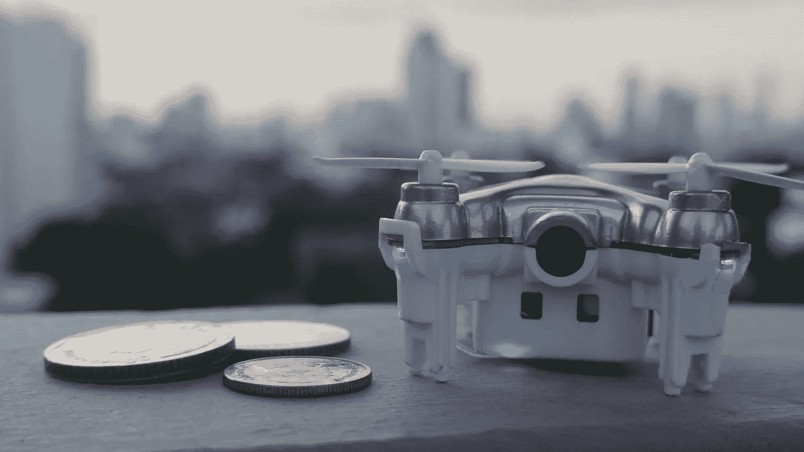

# 如何不撞毁昂贵的圣诞无人机

> 原文：<https://towardsdatascience.com/how-to-not-crash-that-expensive-christmas-drone-ad45259021ce?source=collection_archive---------0----------------------->

## 什么玩具可以教你

© Jason Peterson

认为你的新 DJI Phantom 4、Mavic 或其他昂贵的无人机由于其广泛的传感器包而不可摧毁？它有 GPS *加* GLONASS(俄罗斯 GPS) *加*视觉定位，我听你说的。

是的。然而，人们总是坠毁这些高端无人机，产生各种各样的坠毁色情。下面是一个 3000 美元的 DJI 激励崩溃，都是由湿件故障引起的很好的蒙太奇。

如果你对相机感兴趣，你很容易将无人机简单地视为飞行相机，并迷恋相机部分(你必须拥有最好的)，而轻视飞行部分(这有多难？).

但是多翼无人机是令人不安的装置。他们移动得很快，而且不总是朝着你想要的方向。

很容易慌，做错事。当你这样做时，尽管无人机控制器感觉很像视频游戏控制器，但你现在推动的是物质，而不是像素，物质对物质的碰撞往往是混乱的，昂贵的，[并且对软弱和爱打官司的人有害。](http://www.digitaltrends.com/cool-tech/quadcopter-wedding-crash/)

# 进行一些廉价的练习

相信我。你需要练习。但是为什么要在你 1000 美元的无人机上练习呢？有这么多有趣的、廉价的、飞行原理相似的无人机。开始便宜，甚至继续廉价飞行时，尝试新的举措。

> 在法拉利上试用之前，请先在搅拌器上试用。

我已经在曼谷花了几周时间做这件事，等待我昂贵的无人机送货。我从零飞行经验到基本熟练的全手动飞行，在这个过程中，我把一架无人机沉入了湄南河——令人印象深刻的是，它一直闪烁着红色和绿色的光——然后把另一架放进了游泳池——它在干燥 36 个小时后奇迹般地复活了。

崩溃没有让我开心，但也没有让我付出太多。我从他们身上学到了很多。

在你毁掉昂贵的圣诞无人机之前，给你一些建议。

# 1.买个玩具级的练习用四轴飞行器，带高度保持。

这将是你的打手。

高度保持功能确保你的练习无人机在你起飞后会自动悬停(多亏了里面的一个小气压计——不需要复杂的卫星)。

如果你上升或下降，通过应用或多或少的油门，它将保持新的高度。

这让你几乎忘记了垂直运动，而专注于水平运动，这本身就有点棘手，因为你必须将左杆的偏航与右杆的倾斜结合起来，才能完成一个优雅的转弯。

玩具世界中有许多高空无人机可供选择，但司马 X5HW-I(约 60 美元)被誉为最容易飞行的无人机之一。

(飞行一段时间后，你也不需要保持高度——你将掌握悬停所需的油门的细微调整——但把这个挑战留到以后。)

# 2.买些电池和备用道具。

这些廉价的无人机每次充电飞行不会超过 8 或 10 分钟，所以你希望能够在野外更换电池，以便获得更多的练习时间。

顺便订购一些额外的道具，因为它们很容易损坏或丢失。

# 3.在安全的地方练习。

去一个开放的地方练习。不要认为你可以在你家附近的街道上飞来飞去，那里有电线，孩子们在踢足球，停着昂贵的汽车。

一旦到了那里，你想逐渐掌握如何平稳起飞和降落；悬停；来回和左右移动；并在保持四轮车前侧向前的同时进行倾斜转弯(考虑到对称的形状，这很棘手)。

制作平滑的、正面第一的数字 8，甚至跑道椭圆，并不像你想象的那么简单。

你还希望能够让无人机回到你身边，即使你不确定它的方向，因为它太远了，看不清楚。

四轴飞行器 101 YouTube 频道这里有很好的飞行课，涵盖了以上大部分内容。

# 4.开始思考如何取景拍摄。

没有什么好的说法:这个价位的相机会很烂。没有万向架，视频看起来很糟糕——分辨率低，不稳定，充满果冻效果——但无论如何都要记录下来，因为结果会给你如何最好地创作无人机镜头的想法。你会看到，就像在陆地上一样，你需要努力获得缓慢而流畅的动作。

当你准备好昂贵的无人机上的万向节控制时，你的拍摄将会更好。

# 5.如果你弄坏了，就修好它。

它是一个玩具。但是它不必是一次性的。

当你撞毁你的练习无人机时，你不太可能损坏主板，你可能会损坏的所有部件——机身、道具，甚至马达——都很容易在网上买到，而且很便宜。

我设法更换了我的 Cheerson nano 无人机中的一个花生大小的马达(如上图)。这项工作确实需要焊接，但在其他方面非常简单，20 分钟的修理。

YouTube 上有一个视频，可以让你对一架普通无人机进行几乎所有的修理。

做了这些事情，你就会成为一个更自信、更称职的昂贵无人机飞行员。相比之下，它的先进功能将使它看起来非常容易飞行。但是当软件或硬件出现故障时，这是不可避免的，你会为所有这些廉价的练习感到高兴。