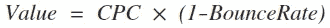
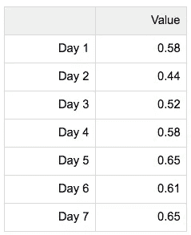
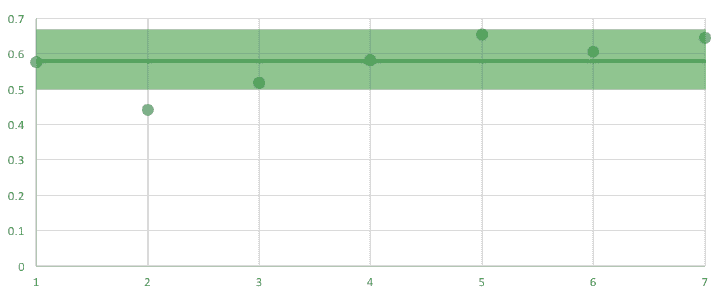
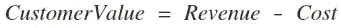

# 如何像一个适当的增长团队一样优化广告支出，并举例说明

> 原文：<https://towardsdatascience.com/how-to-optimize-ad-spend-like-a-proper-growth-team-with-examples-4e57d9ed61e3?source=collection_archive---------1----------------------->

在线营销已经成为利用数据发展业务的一个非常强大的工具。您可以在几十个广告网络和平台上运行数百(或数千)个不同的广告活动，针对非常特定类型的潜在客户，并衡量活动绩效的各个方面。

面临的挑战是如何优化您的在线营销支出，以获得最大收益！在成千上万的活动中，哪些表现良好？哪些花费你太多，你应该一起停止它们？哪些广告吸引了那些会成为你最忠实顾客的顾客？

这些问题的答案每天(甚至每小时)都在变化。由于在线广告竞争如此激烈，接触客户的成本不断变化，你需要能够每天优化你的营销，以确保你的回报最大化。所有这些活动产生的数据可能会令人不知所措，并且很难知道从哪里开始。

在这篇文章中，我们将介绍如何使用我们在过去几个月中介绍的许多数据技术来优化您的广告活动。具体来说，我们将涵盖:

*   **第 1 部分** —绩效基准测试
*   **第二部分** —异常检测
*   **第三部分** —客户价值预测
*   第四部分 —自动化

在你开始优化之前，我们将从讨论如何确定你今天做得有多好开始。

> [***异常值***](http://outlier.ai/about-outlier/) ***监控您的业务数据，并在发生意外变化时通知您。*** *我们帮助营销/增长&产品团队从他们的业务数据中获取更多价值。* [*今天安排一个试玩*](http://outlier.ai/about-outlier/) *。*

# 第一部分。**标杆广告绩效**

理解你的基线表现是提高它的第一步。如果你现在不知道什么是正常的，你怎么能识别异常的表现呢？

有几种类型的在线广告活动，但我们将使用每次点击费用( [CPC](https://en.wikipedia.org/wiki/Pay-per-click) )活动作为一个例子。在这些活动中，只有当用户点击你的广告时(而不是当他们看到广告时)，你才需要付费。与大多数广告一样，实际的每次点击成本会随着广告需求的变化而不断变化。以下是一周内 CPC 活动的示例数据:

A typical ad spend performance table

哇，这么多数据。我们从哪里开始？

我们的第一步是确定该活动的典型特征，以便我们可以轻松评估其表现，并将其表现与您每天开展的大量其他活动进行比较。虽然使用价格(CPC)很有吸引力，但它可能是一种误导性的活动衡量方法，因为最低成本的活动可能不会产生吸引或转化的用户。你需要的是一个结合成本和绩效的指标，这样你就可以通过投资回报来衡量一个活动。

在这个简单的例子中，我没有实际的用户行为数据，比如与每次点击相关的订单值，所以我需要找出一个不同的指标。跳出率是访问网站的用户只看了一页就离开的百分比，因此反过来，(1-跳出率)是访问了至少两页并因此更加投入的用户的百分比。如果我用价格 CPC 衡量参与度，我可以创建一个有用的营销活动价值指标:

有了价值指标，我们现在可以对示例活动进行基准测试。我们七天活动中每一天的价值如下:

鉴于我们 7 天的数据，我们需要选择一个统计数据来捕捉这一时期的活动性质，并成为我们的基准。正如我们前面提到的，如果数据不符合正态分布，使用平均值是危险的，而且我们没有办法知道它是否符合正态分布。相反，我们可以使用中位数，并更有信心，我们没有误导自己！

中值是 **0.58，**这是我们此次活动的基准。我们可以根据未来天数是高于还是低于该基准来评估该活动的未来天数。我们还可以使用基准比较我们所有的活动，看看在我们选择的时间段内，哪些活动表现得更好或更差。您还应该考虑跨多个时间段进行基准测试，因为性能可能会因周、月或年而异。

重要的是不要在真空中思考您的活动，因此您还应该计算您开展的所有活动的全球基准。借助全球基准和每个营销活动的单独基准，您可以轻松发现哪些营销活动超出或低于预期绩效，并做出相应的调整。

# 第二部分。**异常检测**

现在，您已经有了广告性能基准，您可以开始识别性能何时以意想不到的方式发生变化。这就是所谓的异常检测，它可以帮助你快速地从一堆数据中筛选出你需要分析的少数东西。

正如我们昨天所讨论的，最明显的方法是采用全球基准，并将低于该基准的任何活动标记为表现不佳。然而，我们的基准测试依赖于将几天的时间聚合在一起，这可能会丢失有价值的信息。如果一个活动在周一和周二表现很好，但在一周的其他时间表现很差，该怎么办？

我们将不再依赖我们的检测基准，而是将它们作为更复杂方法的一个组成部分。下图显示了七天营销活动的价值指标，以及我们用来总结它的每日基准(0.58，以绿色显示)。

如您所见，该基准有助于了解哪些天高于和低于正常水平，但仍不完全清楚哪些天是真正异常的。

我们可以通过添加一个高于或低于预期偏差范围的区间来扩展基准。我们预计我们的指标每天都会发生变化，因此，根据之前在这些活动中的经验，我们可能会预计，高于或低于基准 15%仍在预期绩效范围内。这反过来又给了我们一个预期的范围，我们可以绘制如下图:

如您所见，这种新的间隔方法使第 2 天明显超出预期行为，并将其归类为需要调查的异常。一旦建立了预期值范围，您就可以通过将每日值指标与预期范围进行比较，轻松监控所有活动的异常情况。

请注意，简单地选择高于或低于基准的值范围(在本例中为 15%)并不能捕捉到您的活动在一周内可能发生的典型变化。您可能希望使用更高级的技术，如 [ARIMA](https://en.wikipedia.org/wiki/Autoregressive_integrated_moving_average) 建模，来创建一个反映数据中每周和每月自然周期的预期范围。

# 第三部分。**客户价值预测**

优化广告活动时，准确了解客户对你的价值是很重要的，这样你就知道你获得他们的花费不会超过他们给你带来的好处。你越了解客户的价值，你就越能优化广告支出。

本周早些时候，因为我没有用户数据，我创建了一个基于每次点击费和跳出率的价值指标:

虽然这捕捉到了一个活动相对于另一个活动的相对价值，但它并没有告诉我们，我们为获得流量而支付的价格是高于还是低于这些用户的预期收入。如果你使用这个指标优化你的广告，你可能会在你获得的每个用户上赔钱！

理想情况下，我们会选择一个价值函数，将客户产生的收入与获得客户的成本联系起来:

收入的一个衡量标准是客户的终身价值，或 LTV，这是我们在获得这些用户后期望从他们那里获得的总收入。正如我们前面所讨论的，成本可以用 CPC 来表示。从 LTV 中减去每次点击费用，这个指标就是我们从客户那里赚的钱比我们为让他们点击而支付的钱多多少。我们仍然可以使用这一指标来比较营销活动、检测异常情况并进行优化，但现在我们可以肯定，只要价值指标为正，我们从营销活动中获得的收益就会超过其成本。

在电子商务等一些业务中，LTV 可能只是用户通过广告点击访问网站后购买的总金额。在其他情况下，如订阅业务，它可能是 12 个月订阅的价值。无论你的业务是什么，你能更有效地衡量 LTV，你就能更好地制定价值指标，优化你的广告。

就像生活中的所有事情一样，没有完美的标准。用户在买东西之前可能会点击几个不同的广告，这使得成本的计算很难进行。你应该考虑到无论你用什么方法都不是完美的。

# 第四部分。**自动化**

虽然我们介绍的技术非常强大，但是如果每天使用这些技术需要花费太多的时间和精力，那么它们就没有用。您需要自动化来为您处理大部分工作！

好消息是有很多选择可以帮助你:

*   [**需求方平台**](https://en.wikipedia.org/wiki/Demand-side_platform) 会自动优化你在多个不同渠道的广告支出。他们将进行我们本周讨论的许多计算，并为您调整支出，确保最佳支出。它们通常只在实时竞价平台(也称为程序化广告购买)上起作用，因此可能不适用于你的所有广告，但它们是一个很好的起点。
*   [**广告归属产品**](https://en.wikipedia.org/wiki/Attribution_(marketing)) 会自动跟踪你的广告价值指标，考虑到用户在成为客户之前可能会看到许多不同的广告(在不同的平台上)。这使得您的价值指标计算更容易，并将您的绩效收集在一个地方。
*   [**异常检测**](https://en.wikipedia.org/wiki/Anomaly_detection) 产品会在您的任何活动数据出现异常时通知您，让您在必要时采取措施。它们通常与其他类型的工具结合使用，以确保您始终知道何时会发生重大变化。

如果你使用自动化，警惕盲目信任他们的优化方法。正如您在本周所看到的，优化可能需要针对您的业务做出许多决策，而这在一个一刀切的产品中是不可能的。只要有可能，自己审核绩效，以确保你真正充分利用了你的支出。

**回顾**:优化广告活动是确保营销支出有效的关键一步。您可以使用自动化平台来完成，也可以使用我们在此为您展示的流程自己完成。这是一个有价值的项目，因为优化的广告策略在任何市场都是一个强大的优势。

> o[***ut lier***](http://outlier.ai/about-outlier/)***监控您的业务数据，并在发生意外变化时通知您。*** *我们帮助营销/增长&产品团队从他们的业务数据中获取更多价值。* [*今天安排一个试玩*](http://outlier.ai/about-outlier/) *。*