# 如何在数据科学竞赛中胜出——洞察力、技巧和策略

> 原文：<https://towardsdatascience.com/how-to-out-compete-on-a-data-science-competition-insights-techniques-and-tactics-95a0545041d5?source=collection_archive---------4----------------------->

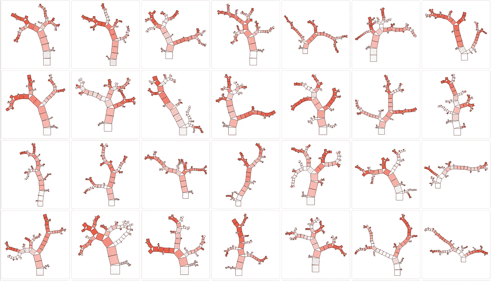

Random Forest Visualization of the Competition Data Set

过去两天，我花了相当多的空闲时间在当前的数据科学竞赛上。在 [Vidhya](https://datahack.analyticsvidhya.com/contest/practice-problem-loan-prediction/) 的一个贷款预测问题。是的，睡眠比平时少了，但是学习是值得的。

让我来分享一下我的经验和这类比赛的主要发现，以及成功的秘诀。

首先:数据科学竞赛是为了好玩，加强你的数据科学和机器学习技能。

> 所以——选择一个你**最喜欢的比赛和数据集**，而不是承诺最高奖金的那个。

# 浏览您的数据。密集！

不深入研究数据细节，我们就无法提出(&回答)正确的问题——这是成功的数据科学的关键先决条件。

在我们的例子中，提供的训练集如下所示:

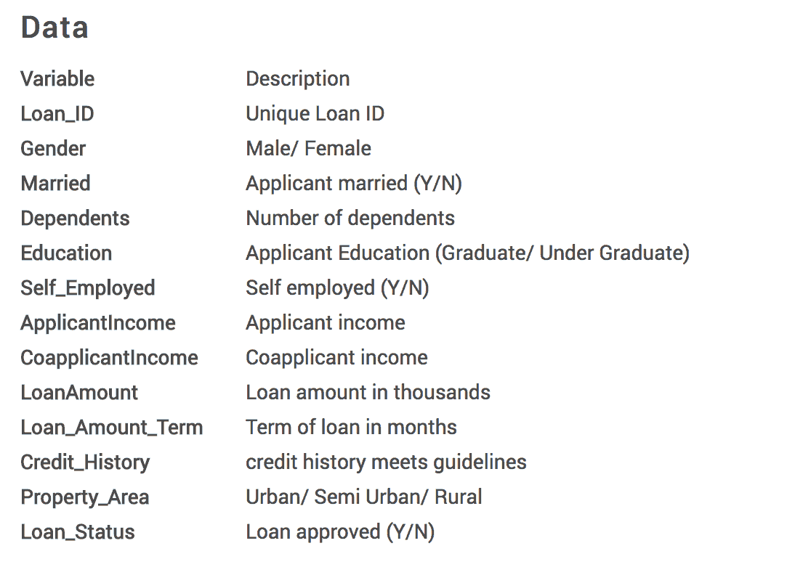

Loan_Status 是我们将针对其进行训练的标签。

# 对数据的初步分析

pandas 库的 describe()特性非常方便。它将一目了然地展示连续变量的一些指标。我们可以清楚地看到，数据相当少，只有 614 个样本。因此每个样本对最终模型的贡献相对较高。

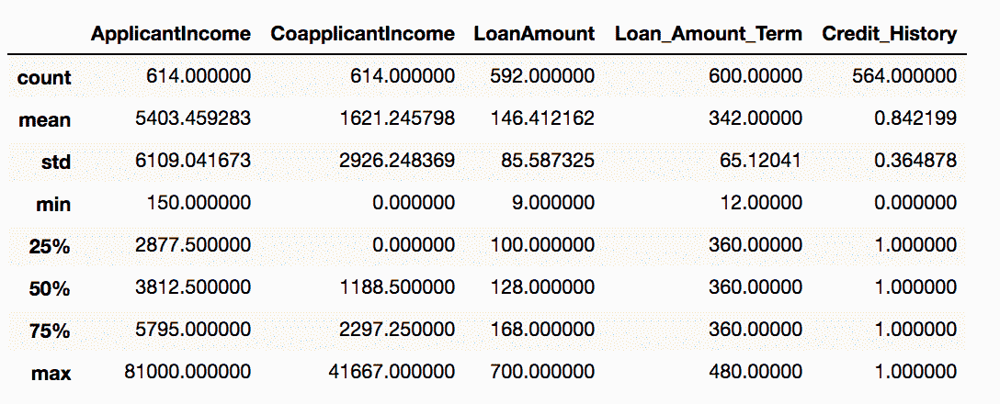

信用记录显然是最重要的特征之一。没有信用记录的申请人很有可能被拒绝——92%——然后是有信用记录的申请人(只有 20%被拒绝)

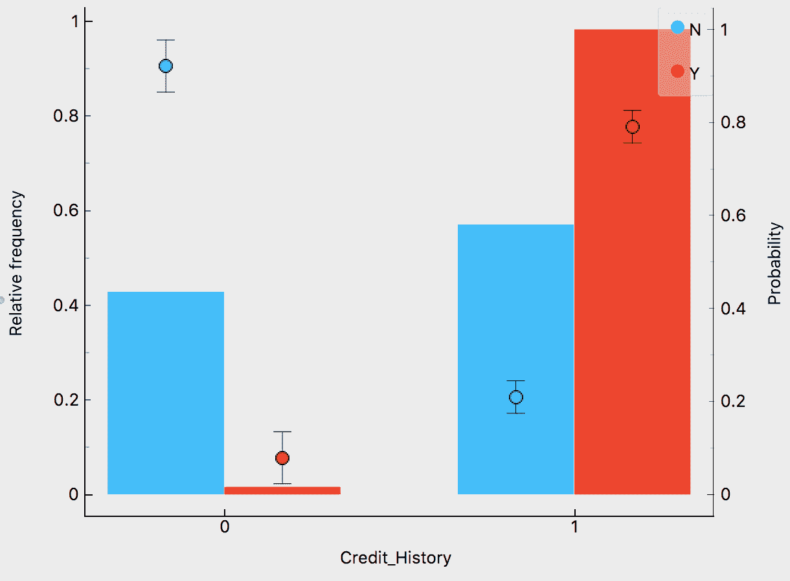

了解这一点很重要，尤其是在处理缺失值时。我们的训练集中的 50 个条目和测试集中的 29 个条目对于信用历史没有价值。考虑到数据的小规模，这是我们需要处理的大量数据。

其他重要特征是财产面积、教育和婚姻状况:

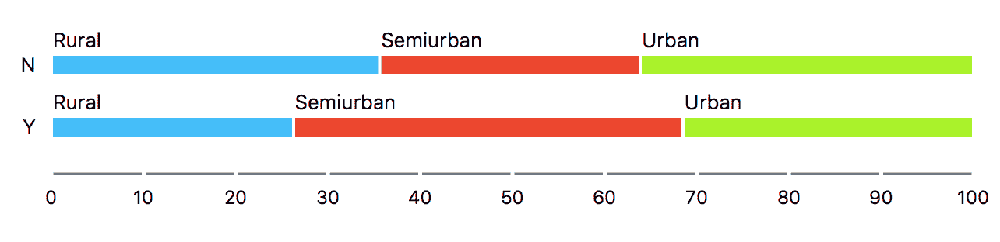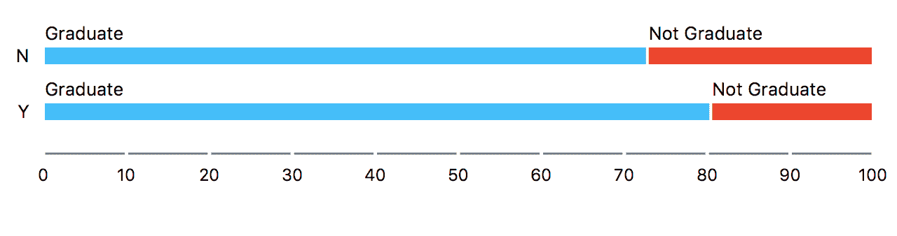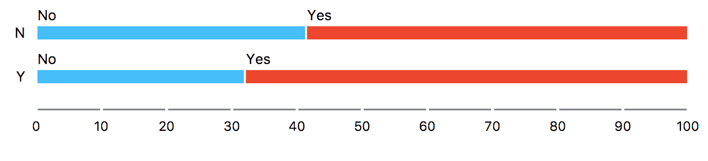

[Orange](https://orange.biolab.si/) 提供了一种很好的方式来可视化三维向量空间中预测值的重要性:

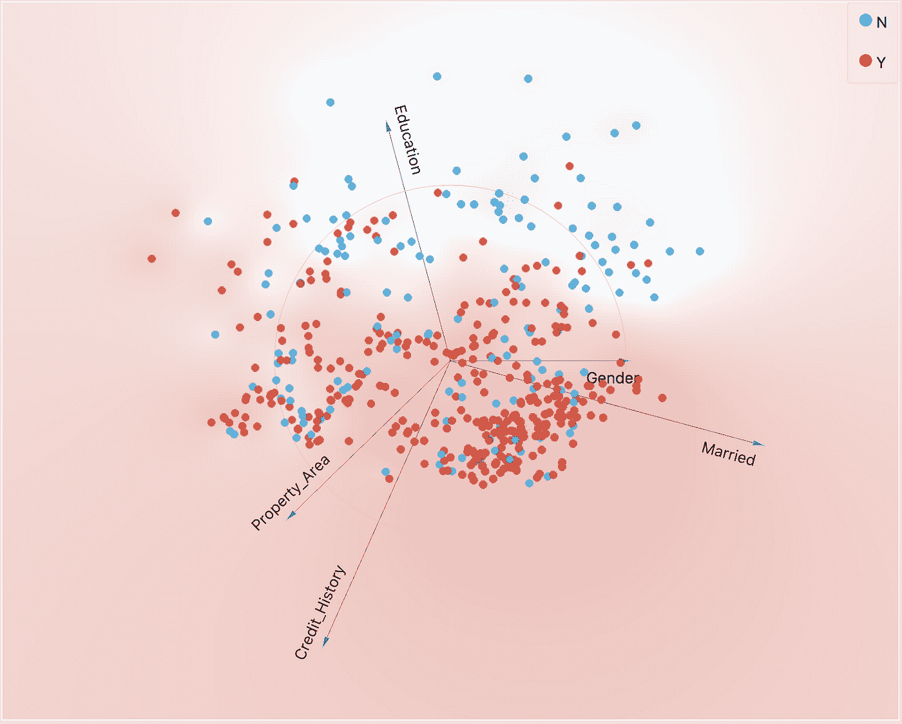

Feature Importance visualized in a 3d vector space

财务状况当然也是申请贷款的一个重要标准:

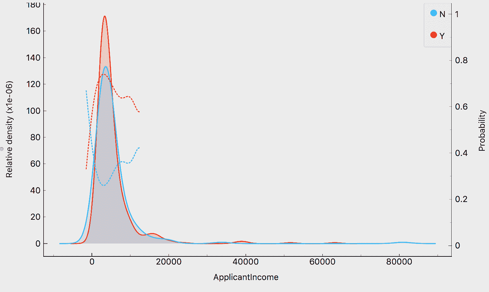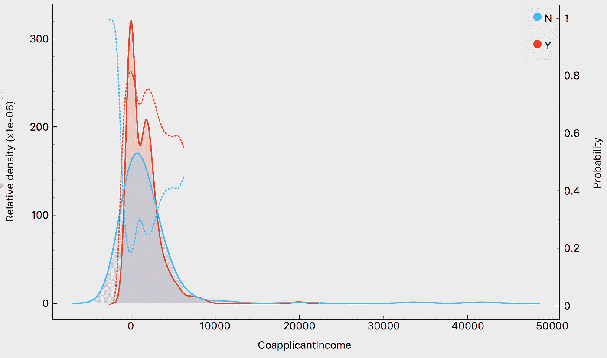

由于银行总是将一个家庭作为一个整体来考虑，所以提供一个新的特征是有意义的，它将包括申请人和共同申请人的总收入。以及人均收入分割(基于数据集上的受抚养人人数)

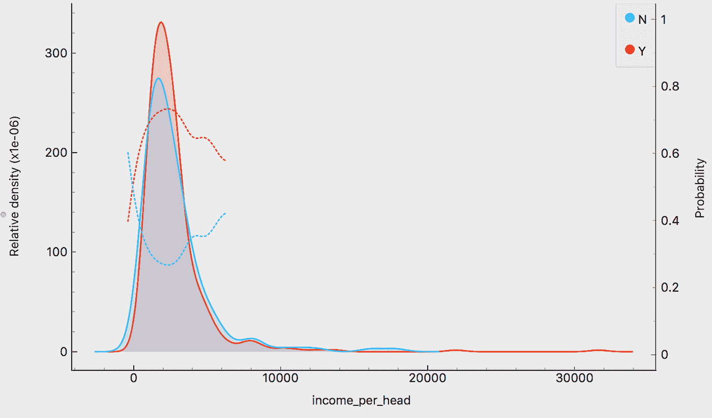

# 填补空白-缺失值处理

一个非常常见且有时很好的策略是跳过/删除缺少值的数据条目。尤其是当数据集的大小非常大而缺失值的数量相对较小时。两者都在这里不是这样的。

所以我们需要想出一个解决方案。有不同的方法到达那里。对于数值，可以应用线性回归并基于它预测缺失值。

k-NN 方法:由于我们缺少数值和分类值，我决定用 k-NN 算法来解决这个问题。想法是检测具有丢失值的每个数据项的 k 个最近邻居。

对于数值，我们将计算 k-邻居的平均值，对于分类值，计算具有最高众数值的平均值。我决定使用 k=7(是一个奇数，代表大约。1%的数据)。这样，我就能够用合理的价值观来填补所有缺失的价值观缺口。

# 添加有意义的信息—特征工程

我们已经围绕收入指标引入了一些新功能。类似的策略可以应用于预测值 LoanAmount 和 Loan_Amount_Term，我们可以计算每个期限的贷款金额(每月贷款支付率):

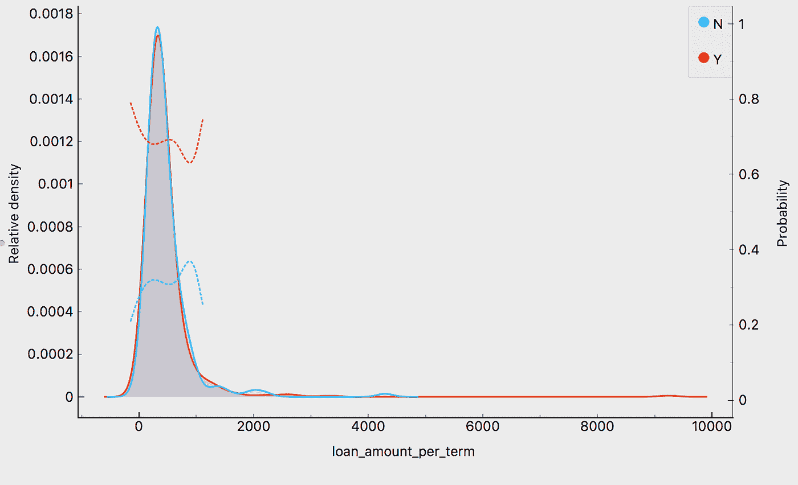

当然，像随机森林或神经网络这样的算法将能够从数据中提取这个值。公开这类特征只是让它们显而易见，从而赋予它们更高的权重。

记住房产的面积是一个决定性的预测因素，一个有价值的新特征可能是区分在郊区有孩子的家庭(假设他们更有可能获得贷款)和其他家庭(有房子的家庭)

# 检测异常值

另一个有价值的方法是计算每期贷款金额与每月收入的比率:

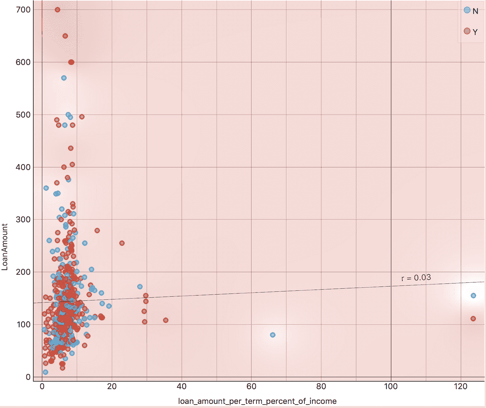

这样做我们可以发现几个异常值(月贷款利率>月收入的 100%)，并可以更仔细地观察它们。离群值是一个严肃的话题，因为它们扭曲了你的度量标准(特别是。平均值对异常值非常敏感)，这将对您的模型准确性产生负面影响。

# 特征选择-哪些贡献最大？

特征选择在数据挖掘过程中起着关键作用。您可以通过对数据应用基于树的算法(例如决策树、随机森林)或使用类似于 [Rlief](https://en.wikipedia.org/wiki/Relief_(feature_selection)) 的算法来验证哪些功能的成本最低:

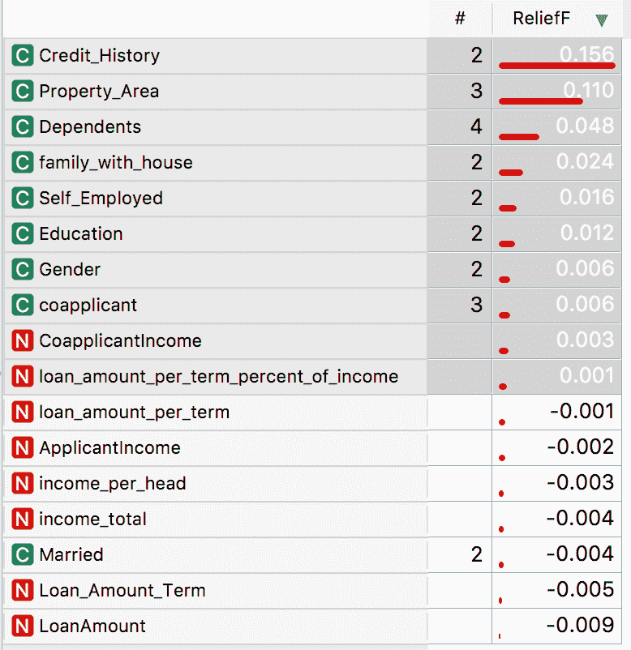

这是一个很好的指标，表明我们引入的额外功能得分很高，并且优于一些给定的功能。这项工作是值得的。

# 现在让我们建立模型。

这里我们面临的问题是一个二元分类问题。我们可以应用不同的监督训练算法，如逻辑回归、神经网络、SVM、基于树的模型等。

由于数据集相对较小，我决定采用多个随机森林模型的[集合](https://en.wikipedia.org/wiki/Ensemble_learning)，这些模型由逻辑回归模型聚合而成。训练结果通过 K 倍(k=20)交叉验证进行验证，在训练集上的最终分类准确度分数为 0.810(竞赛的获胜分数为 0.8206278027，这非常接近，但仍然是显著的差异)

# 结论:

制作新特征、填补缺失的值缺口、处理异常值、特征选择——这是每个数据挖掘过程(也称为探索性数据分析——EDA)的核心步骤。它不是线性的，而是一个高度迭代的过程。

因此，重要的是建立一个处理管道(例如在 Jupyter、RStudio 或可视化工具中，如 [RampidMiner](https://www.linkedin.com/company/rapidminer/) 、 [Knime](https://www.linkedin.com/company/knime.com/) 或 [Orange](https://orange.biolab.si/) )，并能够随时重复和调整其中的每一步。

最后——即使我们没有登上排行榜的首位(但对于两天的努力来说已经很接近了),这仍然是一场胜利。新见解、有价值的技术和策略的胜利。

## 让我知道你是否喜欢这篇文章，点击掌声按钮和/或在下面留下评论。我很感激。

PS:想接触一下？在 LinkedIn 上找到我:

 [## Christo Zonnev -数据科学副总裁-凯捷发明| LinkedIn

### 查看 Christo Zonnev 在世界上最大的职业社区 LinkedIn 上的个人资料。Christo 列出了 7 项工作…

www.linkedin.com](https://www.linkedin.com/in/christo-zonnev/) 

或者在[推特](http://bit.ly/2K4MRSi)上关注我