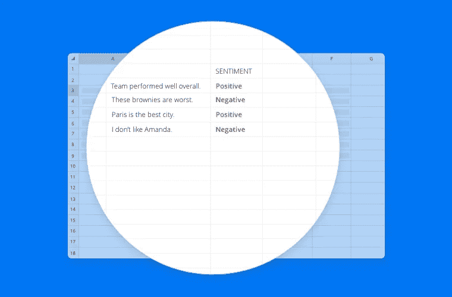
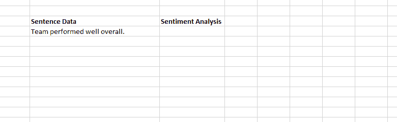

# 如何在 Excel 中不写代码进行情感分析？

> 原文：<https://towardsdatascience.com/how-to-perform-sentiment-analysis-in-excel-without-writing-code-8a9e66115447?source=collection_archive---------5----------------------->

我们最近发布了一个新版本的 Excel 加载项，它让您无需编写一行代码，就可以在舒适的电子表格中执行最先进的文本分析功能。该插件已被不同行业的用户广泛接受，如市场研究、软件、消费品、教育等。解决各种用例。

情绪分析是我们 Excel 插件中使用最多的功能，紧随其后的是情绪检测。我们的许多用户使用 Excel 中的情感分析来快速准确地分析开放式调查的回复、围绕其产品/服务的在线聊天，或者分析来自电子商务网站的产品评论。

在这篇博文中，我们将讨论如何使用 Excel 插件中的情感分析功能对任何类型的内容进行文本分析。

首先，我们将向您简要介绍驱动我们情感引擎的底层技术。

我们的情感分析“模型”使用长短期记忆(LSTM)算法将文本 blob 的情感分为积极和消极。LSTMs 将句子建模为基于上下文的遗忘-记忆决策链。它接受了来自不同社交媒体网站和新闻文章的用户生成内容的训练，以处理随意和正式的语言。作为我们的[企业产品](https://www.paralleldots.com/enterprise-services)的一部分，我们还在不同客户的定制数据集上训练了这种算法。

**在 Excel 插件中使用情感分析**

首先，你需要注册一个 ParallelDots 账户(如果你还没有的话)，下载并在你的电脑上安装 [Excel 插件](https://www.meaningcloud.com/products/excel-addin)。安装后，按照以下步骤在 Excel 中使用情绪分析:

1.  登录到您的 ParallelDots Excel 加载项帐户:输入您的登录凭据以激活加载项的功能。

1.  使用 excel 插件情感分析功能:

使用函数**parallel dots _ perspective**可以分析任何文本内容，并反过来获得附加到文本的情感。考虑下面的例子，其中文本句子“团队整体表现良好”正在使用 paralleldots _ 情操分析。如下图 GIF 所示:

如果您需要知道上面讨论的 parallel dots _ invision 函数返回的情感标签的概率，您可以通过调用 parallel dots _ invision _<sentiment_label>_ probability 函数来实现，其中 invision _ lable 可以是中性的、正的或负的。</sentiment_label>

[情绪分析](https://www.paralleldots.com/sentiment-analysis)以快速有效的方式衡量用户的情绪，并据此采取适当的行动。通常，这是做出数据驱动的决策以改进产品或服务之旅的第一步。您应该将它与关键字提取功能结合使用，以找到对您的数据的整体情感有贡献的关键因素。

你可以在这里阅读更多关于 Excel 插件[的使用案例。](https://blog.paralleldots.com/product/use-cases-excel-add-text-analysis/)

我们希望这篇文章能帮助你在 excel 中使用 ParallelDots 插件进行情感分析，并开始你的文本分析之旅。如有任何疑问或反馈，请通过 support@paralleldots.com[写信给我们。](mailto:support@paralleldots.com)

如果你还没有下载插件，请从[这里](https://www.paralleldots.com/excel-plugin)免费下载。

我们希望你喜欢这篇文章。请[注册](http://user.apis.paralleldots.com/signing-up?utm_source=blog&utm_medium=chat&utm_campaign=paralleldots_blog)一个免费的 ParallelDots 账户，开始你的 AI 之旅。你也可以在这里查看 PrallelDots AI API[的演示。](https://www.paralleldots.com/ai-apis)

此处阅读原文[。](https://blog.paralleldots.com/product/sentiment-analysis-in-excel-without-coding/)