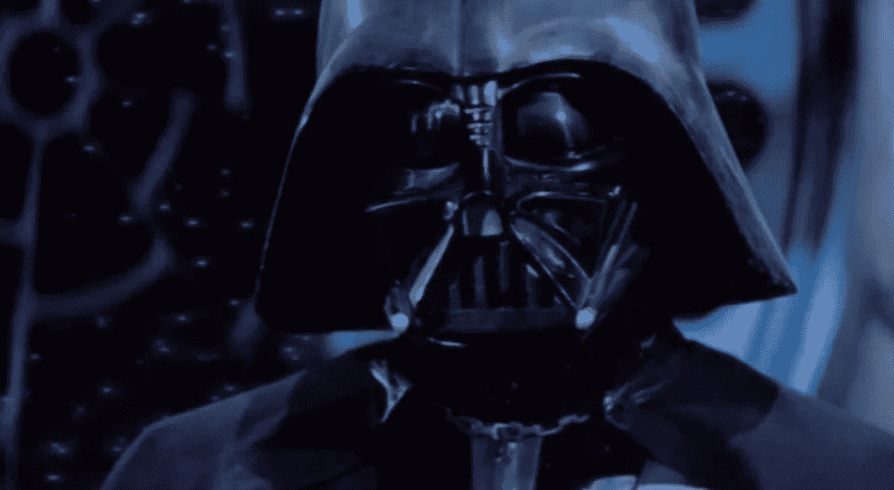

# 如何在 R 中播放星球大战等曲子

> 原文：<https://towardsdatascience.com/how-to-play-star-wars-and-other-tunes-in-r-5e837e8b71e4?source=collection_archive---------2----------------------->


Photo by [Liam Tucker](https://unsplash.com/photos/cVMaxt672ss?utm_source=unsplash&utm_medium=referral&utm_content=creditCopyText) on [Unsplash](https://unsplash.com/search/photos/star-wars?utm_source=unsplash&utm_medium=referral&utm_content=creditCopyText)

有时我的研发过程需要很长时间，我不能坐在电脑前看着它全部完成。我认为在我的脚本结尾选择一些胜利的曲调会很酷，这样当过程成功执行时，我可以听到一些告诉我一切顺利的东西。

所以我研究了 R 中的`audio`包，它允许你通过与机器上基于样本的音频设备接口来创建和播放声音，并将其保存为 wave 文件。文本和数字的字符串可以被处理成频率值，然后与音符长度的数据结合成正弦波。这将产生一个整洁小曲子，可以在你的休息时间或任何媒体设备上播放。

## 写星球大战主题

让我们从加载必要的包开始:

```
library(dplyr)
library(audio)
```

让我们也定义一个八度音程中音符的值。为此，你需要用半音来思考，考虑到降半音和升半音，这将在后面定义:

```
notes <- c(A = 0, B = 2, C = 3, D = 5, E = 7, F = 8, G = 10)
```

现在让我们为星球大战主题写笔记，忽略每个笔记的长度。如果你能读懂乐谱，你就能做到这一点。你可以用任何你想要的方式组织它，用一个字符向量的格式，因为我们稍后会清理它。我决定为每个小节写一个字符串，字符串中的音符用空格隔开。

我们稍后将设置代码，将符号`#`理解为升半音，将`b`理解为降半音，以使音乐人更直观。

我们需要在音乐中分离八度音阶。稍后我将设置我的代码来解释一个普通的音符，例如`A`在第四个八度音阶中，任何其他的八度音阶都通过在音符后面加上八度音阶编号来表示(例如`A5`或`B3`

```
pitch <- paste("D D D",
               "G D5",
               "C5 B A G5 D5",
               "C5 B A G5 D5",
               "C5 B C5 A D D D",
               "G D5",
               "C5 B A G5 D5",
               "C5 B A G5 D5",
               "C5 B C5 A D D",
               "E E C5 B A G",
               "G A B A E F# D D",
               "E E C5 B A G",
               "D5 A D D",
               "E E C5 B A G",
               "G A B A E F# D5 D5",
               "G5 F5 D#5 D5 C5 A# A G",
               "D5 D D D",
               "G D5",
               "C5 B A G5 D5",
               "C5 B A G5 D5",
               "C5 B C5 A D D D",
               "G D5",
               "C5 B A G5 D5",
               "G5 F5 D#5 Bb5 A5",
               "G5 G G G G")
```

然后你可以用音符的长度写一个数字向量，一拍用数字`1`表示。为了使我的符号清晰，我尽量保持每个小节一行。

```
duration <- c(0.33, 0.33, 0.33, 
              2, 2, 
              0.33, 0.33, 0.33, 2, 1, 
              0.33, 0.33, 0.33, 2, 1, 
              0.33, 0.33, 0.33, 2, 0.33, 0.33, 0.33, 
              2, 2, 
              0.33, 0.33, 0.33, 2, 1, 
              0.33, 0.33, 0.33, 2, 1, 
              0.33, 0.33, 0.33, 2, 0.75, 0.25,
              1.5, 0.5, 0.5, 0.5, 0.5, 0.5, 
              0.33, 0.33, 0.33, 0.75, 0.25, 1, 0.75, 0.25, 
              1.5, 0.5, 0.5, 0.5, 0.5, 0.5,
              1, 2, 0.75, 0.25,
              1.5, 0.5, 0.5, 0.5, 0.5, 0.5, 
              0.33, 0.33, 0.33, 0.75, 0.25, 1, 0.75, 0.25, 
              0.75, 0.25, 0.75, 0.25, 0.75, 0.25, 0.75, 0.25, 
              3, 0.33, 0.33, 0.33,   
              2, 2, 
              0.33, 0.33, 0.33, 2, 1, 
              0.33, 0.33, 0.33, 2, 1, 
              0.33, 0.33, 0.33, 2, 0.33, 0.33, 0.33, 
              2, 2, 
              0.33, 0.33, 0.33, 2, 1, 
              0.33, 0.33, 0.33, 2, 1, 
              1,  0.33, 0.33, 0.33, 1)
```

现在我们有了所有需要的原材料。

## 将音符转换成正弦波的频率

首先，我们将音高和音长向量转换成一个数据帧，其中每个音符都是一个具有音高和音长的元素。在星球大战主题的情况下，总共有 126 个音符。

```
starwars <- data_frame(pitch = strsplit(pitch, " ")[[1]],
                     duration = duration)
```

现在，我们将扩展该数据框架，以包括一些新列:

*   `octave`它从`pitch`符号中提取音符要在哪个八度音阶中演奏
*   `note`从我们的原始`notes`向量中提取原始音符值，然后针对升半音、降半音和八度音程变量进行调整
*   `freq`将`note`转换成以 Mhz 为单位的频率

```
starwars <-
  starwars %>%
  mutate(octave = substring(pitch, nchar(pitch))  %>%
  {suppressWarnings(as.numeric(.))} %>%
    ifelse(is.na(.), 4, .),
  note = notes[substr(pitch, 1, 1)],
  note = note + grepl("#", pitch) -
    grepl("b", pitch) + octave * 12 +
    12 * (note < 3),
  freq = 2 ^ ((note - 60) / 12) * 440)
```

我们现在将定义一个将音符和音长转换成正弦波的函数。为此，我们将以每分钟的节拍数和采样率(通常为 44.1Khz)来设置速度:

```
tempo <- 150
sample_rate <- 44100make_sine <- function(freq, duration) {
  wave <- sin(seq(0, duration / tempo * 60, 1 / sample_rate) *
                freq * 2 * pi)
  fade <- seq(0, 1, 50 / sample_rate)
  wave * c(fade, rep(1, length(wave) - 2 * length(fade)), rev(fade))
}
```

最后，我们只需将该函数应用于`starwars`数据帧中的`freq`和`duration`列，然后简单地弹奏曲子。

```
starwars_wave <-
  mapply(make_sine, starwars$freq, starwars$duration) %>%
  do.call("c", .)audio::play(starwars_wave)
```

您也可以将乐曲保存为一个.`wav`文件，以便随时使用

```
audio::save.wave(starwars_wave, "starwars.wav")
```

你需要的所有代码都在这里供你尝试，但是[这里有 GitHub](https://github.com/keithmcnulty/Rmusic) 中的代码链接，如果你想拿出来和其他曲子一起玩的话。您可以随意将自己的音乐放回单独的 R 文件中的同一个 GitHub repo 中，以便他人欣赏。

最初我是一名纯粹的数学家，后来我成为了一名心理计量学家和数据科学家。我热衷于将所有这些学科的严谨性应用到复杂的人的问题上。我也是一个编码极客和日本 RPG 的超级粉丝。在[*LinkedIn*](https://www.linkedin.com/in/keith-mcnulty/)*或*[*Twitter*](https://twitter.com/dr_keithmcnulty)*上找我。*

