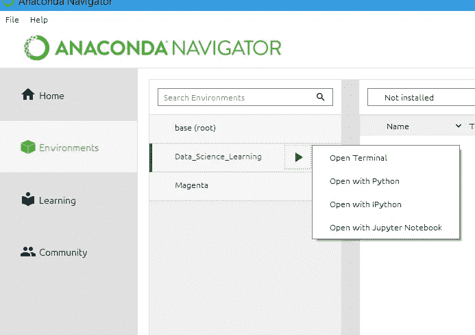
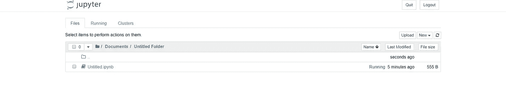
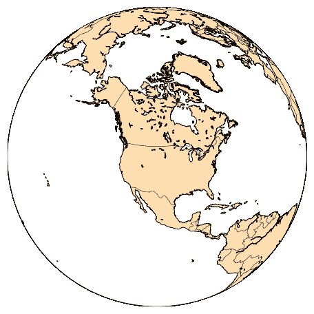
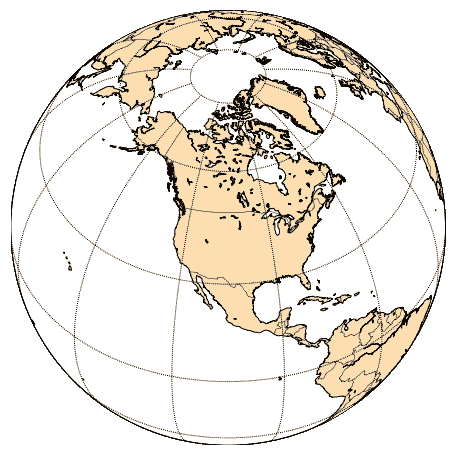
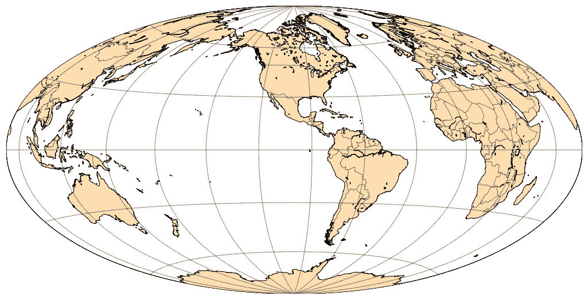
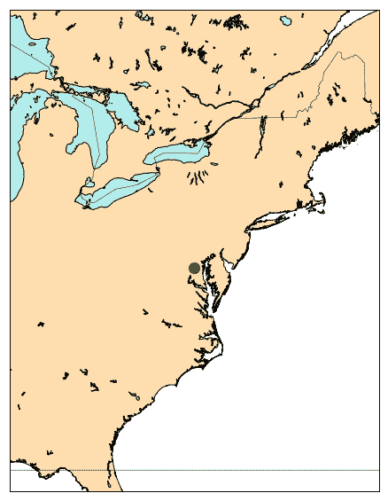
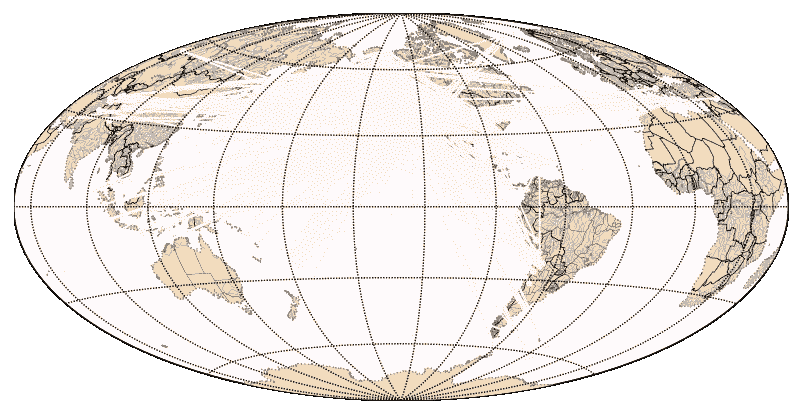
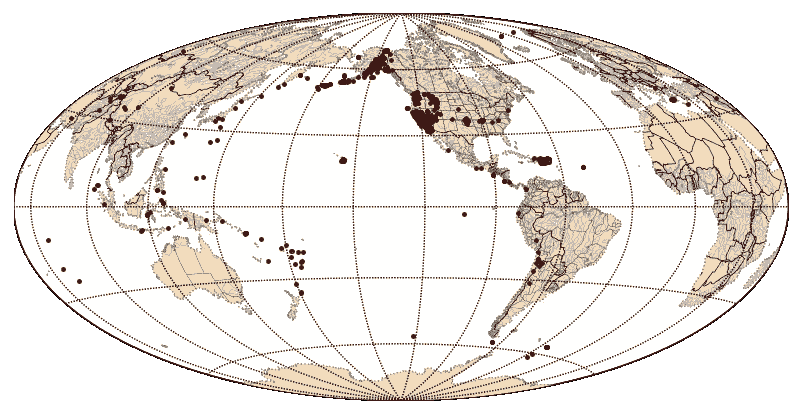
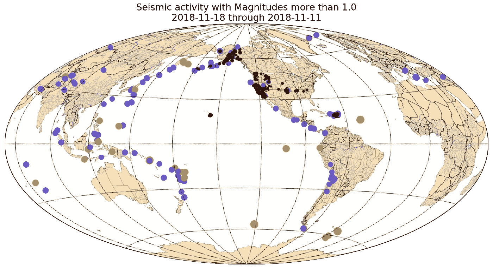

# 如何用 Anaconda 和 Jupyter 笔记本绘制地震活动图

> 原文：<https://towardsdatascience.com/how-to-plot-seismic-activity-with-anaconda-and-jupyter-notebooks-7ed23ce9aa5?source=collection_archive---------8----------------------->


Demo of our end product

在这个活动中，我们将使用 Anaconda 作为我们的分发平台。要开始使用 Anaconda，从 [Anaconda](https://www.anaconda.com/download/) 下载发行版，根据您的操作系统说明进行安装，通过单击左下角的 create 按钮创建一个新环境，然后搜索、选择并安装以下包[matplotlib、basemap、pillow、pandas]

接下来，转到 Anaconda Navigator 的主页，确保左上角的下拉菜单选择了您新创建的环境，并安装 Jupyter Notebook。


Homepage of your selected environment

如果您已经安装了 Anaconda，请确保您已将 Matplotlib 更新到版本 3.0.2，或降级到版本 3.0.0，3.0.1 在使用设置属性时引入了底图错误。plot()，我们稍后会用到它。参考 github 问题[这里](https://github.com/matplotlib/basemap/issues/435)了解更多信息。如果你不确定如何更新 conda 和它的包，请看这个堆栈溢出[帖子](https://stackoverflow.com/questions/45197777/how-do-i-update-anaconda)，尽管如果在阅读时发行版没有更新，你可能不得不求助于 pip。(截至 2018 年 11 月 17 日尚未发布)

```
# open your environment with cmd prompt/shell
pip install matplotlib --upgrade# conda version will still display what it's distro is set to
# feel free to check your version 
import matplotlib
print(matplotlib.__version__)
```

很好，现在在左侧菜单中选择“环境”,您会在新创建的环境中看到一个图标，您会看到几个选项，您想要的是“用 Jupyter 笔记本打开”



Menu for launching environment

继续运行它，一个新的窗口将在你的默认浏览器中打开，列出你的根目录。浏览您的文件夹，选择一个位置来存储您的 Jupyter 笔记本，然后单击文件夹上方菜单上的“新建”按钮创建一个新笔记本。如果您正确地遵循了说明，您应该会看到类似这样的内容。



Newly created notebook

太棒了，你已经做了你的第一个笔记本。现在我们可以开始玩了！请打开笔记本。你将得到一个交互式 shell，如果你不熟悉的话，我鼓励你使用 Jupyter Notebook 来阅读[。](https://www.dataquest.io/blog/jupyter-notebook-tutorial/)

首先，我们将创建一个基本的彩色正交地图。有关所有支持的投影列表，请参见此处的。

```
# import dependencies
# note that Basemap will be supported until 2020 only
from mpl_toolkits.basemap import Basemap
import matplotlib.pyplot as plt
import numpy as np# make sure to set your plot size before you start rendering to screen
plt.figure(figsize=(8, 8))# by default, only crude and low resolutions are installed, if you wanted
# higher fidelity images, refer to the documentation.default_map = Basemap(projection='ortho', lat_0=45, lon_0=-105,
                     resolution='l', area_thresh=1000.0)default_map.drawcoastlines()
default_map.drawcountries() 
# matplotlib provides color creation 
default_map.fillcontinents(color='navajowhite')
default_map.drawmapboundary()plt.show()
```



Default Map

接下来，让我们通过在 plt.show()前添加以下代码来添加经纬线

```
default_map.drawmeridians(np.arange(0, 360, 30))
default_map.drawparallels(np.arange(-90, 90, 30))
```



Longitude and Latitude added

这开始看起来挺帅的！可悲的是，尽管它很漂亮，但它可能不是观察全球地震活动的最佳预测。我鼓励你在这一点上玩投影，看看你喜欢哪一个！至于我自己，我选择了锤子投影，并根据自己的喜好调整了纬度/经度值。

```
# change to hammer projection, fix lat/long
# import dependencies
# note that Basemap will be supported until 2020 only
from mpl_toolkits.basemap import Basemap
import matplotlib.pyplot as plt
import numpy as np# make sure to set your plot size before you start rendering to screen
plt.figure(figsize=(18, 18))# by default, only crude and low resolutions are installed, if you wanted
# higher fidelity images, refer to the documentation.default_map = Basemap(projection='hammer', lat_0=0, lon_0=-100,
                     resolution='l', area_thresh=1000.0)default_map.drawcoastlines()
default_map.drawcountries() 
# matplotlib provides color creation 
default_map.fillcontinents(color='navajowhite')
default_map.drawmapboundary()default_map.drawmeridians(np.arange(0, 360, 30))
default_map.drawparallels(np.arange(-90, 90, 30))plt.show()
```



Hammer projection with longitude/latitude lines

我知道你现在在想什么！"看，妈妈，从这里我能看见我的房子."那么，我们为什么不试着放大我们自己的地理区域，仔细看看。最简单的方法是将您的投影类型更改为“墨卡托投影”，它支持缩放。我在网上查找我的经度，纬度坐标，并向外调整以获得更清晰的图像。如果您希望放大后的地图具有更高的分辨率，也可以安装 Anaconda 的 basemap-data-hires。

对于下一步，我大胆地将 merc 投影仪放入一个接受两个整数的函数中，以创建一个区域地图生成器。现在，如果您超出纬度/经度限制，可能会出现一些问题，但是您可以轻松地调整输入来解决这个问题。这是没有异常处理的快速而肮脏的代码。

```
# what if we want to look at a specific area of the world?from mpl_toolkits.basemap import Basemap
import matplotlib.pyplot as plt
import numpy as npdef create_merc(lat, long):

    plt.figure(figsize=(10, 10))# make sure the value of resolution is a lowercase L,
    #  for 'low', not a numeral 1
    my_map = Basemap(projection='merc', lat_0=(lat-20), lon_0=(long+15),
        resolution = 'h', area_thresh = .1,
        # lower left hand corner longitude, lat
        # upper right hand corner long, lat
        llcrnrlon=(long-10), llcrnrlat=(lat-10),
        urcrnrlon=(long+10), urcrnrlat=(lat+10))my_map.drawcoastlines()
    my_map.drawcountries()
    my_map.fillcontinents(color='navajowhite', lake_color='paleturquoise')
    my_map.drawmapboundary()my_map.drawmeridians(np.arange(0, 360, 30))
    my_map.drawparallels(np.arange(-90, 90, 30))plt.show()create_merc(39, -76)
```


You might recognize these iconic US lakes.

哇哦。我们能不能感谢这些库所付出的努力，让我们在几个小时内通读文档就能做出这样的东西？(不可否认，我花了更多的时间来克服一些错误)

好吧，继续！让我们试着画出具体的坐标。比如我现在住的地方。

```
# plot the initial coordinate input
x, y = merc_map(long, lat)
merc_map.plot(x, y, 'go', markersize=12)plt.show()
```



A nice big green dot

好的，我们已经证明了我们可以绘制图形。但是我们可能需要多个，所以让我们从函数输入中删除赋值，并使用一个容器来存储我们需要的内容(记住，我们希望读入数据并存储它以便以后绘制),让我们继续为我们的图添加一些标签。这里的想法和坐标一样！我们先手动测试一下。(和你真正的一点点偷懒)

```
# what if we want to look at a specific area of the world?from mpl_toolkits.basemap import Basemap
import matplotlib
import matplotlib.pyplot as plt
import numpy as npdef create_merc(lat, long):

    plt.figure(figsize=(10, 10), dpi=100)
    # increase font size
    matplotlib.rcParams.update({'font.size': 16})# make sure the value of resolution is a lowercase L,
    #  for 'low', not a numeral 1
    merc_map = Basemap(projection='merc', lat_0=(lat-20), lon_0= (long+15),
        resolution = 'h', area_thresh = .1,
        # lower left hand corner longitude, lat
        # upper right hand corner long, lat
        llcrnrlon=(long-10), llcrnrlat=(lat-10),
        urcrnrlon=(long+10), urcrnrlat=(lat+10))

    longs = [-77, -74]
    lats = [39, 40]

    x, y = merc_map(longs, lats)

    merc_map.plot(x, y, 'go', markersize=8)

    locations = ['Columbia, MD', 'New York City']
    for label, xc, yc in zip(locations, x, y):
        plt.text(xc-100000, yc+55000, label, color='teal')

    merc_map.drawcoastlines(color='grey', linestyle=':')
    merc_map.drawrivers(linewidth=0.3, color="cornflowerblue")
    merc_map.fillcontinents(color='navajowhite',                              lake_color='paleturquoise')
    merc_map.drawcountries()
    merc_map.drawmapboundary() merc_map.drawmeridians(np.arange(0, 360, 30))
    merc_map.drawparallels(np.arange(-90, 90, 30))

    plt.show()create_merc(39, -77)
```


现在我们已经探索了映射、绘图和注释，让我们开始引入一些数据。出于本教程的目的，我已经将地震数据下载为 CSV 格式，并将其存放在 github 上，供您以其 [raw 格式](https://raw.githubusercontent.com/edwardauron/working_data/master/all_week.csv)访问。

继续将原始数据加载到 pandas 中，并开始研究数据。我们实际上想要绘制地震活动的是它的地理位置，所以检查纬度和经度列中是否有任何缺失的值。

```
import pandas as pd
seismic_activity_30_days = pd.read_csv('[https://raw.githubusercontent.com/edwardauron/working_data/master/all_week.csv'](https://raw.githubusercontent.com/edwardauron/working_data/master/all_week.csv'))seismic_activity_30_days.head()print(seismic_activity_30_days['latitude'].isnull().values.any())
print(seismic_activity_30_days['longitude'].isnull().values.any())False
False
```

太好了，没有丢失 lat 或 long 数据，所以我们可以跳过清理，直接将列中的数据放到我们函数中先前定义的列表中。我们重用先前函数中的现有代码来获取一个数据帧，并添加一些方法来处理它。

```
def create_hammer(df):

    plt.figure(figsize=(10, 10), dpi=100)
    # increase font size
    matplotlib.rcParams.update({'font.size': 16})# make sure the value of resolution is a lowercase L,
    #  for 'low', not a numeral 1
    merc_map = Basemap(projection='hammer', lat_0=0, lon_0=-130,
        resolution = 'l', area_thresh = 1000)

    working_df = df

    longs = working_df['longitude'].tolist()
    lats = working_df['latitude'].tolist()

    x, y = merc_map(longs, lats)
    merc_map.plot(x, y, marker='o', color='lavenderblush', markersize=4)

    merc_map.drawcoastlines(color='grey', linestyle=':')
    merc_map.drawrivers(linewidth=0.3, color="cornflowerblue")
    merc_map.fillcontinents(color='navajowhite', lake_color='paleturquoise')
    merc_map.drawcountries()
    merc_map.drawstates(linewidth=0.3, color='saddlebrown')
    merc_map.drawmapboundary()merc_map.drawmeridians(np.arange(0, 360, 30))
    merc_map.drawparallels(np.arange(-90, 90, 30))

    plt.show()create_hammer(seismic_activity_30_days)
```

如果你跟着做，你会注意到这造成了一片混乱。



Yikes!

我们需要单独绘制所有这些点，而不是一次绘制所有这些点。是的，是时候来个`for`循环了。事实证明“淡紫色”并不是最容易看到的颜色！

```
def create_hammer(df):

    plt.figure(figsize=(10, 10), dpi=100)
    # increase font size
    matplotlib.rcParams.update({'font.size': 16})# make sure the value of resolution is a lowercase L,
    #  for 'low', not a numeral 1
    hammer_map = Basemap(projection='hammer', lat_0=0, lon_0=-130,
        resolution = 'l', area_thresh = 1000)

    working_df = df

    longs = working_df['longitude'].tolist()
    lats = working_df['latitude'].tolist()

    min_marker_size = 2.5
    for longitude, latitude in zip(longs, lats):
        x, y = hammer_map(longitude, latitude)
        marker_size = min_marker_size
        hammer_map.plot(x, y, marker='o', color='maroon', markersize=marker_size)

    hammer_map.drawcoastlines(color='grey', linestyle=':')
    hammer_map.drawrivers(linewidth=0.3, color="cornflowerblue")
    hammer_map.fillcontinents(color='navajowhite', lake_color='paleturquoise')
    hammer_map.drawcountries()
    hammer_map.drawstates(linewidth=0.3, color='saddlebrown')
    hammer_map.drawmapboundary()hammer_map.drawmeridians(np.arange(0, 360, 30))
    hammer_map.drawparallels(np.arange(-90, 90, 30))

    plt.show()
```

这才像话！



我们还需要做最后一件事。你能猜到吗？我们需要一种方法来区分这些情节点！你能在数据框中找到对我们有帮助的列吗？我们应该将该列映射到哪种表达式？在查看我的解决方案之前，请随意探索并提出想法。

嗯，这是我的成品。它仍然需要一些提炼，就像一个传说。但是我继续添加了一个格式化的标题，以及一些玩弄绘制的圆圈大小。它可以使用一些悬停事件，我计划添加一个选项来放大和投影用户指定的区域与墨卡托投影，但我对我在这里感到满意。暂时如此。

```
# plotting seismic activityfrom mpl_toolkits.basemap import Basemap
import matplotlib
import matplotlib.pyplot as plt
import numpy as np
import pandas as pddef create_hammer(df):

    plt.figure(figsize=(18, 12), dpi=100)
    # increase font size
    matplotlib.rcParams.update({'font.size': 16})# make sure the value of resolution is a lowercase L,
    #  for 'low', not a numeral 1
    hammer_map = Basemap(projection='hammer', lat_0=0, lon_0=-130,
        resolution = 'l', area_thresh = 1000)

    working_df = df

    # generate data for plotting from our df
    longs = working_df['longitude'].tolist()
    lats = working_df['latitude'].tolist()
    mags = working_df['mag'].tolist()

    # handle dates for title
    start = working_df.time.iloc[0]
    end = working_df.time.iloc[1825]

    min_marker_size = 2.5
    for longitude, latitude, magnitude in zip(longs, lats, mags):
        x, y = hammer_map(longitude, latitude)
        marker_size = min_marker_size * magnitude\

        if magnitude < 3.0:
            hammer_map.plot(x, y, marker='o', color='maroon', markersize=marker_size)
        elif magnitude < 5.0:
            hammer_map.plot(x, y, marker='o', color='slateblue', markersize=marker_size)
        else:
            hammer_map.plot(x, y, marker='o', color='goldenrod', markersize=marker_size)

    hammer_map.drawcoastlines(color='grey', linestyle=':')
    hammer_map.drawrivers(linewidth=0.3, color="cornflowerblue")
    hammer_map.fillcontinents(color='navajowhite', lake_color='paleturquoise')
    hammer_map.drawcountries()
    hammer_map.drawstates(linewidth=0.3, color='saddlebrown')
    hammer_map.drawmapboundary()hammer_map.drawmeridians(np.arange(0, 360, 30))
    hammer_map.drawparallels(np.arange(-90, 90, 30))

    title = "Seismic activity with Magnitudes more than 1.0\n"
    # string manipulation, list slicing
    title += "%s through %s" % (start[:10], end[:10])

    plt.title(title)
    plt.show()create_hammer(seismic_activity_30_days)
```

