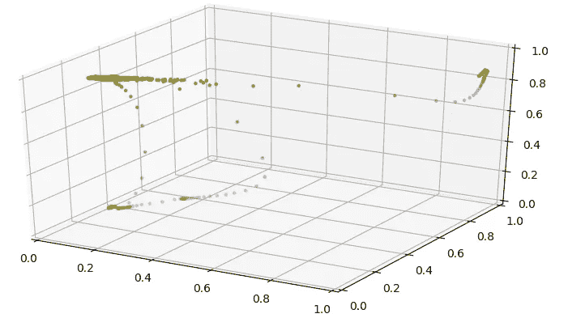

# 如何如厕训练暹罗网络

> 原文：<https://towardsdatascience.com/how-to-potty-train-a-siamese-network-3df6ca5e44da?source=collection_archive---------4----------------------->

是时候对我的一次性学习方法进行更新了，我使用了一个基于 LSTM 的深度神经网络，我们开发该网络是为了通过流量分析来识别电信网络故障。当我们将机器升级到最新的 TensorFlow 和 Keras 时，许多小细节都必须更改。仅此一项就引入了一些新的行为……同时我们获得了新例子的新数据，并发现了我们模型的一些问题。我不打算介绍所有的变化，但一些主要的变化以及一些有趣的发现。这感觉很像 potty 训练一只猫…如果你是这个系列的新手，你可以参考我以前的帖子:“[电信网络会梦到暹罗记忆吗？](https://thelonenutblog.wordpress.com/2017/12/14/do-telecom-networks-dreams-of-siamese-memories/)、[暹罗梦是什么做成的…](https://thelonenutblog.wordpress.com/2017/12/18/what-siamese-dreams-are-made-of/)

首先，Keras 中的批量规范化现在在我的黑魔法列表中😊。我将不得不更多地挖掘它是如何实现的，尤其是火车时间和预测时间之间的差异。很长一段时间，我一直在想为什么我得到了极好的训练损失和差的验证损失，直到我删除了输入层上的批处理规范化。所以，有些东西需要研究。

其次，我介绍了用于训练和验证数据的数据生成器。对于必须提供大量相似和不相似线对的连体网络方法，使用生成器在某些时候是必须掌握的！一旦掌握了要领，就相当方便了。我发现 Shervine Amidi 的博客:“[一个关于如何使用 Keras](https://stanford.edu/~shervine/blog/keras-how-to-generate-data-on-the-fly.html) 的数据生成器的详细示例”是一个很好的解释示例。我将把它推荐给任何学习 Keras 数据生成器的人。

在这个过程中，我发现我的 triplet_loss 函数(如前一篇文章所示)是有缺陷的…因为我用 Keras concatenate 打包基本神经网络输出的方式，我必须显式地指定范围。此外，我痛苦地了解到，Keras 中的损失函数传递的是一小批 y_true/y_pred 值，而不是单个值。嗯，这一点乍一看对我来说并不清楚…我还利用这个机会修改了逻辑，使用了更多的 Keras 方法而不是 TensorFlow(微妙的变化)。下面是新的损失函数。

第四个有趣的事情是，当我调试所有这些问题时，我觉得需要更好地可视化结果，而不是简单地查看预测值。我将输出向量空间从 10 维减少到 3 维，因为我现在没有太多不同的例子，所以 3D 应该足以将它们分开。此外，我更改了输出图层，使用 sigmoid 激活函数将输出空间限制在[0，1]范围内。这些变化反过来使我能够在变换的空间中查看预测点的位置，例如，交通模式现在对应于该输出空间中的 3D 位置。

下面我制作了一个视频，展示了这种投射是如何通过训练而演变的。最初，当神经网络用随机值初始化时，输出点在中心混杂在一起。但是很快我们看到它们被分开了，各自占据了空间的一角。当然，当神经网络试图找到一个更好的解决方案时，会有很多来回跳动，但我们可以看到，我们可以找到一个最佳点，在那里不同的流量模式可以很好地分开。顺便提一下，我们在这里看到了三种不同的流量模式。绿色表示正常流量，两种不同的错误情况，一种是红色表示所有流量都被阻塞，另一种是橙色表示我们达到了通信链路的容量极限。

现在，在从我们的测试平台获取更多数据的同时，我们正在尝试使用不同的损失函数来分离流量。我的一个同事刚刚发布了一个不同损失函数的比较:“[无损三重损失](/lossless-triplet-loss-7e932f990b24)”。我也可能尝试一些不同的损失函数，并展示我的发现。

我希望这表明，使用暹罗网络的一次性学习可以用于人脸识别以外的其他目的。在这种情况下，我们成功地将其用于信令流量分类和故障检测。

*原载于 2018 年 2 月 13 日*[*【thelonenutblog.wordpress.com*](https://thelonenutblog.wordpress.com/2018/02/13/how-to-potty-train-a-siamese-network/)*。*

*封面照片由*[*Jan-Mallander*](https://pixabay.com/en/users/Jan-Mallander-615621/)*at*[*Pixabay*](https://pixabay.com)*。*