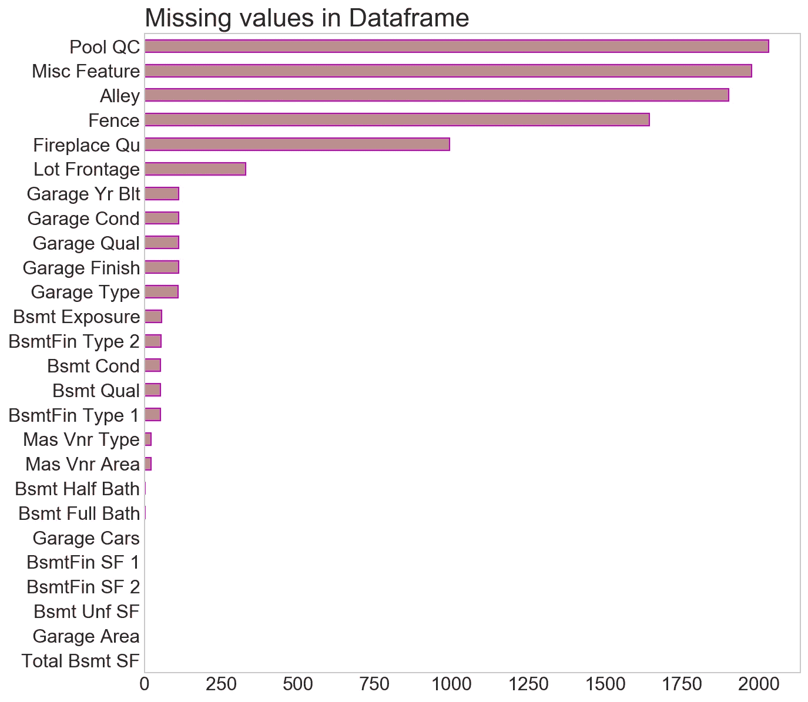
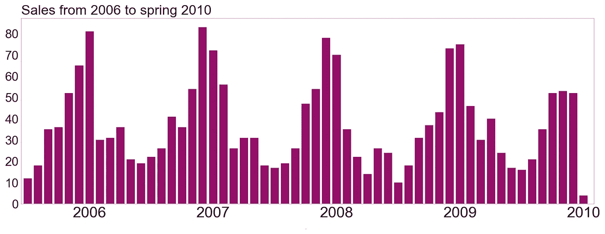
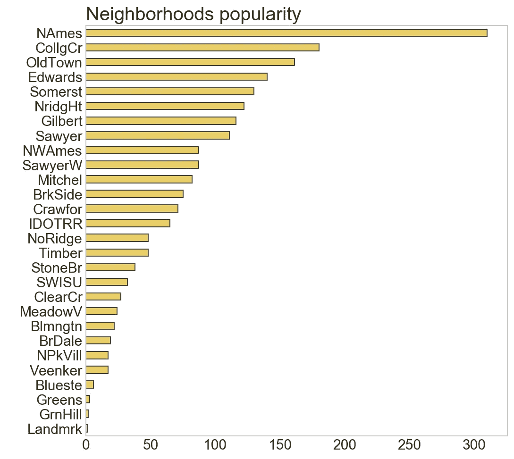
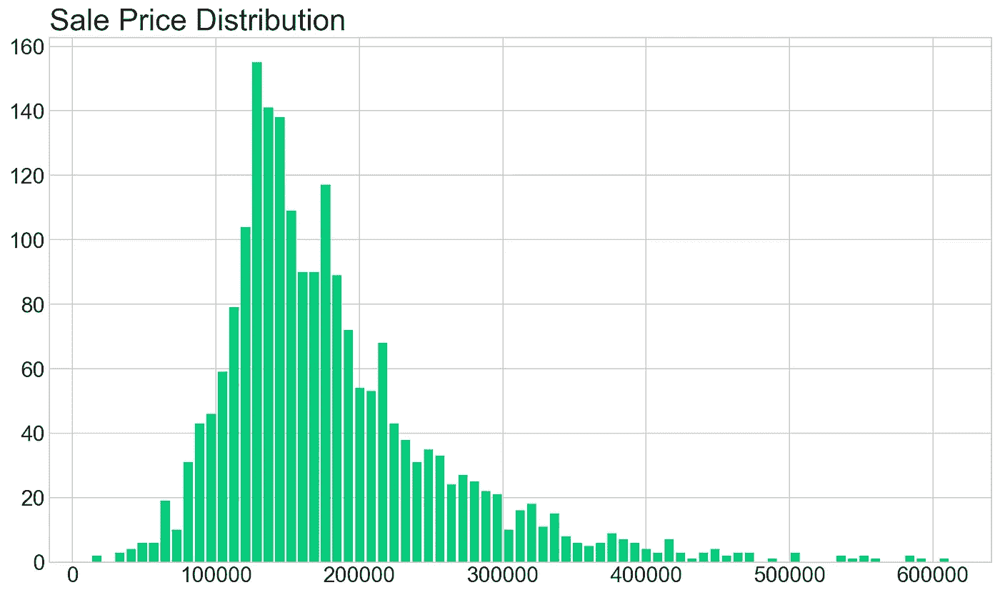
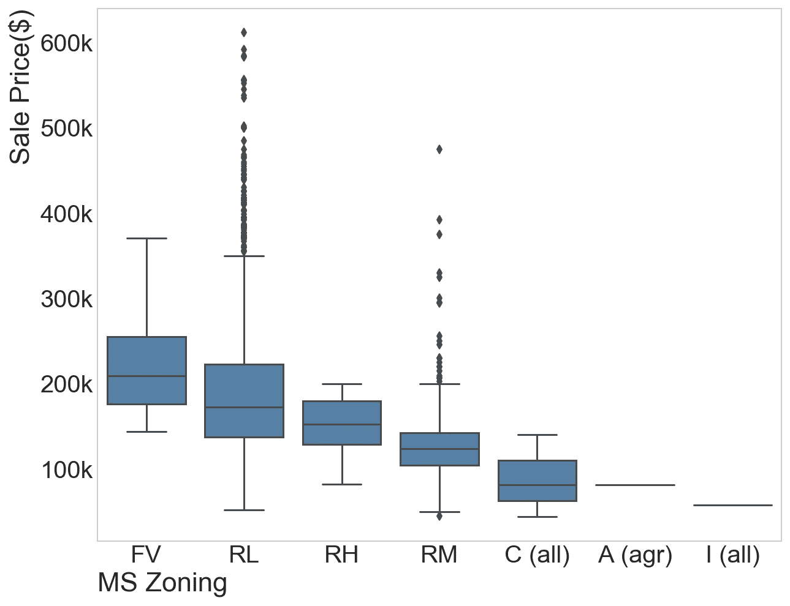
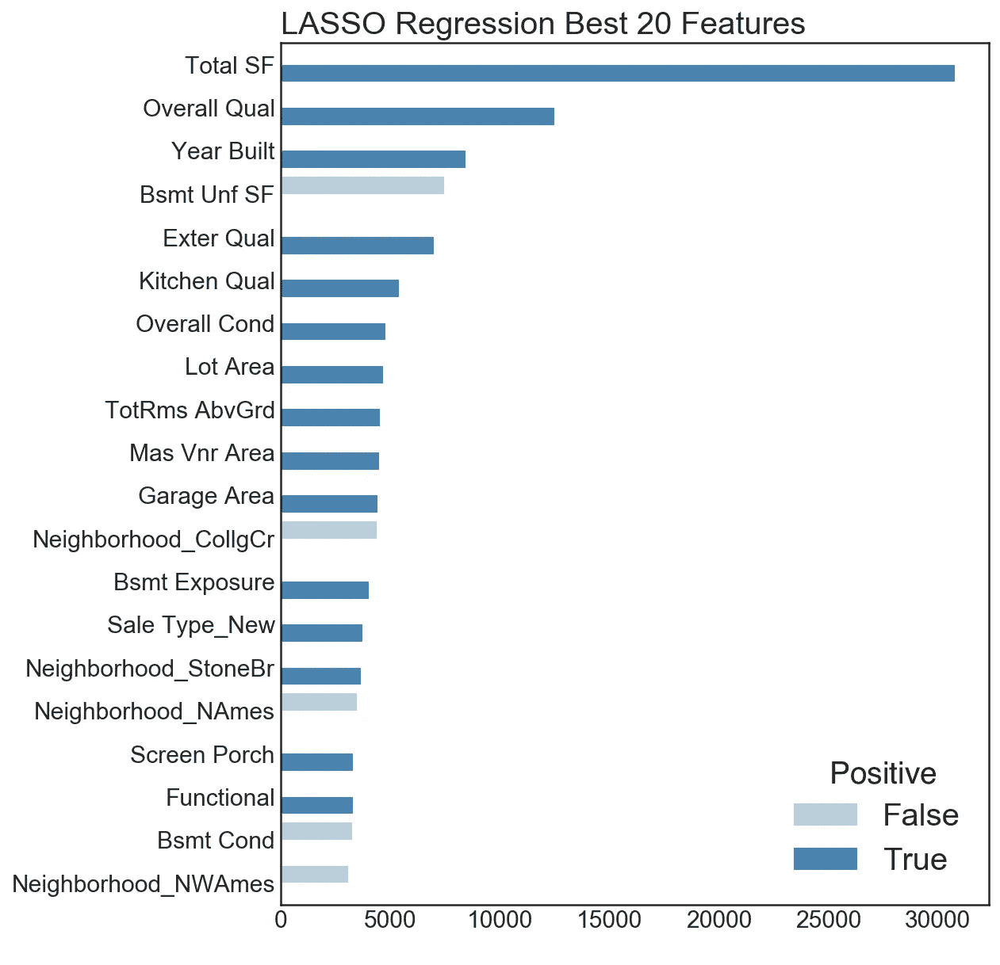

# 在爱荷华州艾姆斯市买房，人们愿意支付什么

> 原文：<https://towardsdatascience.com/how-to-predict-housing-prices-in-ames-iowa-991c35a4743?source=collection_archive---------16----------------------->

这可能是 Kaggle 上最受欢迎的测试你的第一个机器学习模型的比赛之一。你可以下载一个包含埃姆斯市房屋特征和价格信息的大型数据集，并使用它来建立一个可以预测同一城市房屋价格的机器学习模型！

> 为了构建这个模型，我使用了 Python，包括 Pandas、Numpy 和 Scikit-learn 库，以及用于绘图的 Seaborn 和 Matplotlib。

这个数据集有 2000 多行和大约 80 列，但并不是所有的都被填充了:第一个问题是**大量**丢失的数据！

有些人可能只是决定删除带有空单元格的行，或者如果缺少的值数量很大，甚至考虑删除整列。我决定不丢弃任何东西，而是试图理解数据集，并用有意义的东西填充空白点。例如，对于*地块临街面*，我决定使用相同街区内房屋的平均值来填充空白单元格

`train['Lot Frontage'] = train.groupby('Neighborhood')['Lot Frontage'] = train.groupby('Neighborhood')['Lot Frontage'].transform(lambda x: fillna(x.mean())`

其他分类单元格可能会填充模式值(通过使用上述相同的代码块并用`mode()`替换`mean()`)，或者在有意义的地方填充 *0s* ，或者在某些分类列中填充 *N/A* 。

填完空单元格，就该来点 EDA 了！从这个数据集中可以观察到一些有趣的见解。

夏季，尤其是六月和七月的销售高峰。我对埃姆斯的天气不太熟悉，但我认为当外面天气温暖宜人时，人们会比在寒冷的月份里更容易搬到一个新地方。

另一件有趣的事情是社区是如何分布的(例如，它们有多受欢迎),以初步了解这是否是一个在最终确定房价时最终很重要的变量。

It appears that North Ames is the most popular by far, followed by College Creek and Old Town.

另一件值得关注的事情是目标变量的分布，在本例中是*销售价格*，因为这对构建回归模型的最终目的是有用的。分布是正偏的，这并不理想，因为它违反了线性回归所基于的正态假设，但这仍然是我们可以解决的问题。

是时候做模特了！但在直接切入之前，我试图将尽可能多的分类变量转换成数值，这样我的算法在计算上就可以尽可能简单。一些分类变量描述了一种质量(通常从差到优)，在这种情况下，很容易用数字替换这些等级，即*差*对应 1，*一般*对应 2，依此类推……

所以我只定义了一个字典，类似`cat_dict = {'Po':1, 'Fa':2, 'TA':3, 'Gd':4, 'Ex':5}`的东西，并把它传递到`[.replace()](https://pandas.pydata.org/pandas-docs/stable/generated/pandas.Series.replace.html)` [方法](https://pandas.pydata.org/pandas-docs/stable/generated/pandas.Series.replace.html)中，应用到相应的列中！在这之后，您可能会认为您已经完成了分类列的映射，但可能还没有！有趣的是，这些并不是唯一可以转换成数字的变量:例如，如果您看一下 *MS 分区*，这些值与*销售价格*相比是有序的，那么为什么不把它们也转换成数字呢？换句话说，像对待 *FV* 等于*优*和 *A* 或 *I* 等于*差、*一样对待他们，并相应地将所有区域排在中间。

This concept can be applied to a LOT of categorical variables: check out also Lot Shape, Lot Configuration, Masonry Type and so on.

剔除几个异常值，剔除剩余的分类变量，剔除所有相关系数*销售价格*低于 5%的预测因子后，真的是时候建模了！

别忘了[训练/测试](http://scikit-learn.org/stable/modules/generated/sklearn.model_selection.train_test_split.html)分裂！你想把你的模型放在训练集上，然后检查它在看不见的数据上的表现，也就是你的测试集。在处理大量的训练和测试数据时，该过程还可以帮助您防止过度拟合，并理解模型的偏差/方差权衡。我最终选择了 80/20 的比例，但 90/10 的表现还不错。

现在应该用什么型号？我给你一个提示:我尝试了经典的线性回归和岭，但最终选择了套索，因为它的表现要好得多。套索回归在这种情况下也非常有用，因为你有大量的变量要开始:这种方法特别激烈，可以帮助你更快地摆脱不太重要的预测因素！别忘了，Lasso 会要求你[缩放你的数据](http://scikit-learn.org/stable/modules/generated/sklearn.preprocessing.StandardScaler.html)(只有预测值，没有目标值！)所以惩罚因子在所有变量中可以是“公平”的。

这种方法的缺点是“选择”最佳超参数α。你不必真的突然选择它，最有可能的是你必须写一个算法为你做这件事。我刚学了`[GridSearchCV](http://scikit-learn.org/stable/modules/generated/sklearn.model_selection.GridSearchCV.html)`这就是我用的！由于我不知道这个α的范围，也不想让我的笔记本电脑陷入几个小时的迭代中，我把研究分成了两部分:首先，我研究了一个范围更广的数字，这些数字的间隔相当大。一旦我找到了第一个最佳值，我就将研究进一步细分，在第一个最佳值周围划分成一个更密集的区间。我很惊讶，因为这只花了几分钟的迭代时间！那些不熟悉 GridSearch 的人可能不知道我在说什么，也因为我的解释不全面，但这是一个相当复杂的步骤，需要一篇博文，也许我会写一篇。或者，您可以使用`[LassoCV](http://scikit-learn.org/stable/modules/generated/sklearn.linear_model.LassoCV.html)`来找到您的最佳参数:它没有那么强大，但仍然适合这个目的。

一旦您找到您的超参数，您就可以实例化并拟合您的模型了！我的套索回归让我从最初的 179 个参数中去掉了 83 个，非常棒！此外，有趣的是，我的获胜特征是我自己设计的！在初始数据集中，有 4 列关于平方英尺的数据:一楼、二楼、地上(一楼和二楼的总和)和地下室。我删除了所有这些列，并创建了一个新的列:总平方英尺数等于地面面积加上地下室面积的*，这最终成为确定埃姆斯一所房子最终价格的最重要的特征**！***

Absolute values of the top 20 predictors of Lasso regression.

在第二名和第三名我们分别找到了*总体质量*和*年造*，这很有意义。当然，并不是所有的顶级预测都是积极的:一些其他变量也可能非常强烈地降低房价。第四，事实上，我们可以看到一个未完工的地下室的面积和房子的价格是负相关的。如果说我从这个项目中学到了什么，那就是埃姆斯的人们真的很喜欢他们的地下室和车库！

最后，我的第一个模型完成了，我的训练集和测试集的[交叉验证分数分别为 90.2%和 88.6%，非常好！事实上，训练分数比测试分数略高，这意味着模型稍微有些过拟合，所以对于未来的发展，我会考虑放弃更多的变量，或者在训练/测试比率上多下一点功夫。我还将实现一些多项式特性，并尝试对数转换正偏差的变量(使与目标的关系“更加线性”)，看看结果如何！](http://scikit-learn.org/stable/modules/generated/sklearn.model_selection.cross_val_score.html)