# 如何用 Python 和递归神经网络预测严重堵车？

> 原文：<https://towardsdatascience.com/how-to-predict-severe-traffic-jams-with-python-and-recurrent-neural-networks-e53b6d411e8d?source=collection_archive---------9----------------------->

## 利用 Python 和 Keras 实现序列模型在交通事件 Waze 开放数据挖掘中的应用。


在本教程中，我将向您展示如何使用 RNN 深度学习模型从事件报告的 Waze 交通开放数据中发现模式，并预测严重的交通堵塞是否会很快发生。干预是可以有效取出的。

# 竞争

2018 年 12 月 1 日，我在德克萨斯州弗里斯科的 UNT 灵感公园参加了一场黑客马拉松编程比赛。黑客马拉松被称为“HackNTX”。

黑客马拉松从早上 8 点开始，到晚上 9 点结束。参与者可以自由地吃零食和水果，在院子里散步，呼吸新鲜空气，晒晒太阳。此外，人们可以自由地交谈、讨论和组建团队(每个团队不超过 5 人)。


主持人向参赛者提供了各种开放数据集，以及一些预定义的演示问题。你可以选择自己的新问题，在竞赛中解决。

Waze 数据是提供的数据集之一。


在国内，我从来不用 Waze App 导航。对我来说是新的。

我谷歌了一下，发现了 Waze 的特征。它不仅可以为用户提供普通的导航功能，还可以让用户报告交通事件，以便其他用户可以相应地调整他们的路线。

对我来说，最重要的特点是，当你被困在交通堵塞时，你可以准确地知道前面发生了什么，如道路施工，或车祸。在这种情况下，你将能够有一个更好的估计，冷静下来。这对你的健康有好处。

从几年前开始，Waze 与政府合作，开始共享数据。对于政府来说，他们可以从即时的交通状况报告中受益，并及时对事件做出响应。对于 Waze 平台来说，它可以整合政府开放的数据，如道路规划，以改善其路由功能，让用户更快乐。

HackNTX 的主办方提供的 Waze 数据是关于 DFW 地区从 11 月 1 日到 11 月 29 日的交通事件。

原始数据为 TSV 格式，总大小约为 300 兆字节。

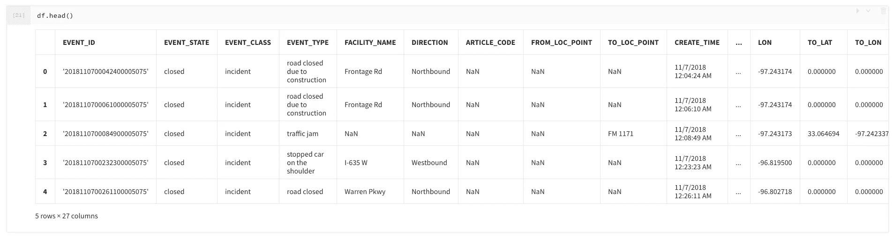

每行代表一个事件报告，包含坐标和时间戳。

在探索性数据分析阶段，我根据数据进行了几次可视化。

第一次听说 QGIS，软件很强大。谢谢杰西教我如何使用它！

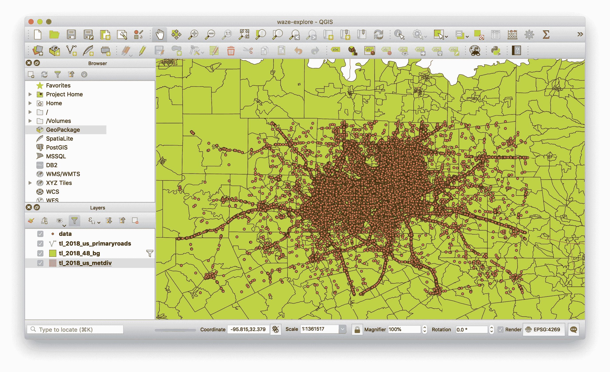

在上面的截图中，你可以看到每个点代表一个事件。他们人太多了！

由于我对 QGIS 不太熟悉，Jesse 在下午早些时候离开了比赛，我不得不回去使用 Python 进行详细的可视化。

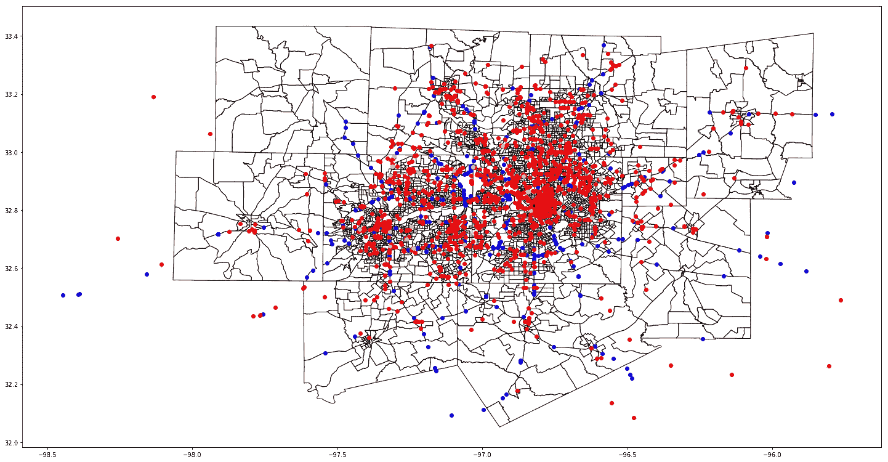

上图是用 Python 的 Geopandas 包制作的。它显示了三种不同类型的交通事件，即交通堵塞(红色)、事故(黄色)和“路肩停车”(蓝色)。请注意，它们仅从数据集中的前 3000 行中提取。

正如你可能已经发现的，红点的数量(意味着交通堵塞)是巨大的。交通堵塞确实是一个大问题。

我从数据中提取了所有独特的事件类型，得到了以下列表:

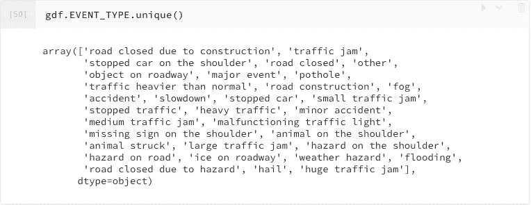

我们可能知道，交通堵塞可以分为几个不同的级别。最严重的是“大塞车”和“大塞车”。

我把这两类事件合并成一个集合 a .而其他事件可以看作是集合 b。

对于集合 A 中的每个事件，我回溯 30 分钟，并将同一条路上报告的每个事件累积到一个序列中。总共有 987 个。然而，其中一些是空列表，意味着在严重堵塞之前没有任何报告，而且它发生得非常突然。对于这种堵车，没人能预测，所以我决定去掉，保留了 861 个非空序列。

类似地，我通过回溯来自集合 b 的事件随机提取了 861 个非空序列。注意这些序列**没有**导致严重的交通堵塞。

现在我们已经得到了作为输入数据的序列，我们将从集合 A 生成的序列标记为 1，而其他的标记为 0。

我们的研究问题是，能不能用一个模型对这些序列数据进行分类？

结果证明是成功的。我们获得了一等奖！


我们的团队，昵称为“守望饺子”，由来自武汉大学的访问博士生王春英和我组成，代表实验室。我们每个人都得到了 100 美元。看我们多开心啊！

HackNTX 的网站很快就对黑客马拉松比赛进行了报道。这里是[环节](https://www.hackntx.com/blog/2018/12/03/hackntx-2018-winners-and-wrap-up)。


几天后，UNT 也向[报告了这个消息](https://informationscience.unt.edu/visiting-scholar-and-doctoral-student-take-first-place-win-hack-ntx-event)。

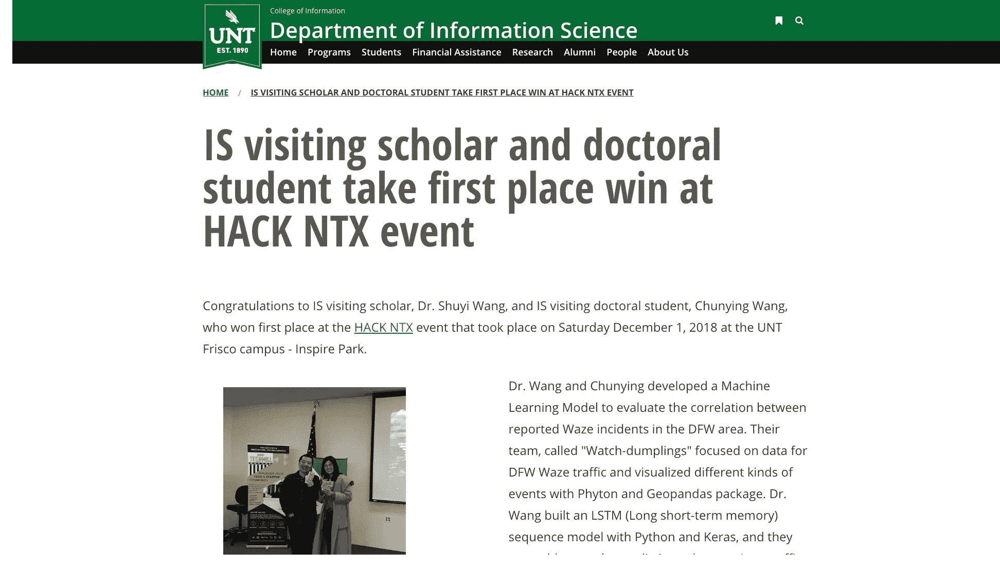

对我来说，获得一等奖几乎完全是运气。然而，我认为该模型具有潜在的实用价值。

在本文的后面部分，我将尝试向您展示如何使用 Python 和 Keras 实现 RNN 模型来对 Waze 事件序列进行分类。

# 环境

要做深度学习，你需要 GPU 或者 TPU，否则你的笔记本电脑会被折磨。我带着没有风扇的 Macbook 去参加比赛，我没有办法用它来训练深度神经网络。

我用了谷歌 Colab。这很酷，谷歌人很慷慨，为用户提供免费的 GPU 和 TPU。

请先下载安装 Google Chrome，然后点击[这个链接](https://chrome.google.com/webstore/detail/colaboratory/flckfnigdgnmmidlohfbfccgpakpeagd)，安装一个名为 Colaboratory 的插件。


你会在 Chrome 的扩展栏中看到它的黄色图标。


我已经把这个教程的所有代码和数据上传到了[这个 github repo](https://github.com/wshuyi/demo_traffic_jam_prediction) 上。

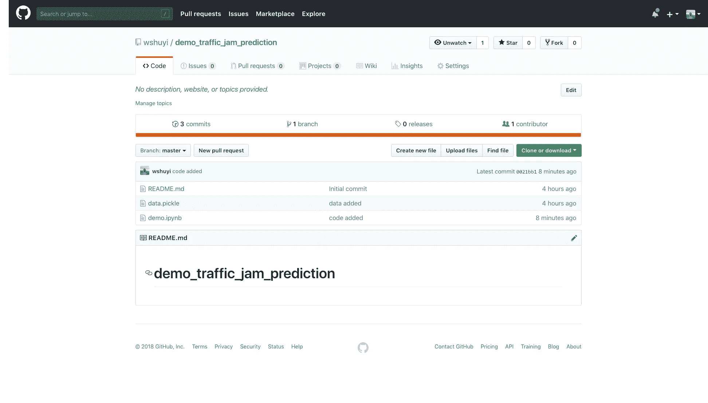

请点击上面的链接，并点击`demo.ipynb`。

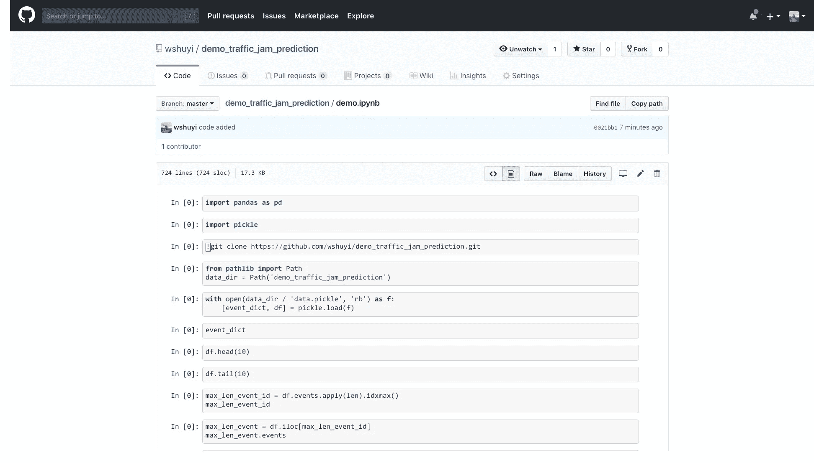

现在你可以点击 Colaboratory 的图标，Chrome 会自动为你打开 Google Colab，将这个 ipynb 文件加载进去。

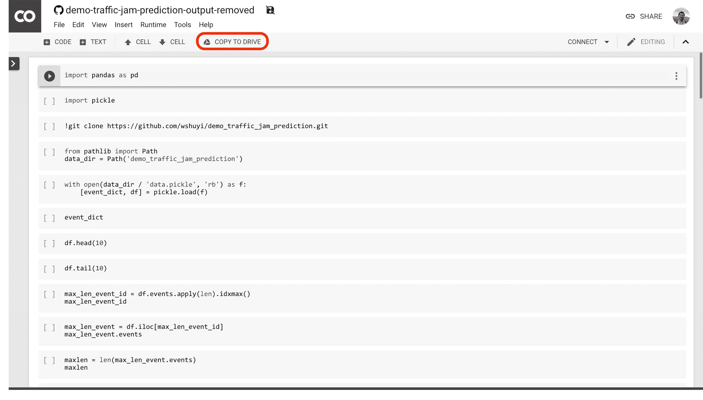

点击上面截图中我用红色圈出的“复制到驱动器”按钮，Google 会在你的 Google Drive 上为你创建一份 Jupyter 笔记本文件的副本。

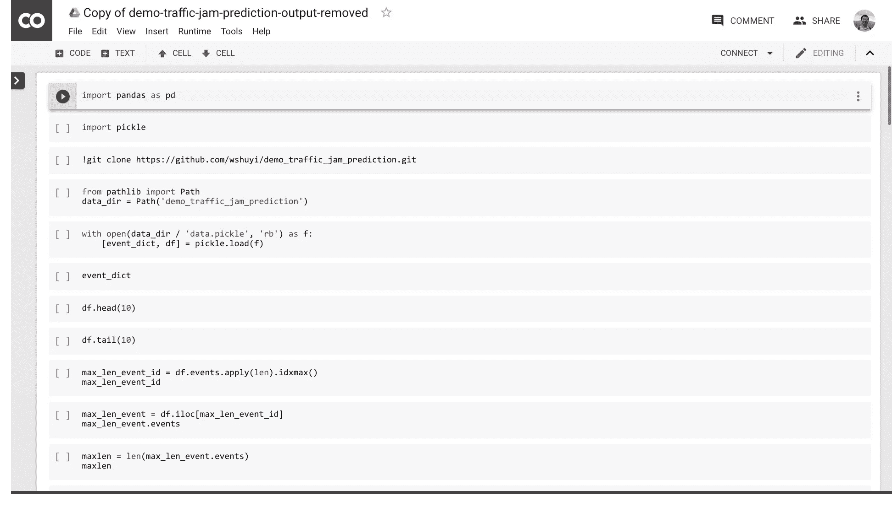

进入“运行时”菜单，点击“更改运行时类型”。

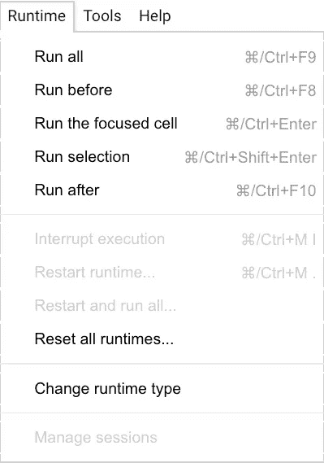

仔细检查选项是否设置如下:


保存，然后就万事俱备了。

要运行一段代码，只需点击左侧的运行按钮。


让我们一步一步来，我会给你必要的解释。

# 密码

我们需要加载 Pandas 包来处理表格数据。

```
import pandas as pd
```

我们将需要另一个包来加载预处理阶段保存的数据。它叫泡菜。

```
import pickle
```

它可以将单个或多个 Python 数据保存到外部文件中。当您将它加载回程序中时，它会将数据恢复为保存时的状态。在这种情况下，它比用 CSV 文件交换数据更容易、更高效。

让我们克隆本教程的 github repo，并将数据放入 Google Colab workspace。

```
!git clone [https://github.com/wshuyi/demo_traffic_jam_prediction.git](https://github.com/wshuyi/demo_traffic_jam_prediction.git)
```

数据没那么大，不一会就下载完了。

```
Cloning into 'demo_traffic_jam_prediction'...
remote: Enumerating objects: 6, done.[K
remote: Counting objects: 100% (6/6), done.[K
remote: Compressing objects: 100% (4/4), done.[K
remote: Total 6 (delta 0), reused 3 (delta 0), pack-reused 0[K
Unpacking objects: 100% (6/6), done.
```

让我们告诉 Jupyter 笔记本数据文件夹的路径。

```
from pathlib import Path
data_dir = Path('demo_traffic_jam_prediction')
```

我们将打开数据文件并用 pickle 加载两个不同的数据变量。

```
with open(data_dir / 'data.pickle', 'rb') as f:
    [event_dict, df] = pickle.load(f)
```

首先，让我们看看名为`event_dict`的事件字典:

```
event_dict
```

以下是所有的事件类型。

```
{1: 'road closed due to construction',
 2: 'traffic jam',
 3: 'stopped car on the shoulder',
 4: 'road closed',
 5: 'other',
 6: 'object on roadway',
 7: 'major event',
 8: 'pothole',
 9: 'traffic heavier than normal',
 10: 'road construction',
 11: 'fog',
 12: 'accident',
 13: 'slowdown',
 14: 'stopped car',
 15: 'small traffic jam',
 16: 'stopped traffic',
 17: 'heavy traffic',
 18: 'minor accident',
 19: 'medium traffic jam',
 20: 'malfunctioning traffic light',
 21: 'missing sign on the shoulder',
 22: 'animal on the shoulder',
 23: 'animal struck',
 24: 'large traffic jam',
 25: 'hazard on the shoulder',
 26: 'hazard on road',
 27: 'ice on roadway',
 28: 'weather hazard',
 29: 'flooding',
 30: 'road closed due to hazard',
 31: 'hail',
 32: 'huge traffic jam'}
```

然后，让我们看看数据帧中的`df`是什么。

这是一张相当长的桌子。让我们只显示前 10 行。

```
df.head(10)
```

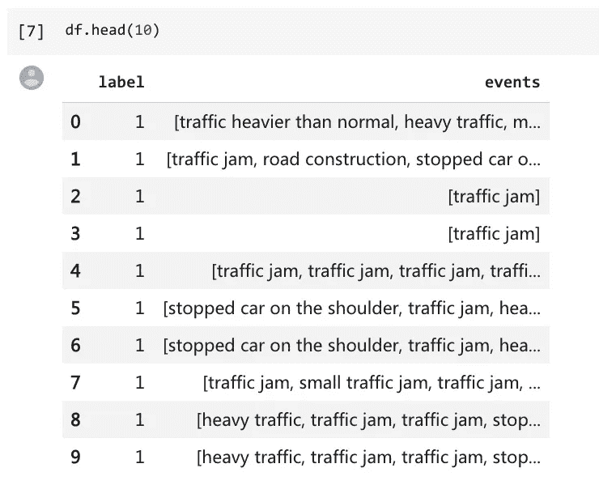

在每一行中，都有一个相应的标签，显示数据序列之后是否有严重的交通堵塞事件。

然后我们会让熊猫给我们展示最后 10 排。

```
df.tail(10)
```

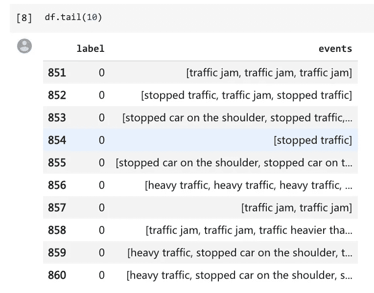

现在我们已经正确地加载了数据，我们将看到哪一行包含最长的序列。

我们将使用来自 Pandas 的一个名为`idxmax()`的函数，它将帮助我们获得最大值的索引。

```
max_len_event_id = df.events.apply(len).idxmax()
max_len_event_id
```

结果如下:

```
105
```

让我们深入了解这一行的顺序:

```
max_len_event = df.iloc[max_len_event_id]
max_len_event.events
```

结果是一个相当长的列表。

```
['stopped car on the shoulder',
 'heavy traffic',
 'heavy traffic',
 'heavy traffic',
 'slowdown',
 'stopped traffic',
 'heavy traffic',
 'heavy traffic',
 'heavy traffic',
 'heavy traffic',
 'traffic heavier than normal',
 'stopped car on the shoulder',
 'traffic jam',
 'heavy traffic',
 'stopped traffic',
 'stopped traffic',
 'stopped traffic',
 'heavy traffic',
 'traffic jam',
 'stopped car on the shoulder',
 'stopped traffic',
 'stopped traffic',
 'stopped traffic',
 'heavy traffic',
 'traffic heavier than normal',
 'traffic heavier than normal',
 'traffic heavier than normal',
 'traffic heavier than normal',
 'heavy traffic',
 'stopped traffic',
 'traffic heavier than normal',
 'pothole',
 'stopped car on the shoulder',
 'traffic jam',
 'slowdown',
 'stopped traffic',
 'heavy traffic',
 'traffic heavier than normal',
 'traffic jam',
 'traffic jam',
 'stopped car on the shoulder',
 'major event',
 'traffic jam',
 'traffic jam',
 'stopped traffic',
 'heavy traffic',
 'traffic heavier than normal',
 'stopped car on the shoulder',
 'slowdown',
 'heavy traffic',
 'heavy traffic',
 'stopped car on the shoulder',
 'traffic jam',
 'slowdown',
 'slowdown',
 'heavy traffic',
 'stopped car on the shoulder',
 'heavy traffic',
 'minor accident',
 'stopped car on the shoulder',
 'heavy traffic',
 'stopped car on the shoulder',
 'heavy traffic',
 'stopped traffic',
 'heavy traffic',
 'traffic heavier than normal',
 'heavy traffic',
 'stopped car on the shoulder',
 'traffic heavier than normal',
 'stopped traffic',
 'heavy traffic',
 'heavy traffic',
 'heavy traffic',
 'stopped car on the shoulder',
 'slowdown',
 'stopped traffic',
 'heavy traffic',
 'stopped car on the shoulder',
 'traffic heavier than normal',
 'heavy traffic',
 'minor accident',
 'major event',
 'stopped car on the shoulder',
 'stopped car on the shoulder']
```

如果你仔细检查序列，你会注意到这条路上有严重交通堵塞的迹象。然而，你需要让机器获得“感觉”并自动对序列进行分类。

最长的序列有多长？

```
maxlen = len(max_len_event.events)
maxlen
```

下面是答案:

```
84
```

哇！这是一个长长的事件列表！

电脑不擅长读取事件名称。让我们试着把名字转换成数字，这样计算机就能更好地处理这个问题。

为了有效地做到这一点，我们需要反转之前加载的字典。即尝试将“索引:事件类型”格式转换为“事件类型:索引”。

```
reversed_dict = {}
for k, v in event_dict.items():
  reversed_dict[v] = k
```

让我们检查一下翻过来的字典。

```
reversed_dict
```

这是结果。

```
{'accident': 12,
 'animal on the shoulder': 22,
 'animal struck': 23,
 'flooding': 29,
 'fog': 11,
 'hail': 31,
 'hazard on road': 26,
 'hazard on the shoulder': 25,
 'heavy traffic': 17,
 'huge traffic jam': 32,
 'ice on roadway': 27,
 'large traffic jam': 24,
 'major event': 7,
 'malfunctioning traffic light': 20,
 'medium traffic jam': 19,
 'minor accident': 18,
 'missing sign on the shoulder': 21,
 'object on roadway': 6,
 'other': 5,
 'pothole': 8,
 'road closed': 4,
 'road closed due to construction': 1,
 'road closed due to hazard': 30,
 'road construction': 10,
 'slowdown': 13,
 'small traffic jam': 15,
 'stopped car': 14,
 'stopped car on the shoulder': 3,
 'stopped traffic': 16,
 'traffic heavier than normal': 9,
 'traffic jam': 2,
 'weather hazard': 28}
```

我们成功了。

现在我们需要构造一个函数，来转换事件列表，并返回给我们一个数字列表。

```
def map_event_list_to_idxs(event_list):
  list_idxs = []
  for event in (event_list):
    idx = reversed_dict[event]
    list_idxs.append(idx)
  return list_idxs
```

让我们试试最长列表中的函数。

```
map_event_list_to_idxs(max_len_event.events)
```

结果是:

```
[3,
 17,
 17,
 17,
 13,
 16,
 17,
 17,
 17,
 17,
 9,
 3,
 2,
 17,
 16,
 16,
 16,
 17,
 2,
 3,
 16,
 16,
 16,
 17,
 9,
 9,
 9,
 9,
 17,
 16,
 9,
 8,
 3,
 2,
 13,
 16,
 17,
 9,
 2,
 2,
 3,
 7,
 2,
 2,
 16,
 17,
 9,
 3,
 13,
 17,
 17,
 3,
 2,
 13,
 13,
 17,
 3,
 17,
 18,
 3,
 17,
 3,
 17,
 16,
 17,
 9,
 17,
 3,
 9,
 16,
 17,
 17,
 17,
 3,
 13,
 16,
 17,
 3,
 9,
 17,
 18,
 7,
 3,
 3]
```

现在我们从 Keras 加载 numpy 和一些实用函数。

```
import numpy as np
from keras.utils import to_categorical
from keras.preprocessing.sequence import pad_sequences
```

我们需要弄清楚我们有多少不同的事件类型。

```
len(event_dict)
```

结果如下:

```
32
```

让我们把所有的事件顺序转换成数字列表。

```
df.events.apply(map_event_list_to_idxs)
```

结果是:

```
0      [9, 17, 18, 14, 13, 17, 3, 13, 16, 3, 17, 17, ...
1                                             [2, 10, 3]
2                                                    [2]
3                                                    [2]
4                               [2, 2, 2, 2, 2, 2, 2, 9]
5                                             [3, 2, 17]
6                                             [3, 2, 17]
7                        [2, 15, 2, 17, 2, 2, 13, 17, 2]
8                                  [17, 2, 2, 16, 17, 2]
9                                  [17, 2, 2, 16, 17, 2]
10     [17, 16, 17, 2, 17, 3, 17, 17, 16, 17, 16, 18,...
11                                                  [17]
12                                                  [17]
13                                              [24, 24]
14                                    [24, 2, 24, 24, 2]
15                                    [24, 2, 24, 24, 2]
16     [2, 10, 2, 2, 2, 18, 16, 16, 7, 2, 16, 2, 2, 9...
17     [2, 10, 2, 2, 2, 18, 16, 16, 7, 2, 16, 2, 2, 9...
18                               [24, 24, 24, 16, 2, 16]
19                               [24, 24, 24, 16, 2, 16]
20                                                [2, 2]
21                                            [2, 16, 2]
22                                            [2, 16, 2]
23                                                [2, 2]
24                                                [2, 2]
25                                              [24, 24]
26                                                [2, 2]
27                                         [2, 2, 2, 17]
28                                            [2, 19, 2]
29                                                  [24]
                             ...
831                     [9, 9, 9, 2, 9, 9, 17, 2, 9, 17]
832                                            [3, 3, 3]
833                                 [2, 9, 2, 17, 17, 2]
834       [3, 3, 17, 3, 13, 3, 3, 23, 9, 3, 3, 25, 3, 3]
835      [3, 17, 9, 14, 9, 17, 14, 9, 2, 9, 3, 2, 2, 17]
836                                                  [2]
837         [17, 2, 16, 3, 9, 17, 17, 17, 13, 17, 9, 17]
838    [13, 17, 17, 3, 3, 16, 17, 16, 17, 16, 3, 9, 1...
839                                                  [2]
840                                                  [3]
841                                                  [2]
842    [17, 17, 17, 3, 17, 23, 16, 17, 17, 3, 2, 13, ...
843                                               [3, 3]
844                                                  [2]
845                     [2, 17, 2, 2, 2, 2, 2, 17, 2, 2]
846                                   [7, 17, 3, 18, 17]
847                                            [3, 3, 3]
848    [2, 2, 2, 2, 2, 2, 2, 2, 2, 2, 2, 2, 2, 2, 2, ...
849                                               [2, 2]
850          [2, 2, 2, 2, 2, 2, 2, 2, 2, 2, 2, 13, 3, 2]
851                                            [2, 2, 2]
852                                          [16, 2, 16]
853                [3, 16, 5, 3, 17, 3, 16, 9, 3, 2, 17]
854                                                 [16]
855    [3, 3, 3, 3, 3, 3, 3, 3, 2, 13, 3, 6, 3, 6, 3,...
856                    [17, 17, 17, 2, 3, 2, 2, 2, 2, 2]
857                                               [2, 2]
858                                  [2, 2, 9, 17, 2, 2]
859                            [17, 3, 2, 2, 2, 2, 2, 2]
860    [17, 3, 3, 17, 3, 17, 2, 3, 18, 14, 3, 3, 16, ...
Name: events, Length: 1722, dtype: object
```

作为人类，我们很难识别每个数字所代表的意义。但是，对于计算机来说，就容易多了。

我们将结果列表命名为`sequences`，显示前五行。

```
sequences = df.events.apply(map_event_list_to_idxs).tolist()
sequences[:5]
```

结果如下:

```
[[9,
  17,
  18,
  14,
  13,
  17,
  3,
  13,
  16,
  3,
  17,
  17,
  16,
  3,
  16,
  17,
  9,
  17,
  2,
  17,
  2,
  7,
  16,
  17,
  17,
  17,
  17,
  13,
  5,
  17,
  9,
  9,
  16,
  16,
  3],
 [2, 10, 3],
 [2],
 [2],
 [2, 2, 2, 2, 2, 2, 2, 9]]
```

注意第一行比后面几行长得多。

然而，要对数据应用序列模型，我们需要确保所有输入序列共享相同的长度。因此，我们使用最长序列的长度作为最大长度，并从开始用 0 填充其他较短的序列。

```
data = pad_sequences(sequences, maxlen=maxlen)
data
```

以下是填充序列:

```
array([[ 0,  0,  0, ..., 16, 16,  3],
       [ 0,  0,  0, ...,  2, 10,  3],
       [ 0,  0,  0, ...,  0,  0,  2],
       ...,
       [ 0,  0,  0, ..., 17,  2,  2],
       [ 0,  0,  0, ...,  2,  2,  2],
       [ 0,  0,  0, ...,  3,  3,  2]], dtype=int32)
```

现在所有的序列都有相同的长度。

我们需要获取标签列，并将其保存到一个名为`labels`的变量中。

```
labels = np.array(df.label)
```

因为我们需要使用几个随机函数，为了保持您的运行结果与我的相同，我们将随机种子值指定为 12。

```
np.random.seed(12)
```

当您完成代码的第一次运行时，可以随意修改它。

我们把这些序列和它们相应的标签混在一起。

```
indices = np.arange(data.shape[0])
np.random.shuffle(indices)
data = data[indices]
labels = labels[indices]
```

训练集将包含 80%的数据，而另外 20%将进入验证集。

```
training_samples = int(len(indices) * .8)
validation_samples = len(indices) - training_samples
```

下面的代码将数据与标签一起分为定型集和验证集。

```
X_train = data[:training_samples]
y_train = labels[:training_samples]
X_valid = data[training_samples: training_samples + validation_samples]
y_valid = labels[training_samples: training_samples + validation_samples]
```

让我们展示训练数据的内容:

```
X_train
```

这是结果。

```
array([[ 0,  0,  0, ..., 15, 15,  3],
       [ 0,  0,  0, ...,  0,  2,  2],
       [ 0,  0,  0, ...,  0,  0, 16],
       ...,
       [ 0,  0,  0, ...,  2, 15, 16],
       [ 0,  0,  0, ...,  2,  2,  2],
       [ 0,  0,  0, ...,  0,  0,  2]], dtype=int32)
```

请注意，当我们用 0 填充序列作为填充值时，现在我们有 33 个事件类型，而不是 32 个。

因此事件类型的数量将被设置为 33。

```
num_events = len(event_dict) + 1
```

如果我们简单地把数字放入分类模型，它会把每个数字看作一个连续的值。然而，事实并非如此。因此，我们将让数字通过一个嵌入层，并将每个数字(代表某种类型的事件)转换为一个向量。每个向量将包含 20 个标量。

```
embedding_dim = 20
```

初始嵌入矩阵将随机生成。

```
embedding_matrix = np.random.rand(num_events, embedding_dim)
```

最后，我们现在可以建立一个模型。

我们使用 Keras 中的顺序模型，一层一层地放置不同的层，就像我们玩乐高一样。

第一层是嵌入层，然后是 LSTM 层，最后一层是稠密层，其激活函数是 sigmoid，进行二值分类。

```
from keras.models import Sequential
from keras.layers import Embedding, Flatten, Dense, LSTM

units = 32

model = Sequential()
model.add(Embedding(num_events, embedding_dim))
model.add(LSTM(units))
model.add(Dense(1, activation='sigmoid'))
```

如果你对 Keras 不熟悉，推荐你读一读 Keras 的创建者 Franç ois Chollet 的《用 Python 进行深度学习》。


下一步是处理嵌入层中的参数。目前，我们只是加载随机生成的初始嵌入矩阵，不会让训练过程改变嵌入层的权重。

```
model.layers[0].set_weights([embedding_matrix])
model.layers[0].trainable = False
```

然后，我们训练模型，并将模型保存到 h5 文件中。

```
model.compile(optimizer='rmsprop',
              loss='binary_crossentropy',
              metrics=['acc'])
history = model.fit(X_train, y_train,
                    epochs=50,
                    batch_size=32,
                    validation_data=(X_valid, y_valid))
model.save("mymodel_embedding_untrainable.h5")
```

在 TPU 的大力支持下，训练速度相当快。

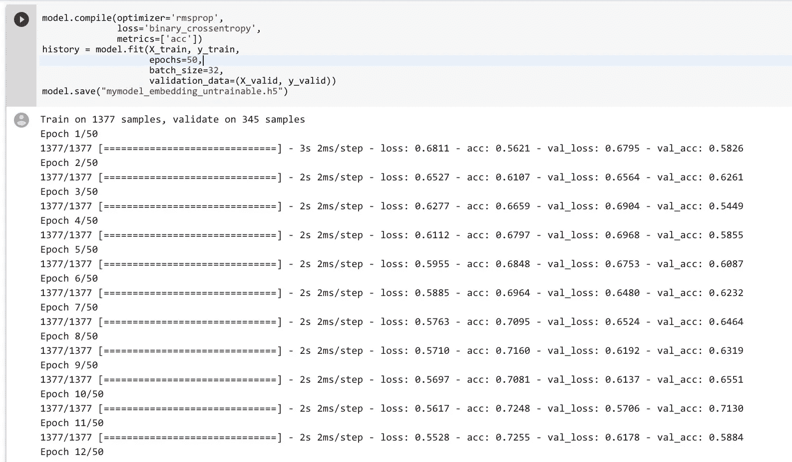

模型训练完成后，让我们用 matplotlib 可视化精度和损耗的曲线。

```
import matplotlib.pyplot as plt

acc = history.history['acc']
val_acc = history.history['val_acc']
loss = history.history['loss']
val_loss = history.history['val_loss']

epochs = range(1, len(acc) + 1)

plt.plot(epochs, acc, 'bo', label='Training acc')
plt.plot(epochs, val_acc, 'b', label='Validation acc')
plt.title('Training and validation accuracy')
plt.legend()

plt.figure()

plt.plot(epochs, loss, 'bo', label='Training loss')
plt.plot(epochs, val_loss, 'b', label='Validation loss')
plt.title('Training and validation loss')
plt.legend()

plt.show()
```

这是精确度曲线。

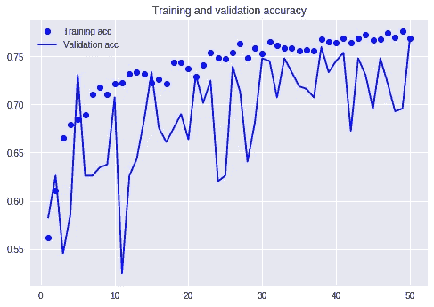

如你所见，还不错。如果我们使用虚拟模型来预测标签为 0 的所有内容(或所有内容为 1)，精确度将保持在 0.50。很明显，我们的模型捕捉到了一些模式，并且比虚拟模型表现得更好。

但是，它很不稳定。

然后让我们看看损失曲线。

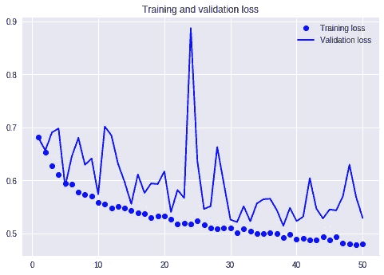

你可能会发现，这并不好。当训练损失下降时，验证集的损失上升，并且没有明显的收敛趋势。

更重要的是找出原因。

注意，我们使用了一个随机初始化的嵌入矩阵，它在训练阶段保持不变。这可能会给我们带来麻烦。

下一步，我们可以做一个实验来训练和调整嵌入层。

```
from keras.models import Sequential
from keras.layers import Embedding, Flatten, Dense, LSTM

units = 32

model = Sequential()
model.add(Embedding(num_events, embedding_dim))
model.add(LSTM(units))
model.add(Dense(1, activation='sigmoid'))
```

代码中唯一不同的是，参数`trainable`被设置为`True`。

```
model.layers[0].set_weights([embedding_matrix])
model.layers[0].trainable = True
```

让我们编译这个模型，再运行一遍。

```
model.compile(optimizer='rmsprop',
              loss='binary_crossentropy',
              metrics=['acc'])
history = model.fit(X_train, y_train,
                    epochs=50,
                    batch_size=32,
                    validation_data=(X_valid, y_valid))
model.save("mymodel_embedding_trainable.h5")
```

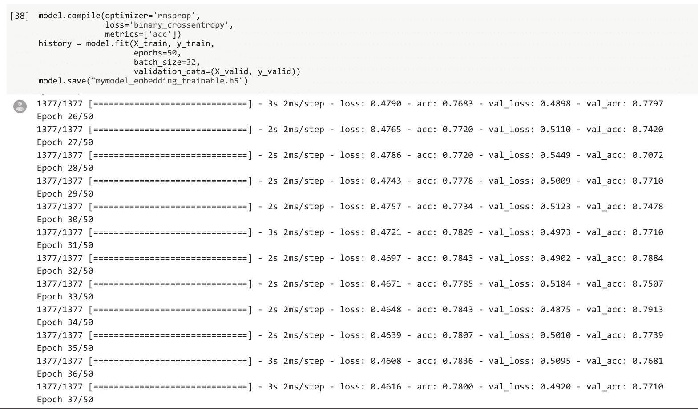

我们还绘制了精度曲线和损耗曲线。

```
import matplotlib.pyplot as plt

acc = history.history['acc']
val_acc = history.history['val_acc']
loss = history.history['loss']
val_loss = history.history['val_loss']

epochs = range(1, len(acc) + 1)

plt.plot(epochs, acc, 'bo', label='Training acc')
plt.plot(epochs, val_acc, 'b', label='Validation acc')
plt.title('Training and validation accuracy')
plt.legend()

plt.figure()

plt.plot(epochs, loss, 'bo', label='Training loss')
plt.plot(epochs, val_loss, 'b', label='Validation loss')
plt.title('Training and validation loss')
plt.legend()

plt.show()
```

准确度曲线如下所示。

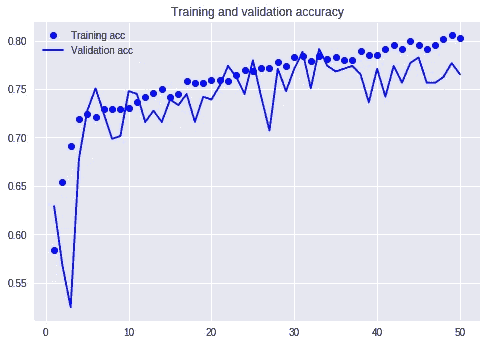

如你所见，情况有所好转。验证准确度曲线波动下降，验证准确度高于 0.75。

这种模式在某种程度上更有价值。

但是，我们不应该这么快就下结论。如果你观察亏损曲线，你就不会这么乐观了。

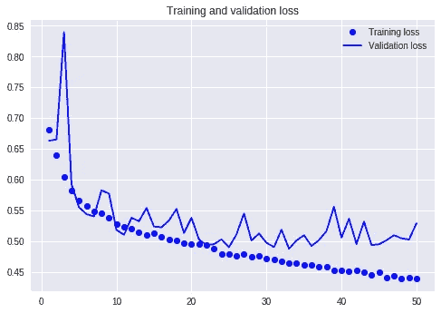

从中途开始，不同盘的损失趋势走向不同的方向。

这是一种过度拟合的暗示。

过度拟合总是表明训练数据对于复杂模型来说是不够的。

你可以为训练增加更多的数据，或者降低复杂度。

第一种方法现在不太适用，因为我们只有 11 月份 29 天的数据集。

然而，要降低模型的复杂性，可以通过 Dropout 轻松实现。

当你使用 Dropout 时，模型会随机选取一定比例(你说了算)的神经元，在**训练**阶段将它们的权重设置为零，这样就可以将它们视为从网络中“移除”，复杂度变低了。

注意在**验证**阶段，模型将使用所有神经元，没有任何遗漏。

我们将添加两个与辍学相关的参数。为此，我们在定义 LSTM 层时使用`dropout=0.2, recurrent_dropout=0.2`。

```
from keras.models import Sequential
from keras.layers import Embedding, Flatten, Dense, LSTM

units = 32

model = Sequential()
model.add(Embedding(num_events, embedding_dim))
model.add(LSTM(units, dropout=0.2, recurrent_dropout=0.2))
model.add(Dense(1, activation='sigmoid'))
```

我们将保持嵌入层的参数`trainable`为`True`。

```
model.layers[0].set_weights([embedding_matrix])
model.layers[0].trainable = True
```

让我们再进行一次训练。

```
model.compile(optimizer='rmsprop',
              loss='binary_crossentropy',
              metrics=['acc'])
history = model.fit(X_train, y_train,
                    epochs=50,
                    batch_size=32,
                    validation_data=(X_valid, y_valid))
model.save("mymodel_embedding_trainable_with_dropout.h5")
```

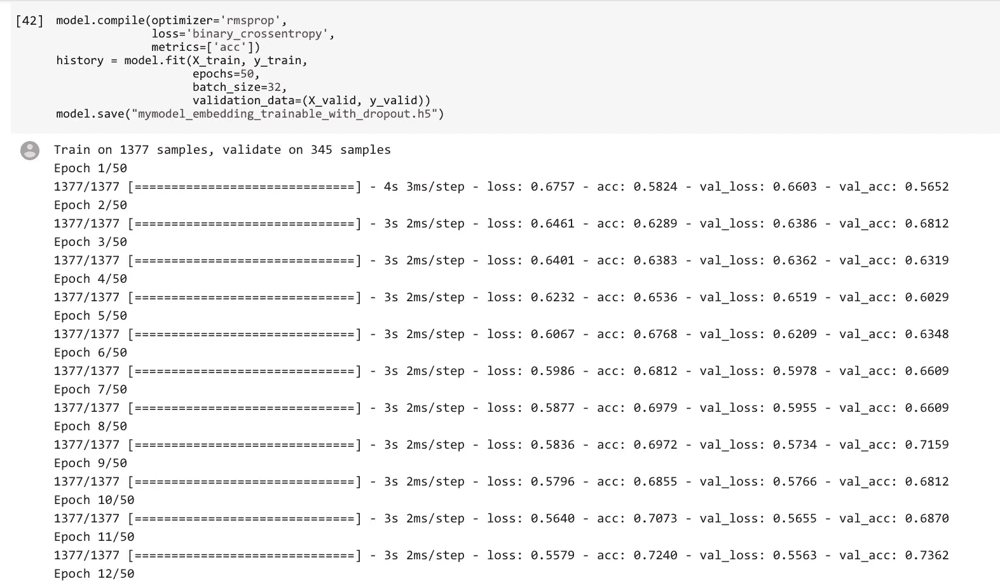

可视化部分没有修改。

```
import matplotlib.pyplot as plt

acc = history.history['acc']
val_acc = history.history['val_acc']
loss = history.history['loss']
val_loss = history.history['val_loss']

epochs = range(1, len(acc) + 1)

plt.plot(epochs, acc, 'bo', label='Training acc')
plt.plot(epochs, val_acc, 'b', label='Validation acc')
plt.title('Training and validation accuracy')
plt.legend()

plt.figure()

plt.plot(epochs, loss, 'bo', label='Training loss')
plt.plot(epochs, val_loss, 'b', label='Validation loss')
plt.title('Training and validation loss')
plt.legend()

plt.show()
```

从准确度曲线上，你可能看不到什么令人兴奋的东西。

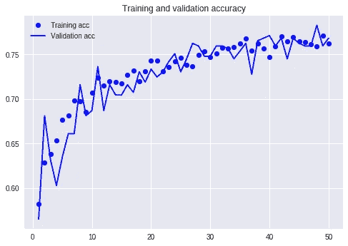

然而，当你观察损失曲线时，你会看到显著的改善。

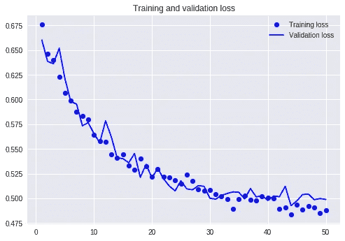

验证损失曲线更平滑，更接近训练损失的趋势。

过度拟合的问题已经得到了解决，模型现在更加稳定，并且可以推广到看不见的数据。

然后，交通管理部门可以使用该模型，通过事件报告的 Waze 开放数据来预测严重交通堵塞的发生。模型精度的期望值约为 75%。

也许这样一来，由于这些预防措施，一些严重的交通堵塞就不会发生了。

# 摘要

希望你能从这篇教程中得到以下几点。

*   序列模型，如 RNN 和 LSTM，不仅可以用于文本，也可以用于其他序列数据。
*   您可以在这类任务中使用嵌入层，即使它们没有预先训练的单词嵌入模型，如 word2vec、glove 或 fasttext。确保您设置了嵌入层的权重**可训练**。
*   你可以尝试用几种不同的方法来克服过度拟合。辍学就是其中之一。在我们的情况下，它是有效的。

希望您现在可以用顺序数据处理自己的分类任务。

快乐深度学习！

我关于深度学习的其他教程:

*   [使用 Python 和 fast.ai 的深度学习，第 1 部分:使用预训练模型的图像分类](https://medium.com/datadriveninvestor/deep-learning-with-python-and-fast-ai-part-1-image-classification-with-pre-trained-model-cd9364107872)
*   [使用 Python 和 fast.ai 的深度学习，第 2 部分:使用迁移学习的 NLP 分类](https://medium.com/datadriveninvestor/deep-learning-with-python-and-fast-ai-part-2-nlp-classification-with-transfer-learning-e7aaf7514e04)
*   [Python 深度学习，第 0 部分:在 Google Cloud 上设置 fast . ai 1.0](https://medium.com/datadriveninvestor/deep-learning-with-python-part-0-setup-fast-ai-1-0-on-google-cloud-c3d41aadbc8c)
*   [如何用云 GPU 加速你的 Python 深度学习？](https://medium.com/@wshuyi/how-to-accelerate-your-python-deep-learning-with-cloud-gpu-a976917037a)