# 如何用 Keras 预处理字符级文本

> 原文：<https://towardsdatascience.com/how-to-preprocess-character-level-text-with-keras-349065121089?source=collection_archive---------8----------------------->


> *你可以在这里找到笔记本*[](https://github.com/BrambleXu/nlp-beginner-guide-keras/blob/master/char-level-cnn/notebooks/char-level-text-preprocess-with-keras-summary.ipynb)

*这篇简介的目的是让您了解如何使用 Keras 在字符级预处理文本。文章的其余部分组织如下。*

*   *加载数据*
*   *标记器*
*   *改变词汇*
*   *要索引的字符*
*   *填料*
*   *获取标签*

# *加载数据*

*首先，我们使用 pandas 加载训练数据。*

*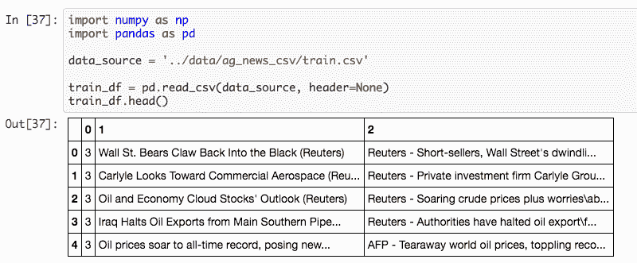*

*将第 1 列和第 2 列合并为一个文本。*

*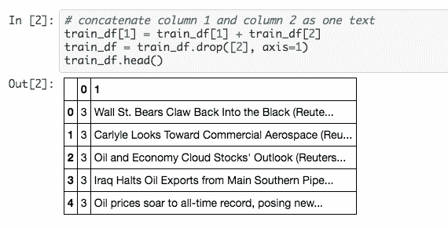*

# *标记器*

*将第 1 列保存到`texts`，并将所有句子转换为小写。*

*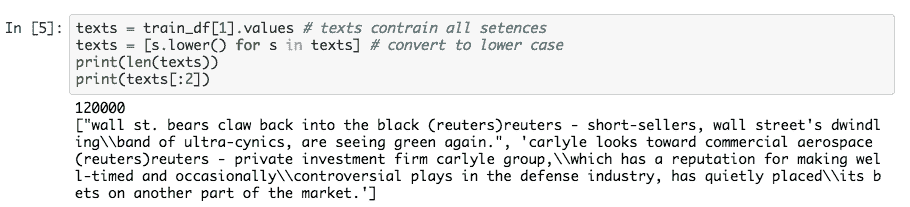*

*初始化记号赋予器时，只有两个参数很重要。*

*   *`char_level=True`:这可以告诉`tk.texts_to_sequences()`在字符级处理句子。*
*   *`oov_token='UNK'`:这将在词汇表中添加一个 UNK 令牌。我们可以用`tk.oov_token`来称呼它。*

*在调用`tk.fit_on_texts(texts)`之后，`tk`类将包含关于训练数据的必要信息。我们可以调用`tk.word_index`来查看字典。这里`UNK`的索引是`word_count+1`。*

*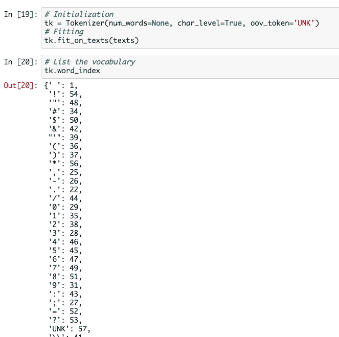*

*这是从训练数据中学习到的字符字典。但是如果我们已经有一个角色列表，我们必须改变`tk_word_index`。*

# *改变词汇*

*看到我已经有一个角色列表调用`alphabet`，我们基于`alphabet`构建一个`char_dict`。*

*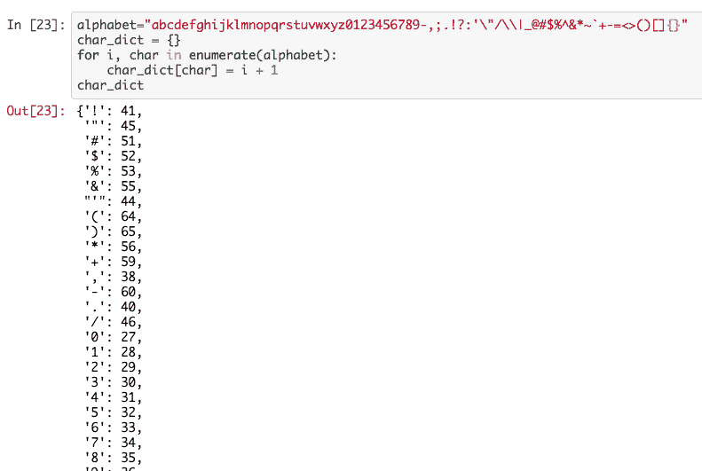*

*我们将为`UNK`分配一个新的索引。*

*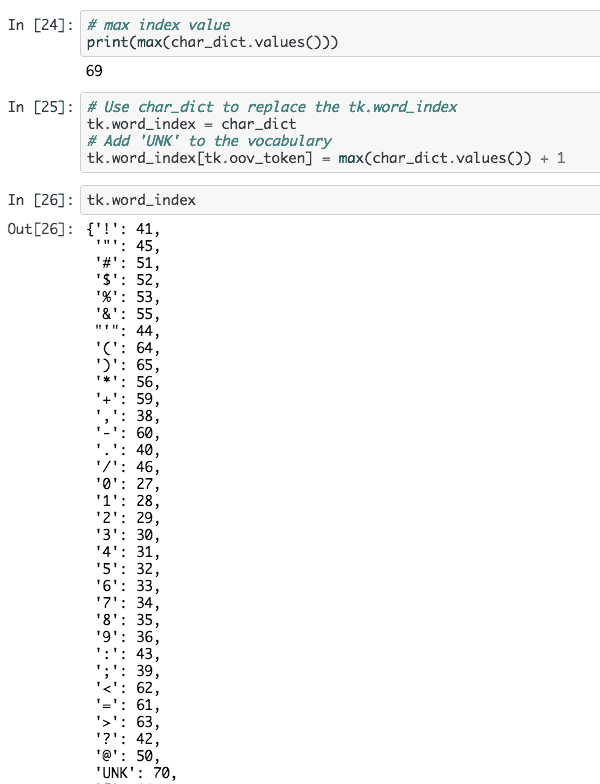*

# *要索引的字符*

*在我们得到正确的词汇后，我们可以用字符索引来表示所有的文本。*

*这一步非常简单，`tk.texts_to_sequences()`会为我们自动完成这个转换。*

*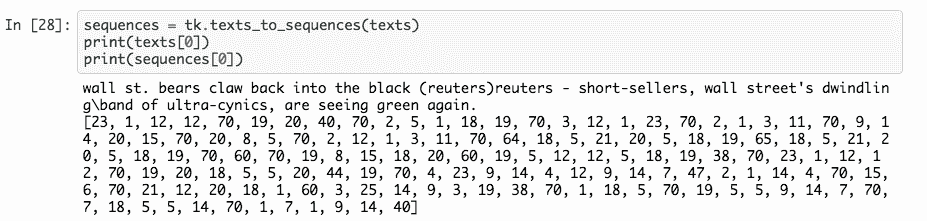*

*我们可以看到字符串表示被索引表示所取代。我们列出了前 5 个句子长度。*

*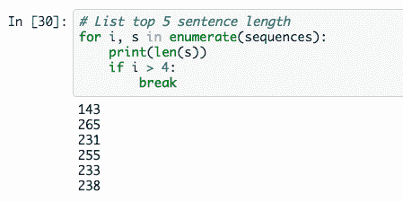*

# *填料*

*因为文本有不同的长度，我们必须使所有的文本长度相同，这样 CNN 就可以处理批量数据。*

*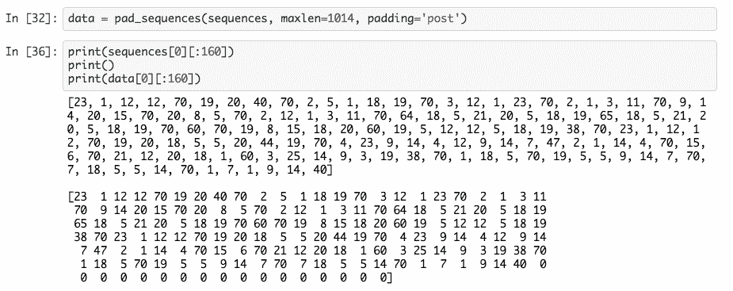*

*这里我们将最大句子长度设置为 1014。如果文本的长度小于 1014，则该部分的其余部分将被填充为 0。如果文本长度大于 1014，超过 1014 的部分将被截断。因此所有文本将保持相同的长度。*

*最后，我们将列表转换成 Numpy 数组。*

*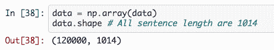*

# *获取标签*

*首先，我们将`train_df`中的第 0 列分配给一个`class_list`，这个一维列表包含每个文本的所有标签。但是我们的任务是一个多类任务，所以我们必须把它转换成一个二维数组。这里我们可以使用 Keras 中的`to_categorical`方法*

*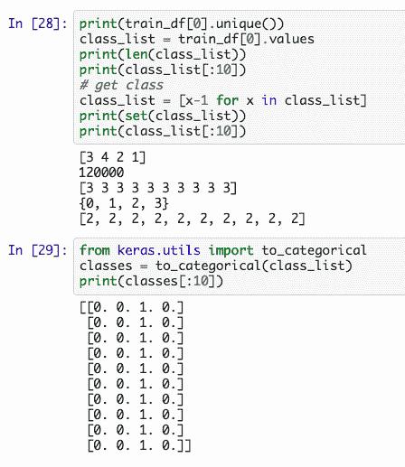*

*至于测试数据集，我们只需要再次执行相同的过程。*

# *摘要*

*为了方便使用，我将所有代码加在一起。*

```
*# write all code in one cell#========================Load data=========================
import numpy as np
import pandas as pdtrain_data_source = '../data/ag_news_csv/train.csv'
test_data_source = '../data/ag_news_csv/test.csv'train_df = pd.read_csv(train_data_source, header=None)
test_df = pd.read_csv(test_data_source, header=None)# concatenate column 1 and column 2 as one text
for df in [train_df, test_df]:
    df[1] = df[1] + df[2]
    df = df.drop([2], axis=1)

# convert string to lower case 
train_texts = train_df[1].values 
train_texts = [s.lower() for s in train_texts]test_texts = test_df[1].values 
test_texts = [s.lower() for s in test_texts]#=======================Convert string to index================
from keras.preprocessing.text import Tokenizer
from keras.preprocessing.sequence import pad_sequences# Tokenizer
tk = Tokenizer(num_words=None, char_level=True, oov_token='UNK')
tk.fit_on_texts(train_texts)
# If we already have a character list, then replace the tk.word_index
# If not, just skip below part#-----------------------Skip part start--------------------------
# construct a new vocabulary 
alphabet="abcdefghijklmnopqrstuvwxyz0123456789-,;.!?:'\"/\\|_@#$%^&*~`+-=<>()[]{}"
char_dict = {}
for i, char in enumerate(alphabet):
    char_dict[char] = i + 1

# Use char_dict to replace the tk.word_index
tk.word_index = char_dict 
# Add 'UNK' to the vocabulary 
tk.word_index[tk.oov_token] = max(char_dict.values()) + 1
#-----------------------Skip part end----------------------------# Convert string to index 
train_sequences = tk.texts_to_sequences(train_texts)
test_texts = tk.texts_to_sequences(test_texts)# Padding
train_data = pad_sequences(train_sequences, maxlen=1014, padding='post')
test_data = pad_sequences(test_texts, maxlen=1014, padding='post')# Convert to numpy array
train_data = np.array(train_data)
test_data = np.array(test_data)#=======================Get classes================
train_classes = train_df[0].values
train_class_list = [x-1 for x in train_classes]test_classes = test_df[0].values
test_class_list = [x-1 for x in test_classes]from keras.utils import to_categorical
train_classes = to_categorical(train_class_list)
test_classes = to_categorical(test_class_list)*
```

> ****查看我的其他帖子*** [***中等***](https://medium.com/@bramblexu) ***同*** [***一分类查看***](https://bramblexu.com/posts/eb7bd472/) ***！
> GitHub:***[***bramble Xu***](https://github.com/BrambleXu) ***LinkedIn:***[***徐亮***](https://www.linkedin.com/in/xu-liang-99356891/) ***博客:***[***bramble Xu***](https://bramblexu.com)*