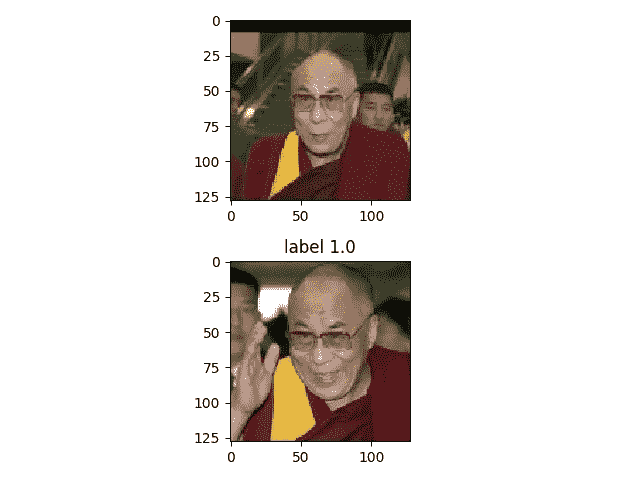
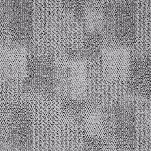
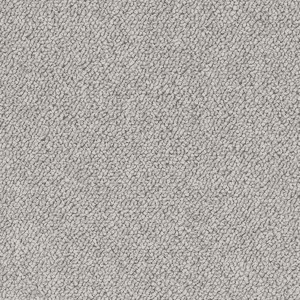
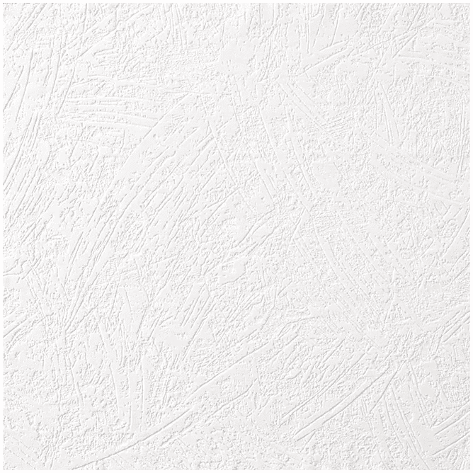
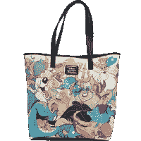
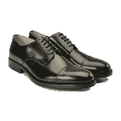
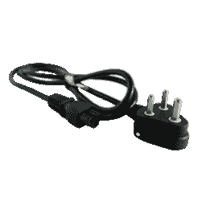
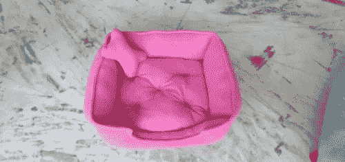
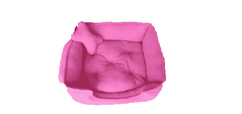

# 如何(快速)建立 Tensorflow 培训渠道

> 原文：<https://towardsdatascience.com/how-to-quickly-build-a-tensorflow-training-pipeline-15e9ae4d78a0?source=collection_archive---------4----------------------->

## 如何在 Tensorflow 中建立一个高效的培训和管道，而不会在树林中迷路

Tensorflow 很棒。真的，你可以做任何你能想到的事情。你可以用它来打造真正的[酷产品](http://www.proproductpix.org/?ref=medium)。然而，Tensorflow 的代码示例通常倾向于掩盖如何将数据输入到您的模型中:它们有时会天真地认为其他人已经为您做了艰苦的工作并将数据序列化为 Tensorflow 的原生格式，或者展示不合理的缓慢方法，这些方法会使 GPU 以低得惊人的性能闲置。此外，代码通常非常粗糙，难以遵循。因此，我认为展示一个小的、自包含的例子可能是有用的，这个例子在一个重要的例子上处理训练和有效的数据管道。

## 向张量流模型提供数据的 3 种方法:如何正确获取数据？


There are three paths to enlightenment. Or at least to feeding Tensorflow models with data.

在典型的 Tensorflow 中，有许多方法可以设置数据管道。本指南将快速列出前 3 项，并向您展示如何使用折衷方案，获得易于编码且对于 80%的用例来说速度惊人的解决方案。

一般来说，有三种方法可以将数据输入到模型中:

1.  使用`feed_dict`命令，使用输入数组覆盖输入张量。这种方法在在线教程中有广泛介绍，但是由于一系列原因，它的缺点是非常慢。最值得注意的是，要使用`feed_dict`，你必须在 python 中将数据加载到内存中，这已经否定了多线程的可能性，因为 python 有一个丑陋的怪兽，叫做全局 interperer 锁(又名 [GIL](https://realpython.com/python-gil/) )。使用`feed_dict`在其他教程中有广泛介绍，在某些情况下是一个很好的解决方案。然而，一旦你试图利用高容量的 GPU，你会发现你正在尽力利用它的 30%的计算能力！
2.  使用 Tensorflow `TfRecords`。我觉得在这里我可以大胆地说，卷入这场混乱十有八九是个坏主意。从 python 中序列化记录既缓慢又痛苦，反序列化它们(即读入 tensorflow)同样容易出错，需要大量编码。你可以在这里阅读如何使用它们[。](https://medium.com/mostly-ai/tensorflow-records-what-they-are-and-how-to-use-them-c46bc4bbb564)
3.  使用 tensorflow 的`tf.data.Dataset`对象。现在，这是一个很好的方法，但有太多不同的方法来使用它，Tensorflow 的文档在构建重要的数据管道方面并没有真正的帮助。这就是本指南的用武之地。

让我们看看现实生活中的用例，并建立一个复杂的数据管道，在一台具有潜在高容量 GPU 的机器上以惊人的速度进行训练。

## 我们的模型:基本的人脸识别

所以我们来处理一个具体的例子。假设我们的目标是建立一个人脸识别模型。模型的输入是 2 张图片，如果是同一个人，输出是 1，否则是 0。让我们看看一个超级天真的张量流模型如何完成这项任务

好吧，所以这个模型不会赢得任何历史上最佳人脸识别的奖项。我们只是取两幅图像之间的差异，通过标准的 conv-雷鲁-马克斯普尔神经网络输入这个差异图。如果这对你来说是胡言乱语，不要担心:这不是一个比较图像的好方法。请相信我的话，它至少在某种程度上能够识别同一个人的照片。模型现在需要的只是数据——这就是我们有趣的小帖子的重点。

那么我们的数据是什么样的呢？

## 数据

一个经典的(微小的)人脸识别数据集叫做*标签为* *野外*人脸，你可以在这里 *下载[。](http://vis-www.cs.umass.edu/lfw/lfw.tgz)*数据很简单:你有一堆文件夹，每个文件夹都包含同一个人的照片，就像这样:

```
/lfw
/lfw/Dalai_Lama/Dalai_Lama_0001.jpg
/lfw/Dalai_Lama/Dalai_Lama_0002.jpg
...
/lfw/George_HW_Bush/George_HW_Bush_0001.jpg
/lfw/George_HW_Bush/George_HW_Bush_0002.jpg
...
```

我们可以做的一件事是生成所有可以想象的配对，缓存它们，并将其提供给模型。那会很高，会占用我们所有的内存，因为这里有 18，984 张照片，18，894 的平方是……很多。

因此，让我们构建一个非常轻量级的 pythonic 函数，它生成一对照片，并指示它们是否是同一个人——并在每次迭代中随机抽取另一对照片。

哇哦。但是我不是说过 python 对于一个数据管道来说太慢了吗？答案是肯定的，python 很慢，但是在随机抽字符串和喂它的时候，就足够爽快了。重要的是，所有的重担:阅读。jpg 图像，调整它们的大小，对它们进行批处理，对它们进行排队等等——这些都是在 pure Tensorflow 中完成的。

## 张量流数据集管道

所以现在我们只剩下在 Tensorflow 中构建数据管道了！事不宜迟:

所以基本上我们从 pythonic 生成器输出(3 个字符串)的字典开始。让我们来分析一下这里发生了什么:

1.  让我们知道它将由我们的 pythonic 发电机提供能量。这一行根本没有评估我们的 pythonic 生成器！它只是建立了一个计划，每当我们的数据集渴望更多的输入，它将从生成器中获取它。
    这就是为什么我们需要煞费苦心地**指定生成器将要生成的输出的类型**。在我们的例子中，image1 和 image2 都是图像文件的字符串，label 是一个布尔值，表示是否是同一个人。
2.  `map`操作:这是我们设置所有必要任务的地方，从生成器输入(文件名)到我们实际上想要馈送给模型的内容(加载和调整大小的图像)。`_read_image_and_resize()`会处理好的。
3.  `batch` operation 是一个方便的功能，它可以将图像批处理成具有一致数量元素的包。这在训练中非常有用，因为我们通常希望一次处理多个输入。请注意，如果我们从[128，128，3]维的图像开始，在该批之后，我们将得到[10，128，128，3]，在本例中，10 是批大小。
4.  `prefetch` operation 让 Tensorflow 做簿记工作，包括设置队列，以便数据管道继续读取数据并对数据进行排队，直到 N 批数据全部加载并准备就绪。在这种情况下，我选择了 5，并且通常发现数字 1-5 通常足以充分利用 GPU 的能力，而不会不必要地增加机器的内存消耗。

就是这样！

现在一切都设置好了，简单地实例化一个会话并调用`session.run(element)`将自动获得`img1_resized`、`img2_resized`和`label`的实际值。如果我们点击`session.run(opt_step)`，那么一个新的数据将通过管道执行一个优化步骤。这里有一个很小的脚本，用于获取一个数据元素，并执行 100 个训练步骤来查看它是否全部工作

当你只把乔治·布什和达赖喇嘛作为类别时，这个模型收敛得相当快。下面是这次模拟运行的结果:

```
/Users/urimerhav/venv3_6/bin/python /Users/urimerhav/Code/tflow-dataset/recognizer/train.py
{'person1': 'resources/lfw/Dalai_Lama/Dalai_Lama_0002.jpg', 'person2': 'resources/lfw/George_HW_Bush/George_HW_Bush_0006.jpg', 'same_person': False}
{'person1': 'resources/lfw/Dalai_Lama/Dalai_Lama_0002.jpg', 'person2': 'resources/lfw/George_HW_Bush/George_HW_Bush_0011.jpg', 'same_person': False}
```



```
step 0 log-loss 6.541984558105469
step 1 log-loss 11.30261516571045
...
step 98 log-loss 0.11421843618154526
step 99 log-loss 0.09954185783863068
Process finished with exit code 0
```

我希望这本指南对你有用。github 上有完整的(微小的)代码回购[。你觉得合适就随便用吧！](https://github.com/urimerhav/tflow-dataset)

# 示例 2 —从产品图片中移除背景

稍后我可能会写一篇更详细的博文，但我应该注意到我最近的数据培训管道，我很喜欢我作为副业项目建立的一个名为 [Pro Product Pix](https://www.proproductpix.org/) 的小型概念验证网站。这个概念很简单:电子卖家需要拍摄产品的照片，然后必须做一项费力的任务，即去除背景像素(这相当繁琐！).为什么不自动这么做呢？

但是获得有背景和没有背景的产品的标签图像是非常棘手的。所以:数据生成器来拯救！以下是我最后做的事情:

1.  在只有一个物体存在的公共领域搜索图像(实际上有很多这样的东西——透明的 png 文件到处都是)
2.  在 Bing 图片中搜索一些普通的背景模板，如“地毯”或“墙”
3.  建立一个生成器，生成成对的背景文件路径+对象文件路径，将它们融合在一起。
4.  让模型猜测哪些像素属于背景，哪些属于物体(以及一堆其他东西，但那是另一篇文章)。

总之，我们有很多这样的背景:



Bunch of backgrounds

我们把它们和没有背景的产品照片融合在一起



Random product photos

这里有一堆小问题要解决。对于 exmaple，背景通常比产品照片大得多，所以我们需要将背景照片裁剪到产品尺寸，然后将两张照片合并。整个管道有点复杂，因为它不是在编写教程的时候考虑的，但是我会把重点片段放在这里。我们有一个生成背景路径+产品路径的生成器

我们将背景加载为 rgb 图像，对象 png 实际上既有 rgb 图像，也有我们所说的透明贴图(我们称之为 object_pixels:它告诉我们哪些像素属于背景，哪些属于对象)。然后在我们的 *dataset.map* 操作中，我们随机裁剪一块背景，并将其与前景混合。

有时候，结果非常好。这里有一张我比较喜欢的之前/之后的照片，尽管它仍然不是 100%完美的:



我希望有一天我会找到时间写更多关于实际使用的模型。你可以在网站[这里](http://proproductpix.org\)玩这个模型，但是要预先警告——这基本上只适用于类似真实产品照片的图片。其他的，都是垃圾进——垃圾出！

最初发布在[霍斯科技博客](https://www.hosstechnology.com/blog/how-to-quickly-build-a-tensorflow-training-pipeline)(那是我的 ML 咨询公司)