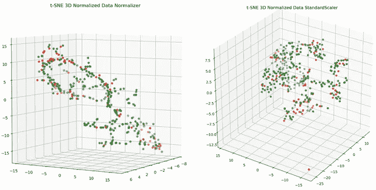
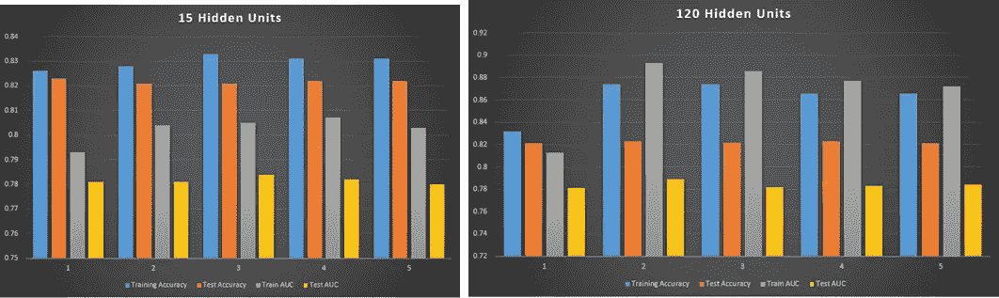
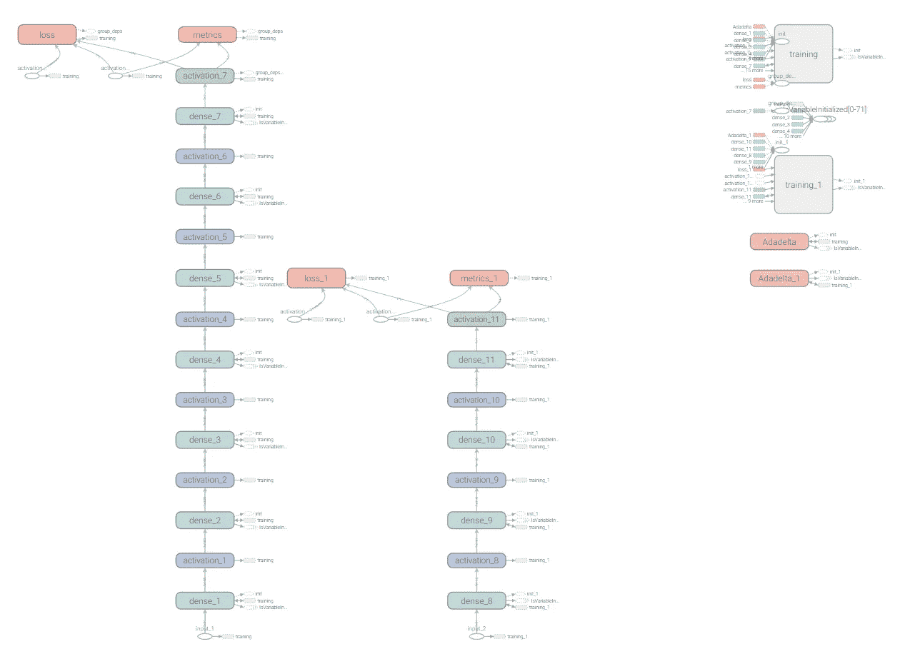
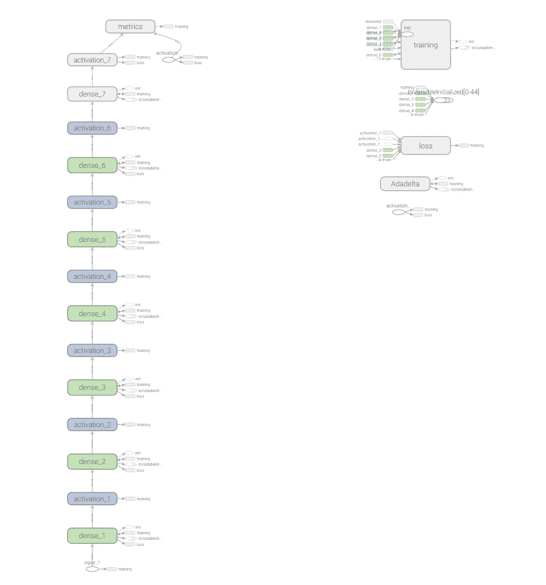

# 如何用 Python 快速测试几十个深度学习模型

> 原文：<https://towardsdatascience.com/how-to-rapidly-test-dozens-of-deep-learning-models-in-python-cb839b518531?source=collection_archive---------4----------------------->

让我们开发一个神经网络装配线，使我们能够轻松地试验众多的模型配置。


Assembly Line of Neural Networks (Source: [*all_is_magic*](https://www.shutterstock.com/g/all_is_magic) *on Shutterstock & Author)*

优化机器学习(ML)模型不是一门精确的科学。最佳模型架构、优化算法和超参数设置取决于您正在处理的数据。因此，能够快速测试几种模型配置对于最大化生产率和推动 ML 项目的进展是必不可少的。在本文中，我们将创建一个易于使用的界面，允许您这样做，类似于 ML 模型的装配线。

深度学习模型由一组超参数管理，我们可以创建对这些超参数进行归纳的函数，并建立临时模型。以下是控制神经网络的主要超参数:

*   隐藏层数
*   每层神经元的数量
*   激活功能
*   最优化算法
*   学习率
*   正则化技术
*   正则化超参数

我们可以将这些打包成一个哈希表:

```
model_info = {}
model_info['Hidden layers'] = [100] * 6
model_info['Input size'] = og_one_hot.shape[1] - 1
model_info['Activations'] = ['relu'] * 6
model_info['Optimization'] = 'adadelta'
model_info["Learning rate"] = .005
model_info["Batch size"] = 32
model_info["Preprocessing"] = 'Standard'
model_info["Lambda"] = 0
model_2['Regularization'] = 'l2'
model_2['Reg param'] = 0.0005
```

在我们开始试验各种模型架构之前，让我们将[数据](https://www.kaggle.com/uciml/default-of-credit-card-clients-dataset)可视化，看看我们在做什么。虽然标准缩放是事实上的预处理方法，但我使用了各种预处理策略来可视化数据。我使用主成分分析和 t-SNE 来降低每种预处理方法的数据维数。以下是看起来最容易分离的数据可视化:



Source: Author

然后，我们可以定义一个函数，在给定超参数哈希表的情况下，该函数将构建和编译一个神经网络:

既然我们有了一种快速、灵活的构建和编译神经网络的方法，我们就可以快速测试一些基线模型。这使我们能够快速推断出哪些超参数似乎工作得最好:

使用上面的函数，在用五重交叉验证评估了十几个模型架构之后，我发现需要更深更宽的架构来获得数据的高性能。这很可能是由于我们数据的非线性结构。下图说明了收益递减。将每层中隐藏单元的数量从 15 个增加到 120 个，可以显著提高训练数据的性能，但实际上对测试数据没有任何影响。这是模型过度拟合的迹象，即训练集的性能不能概括测试数据。

旁白:如果你不熟悉 k-fold 交叉验证，这是一种模型评估技术，涉及到将数据分成 K 个不相交的分区。这些分区中的一个用作测试集，其余的用作训练集。然后我们遍历每个折叠，这样每个分区都有一个回合作为测试集。执行 k-fold 交叉验证使我们能够获得模型性能的可靠评估。



Source: Author

K-fold 交叉验证是一种评估模型性能的稳健方法，但需要注意的是，获得这些结果的计算成本很高。我们可以将数据分成训练和测试集，以在优化超参数的同时得出更快的启发，并在每个时期后保存模型，以便它们在训练后可检索。 [Tensorboard](https://www.tensorflow.org/guide/summaries_and_tensorboard) 回调也可用于检查模型是如何被训练的:

一旦我们了解了哪些超参数设置工作良好，我们就可以获得更可靠的性能评估。

网格搜索不是行业中超参数优化的首选方法。相反，一种被称为由粗到细的方法被更频繁地采用。在由粗到细的方法中，我们从大范围的超参数开始，然后专注于最有效的参数设置。然后，我们从想要试验的狭窄范围的值中随机抽样超参数设置。既然我们有了动态实例化深度神经网络的方法，我们可以快速迭代众多模型配置:

旁白:当从你的终端调用 Tensorboard 日志目录时，你不能在文件路径中有空格。在 Windows 上，日志目录中的空格会阻止 Tensorboard 正确加载数据。

上面的代码还将每个模型的重要指标(例如 ROC 曲线下的面积)保存到一个 CSV 文件中，以便我们可以轻松地比较和对比哪些超参数会导致性能变化。

一旦我们对哪些超参数值工作良好有了更好的了解，我们就可以开始在这个值范围内优化模型。下面的函数生成一个随机化的神经网络。然后，我们可以使用该函数在我们缩小的值范围内试验各种随机超参数设置:

在本文中，我们学习了如何快速试验众多的模型架构和超参数设置。如果你喜欢这篇文章或学到了新的东西，请随时关注我或留下掌声。再次感谢！

源代码:[此处](https://github.com/cihat645/DeepLearning/blob/master/RapidlyIterate.py)

**警告:**

我在代码中发现了一个 bug，可能是 Tensorboard Keras 回调或者 build_nn()函数导致的。这不是一个主要问题，但我想和你讨论这个问题。问题是，在测试一系列神经网络时，会将多个图形写入 Tensorboard 日志文件。例如，当我们运行上面的“模型实验”代码时，我们得到了 model_1 的图形可视化:



Erroneous Graph (Source: Author)

正如您所看到的，这里有两个不同的图形:一个对应于 model_0(左)，一个对应于 model_1(右)。model_0 的图形不会发生这种情况，因为它是在 model_1 之前训练的:



Visualizing model_0 Architecture via Tensorboard (Source: Author)

然而，如果我们在训练之后加载 model_1，我们可以看到，对于我们传递给 build_nn()的哈希表，该架构是正确的:

```
print("Model 1")
saved_model = load_model(FILE_PATH)
print(saved_model.summary())Model 1
_________________________________________________________________
Layer (type)                 Output Shape              Param #   
=================================================================
dense_8 (Dense)              (None, 110)               10120     
_________________________________________________________________
activation_8 (Activation)    (None, 110)               0         
_________________________________________________________________
dense_9 (Dense)              (None, 110)               12210     
_________________________________________________________________
activation_9 (Activation)    (None, 110)               0         
_________________________________________________________________
dense_10 (Dense)             (None, 110)               12210     
_________________________________________________________________
activation_10 (Activation)   (None, 110)               0         
_________________________________________________________________
dense_11 (Dense)             (None, 1)                 111       
_________________________________________________________________
activation_11 (Activation)   (None, 1)                 0         
=================================================================
Total params: 34,651
Trainable params: 34,651
Non-trainable params: 0
_________________________________________________________________
```

这表明使用该代码获得准确的评估没有潜在的问题，但是它不允许我们可视化管道中的模型。如果您有任何见解、建议或知道为什么会出现这种情况，请随时修改代码或告诉我。我想继续研究这个问题，但作为一名有三份兼职工作的全日制学生，我无法做到这一点。再次感谢阅读！