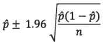
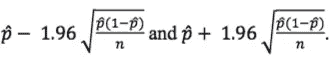
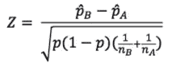
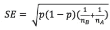
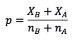
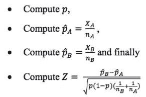

# 如何降低电子商务结账阶段的废弃率——A/B 测试电子支付方式

> 原文：<https://towardsdatascience.com/how-to-reduce-abandonment-rate-during-the-e-commerce-checkout-stage-a-b-testing-e-payment-methods-8818506a353c?source=collection_archive---------7----------------------->

If SpaceX A/B Tests their Rockets, shouldn’t you at least A/B Test your Checkout Page?

随着电子商务公司不断寻找新的方法来提高他们的转化率，他们中的大多数人仍然不得不应对高比例的购物者放弃结账阶段的最后一步。即使顾客输入了个人信息，选择了送货方式，20-30%的顾客仍然会放弃付款页面。这就给我们带来了挑战:如何降低结账阶段的弃用率？

我花了几年时间，帮助世界上一些最大的电子商务商家，我相信一个更明显的答案在于 A/B 测试电子支付选项，以确定最高的转换组合。

## **电子支付系统如何工作**

电子支付系统可以分为三种类型，基于信用，替代和数字钱包。

*基于信用的电子支付系统*使用信用卡/借记卡/预付卡接受和处理来自发卡机构的支付，如[万事达](https://www.mastercard.com)、[维萨](https://www.visa.com)、[美国运通](https://www.americanexpress.com/)、 [Discover/Diners](https://www.discover.com/) 和[银联](http://www.unionpayintl.com/)。使用四方模型或三方模型，其中涉及发行者(向购物者提供信用卡/借记卡/预付卡)、收单方(以商家的方式处理交易)、商家(与网关集成以接受交易)和购物者(向商家发起支付)。

*可供选择的电子支付系统*有多种实施方式，但几乎都使用由第三方处理机构促成的直接银行转账，例如荷兰的 [iDeal](https://www.ideal.nl/) 和比利时的 [Bancontact](https://www.bancontact.com/) 。第三方处理器提供一方面与网关集成，另一方面与银行环境集成的技术，以启动从购物者到商家的资金转移。

*数字钱包电子支付系统*是像 [PayPal](https://www.paypal.com/) 、[谷歌钱包](https://www.google.com/wallet/)和 [Apple Pay](https://www.apple.com/apple-pay/) 这样的服务，它们作为中介接受和处理支付，并从转入账户或关联信用卡或银行账户的资金中进行内部贷记。与替代电子支付系统类似，数字钱包为网关提供 API 以集成其钱包或直接为商家提供集成选项。

## **哪种电子支付系统最常用？**

根据国家的不同，零售中采用基于信用卡或借记卡的支付方式对所使用的电子支付系统有很大的影响。美国和英国的信用卡使用率很高，这导致大多数商家提供基于信用的电子支付方式。虽然荷兰和比利时等国家更喜欢使用借记卡，但这导致银行合作开发 iDeal 和 Bancontact 等替代支付选项，以防止万事达卡和 Visa 抢占更多市场份额。

导致采用电子支付系统的其他几个因素是安全性和易用性。这导致电子商务公司不得不提供多种支付方式。像 AirBnB、Amazon 和 Zalando 这样的公司都是以基于信用的电子支付系统起家的，但是随着他们的成长，电子支付方式已经适应了消费者的偏好。例如，AirBnB 接受信用卡、借记卡和预付卡，但在特定国家也接受 PayPal，在中国只接受[支付宝](https://intl.alipay.com/)，在意大利接受 [Postepay](https://postepay.poste.it/) ，在德国接受 [Sofort](https://www.klarna.com/sofort/) ，在荷兰接受 iDeal，在印度接受 [PayU](https://corporate.payu.com/) ，在巴西接受 Boleto Bancário、 [Hipercard](https://www.hipercard.com.br/) 、 [Elo](https://www.cartaoelo.com.br/) 和 Aura。

## **A/B 测试电子支付选项**

通过实施 A/B 测试，商家能够测试电子支付选项的不同组合。在任何 A/B 测试中，都有可以测试的变量。通过与世界各地的商家合作，我分析了我认为在 A/B 测试电子支付选项中最重要的变量。

如前所述，国家是电子支付方式可用性和接受度的重要组成部分。另一个变量是购买商品或服务时使用的 D *设备类型*，无论是台式机、平板电脑还是手机。对于具有结账功能的应用程序，平台是另一个可以用于测试的变量，可以是 iOS (15%的市场份额)，Android (85%的市场份额)。

## **测试电子支付方式背后的数学原理**

要确定添加额外的电子支付方式是否会对转换率产生影响，可以实施 A/B 测试。为了确定哪个版本是赢家，Z 测试可以计算 B 版本是否明显优于控制版本。

根据您的交易量，我建议您尝试达到 95%的置信度。

95%区间估计的公式如下:

在哪里

*   p(hat) =我们的点估计
*   1.96 =对应于 95%显著性的正常曲线 Z 值估计值
*   n =我们的样本量

这可以解释为有 95%的把握皮肤上的转化率介于:

95%的置信水平告诉我们，如果测试重复多次，并且计算了每次测试的置信区间，则 95%的置信区间将包含真实的转化率。前面处理的是单个样本。在 A/B 测试中，重点在于比较多个样本。为了凭经验确定在 A/B 测试中观察到的两个转化率之间的差异是否足够大，从而可以合理地归因于 A 和 B 之间的经验差异，而不是因为采样误差，必须计算两个比例的 Z 统计量。

如果给定的指标是一个百分比或一个比例，则测试统计由下式给出:

在其最基本的形式中，它可以被认为是被称为标准误差的总体变化的量度，可以通过下式计算:

对于两个比例，通过合并所有值，计算合并比例，然后根据两个样本大小进行归一化，可以获得标准误差。如果 **X** A 是第一个样本中转换的人数，第二个样本中转换的人数，则综合转换率由下式给出:

在计算检验统计量(Z)时，采取以下步骤:

基于这个测试统计，我们观察到的差异是由于随机机会的概率可以计算出来。该值称为 p 值，是某一点之前或之后标准正态(Z)分布下方的区域。如果 Z 值为负，则计算到该点为止的值，并乘以 2。如果 Z 值为正，则在该点之后计算该值，然后乘以 2。乘以 2 是所谓的双尾检验的应用。

## **对商家有什么好处**

A/B 测试电子支付选项有很多好处

1.  **通过 A/B 测试电子支付选项，商家可以消除猜测工作，为客户提供正确的电子支付方式组合，并在此过程中降低支付页面的放弃率。**
2.  ***降低获客成本*** :通过在结账流程的关键阶段降低弃购率，这直接提高了转化率。虽然获得客户的成本相同，但购买量降低了平均获得客户的成本。
3.  ***更高的利润*** :更低的废弃率等于更高的交谈率，这导致销售商品的收入和成本增加，但在相同的管理费用和广告成本下，这导致更高的利润。

随着购物者越来越习惯于在网上购买商品和服务，他们首选的支付方式可能会因国家而异。通过使用 A/B 测试，商家可以测试并找到每个国家和设备的电子支付选项的正确组合。通过降低结账过程中最关键部分的废弃率，商家将能够降低他们的客户获取成本并增加利润。

## 感谢阅读；)，如果你喜欢它，请点击下面的掌声按钮，这对我意义重大，也有助于其他人了解这个故事。通过在 Twitter、Linkedin 和 Twitter 上联系，让我知道你的想法。或者留下回应。